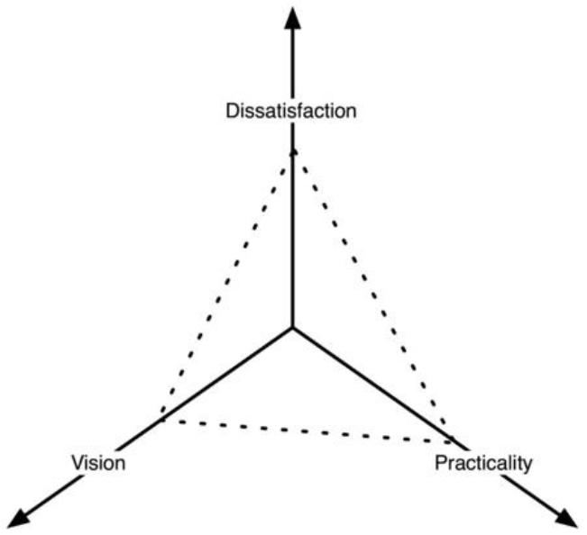

要改变，必须克服许多障碍。
以前克服过障碍，克服新的障碍就变得容易得多。
你可能希望通过首先完成马拉松、博士学位或同样艰巨的任务（例如建造纸牌屋）来交叉训练以适应新的生活方式。
克服障碍的决定，也可能源于令人震惊的事件。
例如，许多人在自己或亲近的人经历了第一次心脏病发作，或同样严重的事情后，决定变得健康。
类似的顿悟发生在经济危机期间的失业之后。
障碍包括：不知道某项活动或其好处、认为该活动难以从事、社会不赞成或相信继续当前行为有更多好处。
人们自然会选择他们认为收益高、进入门槛低的活动——快速而简单的致富方式。
人与人之间的利益和障碍差异很大。
对一些人来说，步行半英里很有趣，或者至少就像穿上一条裤子一样自然，而对另一些人来说，它代表着需要避免的重体力劳动。
有些人同样厌恶仅仅是从沙发上爬起来。
最重要的是，提议的行为可能会与一个或多个其他行为竞争，在这种情况下，提议的活动排除了另一项活动，或者只是被认为排除了另一项活动。
通常情况下，与最高利益相关的活动，例如搬入较小的房屋或放弃个人汽车所有权，也具有最高的感知障碍。
此外，选择一些活动意味着拒绝其他活动，例如开车出去买一瓶洗发水，是因为你今天早上忘了买，而明天早上又“需要”它。
住在小房子里意味着，拒绝用商场里的东西填满房间的乐趣。
毫不奇怪，我得到的最常见的反应是，“这听起来有点极端”，或者，“这对你来说可能没问题，但我更喜欢做和目前相似的事情。”
因此，为了让你相信某事，我必须让你相信所提议行为的好处（见[经济和金融基础]()）。
所提议行为的障碍的可克服性（见[文艺复兴式生活方式]()）。
竞争行为的边际收益（见[锁住]()）。
竞争行为障碍的鲁莽性（见[锁住]()）。
许多人将他们的观点和想法，与他们的个人身份联系起来。
这是一个重大的障碍，因为承认替代方案更好会被视为是个人失败。
因此，障碍被提高以保护自我，并避免观念的改变。
这是通过对上述列表采用适应性对策来完成的。
最常见的反驳意见是，提议行为的障碍太高：“我不能放弃我的车。”
第二个最常见的反驳论点是，所提议行为的好处太低：“如果我不用每天整天上班，我不知道我会做什么。”
第三个最常见的是，竞争行为的障碍足够低：“我已经在这样做了——我已经投入太多了。”
第四个最常见的是，竞争行为的好处足够高：“虽然我很痛苦，但至少我很舒服。”
这取决于你是谁。
障碍代表必须支付的成本。
支付意愿取决于对现状的不满、对未来形势的展望，以及从现状转变为未来形势的实用性。
这种改变的意愿可以用[图]()中金字塔的体积来表示。

金字塔的体积代表，从不满意的情况改变为其他情况的意愿，这取决于愿景、改变的实际程度，以及对情况的不满程度。
直观地说，如果缺乏不满、远见或实际的第一步，就不太可能采取行动。
具体来说：如果不满意程度很低，显然不会发生任何变化。
如果你对现状感到满意，为什么要改变策略？
如果愿景很低，这会导致一种舒适的痛苦，即愿景不够强或太害怕而不允许改变。
在抑郁、信仰或愿景丧失、外部环境下，高度的不满可能同时伴随着愿景的低下。
例如，许多人在节俭时犯的错误是，他们以前积累东西的强烈愿景，没有用于做其他事情。
因此，放弃当前的愿景会导致被剥夺的感觉，或从某种意义上说，是一种信仰甚至身份的丧失。
但是，如果你遵循与“购物教会”不同的信仰，那么不参与购物仪式就不会被剥夺。
对现状的不满可能很高，对替代方案的愿景也可能很高，但如果没有计划，这只会导致沮丧。
必须有策略或至少有计划，而且必须切实可行。
为了把事情做好，有计划比有激情要好得多，至少在你付诸行动的时候是这样。
最后，还有感知成本的问题。
如果成本太高，改变就不会发生。
因此，变化兜售者有以下四个变量可供使用：
1. 增加你对现状的不满。
2. 加强对未来形势的展望。
3. 制定一个从现在到未来的计划。
4. 降低计划的感知成本。
动机也取决于个人。
例如，我的动机是避免负面结果，例如感觉不好。
其他人则是通过努力获得积极的结果，例如感觉良好的激励。
我更喜欢立即的、根本上的改变。
其他人则喜欢慢慢改变。
本着立即摆脱消极事物的精神，我在接下来的章节中写了许多建议。
如果您对改变有不同的看法，请相应地修改我的方法以适合你的个性。
