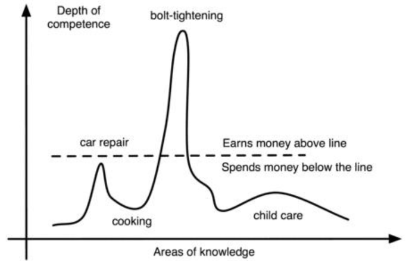
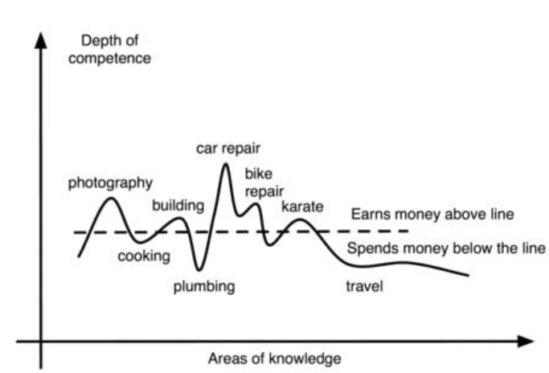

如在“锁住”章节提到的，我们把“原始的人”定义为原始是非常有意思的，
当每一个原始人有能力建造自己的工具和庇护所，制作自己的衣服，提供温暖和水，知道哪些食物能吃哪些不能。
我们中有多少人能做到这点？
他的技术可能是原始的，但是在他的世界里他的通用知识是远胜于我们的。
一个“原始的人”能够完整地参与到他文化中的各个方面。
作为对照，我们只知道我们文化中的非常有限的一点东西，
随着我们的工作训练和进行，这仅有的一点常识性的东西也是关于当地饭馆，电视节目上的生活家具，对于天气预报的理解。
这就代表着，我们的社会更接近高度发展的群居昆虫，特化的个体为更好的整体工作。

由于缺乏个人技能的多样性，评价我们的标准也被给定了一个单一的数值：我们的净值，对于那些没有净值的人来说则是薪水。
打开任何一个关于个人财务的书籍，第一介绍的都是净值。
你的净值等于你的财产、房子、投资加和，然后减去财务负担、按揭、贷款。
这或正或复，但它仍然是一维数字。

净值只有在玩同一游戏并且有相同消耗的时候，才能作为一个有用的测量尺。
它只有在一个缺乏其他技能，只能用一种技能赚钱，然后比拼花钱的世界中有用。

然而，真正的人，即使是专业人士，也不只是一维的。
一个人能够自己做饭（加热披萨和煮面条不算！）。
和那些需要到外面吃或者买昂贵加工食品的人比，这项技能是财产，因为吃饭可以花更少的钱。
然而，如何为这一资产定价？ 同样，从事高薪工作的人可能会长期承受压力或久坐不动，因此患各种生活方式疾病的风险更高。
然而，人们如何为这一负债定价呢？

可能无法对此类资产和负债进行准确定价，但可以绘制说明它们的图表。
此[图]()展示了[锁住]()中描述的被锁住的人的场景。
x轴显示了一个人生活的各个方面——工作、生活、饮食等。
还显示了一条虚线，该虚线划定了花钱的区域和赚钱的区域。
一个被锁住的人几乎没有有用的技能。他们拥有的一项技能提供了他们所有的收入。
因此，锁住的专家只会在一个领域获得报酬，但正如大的尖峰所示，他的报酬很高。
这是此[图]()中的相同尖峰。然而所有其他区域都低于虚线，表明这些区域必须付费。

该图显示了锁住的人的技能程度。

虚线划定了一个人既不花钱也不赚钱的点。
换句话说，此人可以免费进行此活动。请注意，对于被锁住的人来说，大多数活动都需要花钱。这些活动都由单一的技能收入支持的。

将此与拥有多项个人技能资产的人进行对比，如[图]()所示。
虽然可能没有时间，将技能发展到与专家相同的水平，但他能够通过在几个领域，赚取一些收入，而在其他领域花更少的钱来弥补，因为他能够自己做一些工作，并以更低的价格购人产品。
这是一个比专家更不依赖市场体系的人。这是一个与净值无关的人。在极端情况下，金钱甚至可能无关紧要。

该图显示了文艺复兴人的技能程度。

请注意，他为大多数活动支付的费用很少。还要注意他是如何从多项活动中赚钱的。

奇怪的是，专家建议投资广泛多元化，同时建议工作技能应该高度集中。
文艺复兴人拥有大量多样化的人力资本，，尽管有不可能，但在专为专家量身定制的市场上，出售它是困难的。
不过，销售不是重点。 而不是专注于如何销售，专注于如何不购买往往更有效率！各种各样的技能可以替代收入的需要。

根据成为专家的专家的说法（是的，有这样的事情！），需要1千小时的专注努力才能胜任一门学科，需要3千小时才能掌握它，而要成为专家则需要1万小时（请参阅[测量掌握程度]()）。
考虑到普通人每天花费4小时，或每年将近1500小时看电视或玩电脑游戏，成为某一领域的专家并同时在其他几个领域胜任，这并不是一项在几年内无法完成的任务， 甚至可能完全掌握其中一个领域。

应该关注哪些技能？17世纪的文艺复兴时期的人们，努力提高他们这些能力：

- 用各种武器保护自己。

- 演奏各种乐器和画画。

- 辩论政治和哲学。

- 先进的知识和科学。

- 成为一个有成就的作家和诗人。

就我们现代的目的而言，这些领域或许可以分为七个通用领域——生理、经济、智力、情感、社会、技术和生态。
一开始，掌握如此广泛的学科似乎让人不知所措，而且这个想法甚至可能与你的个人喜好格格不入。
然而，普遍的想法并不需要完全掌握一门学科，只是立志于追求它。请记住，工作量和结果在整个范围内并不是线性的（请参阅[S型曲线逻辑曲线和最大能量原则]()以及此[图]()）。
理想情况下，努力应该在所有科目之间平均分配，但由于个人喜好和才能，一个人可能会决定更多地关注某些领域而不是其他领域。
