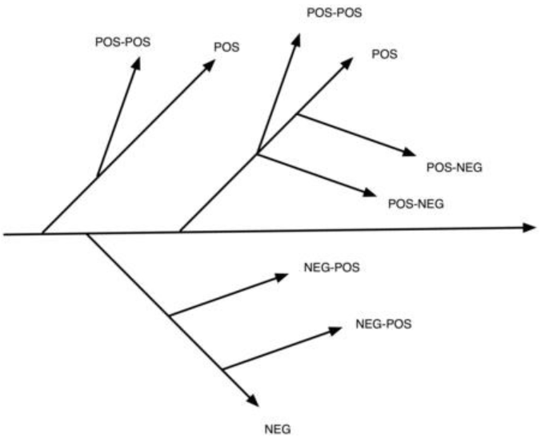

意识到不可能只做一件事情，任何的行动和行为都会带来一堆的积极和消极的影响和后果。
在这个图中，每个侧面影响都对于着一个维度。
如果你采取所有行动，就是增加它们到现在的“目标空间”向量，这会给你提供一个强的最有可能结束的“目标空间”（参考生态和目的地）。

这张图展示了完整的后续路径。
对于那些熟悉“鱼骨图”的人来书，这是反向的。
占位的是零阶影响和它的一阶影响。
正向影响在线上。
负向影响在线下。
每个影响还有二阶影响。
正向影响向上走。
负向影响向下走。
很难说如果一个为有弱正向一阶影响和一个强的负向二阶影响，或者一个弱的负向一阶影响和一个强的二阶正向影响的网络是正向的。
如果这个不能被确定，那么行为太过复杂需要被避免（参考这里）。
希望二阶影响被忽略不会是一个问题。
然而，有些时候对于一些长时间触发的特殊事件，二阶甚至三阶影响需要被加上。

作为通用的规则，如果增加侧面影响不会创建一个正向的偏置，那么整个目标结果需要被重新评估。

目标是一个水平线。
这个目标有两个正面（POS）和一个负面的一阶副作用（NEG）。 第一个积极的副作用有一个积极的二阶副作用（POS-POS）。 第二个正副作用具有一个正二阶副作用 (POS-POS) 和两个负二阶副作用 (POS-NEG)。 第一个负面副作用有两个正面的二阶副作用 (NEG-POS)。
让我们考虑几个例子。

【爱好】获得乐趣的零阶目标。一阶的负面影响是花钱。另一个一阶的负面影响是需要空间。空间需求有一个二阶影响是太花钱。一个一阶的正面影响可能是遇见新人。这个二阶的正面影响是能够专业化网络。一个三阶的正面影响是这能够带来工作。

【副业】零阶的目标是学习如何做生意。初创需要花钱是一阶的负面影响。收入是一阶的正面影响；对于很多人来说，收入可能是零阶的目标。做生意会花时间这可能是正面的或负面的。不管这个的话，正面的二阶影响是这个时间不是在花钱。

【工作】零阶的目标是赚钱。职业发展是一阶的正向影响。承受压力和不健康，以及商务打扮和外表提升的花费，是一阶的负向影响。二阶的负面影响是吃药和购物所花的钱。

这只是一个例子。实际可能是，工作的零阶目标是发展职业而不是赚钱。
在这种情况，把职业放在零阶目标那钱就是侧面影响。如果制服是提供的，这变成了正面影响而不是负面影响。

现在，想想你自己如何花费你绝大多数时间和经历的反向鱼骨图。这可能包含了家庭，教育，运动，宗教，退休，等等。
还有一些你现在没有做但是可能做的事情。

考虑到你所有行动的影响总和。
适配不同的活动会导致特定的产出，所有的影响可以被认为是目标，不管你事实上有没有达到这个目标。
你可能会发现有些目标是反效率的。
有些目标涉及了省钱，同时有些涉及花钱。
有些目标涉及了更加健康，同时有些目标让身体不健康。
事实上，如果你画出了一个典型生活的图，你可能会发现一堆反效率的目标。
当强的正向目标遭遇弱的负向目标时，结果时摩擦。
摩擦产生浪费（参见逃离）。
浪费在现代生活是普遍现象。
想想多少人开车。
开始踩油门，十秒后踩刹车，把动能转换成了废热。
然后又因为速度降低了再次加速。
结果就是高油耗，汽油被用来加热刹车片，并且设备也因为日常的工作习惯降低了寿命。
相同汽车的不同油耗取决于司机。
同理，相同的钱运行不同的距离取决于谁使用它。
相反的，如果一个人的正向目标和其他目标正向对齐，那么两个目标都会受益——向量在目标空间里指向了相同的方向。
未来达到这种协调，记下行动，列出影响。
影响可能是正向或负向的。没有协调，负向影响会经常消耗掉正向影响或者影响会变得非常分散。
 协调集中影响或目标。
如果你不能看到一个集中的目标，你必须对你的行为做出一些改变并且可能要指定一个新的目标。
例如，一件事是，当我开及早退休之路的时候，我开始把我无效的耗钱的爱好转换成免费的（参加模块化设计）和有意义的，
a) 让其不和我存钱的目标摩擦，b)提供一些和工作不相关的一样，c) 学习一些能够用到工作上的新技能（编程和写作）。
