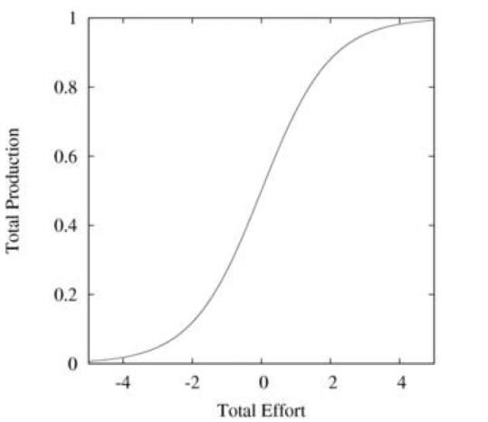
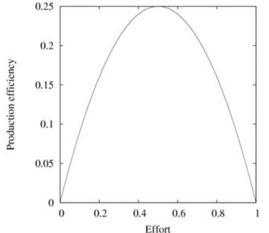

一个流行的心理策略是设置一个小目标或者缓慢地开始。
缓慢的改变是舒适的改变。
然而，从悲观者角度区观察，随着一系列的婴儿蹒跚，事实上什么都没有改变。
这个策略经常因为依赖获取一系列小目标，缺乏有意义的进展而失败。
这是一个好的原因。

这个图展示了一个S型的曲线，经常用于描述“投入和产出”模型，这里的“投入”代表着很多不同类型的“投入”。
例如，“产出”可以是幸福，“投入”可以是薪水。
注意到曲线在原点处是对称的，并且在原点处的变化率是最快的。
纵轴代表“产出”，横轴代表“投入”。
这里的“投入”衡量了某种输入，“产出”衡量了某种输出。
例如，输入可以是时间，输出可以是金钱。
输入可以是做事情，输出可以是幸福，苗条等等。
为了方便讨论，我们定义一个变量P代表“产出”。
一种思考P的方法是我已经写作的本书的页数。
产出的增加是和当前的产出相关联的，因为已经写了这么多，就会认为再多写一些会很容易。
然而，增加产出也会关联到将来的产出。
最开始，这个斜率非常高，因为太多东西还没有写，但是随着写作接近尾声，就没有多少话题可写，因此再多写一些就会变得非常困难。
这段文字可以用这个简单的公式进行总结：
(dP)/(dE)=P(1-P)
这说的是，当只有很少的资源（当P在右手边很低代表着图中左下角和P(1-P)~P），潜在的变化是指向资源的。
这像是复利的工作模式，它会创造指数型增长。
然而，复利本身不会让任何人富有。
按8%的利率投资1刀然后等待30年只会获得10刀。
这30年的等待是不值得的。
但是按8%的利率投资10万刀然后等待30年只会获得100万刀。
这是真正的钱。
为了到达任何地方，快速建立一个实质性的基础是非常重要的。
在依赖指数增长的情况下，设置一个小目标绝对不会看见结果快速变化。
相反的，投入一个大量的初始值是立马看到回报增长的保证。
曲线的中间是投入和回报的比例式关系——做的越多回报越多。
做的少回报就少。
换句话说，这个阶段额外的投入获得的回报要比刚开始时多，因为产出被高产出抬高了。
继续投入，产出因为资源、消费者、岗位和市场规模受限而触及天花板。
你可能会发现在职位描述里，一个每天三个小时可以完成的工作，你通常需要每天工作八个小时。
如果时这样你就知道触及产出天花板是什么意思了。
在这种情况下，减少25%的工作投入如果产出只减少5%，这么做是有意义的。
在这种情况下最好开始一个额外的项目，寻找更多的职责，或者学习其他东西。
这些项目每一个都会有自己的曲线让你进步。
最优化的生活策略是最大化你涉及事物的总“产出”，或者无论什么曲线来衡量——有可能你每个项目都有不同的曲线和多维的回报，这里总的效用（参见构造模块）是最大化的（参见生态学）。
就价值而论，这会是不可能衡量的，因为这会要求你决定健康、金钱、自信、意义等的交换价值。
其中的一些是不能被量化的。
这些值可以被具体化地确定（参见情绪）。给定一个有限的投入（你只剩下这么多天可活了），通过每个项目的最大化“投入产出”来优化总的产出。
这是关键的一段，并且这和生态学上的最大能量原则相关。
这就意味着项目间的投入必须相互贡献以获得最大的总产出。把精力投入到能产出最高的地方。
产出的最高点在投入回报比的最高点。
在数学项上，这出现在公式导数为0的时候，也就是，
这意味着最大的回报发生在曲线的中间。
如果我们绘制出 dP/dE的突现就更明显了。
这和在解耦和增加复杂度章节讨论的有很多的关联性。
特别的，动态区域在[这个图](../img/7-c-iv-a-fig1.png)和[这个图](../img/7-c-iv-a-fig2.png)的中间。
瞬时响应，要求100%的投入，在右边，无响应，要求0%的投入，在左边。

一个附加投入和附加回报的关联曲线。
例如，专业人士经常被鼓励要更专业，也就是尽最大投入来获取他们的产出（在图中的右面），来赢得和其他专业人士的竞争并获得高薪水。
如果金钱是唯一有意义的东西，那这就是最优的策略。
如果，幸福、低压力、闲暇时间和其他工作生活平衡的东西也有意义，那结果就是不同的策略了，至少说，80%的投入，来换取最少的20%的回报是浪费。
一旦你理解了最大能量原则，这就会变得非常容易执行。
最简单的是，你可以在同一项目上关联很多的模块，每个只投入很少的精力来增加最大的效用。
这意味着为了增加效用每个项目上放置10话题，而不是花相同的时间在同一项目上力图成为专家。
