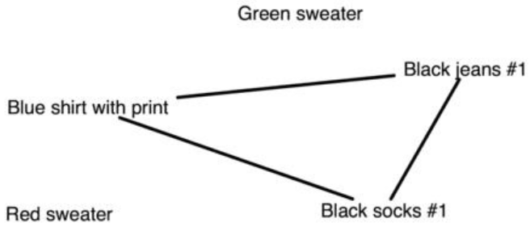
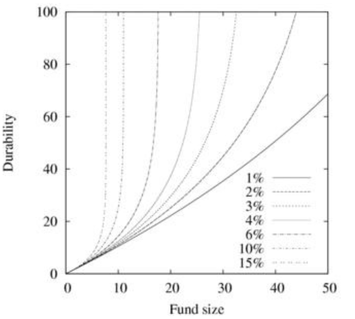
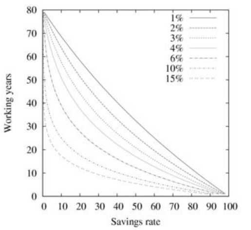

## 《极早退休：一个财务独立的哲学和实践的指导》

## 目录

- 

- 

    - 
    - 

- 

    - 
        - 

    - 
        - 
        - 
    

    - 

    - 
        - 
        - 

    - 

    - 

- 

    - 
        - 
        - 
        - 
        - 

    - 
        - 
            - 

    - 
        - 

    - 

- 

    - 
        - 
        - 
        - 
        - 
        - 
        - 
        - 

    - 

    - 

    - 

- 
    - 

        - 
            - 

    - 

        - 

        - 
        
        - 

    - 

        - 
        - 
        - 
        - 
            - 

- 

    - 
        - 
            - 
            - 
            - 
            - 

        - 

        - 
            - 
            - 
            - 
            - 
            - 

        - 
            - 
            - 
            - 
            - 
            - 
            - 
            - 

        - 
            - 
            - 
    - 
        - 
            - 
            - 
            - 
            - 
            - 

        - 

        - 

        - 

        - 

        - 

     - 
    
        - 

            - 

            - 

        - 

    - 

        - 

            - 

            - 

            - 

            - 

            - 

            - 

            - 

        - 

            - 

            - 

            - 

            - 

            - 

            - 

            - 

            - 

            - 

            - 

    - 

        - 

        - 

            - 

        - 

            - 

        - 

    - 

        - 
            - 
            - 
            - 

        - 

            - 

            - 

        - 

            - 

            - 

- 

    - 

    - 

        - 

        - 
    
    - 

        - 
            
            - 

            - 

            - 

        - 

        - 

            - 

            - 

        - 

            - 

- 

- 

- 
  

## 关于本书
我认为首先本书是一个关于策略的哲学书籍。
像许多哲学书籍一样，它使用大量的篇幅重新定义了一些基本概念，
尝试找到文字去描述一些平常不会用这些文字自动去描述的东西。
缺少详细的说明是有意的，因为他们不会适合大多数人。
途径是有意的开放式，使概念适用于尽可能多的适应不同情况。
这也可能意味着旨在创造一些有一致性和弹性结构的概念，使他们适用于其他类型的组织，如
政策制定或商业管理。

这本书不是特定生活方式“怎么做”的手册，而是一个“怎么做”手册的“怎么做”手册。
这么做的目的是让每个人都能创造一个属于他自己的方案。
从这个意义上说，这本书不是一本旅行日记，也不是一套地图指南； 这是一本教你成为领航者的书。
我使用本书中的原则，将我的开支减少到普通人的1/4，并在五年内实现经济独立。
虽然我的故事可能很有趣或鼓舞人心，但它可能对实现类似的目标没有直接的用处。
同样，虽然最初由于其可操作性而有激励作用，但在第一次到达并不在地图上的十字路口时就会失败。
如果“飞行员”没有导航技能，这将结束旅程。
因此，我把这本书写成了教科书。
学习如何在经济上独立需要学习和研究。
这需要努力，但并不容易——如果真的很容易，每个人都会去做——但这也并不比接受大学教育，或成为各自领域的熟练商人更困难。
我在这里要描述的是另一种生活，一个独立的、富有的和拥有广泛技能的人的生活——一个现代文艺复兴人。

## 关于难度级别的说明
这不是一本适合初学者的书。
这不是一本可以拿起、阅读，按部就班就能实现经济独立的书，就像阅读物理教科书不会将一个人变成物理学家一样。
这只有在不断应用这些概念，并且开始“像物理学家一样思考”时才会发生。 
对于追求经济独立的人来说，情况是相似的。

这是一本我认为可以在几个不同层次上阅读的书。
不同层次的原因是人们在学习时会发生改变。
根据你所在的位置，这本书会以不同的方式与你相关联。
这很好，因为那些进化的人，最终会变成不同的人。
过去看起来像是牺牲的东西，会看起来很自然，而曾经看起来很自然的东西，将被视为牺牲。
过去是技术的集合将成为一个普遍的原则。
过去感觉具有挑战性的事情现在变得容易了。

## 开始前注意事项
在开始之前，你不需要学习所有东西。
毕竟，不知道发动机工作原理的情况下，你也可以开车。
事实上，你还可以驾驶多种不同类型的车。
这是因为，大多数汽车的驾驶方式相同。
然而，保持类比，同一辆车的油耗可以差别很大。
标称可能是14公里每升，但技术好可以使这个数字翻倍，技术差会将这个数字减半。
一个小技术是将速度降低8公里每小时，也简单地让大多数司机回到限速。
类似地，如果将生活视为驾驶一种特定的“车”，那么本书中的一些技术，可以在不了解其工作原理的情况下使用。
而了解它们的工作原理，将允许人们调整和改进它们。
## 关于引用的注释
这不是学术著作。
我抵制了中世纪传统学术的诱惑，即引用旧书依照权威来陈述。
我发现，展示基本原理的推导，对应用更有用。
我在附录中提供了参考书目，而不是参考文献，每本书都会增加到主题中。
## 关于地理的注释
虽然这本书的例子有点以美国为中心，但这些方法应该适用于，任何具有市场经济的发达国家。
退休计划在不同国家/地区有不同的名字，但每个国家/地区为其公民提供的方案都非常相似。
在一些国家，医疗保健是通过税收支付的，而在其他国家，它是自掏腰包支付的。
无论如何，发达国家的商品和服务价格是相似的，因此即使技术细节不同，本书中的策略也能奏效。

## 关于原创性的说明

费曼曾经说过，找到问题新见解的最佳方法是跳出框框，忽略以前的出版物，得出自己的结论。
使用这种方法，最初被认为是新颖的概念，会是已经被发现的。
事实上，本书中的许多想法可以追溯到几十年甚至几个世纪前。
举个例子，当我十几岁的时候，我浪费了很多时间玩电脑游戏。
我特别喜欢的一种类型是即时战略游戏，像：沙丘、魔兽争霸 I 和 II 以及命令与征服。
在这些游戏中，您可以建立由单个单位（坦克、战士等）组成的部队。
当这些单位战斗时，每个单位都会全力战斗，直到被摧毁或杀死。
由于损耗率取决于开火或打击的武器数量，因此战斗中的最佳策略是让所有单位一次攻击单个敌人，以尽快减少开火或打击的敌人数量。
很多玩家独立“发现”了这个称为Lanchester平方定律的策略，却没有意识到，它实际上已经被Frederick W Lanchester 在二战中发现了。
因此，对一般生活的许多观察也是如此。
顺便说一句，这也是阅读经典非常值得的原因——概念被发现、遗忘，然后重新发现，无论是独立还是通过阅读旧书。
就像Lanchester定律一样，我发现了本书中的许多概念，后来才发现其他人已经在我之前发现并命名了这些概念。
进一步阅读显示，还有其他人在他们之前写过这个概念，等等。 类似地，我相信兰彻斯特不是第一个，思考如何最有效地引导投石机火力的人。
## 关于完整性的说明
总是有使一本书完整的诱惑。
但是，必须划出界限，以免这本书增长到一本小百科全书的大小。
毕竟，必须掌握的知识量很大，因此我无法描述所有东西。
但是，我希望我已经使用了足够多的关键字，以便可以在 Internet 上搜索获取更多信息。
在所有情况下，我都努力使用标准词汇而不是行话。

## 不一样的思维框架
在我成长中，我一直尽职的上学和完成作业。
大多数时候，学校就是安静地坐45分钟，同时完成老师的任务。
我很擅长老实儿地坐着，所以我是个好学生。
我学着怎么加减乘除。
我学着怎么发音和拼写。
我学了一些化学知识。
接着我又学了一些关于物理和地质的东西。
到了一些时间点，老师指导着考试和升学。
接受考试是主要的目标，
学习，次要的。
考试完成，我们很快就忘了我们花几年时间所学的东西。
换句话说，我们被教会了要“灵活”。
之后，工作市场和教育市场教我们如何写简历，如何面试，然后我们才能得到工作。

然而，我从没学到这个世界为什么像这样运转，回想起来，我认为也没人曾经问过同样的问题。
每个人永远只关注“什么”和“哪里”
没有质疑。
但是当我作为一个物理研究助理，开始我的的职业生涯后，
我开始对生活中所有的“为啥”感兴趣了。
我研究和思考了一堆基础性的问题，比如“为啥我们用钱而不是承诺或者人情？”；
“为啥我们住房子里而不是在船里或车里？”；
“为啥我们一个房子里住2-4个人而不是10-20个？”；
“为啥我们要从家里搬出去？”；
“为啥我们要工作到65岁？”；
-同时被善意的“鼓励”攻击 着。
我应该确保在我 30 岁之前开设一个退休账户，并将净收入的 15% 存入其中；
我应该买个房子；
已婚房主更富裕，因此我最好也结婚；
我应该买个新车；
如果我穿某种品牌的衣服，人们会更喜欢我，
我会更喜欢喝来自某种瓶子的饮料。
我开始觉得事情有些不对劲。
“皇帝怎么没穿衣服？” 我开始对世界上不太对劲的事情感到不安。
没有人解释“为什么”。
当然，他们可以解释我应该如何首购买“入门之家”，以便我以后可以“升级”。
但是没有人能解释为什么我应该首先买房子。
没有人能够或会解释为什么我应该从事职业，只有职业发展很重要。 

有一些寓言可以解释这种思维进程。
最古老的是柏拉图洞穴。
在柏拉图的洞穴里，囚犯们从小就被安排在一个黑暗的洞穴里。
他们被铁链锁住，身体无法移动，他们的头也被束缚住，只能面朝前方，面对墙壁。
他们可以听到和说话，但他们看不到对方，也看不到自己。
他们的身后是一团火。
火光映出墙上囚犯的影子。
在囚犯和火之间，还有人和动物在表演逼真的戏剧，在墙上投下影子。
囚犯们只看到影子，但他们能听到所有的声音。
自然而然地，他们认为世界是由墙上的影子组成的，而他们自己也是墙上的影子。
影子互相交谈、互动，这对囚犯来说都是有道理的，他们认为墙上的所有影子都像他们自己。
囚犯们甚至通过他们看到的影子，和听到的声音相互认识，他们通过识别其他影子，和预测他们会做什么的能力来获得地位。
现在，想象一下其中一名囚犯被释放。
他的枷锁掉在地上，他可以转动他的头了。
他看到其他囚犯排成一排，被锁在地上，他吓坏了。
他还看到了囚犯和火团之间的演员和动物。
他看到洞穴打开并冒险出去。
他被阳光晃地眩目，但终于看到了更大的图景：他一生都坐在山洞里，被铁链锁在地上，相信墙就是整个世界。
现在他意识到墙上的动作主要由几个演员引导的，与此同时囚犯提供评述。
现在他看到了现实世界中的机会。
他觉得有责任回去告诉其他囚犯真实情况，并试图释放他们。
首先，他试图向囚犯解释傀儡大师的存在，但大师们不太可能证实他的故事，因为他们正以此从当前的世界获得了很多利益。
然后他试图解释系统是如何使用洞穴安排囚犯的。
可悲的是，他发现囚犯比他预期的更抗拒。
大多数人不相信他——他们为什么要相信？ 适应了外面的光线后，他没法和他们一样看清影子。
 “真是个傻子。”
摘下锁链太费劲，所以大部分人还坐在原地。
还有些人非常擅长识别、命名和处理阴影，因此他们可能不想离开。

也有人觉得有必要离开。
离开并不容易；它需要大量的学习和重新定位一个人的价值观，从将成功等同于识别阴影，转移到将成功等同于在现实世界中走动。

在现实生活中，柏拉图洞穴的囚犯，是那些被他们的工资和文化所俘虏或奴隶的人们。
薪资奴隶是完全依赖工资的工薪阶层。
虽然薪资奴隶可以自由地离开当前的工作，但他不能完全离开就业市场，而且他可能无法想象这样做的可能性。
他仍然将全部注意力放在墙上。

这面墙向其他人展示的不是他们是谁，而是他们拥有啥。
有一个人开着他的新跑车——没有看到的是这辆车是贷款买的，而且这个人因为偿付困难而倍感压力。

薪资奴隶有工作，他们可以花他们最有效率的时间来写高效的备忘录，这样他们就可以更高效，而其他人则把时间花在忽略备忘录上，这样他们也可以更高效。
这就是这一切如何运转的。
事实上，个人计算机是20世纪的伟大发明之一，它让编写更多的备忘录和通知成为可能。
这很好，因为它让人们可以在完成工作时，看起来比以往任何时候都更忙了。
看起来很忙很重要，因为在这种文化中，忙是一种美德，就像负债是一种美德，而最具美德的是那些信用评分最高的人。
与其他人相比，他们更擅长负债。
这种无休止的工作和付出叫做“谋生”，而人们却忙着“谋生”到没有时间生活。
薪资奴隶不仅在经济上受到抵押、贷款和其他义务的束缚，而且在精神上也受到无法感知其他选择的束缚，就像柏拉图洞穴中的囚犯。
他们的锁链不像 150 年前那样是有形的了（尽管它们仍然存在于世界的某些地方）； 锁链是精神上的，这在某种意义上使他们变得更坏，因为它把囚犯变成了自己的监狱看守。
就像柏拉图洞穴中的奴隶一样，离开的唯一普遍接受的方式就是赢得“监狱游戏”，这意味着积累至少一百万才能退休。

对“系统”或“那些人”的失望的抱怨不断。“系统”是比喻那些在奴隶后面走来走去的人，他们让奴隶们继续前进。
然而，真正让奴隶们继续的，是奴隶自己。
我们没有意识到，我们是通过缺乏想象力和怀疑精神，在维护着这个系统的。
就像鸟儿，它们似乎从来没有飞行计划，总是成群结队地一起飞，我们也一样，从不怀疑。
我们顺从地接过交给我们的任何选项，通常根据周围人的选择进行选择。
我们尽最大可能利用墙上的阴影，但我们不质疑这面墙。
最好的监狱是有隐形栏杆的监狱。

这种完备性的一个可能原因是，锁链制造团伙可以获得大量的物资。
物质货物通常用作补偿。
通常，当有人沮丧时，建议是“出去花点钱。给自己买点好东西。善待自己。尝试一点零售疗法。”人们似乎没有意识到，这种感觉良好的尝试正是传播的问题。
与 50 年前的人们相比，现代工资奴隶过着物质丰富的生活。
他们是消费者。
他们有大屏幕电视、电影点播、微波炉、食品加工器和24件套餐具。
他们有一周不用洗，也够穿的衣服鞋子。
他们有铺有地毯的地板、配套的家具和真空吸尘器。
他们有昂贵的玩具。
他们有汽车贷款、大学学位、五卧室/三浴室抵押贷款、笔记本电脑、手机合同、带有 108件套的电动工具、优质电缆、空调系统、搅拌机、食品加工机、台球桌、DVD 播放器 ，和大理石台面。
他们重新装修，参加体育赛事，去度假，偶尔玩玩他的玩具。

这社会让花钱变得很容易。
每条街都有购物中心。
已经设计了许多创造性的花钱方式。
使用传统的开罐器，打开一罐西红柿需要30秒，现在可以花30分钟的时间来购买一个，可以在相同时间内打开罐头的电动开罐器。
同样，我们过去做事的方式都经过重新设计，以确保我们可以购买一些小工具或服务来帮我们完成，而不用自己做。
这是很方便，因为我们忙于工作给这些便利付钱，而没时间自己去做。
这就是服务经济的要旨；据推测，如果我们不创造足够多的问题，然后花时间去解决它们，经济就会崩溃。

为了加速消费，可以贷款，花还没有赚到的钱。
它所需要的只是承诺在未来增加工作量，并承诺可以用长达30年的时间来偿还这笔钱——加上两倍的利息。
许多个人理财大师愿意向你收费（有些人也会免费），获得将你的钱准确地分配到退休计划、大学储蓄计划、抵押贷款、信用卡等等当中的建议。
以此来最大化你有生之年的消费。
成功和权力等同于谁花的钱多。

它通常从儿童玩具开始，并迅速演变为手机和时髦的衣服。
许多人意识到通过手机的颜色和构造，来展示他们的个人价值观是不够的，然后就转向了更大、更昂贵的设施，如大型汽车、重新装修或翻新厨房。
并不是说这种创意渠道有什么问题，但这些“项目”的规模往往令人难以置信，数以万计的资金用于增加边际功能。
通常功能齐全的旧物品被丢弃，特别是，如果它们具有 1970 年代丑陋的大地色调，或者 1980 年代的淡米色，或者我们在 1990 年代拥有的任何颜色，等等。
试想一下你一生中丢弃的，一大堆废弃但功能强大的电话、电视、家具、玩具、旧衣服和鞋子、LP、CD和包装材料。
这样的东西不会神奇地消失。
它会去某个地方，通常是垃圾填埋场。
现在乘以几亿人——一点都不酷！ 以同样的方式，计算到目前为止您的总收入，减去您的储蓄，然后将差值与你的一堆东西进行比较。
真的很划算吗？

将你生命中最富有创造的几年和就业市场绑定到一起，收集大量很少使用的东西，这些东西会在壁橱里积灰或占用垃圾场的空间，这是一个明智的选择吗？ 你真的是为了从死到生，留下一大堆废弃的消费品吗？可能不是。
我意识到，不想要一个装满东西的房子，让我看起来很奇怪，最近甚至有些“不爱国”。
毕竟，越多越好，谁不想变得更好？但也许从众并不是唯一的生活方式。
事实上，通过交易的另一端，储蓄与其他人在欲望上花费的钱一样多，在全职工作五年后就可以退休，并依靠投资储蓄生活。
与其增加工作量来获取更多东西，不如减少这种表面需求，从而减少必要的工作量。
可以将工作量一直减少到零：财务独立。
事实上，玩五年的影子游戏，提供了一条永久的出路。
或者，也可以每年回到洞穴几个月，为下一次走出洞冒险赚钱。
可以说，这是靠经济生活，而不是生活在经济中。

由此产生的自由可以用于个人项目，例如阅读书籍、旅行、娱乐、探索、烹饪、学习和体验。
也可用于创业、从事第二职业、照顾家人等。
不用担心必须养活自己。
这本书解释了如何做，但是一旦你意识到选项就在那里，它就变得非常简单了。
我已经做到了，其他人也做到了。
在我看来，与只做一件事相比，经济独立为一个人的生活提供了更大的平衡感。
此外，它并没有将这种平衡推迟到传统的退休年龄，当那些终生被困在同一个地方的人，决定他们需要旅行时，却发现他们过一段时间就厌倦了旅行，因为他们从来不知道究竟是什么让他们快乐。

最常摆脱枷锁的方法是，靠着相当于三份薪水，甚至每四份薪水（每年 6千到1万美元）的东西生活，而不是靠薪水生活，一定是无聊的生活。
不知道更多东西，我必须承认，我是带着这样的假设开始自己的冒险的，但当时，与这项事业相关的知识和智慧，并不像今天这样容易获得。
我必须从头开始探索一切。
我是以一个消费者的方式长大，把钱花在越来越大的玩具上。
我对各种 CPU ，以及如何匹配内存和显卡，以构建终极游戏平台了如指掌。
我的手眼协调能力也很好，花很多时间玩电脑游戏。
像大多数消费者一样，我不知道不花钱获得高质量的生活的方法。
这就是为什么退休储蓄目标，经常达到数百万的原因。
那些——他们是大多数——必须为每一种便利付费的人，是需要那么多钱，来重复中等收入的生活方式。
作为一个习惯于花费大量金钱来获得食物、物品和娱乐的终生消费者，很难想象怎么可能在家具上几乎不花钱，在衣服上花几美元，在食物上花很少的钱，在交通上几乎不花钱，较少的租金/抵押贷款。

然而，有可能靠收入中位数的1/3甚至1/4生活，使一个人完全低于政府定义的贫困线，而不必过着节衣缩食的生活。
没有理由为“零售”付钱。
你可以享受击败现有系统的乐趣，这些系统可以拿你的4倍的钱，让你过上中产阶级的生活方式。
但为什么目标低呢？ 为什么不过上流社会的生活方式，把自己当成一个贫穷的贵族呢？ 它需要一种稍微不同的方法，并且需要一些技巧。
它还需要对“我们一直这样做的方式”，或者更确切地说，我们通常这样做的方式进行重新编程。
事实上，当我谈论节俭时，回答通常是人们应该购买什么样的东西，比如节能灯或压力锅，以变得更加节俭。
问题错了，兄弟！ 

离开洞穴需要一些努力。
如果洞穴外的思维框架或思维方式与洞穴里相似，那就简单了。
在那种情况下，我会列出 25 种省钱方法、25 种赚钱方法和 25 种节省时间的方法，然后你只需将它们添加到你的清单中，然后把它们在午餐时间挤进去。
使用这些列表作为灵感是可以接受的，但不要像食谱一样遵循它们。
你会错过重点。
套用爱因斯坦的话，你不能用创造问题的心态来解决问题。
作为一个自由的人生活，遵循一系列简单的、重复的事情，可能是为了回报一些回报，正是应该避免的。
相反，有必要了解世界是如何运作的，以及人们如何被专业化到普遍无能的地步，就像蚂蚁一样，它们只知道如何做一项工作，做得很好； 但这不是人性。
为了过上好生活，人们必须超越清单，开始创造性地思考解决问题。
一个人必须承担更多的个人责任，而不仅仅是准时出现、听从命令、检查箱子和努力适应。
一个人必须学习一般的系统规则，允许一个人即兴发挥的方式生活——以你自己的方式，而不是遵循像任何人设计的清单。
人们必须开始创造性地思考如何解决问题。
生活中的大多数挑战，都可以被认为是解决方案的问题。
有些问题是自己创造的；人必须学会避免这些问题。
常见的解决问题的方法是去购买一些产品。
太弱而无法打开盖子？ 去买一个工具，而不是锻炼来变得更强壮。
想烧烤，却没有烤架？ 去买一个而不是做一个火坑。

也许最好的克服这种“买、买、买！”的消费主义倾向的建议是，研究替代的信息来源。
忽略大多数的个人理财书籍。
他们只解释如何按规则玩游戏。
而不是，使用规则玩不同的游戏。
请记住，墙上的阴影只是生活的一部分。
没有理由只遵循阴影的规则。
我受到了许多不同来源信息的启发：关于背包旅行的书籍、动物和生态系统的观察、划船、骑自行车、住在汽车里的人——甚至是无家可归的人。
我读过关于系统理论、生物学、物理学、金融的书籍，以及更多关于管道、房屋布线、建筑等的实用手册。
然后我将这些想法应用到了我自己的生活中。

要成功摆脱束缚，必须建立一种关于生活意义的总体哲学，这与“听从建议/命令；工作；获得薪水；花薪水；得到东西；重复”的消费者哲学不同。

那些仅仅尝试实施诸如，“省钱的 25 条节俭小贴士”之类的小改变，省更多的钱，然后来花更多的钱，和他们设定的目标完全背离。这和节食失败者的失败原因相同。
更重要的是，他们在最终投降并宣布“受够了这种节俭”或“我想挥霍；我应得的”或“我放弃；我会聘请专业人士”之前，会经历很多精神痛苦。 不，一个人的整个哲学必须改变。
稍后，我提供了一种哲学，其模型以 17 世纪的文艺复兴理想，和18世纪的工匠为蓝本，他们在启蒙时代的巅峰时期起草了美国宪法。
这是一个复杂的框架，这里一个人不仅精通一个领域。
在某种程度上，这和当代“一个人一种专长”理念的完全相反。
这是安排一个人生活的内部链接方式。
用风险管理的话来说，人们希望从金融消费主义的紧密耦合的线性系统，转变为财务独立的、文艺复兴式的、松散耦合的复杂系统。

当然，我不期望每个人都喜欢这种哲学。
我们通常倾向于喜欢，已经与我们的个人价值观和才能一致的哲学。
例如，像本书，首先告诉你，我们当前社会的一切都是错误的，然后试图提供另一种选择，大多观点是作者价值观的反映，而不是绝对的。
我们都是不同的，发展、成长和走我们独特的道路取决于我们自己。
这就是成为人的意义。
不过，有一件事是肯定的：炫耀性消费并不是我们所有人的自然状态。

这种改变并不容易。 不是每个人都能做到的。 从某种意义上说，这就像跑马拉松或塑身。
跑马拉松在技术上很容易，但很少有人有毅力去真正去完成它，更没有人没有准备，就已经有这样的身体状况。
心理障碍是相似的。
说某件事行不通，要比找到一种方法使它可行容易得多。
总有借口。
“我想要的还不够多；” “这很好，但我做不到，”他们说。
他们当然可以做到。
没有任何物理定律禁止它。
谢天谢地，也没有社会法律禁止这样做。
他们只是更喜欢方便、可预测和舒适的痛苦。
因此，在你卸下枷锁后，不要指望人们会立即理解。
“适应良好”的人也会抵制，他们喜欢看到每个人都适合特定的模式，并且不会容忍任何具有不同价值观的人。
他们会告诉你，你不切实际，不负责任，也许会讲责任：“不工作就是懒惰；不花钱就是不爱国。” 然而，这些人可能会感到陷入平静的绝望生活——陷入困境是因为他们说服自己，只要其他人以同样的方式生活，一切都是好的。
在最好的情况下，人们会因为你是一个多么疯狂的人而被逗笑：“是的，这很有趣，对你来说可能很好，但我永远不会......”即使你过上了美好的生活，他们也会还是不明白，因为根据影子，你在做什么没有意义：“但你没有草坪！”

然而，你可能会惊讶地发现，最终你周围的人，你以前怀疑的朋友和家人，会开始采用你的一些行为模式。
虽然他们不会带头，但他们会以你为榜样。
甘地说过； “成为你想看到的改变”，这听起来可能很陈词滥调，但这并不意味着它不真实。
它比试图制定政策要好得多！ 积蓄力量时无需等待变化； 只是改变。

如果有足够多的人去做，它将开始一场自下而上的缓慢革命。
当人们因工作减少而有更多时间时，因为他们需要更少的钱来满足他们的需要，就会做更多的事情，因为这是正确的事情——世界会因此而稍微好一点。
对于那些选择这样做的人来说，在几年内实现经济独立，将为他们提供时间和自由，而缺乏时间和自由使他们无法完成工作，并导致与朋友的关系停滞或退化为熟人或“网络机会。”

经济独立和极早退休，仍然是探索者和新生活方式的先驱。
他们将被其他人跟随。
现在很少有人关注，但我预测在十年左右的时间里会有很多人——稍后会更多。

### 这适合我吗
本书中介绍的方法，不依赖于风险技术与千载难逢的机会的组合（如牛市投资回报，或杠杆，或正确时机的房地产投机），所有上述这些都难以复制。
虽然这些方法读起来很有趣，但它们属于高风险/高回报的个人轶事类别，只有少数人获胜。
此外，通常情况下，当描述此类机会的书籍问世时，实施他们的方法为时已晚，因为市场已经见顶。

在这本书中（以及在我的生活中），只要你的国家是市场经济，且不强迫任何人工作，这些方法不管外部环境如何就都行得通。
但是，如上所述，仅仅因为方法具有普遍适用性，但并不意味着每个人都会采用，并遵循它们。
毕竟，这本书是关于离开柏拉图洞穴，并规定了一种生活方式的改造，而不是简单、快速的修补生活方式问题的方法。
用运动类比，这本书将教你如何像运动员一样思考和锻炼，这样你就可以成为一名运动员，而不是在海滩季节开始之前，提供一些简单的锻炼来减掉几磅“塑身”。

这对读者了解他们自己，是否准备好离开洞穴，会有所帮助。
以下是一些问题，可能表明某人是否适合这些更改提议。

### 你对你的生活完全满意吗？
这个问题，对于任何考虑改变的人都很重要。
任何认为自己生活完美的人，都不太想要做任何改变。
然而，也许你对自己的生活并不完全满意，或者世界的运作方式，对你来说并没意义。
例如，当我们的工作效率是 50 年前的两倍时，为什么我们仍然每天工作 8 小时，每年工作 50 周？
为什么我们要有孩子，然后在他们出生后不久就将他们送走？ 
除了更多的工作和更多的东西，生活还有更多意义吗？
幸福可以买来吗？

### 你想生活在一个坚实的基础上吗？
许多人结婚、组建家庭或购买房屋，但没有基于储蓄的坚实财务基础。
相反，他们大量借款，希望以后能弥补差额。
这很容易变成，一生为维持生计而奋斗，因为收入的很大一部分，用于支付过去消费的利息，而这些利息本来可以用来改善生活。
例如，人们可以减少工作，然后花更多的时间彼此相处。
良好的财务基础允许父母抚养自己的孩子，而不是将工作外包给日托中心或保姆。
良好的财务基础，可以让人们将更多时间，花在他们想要做的事情上，而不是必须工作来支付账单。
总的来说，财务独立创造了更大的灵活性，并允许人们对生活方式有更多选择。

### 你想创业吗？
财务独立后，你可以冒险花时间专注于你的项目，而不需要立即获得支付，来证明你的努力是合理的。
如果成功了，为自己工作可能比为他人工作更有回报，因为你会从自己的努力中获得全部收益。
创业的最大成本，通常是你需要支付给自己生活的薪水。
不必从公司资金中支付这笔钱，你就可以将钱投资回公司。
此外，你可以将所有精力集中在公司上，而不是从事其他工作来养活自己。

### 你梦想做一些事，而不是拥有一堆东西吗？
你的工作是否妨碍你做你想做的事？ 没有人会永远活着，人们迟早会意识到他们的寿命是有限的，总有一天他们会死。
当人们四十多岁时，思考迄今为止他们的生活，和所做的事情时，这种启示就会出现。
这就是所谓的中年危机。
你需要回答的问题是，鉴于你没有时间做所有事情，你想用自己的生活做什么？
你是否想用一生的大部分时间，为偿还 30 年期抵押贷款的利息而工作，这样你就可以用越来越多的东西，填满越来越大的房子，在日常通勤中，又被困在越来越好的汽车上？
或者你准备放弃这一切，而是做任何你想做的事情，随时，随地，没有理由？
你的遗产会是什么，你拥有什么，你是谁？

### 你相信人生是一场冒险吗？
普通人过着可预测的，但有些人会说无聊的，生活。
他期待着获得大学学位和职业，购买电视广告中的东西，结婚生子，然后获得贷款和一个退休计划。
我们的从众文化不允许太多选择。
你是否觉得难以接受这种选择约束？
当你不得不保住一份全职工作，来支付所有账单时，你是否觉得很难追求自己的热情？
你的工作会消耗你的创造力吗？
很多人，尤其是年轻人，开始意识到，幸福不是靠积累东西来实现的。
他们没有退出，他们选择退出，开辟自己的道路，创办互联网公司，环游世界，从激烈的竞争中提早退休，这样他们就可以过上自己的生活，而不仅仅是买东西。
你喜欢哪个？

### 你想有所作为吗？
我们中许多人喜欢将问题归咎于“系统”，但又指望“系统”为我们提供解决方案，实际上“系统”并不是由一个被称为“他们”的神秘团体所管理的。
我们生活的世界，是我们所有人个人行为的总和。
“他们”不对我们的世界负责。
我们是！ 你是！ 除非你是独裁者、摇滚明星或其他有足够影响力的人，可以通过法令或者宣言促进自上而下的改革，否则最有效的改变，是始于使用自下而上方法的个人。
你必须成为你想看到的改变。
你必须为其他人树立榜样。
如果你不是解决方案的一部分，那么你就是问题的一部分。
不幸的是，我们文化中的许多人都是问题的一部分。
我们担心对石油进口的依赖，并由此产生战争，但我们每天开车 30 英里去上班，来支付账单。
我们受困于一种，与我们的价值观相冲突的，经济和行为模式。
我们还有什么选择？ 好吧，继续阅读！

社会为你提供交易：获得学生贷款； 获得大学学位； 获得抵押贷款并成为房主； 用一张信用卡建立你的生活。
只需在虚线上签名，不知不觉中，你就已经关联了一辆车、有线电视这些基本的“人类需求”、高档餐厅、手机和健身房会员，和一所充满玩具的房子。
几年后，就很难想象没有这些东西的生活了。
因此，你将终生从事一项可能无法令人满意的工作，以支付你签下的所有账单。
如果你的工作让你失望，你会赊账买东西作为奖励，这会让你进一步陷入成瘾的漩涡。
你将生活在虚拟债务人的监狱中，只有你在错过付款时才会看到栏杆。
如果你有债务，你就不是一个自由的人。
你明确地由你的债务拥有，而隐含地由债权人拥有。
你将收入的 15% 存入退休账户 40 年，计划在 65 岁退休，然后尝试用余生来弥补失去的时间和健康。
你愿意接受这笔交易吗？ 如果不愿意，还有另一种方式：不要接受锁链，离开洞穴。

改变思维模式是逃离的关键，但改变是一个挑战。
如果你的思维模式，与你的生活方式不相容，那么这个挑战可能会变成一场斗争。
换句话说，你需要相信你的生活方式是目的，而不是达到目的的手段。
也就是说，跑步者和其他运动员已经很健康了，所以他们不需要锻炼。
然而，他们勤奋的锻炼正是他们健康的原因。
做好事、创造财富、建立联系——简而言之，完成任何事情——有什么不同？

使用与你的现实相符的理论，来完成某事时会更有效。
像所有理论一样，这样的理论必须建立在这样的原则上，通过理解观察到的事实发展起来。
在这里，我试图制作一张地图而不是一组方向。
路线简洁而有用，直到你迷路或需要更改计划。
地图允许优化和自由选择目的地，但它们需要导航技能。

要在地图上导航，你必须首先客观地了解你当前的环境； 也就是说，你的现实必须与现实相匹配。
可以毫不夸张地说，任何在我们现代生活方式中长大的人，都对他们的环境知之甚少，除了一些特定的细节，如需要他们在工作中操作某些机器，官僚机构里传送的文件，或者管理这些人这么做的人。
在[锁住]()中描述了一个广阔的画面。
然后，你必须了解你的环境、你当前的位置、你的目的地与地图的关系。
你必须了解环境如何影响你的选择，以及你选择的动机。
这在[经济上的自由度]()中有描述。
为了到达某个地方，你必须有一个深思熟虑的目的，和驱动你行动的愿景。
这一愿景在[文艺复兴式的理念]中有描述。
要做出深思熟虑的选择，你必须知道如何创造性地处理你周围的环境。
战略选择将当前行动与未来行动联系在了一起。
[策略、战术和指导原则]()中给出了一组根据你的价值观，最大化效用和效率的一般战略和指导原则。
策略的个别例子在[文艺复兴式的生活方式]中给出。
由于每个人的情况和目标都是独一无二的，因此这些更多是作为说明前几章原则的示例，而不是可操作的待办事项列表。
[经济和金融基础]()讨论了财务独立和极早退休。
对于极早退休的含义存在极大的困惑，这可能是因为只有少数的极早退休的人选择复制，那些将退休推迟到老年的人的生活方式——通常是无尽的假期。

本书为你提供了工具，并向你展示了如何使用它们。
但是，它不能给你使用它们的经验，也不能给你这样做的勇气； 因为那完全取决于你。
### 改变的藩篱
要改变，必须克服许多障碍。
以前克服过障碍，克服新的障碍就变得容易得多。
你可能希望通过首先完成马拉松、博士学位或同样艰巨的任务（例如建造纸牌屋）来交叉训练以适应新的生活方式。
克服障碍的决定，也可能源于令人震惊的事件。
例如，许多人在自己或亲近的人经历了第一次心脏病发作，或同样严重的事情后，决定变得健康。
类似的顿悟发生在经济危机期间的失业之后。
障碍包括：不知道某项活动或其好处、认为该活动难以从事、社会不赞成或相信继续当前行为有更多好处。
人们自然会选择他们认为收益高、进入门槛低的活动——快速而简单的致富方式。
人与人之间的利益和障碍差异很大。
对一些人来说，步行半英里很有趣，或者至少就像穿上一条裤子一样自然，而对另一些人来说，它代表着需要避免的重体力劳动。
有些人同样厌恶仅仅是从沙发上爬起来。
最重要的是，提议的行为可能会与一个或多个其他行为竞争，在这种情况下，提议的活动排除了另一项活动，或者只是被认为排除了另一项活动。
通常情况下，与最高利益相关的活动，例如搬入较小的房屋或放弃个人汽车所有权，也具有最高的感知障碍。
此外，选择一些活动意味着拒绝其他活动，例如开车出去买一瓶洗发水，是因为你今天早上忘了买，而明天早上又“需要”它。
住在小房子里意味着，拒绝用商场里的东西填满房间的乐趣。
毫不奇怪，我得到的最常见的反应是，“这听起来有点极端”，或者，“这对你来说可能没问题，但我更喜欢做和目前相似的事情。”
因此，为了让你相信某事，我必须让你相信所提议行为的好处（见[经济和金融基础]()）。
所提议行为的障碍的可克服性（见[文艺复兴式生活方式]()）。
竞争行为的边际收益（见[锁住]()）。
竞争行为障碍的鲁莽性（见[锁住]()）。
许多人将他们的观点和想法，与他们的个人身份联系起来。
这是一个重大的障碍，因为承认替代方案更好会被视为是个人失败。
因此，障碍被提高以保护自我，并避免观念的改变。
这是通过对上述列表采用适应性对策来完成的。
最常见的反驳意见是，提议行为的障碍太高：“我不能放弃我的车。”
第二个最常见的反驳论点是，所提议行为的好处太低：“如果我不用每天整天上班，我不知道我会做什么。”
第三个最常见的是，竞争行为的障碍足够低：“我已经在这样做了——我已经投入太多了。”
第四个最常见的是，竞争行为的好处足够高：“虽然我很痛苦，但至少我很舒服。”
这取决于你是谁。
障碍代表必须支付的成本。
支付意愿取决于对现状的不满、对未来形势的展望，以及从现状转变为未来形势的实用性。
这种改变的意愿可以用[图]()中金字塔的体积来表示。

金字塔的体积代表，从不满意的情况改变为其他情况的意愿，这取决于愿景、改变的实际程度，以及对情况的不满程度。
直观地说，如果缺乏不满、远见或实际的第一步，就不太可能采取行动。
具体来说：如果不满意程度很低，显然不会发生任何变化。
如果你对现状感到满意，为什么要改变策略？
如果愿景很低，这会导致一种舒适的痛苦，即愿景不够强或太害怕而不允许改变。
在抑郁、信仰或愿景丧失、外部环境下，高度的不满可能同时伴随着愿景的低下。
例如，许多人在节俭时犯的错误是，他们以前积累东西的强烈愿景，没有用于做其他事情。
因此，放弃当前的愿景会导致被剥夺的感觉，或从某种意义上说，是一种信仰甚至身份的丧失。
但是，如果你遵循与“购物教会”不同的信仰，那么不参与购物仪式就不会被剥夺。
对现状的不满可能很高，对替代方案的愿景也可能很高，但如果没有计划，这只会导致沮丧。
必须有策略或至少有计划，而且必须切实可行。
为了把事情做好，有计划比有激情要好得多，至少在你付诸行动的时候是这样。
最后，还有感知成本的问题。
如果成本太高，改变就不会发生。
因此，变化兜售者有以下四个变量可供使用：
1. 增加你对现状的不满。
2. 加强对未来形势的展望。
3. 制定一个从现在到未来的计划。
4. 降低计划的感知成本。
动机也取决于个人。
例如，我的动机是避免负面结果，例如感觉不好。
其他人则是通过努力获得积极的结果，例如感觉良好的激励。
我更喜欢立即的、根本上的改变。
其他人则喜欢慢慢改变。
本着立即摆脱消极事物的精神，我在接下来的章节中写了许多建议。
如果您对改变有不同的看法，请相应地修改我的方法以适合你的个性。

## 锁住
我们已经到了，花钱是少数可辨识的成功迹象之一，的地步。
例如，从 A 到 B ，在交通拥堵中花费半小时，乘坐昂贵的汽车被认为比乘坐廉价汽车更成功。
我不知道为什么会这样。
更令人费解的是，这两种方法都被认为比坐火车上花 25 分钟，或花 20 分钟骑自行车在交通堵塞中超车更成功。
同样，如果有额外未使用的房间，里面又有额外未使用的沙发，那么坐在家中的沙发上被认为更成功。
在房地产市场上，房间闲置潜力较大的房屋，通常比房间少但经常使用的房屋的价格更高。
也许在清洁和维护更大的房屋可以实现个人成就？
或者，这种满足感来自付钱让别人去做？
许多男人花在修剪草坪上的时间，和有些女人花在修剪指甲上的时间一样多。
我不理解将饮用水倒在绿色草坪上的意义——更不用说人行道了——在我们居住的连绵起伏的棕色山丘上，当草坪不可食用，附近的所有鸟类似乎都涌向我们自由生长的花朵，它们不需要浇任何水。
然而，房主协会将自然产生的植被称为杂草； 他们认为他们比鸟类更在行。
近来，大厨房和大厨具备受关注，而除了电视上的那些饮食节目，大家又对烹饪关注甚少。
煮蛋器有350多种，何必用锅煮蛋？ 一个常见的误解是钱多更好 - 或者说“更成功？” - 将钱花在大理石台面，餐厅，加工食品，燃烧器上，而不是烹饪课和练习上。
谁又有时间呢？
这种行为很普遍。
比有时间更有钱的人，会购买 3千美元的超轻碳纤维车架公路赛车，以减轻1公斤的自行车重量，尽管他们自己可能至少超重5公斤，并且每周只慢骑一次，因为他们腿部力量缺乏，没法骑得更快、骑得更频繁。
相比之下，业余爱好者的时间比钱多，他们每天都骑车，因此有能力骑上他便宜得多的自行车，骑地更快。
谁更喜享受骑行？
对于娱乐，许多人认为，一周忙碌的异国情调的假期，比节省一大笔钱，在家附近放松一个月更有趣。
忙碌的旅游体验被认为是非常成功的。
这种消费者成功的先决条件是花钱。
这笔钱必须是继承的或赚取的。
如果这不可能，它会是借的。
大多数人都没有幸运地赢得出生彩票，继承得到他们的钱，因此他们必须赚钱。
那些证明成功的东西，只需要很短的时间来购买，实际上没有时间使用或享受这些东西——也就是说，除非一个五居室/三居室的房子，能让一个人在工作时远程享受。人们将大部分时间用于赚钱，而不是使用和享受金钱购买的东西。
这导致除了花钱之外，几乎没有时间培养技能，这可以从现代人在不花钱就解决不了问题，或者与服务代表通话求助时的无助中看到。
消费者习惯于通过购买或求助来解决问题。
你可以花 150 美元在超市买一个丙烷烤架，或者花 300 美元让水管工修水管，但做完这些事情后，人们什么也没学到。
养成这样的习惯，你会变得无助和害怕失去收入，因为工作支出法只有在有足够的收入时才有效。
因此，人们在赚钱或寻找赚钱方式上花费了大量精力，以至于人们大多每周工作 40、80 甚至 100 小时以上，几乎没有时间质疑自己的生活陷入了困境。
当然，过度工作也会带来一些问题，例如压力、失眠和高血压，但通常可以通过花钱消除，或至少掩盖症状，来解决这些问题——具有讽刺意味的是，钱必须通过额外的工作来赚取。
在许多方面，现代社会似乎正在使用，稍微复杂一点的凯恩斯经济刺激计划，通过让一些人挖个坑，让其他人在第二天把它填上，来刺激经济。
我们创造问题，在第二天去解决它们，然后声称我们取得了进步。
我们完全遵循凯恩斯的建议，我们从地下挖掘资源，将它们塑造成消费对象，将它们暂时存放在我们的家中，很少使用它们，并最终用一个新的、更大的模型替换它们，同时把旧的并且可能仍然有效的，送到垃圾填埋场——埋回到地下。
当然，这会促进经济增长，这是衡量人们的钱流转忙碌程度的一个指标，但忙碌是否是衡量财富的一个很好的指标？
多年来，我一直想知道是否有一小搓损人利己的人，在拉我们的线，故意制造问题，然后让其他人去解决它们，或者我们是否在互相拉线。因为我们太忙于付钱，或关注日常琐事，例如支付账单、上班和追剧，而没有注意到这一切。
从外部看，上述行为毫无意义。
然而，当从内部看时，一切都合乎情理，因为个人价值观和个人行为，最终会与现状的利益保持一致。
有一份工作来支付账单，并且可以每天晚上回家并在电视前昏倒，这就是美好生活的全部内容，对吧？大多数人会同意，因为大多数人无法想象任何替代方案。
换句话说，他们是被锁在柏拉图洞穴的囚犯。
要在精神上挣脱，人们需要意识到被锁在柏拉图洞穴的事实。
理解这一点的最好方法是，从不同的角度看洞穴，即从外面看洞穴。

这些是我看到的。

### 教育和训练
孩子天生会模仿他们的父母，只是在他们早年是这样，
并且，孩子的大部分价值观是他们父母价值观的直接反应，
要么完全接近，要么完全相反。
传统上，父母在孩子的成长上扮演了重要的角色。
通过观察和模仿，
孩子学习生活技能，诸如，尊重他人，
干家务的美德，或者干一天活得一天薪水，
平衡账簿或者追踪钱的去处，
如何评判价值，
如何能划算，
吃的不贵，
做饭刷碗，
烤面包，
清洁，整理，
骑自行车，
整理花园，
搭棚子，
修下水槽，
然而，
随着人们开支的增加，
现在家庭需要两份收入，
因此，就像我们日常生活经常运转的那样，
父母将孩子的养育职责外包了出去，并且很可能将他们薪资奴隶的状态教给了孩子，他们现在扮演的是管理者，而不是他们应有的角色，指定孩子的特定活动，这对于他们孩子就可以在申请梦想大学时，有一个漂亮的简历。
将一整天的时间，花在把石头到处踢和在池塘抓青蛙，又会怎么样呢？
对这个问题（更重要的可能是），青蛙们会怎么样？

幸运的是，大多数成为成功的消费者和薪资奴隶的技能，都是在公立教育系统中教授的。
这不是他们教授的目标，而是他们教授的方式。
在孩子12岁的时候在公立学校系统里，最“成功”（为了阅读好看而调整成这个词）的就是学习不要质疑权威，不询问那些并不适用的任务，跟随着流程，成为一个团队成员，并且不要出头。
最重要的是，孩子们被训练安静地坐着，不断增加时间，去完成那些精神奴仆的忙碌工作。
在休息时，孩子们学习行为良好的重要性——被人喜欢和融入群体，也就是在一个严格限定的范围内，成为一个唯一而独特的人。
这对将来工作上的成功是必要的。
如果不是这种行为训练，那么那些受限的课题事实上可以非常快的完成。
然而，如果那些12岁年纪的孩子和高中生具有相同的智能，但是没有那些安静坐着，遵循那些无聊的工作流程，会发生什么，就业市场立刻就会受到冲击。
谁还想要工作？大量的高中教育，反应到真实世界就是大量的生产。

教育模式就是，一个老师（监工）讲授（领导）20~25个学生（工人），坐成一排，和管理员和他们的雇员是一样的。
所有给出的，封闭式的，只有一个答案的问题，通过解释，能被从书本里找到解法。
这些被教授的主题，都是经过筛选可以考试的，非常适合适，使用预定的答案进行标准的考试。
这意味着，大多数主题是机械的，而不是自然的，他们都是良好定义的，从简到难，寻求答案的方法，而不是开放式的问题，有非线性和复杂的解法。
这样，记忆书本上的东西占优先地位，而不是获得更广泛的理解。
对于智力遵循流程，这是一个完美的训练，但是，对于使用创造性智力却是强大的反训练。

测试结构都相当简单。
一些书中的章节有这样的段落，“这里有三个已知的示例……”，然后，测试的题目是，“三个已知的示例的名字是……”
这并不比工作难多少，有三种代售的汉堡，收款机上有三种汉堡的图片（按下正确的一个），
或者三种不同的情况，用三种不同的形式填进去。
这种教育没有灌输一些永久性的信息，也不需要对公式有很深的理解。
它不灌输知识，并且它确实不灌输智慧，从某种意义上，我猜它更像是新闻媒体。它真正做的就是测试学生的智力和短期记忆能力，和他们使用他们才能最大化测试分数的意愿。
这是幸运的，因为绝大多数办公室工作并不要求很高的知识层次。
绝大多数工作流程被，一个足够聪明、又有良好记忆的人、又能长时间关注相同任务的人学习。
很多雇主，然而，不会雇佣没有证明的人——那就，学历。

与此同时，很多需要在学校里被教的东西却没有教。
可以肯定地说，在“原始”部落中长大的青春期儿童，在他们成年时了解他们周围的世界。他们知道哪些植物是安全的，哪些是有毒的。他们可以打猎和做饭，他们了解各种食物的真正营养价值。
他们可以自己做衣服。他们知道如何修理甚至盖房子。他们知道性和拥有孩子。

另一方面，我们“先进的”文明中的人们实际上并不了解我们的世界。
尽管所有人都完全依赖技术解决我们所有的需求，很少有人了解技术如何为我们提供光、热、食物、通讯、交通等。
我们只知道如何打开点火开关，按下一个按钮，让技术神奇地执行其预期功能。
尽管他们接受了“教育”，但学生们仍然被留在神奇的思维中，因此无法理解他们周围世界。
具体的功能与特定（品牌名称）产品相关联，而不是与产品的操作成分和结构。
他们永远不会想到，他们的大部分收藏品包括20种不同的、广为宣传的清洁产品，都可以用人们曾经使用过的醋和小苏打代替。
他们永远不会想到，用刀切大蒜，而不是使用各式各样的压蒜器，这种以产品为导向的思维延伸到了健康领域。

生活方式和健康之间的联系已经丧失。焦点已从健康的生活方式，转移到负担得起的健康保险，使健康成为一种产品而不是一种状态。
压力和缺乏运动导致的心血管问题，可能是通过购买三重旁路手术，和弹出专门的阿司匹林来解决。
人们心脏病发作，是因为他们没有看到它与压力、不健康的生活方式的联系，人们被旁观者包围死于心脏病，因为几乎没有人知道心肺复苏术或基本的急救。
批判性思维已被权威人士、政治和宗教领袖的观点所取代，因为人们更喜欢让其他人代替他们思考。
世界大事被名人报道取代，讽刺新闻通常比真实新闻更具分析性。

总之，在“长大”之后，孩子们唯一知道的就是，通过购买产品解决问题；为了买东西，一个人需要一份工作；为了找到一份工作，一个人需要大学学位，这恰好也被认为是一种品牌产品。

#### 大学文凭
高中文凭曾经足以在大多数职业中找到工作，除了少数需要深造的职业，如工程、科学、医学、会计和法律。
现在已经不是这样了。
今天，加入受薪专业人士行列的唯一途径是拥有大学学位，尽管事实上 85% 的大学毕业生找到的工作和他们所学的专业不同。
这并不奇怪，因为正常的办公室工作，通常不需要水下篮子编织、19 世纪匈牙利木屐艺术或其他有趣的学术知识。
因此，大学学位已成为白领就业市场的入场券，因为雇主认为，通过大学教育的筛选的人，非常适合选出受纪律约束的工人。
有薪的白领工作是炙手可热的，因为它们被认为提供了优越稳定的薪酬和附加福利。
与体力劳动相比，他们也被认为不那么费力，也不那么危险。
今天，这种看法有明显的例外。
比方说，手臂在离心机中被扯断的可能性很小，由于在没有自主权、几乎没有实际结果，久坐不动的办公室工作，产生的压力相关的疾病可能性更大。
此外，熟练的机械师或司机，通常可以比同等年限的上班族赚更多的钱，并且可以在任何地方找到工作。
自雇电工或水管工应该能够清除六位数，并设定自己的工作时间。
然而年轻人似乎没有意识到这一点，因此每个人，即使是那些没有才能或渴望，进行智力挑战的人，不管对他们未来的收入和经济独立的损害，都非常努力地进入大学。

虽然服务业增长缓慢，而且雇主越来越喜欢受过大学教育的求职者，使对大学学位的需求增加。
学院和大学的回应是，降低学术标准和提高价格，就像其他消费品和服务生产商，应对不断增长的需求一样。
这导致过多的受过大学教育的人拥有无用的学位。
这会造成结构性失业，这通常对社会不利，对失业者不利，但对雇主有利。
因此，尽管有时很难看出原因，接受更多教育的呼吁仍在继续。
例如，看到“必须拥有学士学位并能够举起 50 磅”这样的招聘广告，才能获得一份商店经理的工作，而这种工作本应由一个高中毕业生担任。
也许有一天，人们需要博士学位，才能在汉堡店的收银机上工作......嘿，等等，啥？！

随着大学不断降低他们的标准，也就越来越少地充当高等教育的中心，而越来越多地充当证书的颁发者，在那里，学生除了试图在入学后最大化他们的平均绩点外，别无其他目的。
因此，录取标准成为主导因素。
因此，大学专注于筛选方法，而学生则专注于如何绕过它们。
许多资源被用于无休止的攻击和防御，因为学生和家长尝试各种策略，包括聘请高薪招生顾问，以超过招生标准。

许多父母意识到，如果孩子们早点开始制作简历，比如在学龄前，他们的孩子就会更有优势。
为了尽早建立凭据，父母将孩子推入高级班，期望获得高分，如果他们没有获得高分，就打电话给孩子的老师。
超级父母会不遗余力地确保他们孩子的“成功”。 三岁时，他们会将孩子送到日托中心，这些中心要付出高昂的代价，才能让孩子们使用多种语言，并每天连续八小时让他们参与精神注入活动。
父母很乐意搬到另一个学区，以确保他们的孩子上最好的学校。
家长将为他们管理他们的科学博览会项目，并与外部合作完成，这些项目在高中阶段开始，但看起来更像是本科水平的研究项目。
他们将支付导师和备考材料的费用，孩子们则优先考虑补习和通过考试，而不是学习基础知识，如果他们自己弄不明白，他们将确保小苏西和小约翰尼，可以为他们的数学问题提供正确的答案 。
孩子们并没有自己决定的游戏时间，而是被推到高度结构化、成人监督的课外活动中，这些活动占据了大部分工作日的晚上，在简历上填上他们所需的奖项和荣誉，使他们的大学申请在成千上万的人——也遵循了相同策略的人——中脱颖而出。

一旦进入大学，任务就圆满完成了。
这是旅程的终点，而不是起点。
学生们只需要，在四年神秘科目的“教育”讲座中打发时间，同时像高中一样保持他们的平均绩点，在考试日期前几周突击补习，结果是，他们忘记所学内容和他们记住时一样快。

如果你足够聪明并雄心勃勃地进入一流大学，那么教育机构增加的价值显然与你未来的成功无关。
换句话说，顶级机构不会像他们选择或发现人才那样，增加价值来创造人才。
因此，如果你足够聪明和有雄心壮志，能够进入一所昂贵的一流大学，那么你实际上并不需要去一流的大学才能在生活中取得成功。
雄心勃勃和聪明的人意识到了这一点，他们退学并创办了自己的公司。
那些只是聪明的人会留下来，但很快就会学会，选择适合他们想要的工作，或收入水平的大学学位，并选择成绩-努力水平最高的课程，以最大限度地满足雇主的需求。
我认识几个这样的人——非常无聊的人——他们对课本之外的任何事情一无所知，考试两周后，他们几乎忘记了所有让他们想死的东西。
今天，他们是非常成功的白领！ 教育系统在运作，只是没有按照其既定的目的：教育。

由于学生已经开始将教育视为一种产品，而家长只需一个电话，由此“鼓励”教授使教育“具有教育意义”。 学生们现在认为，如果他们什么都不学，那是教学过程或老师的失败，而不是他们自己的失败。
毕竟，他们花钱了。
重要的不是你能做什么，而是你能买什么。

现在，学生的评价决定青年教授的职业道路，青年教授决定青年学生的就业机会，教授和学生之间达成了互不侵犯的协议：教授提供有趣而简单的课程，以换取良好的评价。
通过这种方式，教授获得终身教职，这样他们就可以重新发表论文和撰写资助提案，以获取资助资金。
这种“软钱”有时是他们薪水的重要组成部分，通常也是他们最初被聘用的原因，有时也是他们保住工作的唯一途径。
学生获得了学位，每个人都很高兴——除了那些来学习的和接受挑战的人，在许多情况下，为了获得特权而负债累累。
重要的不是毕业生的教育成长，也不是教授的教学技能，而是学校的形象，气势磅礴的校园建筑，以及从几年来遵循程序，始终如一地执行的习惯，满足最后期限的、解法自由度有限的封闭式问题，统计量化为单个平均成绩，以便于排名和快速排序。

因此，从总体上看，大学的功能目的是，将学生分类到未来的职业中，而不是普遍认为的，以有用的方式拓宽视野。
询问大学毕业生上一次完整阅读一本书是什么时候，答案可能会让你感到惊讶和沮丧。
尽管如此，个别学生仍有可能在大学获得广泛的背景。
聪明人，即使不是街头聪明人，也比比皆是。 
然而，这将以高平均绩点为代价，因为学生过多地关注特定有趣的科目或课程，这些科目或课程可能无法在经济上，为学生的努力，提供最佳的成绩点回报。

虽然大学对不同的人意味着不同的东西——无论是接受高等教育的地方，两到四年的狂欢派对，还是仅仅是就业市场所需的名牌入场券——但对教育的需求不断增加，都导致了更高的成本，也就意味着学生承担的更多债务。
学生贷款通常被认为是对未来的投资。
大多数学生忘记的是，他们出售这项资产的唯一方法是偿还债务。
此外，除了可能的 MBA 学生之外，很少有人会进行贴现现金流分析，来验证他们的“投资”是否有足够的内部收益率。
许多贸易学校的内部收益率高于大学教育，这或许令人惊讶。
它们的成本（要低得多），毕业时间更短，而且由于拥有大学学位的人的生产过剩，与过去相比，后者不再提供那么多的经济效益。
尽管如此，许多年轻人仍然相信，大学学位，是他们实现中产阶级生活方式的最佳选择，正如下层阶级将他们已经有限的收入的近 10%，花在彩票上，以实现他们的财务梦想。
没错，10%！
### 专业化
我们的教育系统和商业领袖都建议我们“成为专家”。 原因是，虽然通用技能非常有益，但它们并不适合现有系统。
现有系统需要专家——构建已有系统的齿轮。
为大规模生产目的而获得的专业知识，比一般知识便宜得多。
想象一下，用从地下挖出的原始矿物，到制造汽车所需的所有技能。
制造一辆汽车需要一生的时间，才能获得足够的技能，之后就太老了，无法制造更多的汽车。
相反，如果几个人只学习一项简单的技能，并组织成一条装配线，那么花在学习上的时间会减少，他们就能生产更多。
鉴于人类智力和寿命的限制，专业化是快速生产复杂产品的唯一途径。
从这个意义上说，制造汽车的复杂技能，已经从工匠大师转移到工厂系统，工厂系统变得非常复杂，它有计算机控制的装配线和库存管理。
相反，该系统试图将劳动力专业尽可能细分，以降低成本。
再次使用制造汽车的例子，专业化可以缩小到，用焊接机器人代替人的地步。
#### 专业化的代价
与 A 专注于 X，B 专注于 Y 相比，A 和 B 在 X 和 Y 领域都获得相同数量的知识，显然在时间和金钱上都更昂贵。
这样，双方可以在一半的领域、一半的时间内获得相同的知识深度。
或者，他们可以在同一时间，在同一领域获得两倍的知识。
因此，一个领域被分割的子领域越多，知识成本就越低。
这些节省的成本，可用于达到更深层次的能力（参见此[图]()）。

17世纪一位自然哲学家的知识非常广泛，涵盖了数学、物理、化学、气象等多个领域。（以宽钟形曲线表示）
与现代科学家相比，自然哲学家对特定主题的知识，充其量可以说是补救式的。
另一方面，现代科学家对自己专业领域之外的基本知识知之甚少。
这是通过拥有更多的科学家来解决的，每个科学家都涵盖自己狭窄的子领域。
然而，重要的是要意识到，人类变得更加专业化，并不意味着他们变得更聪明。
鉴于这些限制，很明显，专业化的深度是以专业化的狭窄为代价的。
拥有狭隘但深厚的知识意味着，一个人没有太多广泛的知识，或广泛适用的技能。
市场通过以一定的价格，提供其他专家生产的产品，来弥补这一点。
但是，如果由于外包，或由于竞争，导致工资停滞不前，对特定技能的需求突然消失，个别专家可能会陷入技能无用的困境。
将全部知识投入到对就业有用的技能上的专家，突然发现，不断变化的世界中，自己在没有了收入。
因此，很多努力用在不断获得新技能，同时丢弃旧技能上。
随着新方法的不断引入，许多人发现，跟上他们专业化的技术变化，会带来压力，这要求他们放弃以前获得的知识。

该图显示了代表专家技能的窄 delta 函数。
虚线和箭头表示需求的变化。
现在的需求几乎完全超出了专家的供应。
这需要专家非常努力地工作以保持目标。
该图还显示了代表通才技能的更宽的钟形曲线。
在类似的需求转变期间，新需求和通才供应之间的重叠是巨大的。
在这里，一个大问题是，以前获得的专业知识，不能作为新专业知识的基础——根据定义，只有广义知识才能达到这个目的。
专家唯一知道的是，达到以前的专业水平需要付出多少努力，而且现在必须在他的职业生涯中多次重复这一点。

换句话说，专家以低廉的单位成本，获得了大量专业知识，以保持竞争力。
然而，鉴于单位成本较低，这些知识并不是进一步专业发展的坚实基础； 相反，它是可消耗品。
专家生存的手段是，他能够快速学习新学科，快速制作出可销售的作品，然后继续前进。
这称为略读。
使用生态学类比，这与杂草所追求的策略相同。
在专家级别（参见[衡量精通]()），一个人每周需要 80-100 小时才能保持竞争力。
对于大师水平，它是 60-80 小时，而保持能力需要每周 40-60 小时。
忘记和重新学习的专业需求可能难以接受，特别是对于那些个人认同、自我实现，并为他们多年来获得的知识感到自豪的敬业的专家们。
这些人认为他们的工作表现了他们的身份。
他们通常制作最好的作品，即他们职业的“大教堂”。
相反，当市场或他们的雇主强迫他们拆除大教堂，并建造其他东西时，他们也面临最高的烧毁风险。
那些与他们的知识保持专业距离，并将其视为学校课程和通过考试方法的人会更好。
这些人建造了专业的“千篇一律的房子”，这非常适合大规模生产。
这些是“专业人士”。

因此，创建基于专业化生产的系统，可以提高生产力，但代价是增加了个人的风险和压力。
专业工作的另一个特点是，它依赖于时间和精力等资源的消耗。
因此，对于那些在生活中寻求平衡的人来说，专业化并不是最佳策略。
那些花一些时间或精力去追求其他兴趣的人，肯定会被另一个睡眠不足，或没有其他责任的专家超越。
竞争很激烈。
导致系统效率低下的另一个问题是，系统内部的晋升受制于彼得原则，只要人们在当前的专业领域内胜任，他就会得到晋升。
随着专业化的变化，这会产生一个问题，一个人可能会被提升到一个专业化，通常是管理，在那里他不胜任（他是最不胜任的）并且永远也不会胜任。
在这样的系统中，工作只能由那些，尚未达到他们职位无能的人来完成。
虽然一些机构已经努力消除这一原则的不利影响，但许多地方得仍然依旧。
#### 职业竞争
如上所述，专业化还有另一个问题。
竞争非常激烈，因为很难比较专家的实际技能。
在某些情况下，几个竞争者都达到了，一个职位所需的技能水平，他们都足够优秀。
如果有很多竞争对手，决策过程就会崩溃，变得模糊，并开始依赖于与所需技能联系较少的事情。
在这些情况下，获得工作开始依赖于无形资产，这些无形资产通常不受外界控制，当然也不受外界专业化影响。
当然，还有很多其他专家会就穿什么、如何格式化简历、加入哪些俱乐部等提供建议。
这对系统有利，但对个人不利。
大量时间用于挑选这场比赛的少数获胜者。
有人可能会争辩说，大学教育的功能与其说是提供教育，不如说是培养愿意接受低薪工作的大学辍学生。
换句话说，大学教育是一种分类机制。
然而，它并不止于此。
所谓的职业提供了类似的排序机制。
人们经常谈论攀登公司阶梯。
然而，梯子意味着如果一个人爬得足够努力，最终会到达顶部。
实际上，它更像是一个企业金字塔。
不仅要努力攀登；
随着金字塔变得越来越窄，一个人还必须击败其他攀登者。
虽然，这个系统倾向于提升那些具备技能的人，来最好地玩游戏，但它会造成很大的压力和浪费。
由于很多人认为就业收入，是获得成功的唯一途径，尽管雇主口头上承诺工作与生活的平衡，但他们将所有精力都花在工作上，这损害了家庭生活。
在这里，一种解决方案是缓和一个人的职业抱负。
毕竟，早点意识到这条路不仅取决于技能，还需要100%的奉献精神、阅读时间，可能还有一些道德上的妥协，就可以有意识地寻找更适合自己的职位，来帮助缓和目标设定，并避免不必要的竞争。
那些缺乏远见的人因职业倦怠而被迫降低目标。
总之，工作系统的设计使大多数人尽可能专注于生产链的下游。
通过与具有相似技能的许多人之间的竞争，专业化使人可替代。
专家就像系统中的齿轮，他们往往有非常简单的接口。
### 对物质地位和幸福的追求
我们的文化建立在，生产最大化等于幸福最大化的理念之上。
在过去，追求这个目标是令人钦佩的，因为，任何生产的增加，都会导致福祉的增加：更好的食物、更好的药物、更好的衣服、更好的住房、更好的工作和更好的生活。
在某个点，重点从更好变成了更多：更多的食物、更多的药物、更多的衣服、更多的卧室、更多的浴室和更多的工作。
但我们能否坦诚地说，这仍然会带来更好更幸福的生活？

不断变化的焦点——从更好到更多——标志着从生产经济向消费经济的转变。
生产者经济的最大问题是，如何生产和分配足够的商品来生存——这个问题在全球范围内仍未解决——而消费经济的最大问题是，如何清理市场上的过度生产的商品。

解决这个问题有两种方法：要么减少生产，要么增加消费。
减少工作的各种策略，例如更多的休假时间和更长的教育时间，会降低生产力。然而，还有更多的消费策略——政府策略和企业策略。

受民众选票的政治货币驱动的政府战略，包括引发通货膨胀的货币政策，导致人们现在花钱而不是留着以后用；财政政策，从增加军费开支和开启战争，到创造就业的政府项目，例如架起通往任何地方的桥梁，为消费者（以前称为公民）提供刺激计划。

许多以利润驱动的企业战略都是基于时尚、计划性淘汰、不必要的升级和高超的情绪操纵——营销——诱使人们不断更换仍处于良好工作状态的商品。

尽管这些战略在几乎可以预测的方式在战术上失败，比如繁荣和萧条、衰退和萧条，或者简单地说是长期管理不善，但在中央监管和指导下，这些战略在长期时间尺度上被证明是非常强大的。
一个结果是，人类在一个世纪的时间内消耗了一半的石油——一种数百万年前产生的古老资源，同时对世界生物圈和气候产生了重大影响。
由于这些资源是有限的，这些战略无法持续。 
经济增长——资源转化为消费品的速度——被经济学界认为是可取的，而生物学家、心理学家和社会学家正在统计损失。
然而，如果个别公司以同样的方式衡量增长——通过创造收入，而忽视收入是通过快速烧掉其资本资产而产生的——股东们就会抗议。
在一个自动化已经从产品中消除了对工艺的自豪感，没有人有时间做工作以外的事情的世界里，地位是建立在获得和积累的基础上的。
产品的购买和消费已经成为创造和行动的替代品。
因此，自我价值和地位与内在价值无关，比如你是谁，你能做什么，或者你知道什么；它们是关于外在价值的，比如你能买什么，你开什么车，你家里卧室和浴室的数量，以及你衣服上的价格标签。
看看那些流行的节目吧，这些节目讲述的是高度风格化的房子，每个房间都有一台电视的——电视是一种耗费时间而不是金钱的方式——昂贵的家具，墙上还有艺术印刷品。
现在再去看看，但要注意书架上的书的数量，爱好项目的工具，桌子上展开的正在进行的工作。
没有。
这些人必须过着多么空虚的生活。

购物取代了消费，取代了创造力和技术技能，成为自我实现的一种形式——有不少十几岁的女孩，将个人成长与改变和衣橱联系在一起——“零售疗法”成为一种感觉良好的积极方式。
于是，购物本身就成了目的，而不是达到目的的手段。
与其为自己设计，不如购买专业设计，与品牌名称相关的“生活方式”，成为表达你是谁的首选方式，消费者开始根据他们购买的物品和品牌相互联系。
这种消费以不同的方式表现出来。

对一些人来说，地位驱动的经验被寻找出来。
与在公园散步时，学习识别鸟叫声等精炼体验不同，人们会寻找新的、更昂贵的体验，旅行社也乐于提供这些体验。
许多这样的旅行类似于繁忙的商务旅行，而不是放松的假期。
“努力工作，努力玩耍。”

其他人试图通过收集来创造意义；也就是说，一种系统的囤积形式。
整个行业都被创造出来，吸引着囤积的本能，创造出毫无使用价值的收藏物品。
这些东西甚至没有任何内在的或可收集的价值，但消费者无论如何都会收集它们，并且做得很努力。

对许多人来说，地位与被认为适合高薪人士的昂贵物品有关。
某些工作与特定的支出水平相关。
这意味着价格本身通常被认为是一种补足品——该商品之所以被认为是可取的，仅仅是因为它很贵。
这将一个人锁定在“升级”的螺旋中：昂贵的衬衫导致购买昂贵的西装；这辆车必须和这套昂贵的房子相配。
工资的增加，使人们能够购买以前似乎是奢侈品的商品。
另一个增加导致另一个升级。
很快这些就成为了生活中正常的一部分，人们开始认同它们。
当你认同一个对象时，你由该对象定义，然后由它控制，最后由它拥有。
如果你关联到你的财产，你就被你的东西拥有，它会为你做出许多决定。
这个陷阱不仅是精神上的，而且是身体上的。

当搬进一个新的地方时，有一种趋势是，所有的房间都会很快被家具（和电视）填满——也许空房间是个禁忌？
那些很少使用的额外房间——所谓的媒体室、地下酒吧、工艺室——然后被用作存储空间，慢慢填满人们“需要”但从未使用过的东西。
事实上，在许多房屋中，这些房间就像附属的车库一样，除了存放未使用的东西和家具外，没有其他用途。
当然，这使得搬到更小的地方很有挑战性。
特别是，搬家的想法被取消，因为这需要太多的努力。
因此，人们不仅对自己的东西感兴趣，还对自己的家感兴趣。

不断积累的东西很快就会使任何一个家变得太小，不管它有多大。
因此，在优化总占地面积方面付出了很大的努力，包括重新调整车库的用途，和在街上停车。
人们似乎没有意识到，通过前门带来更多财产的追求，是一种慢性病，而空间不足是一种症状，而不是根本问题。
因此，现代住宅大多是大型的、结构简陋的、地理位置优越的、财务杠杆作用的。
就像过去来来回回的大型耗油汽车一样，它们是能源密集型的，因此，考虑到刚刚出现的资源限制，它们已经过气了。

具有讽刺意味的是，买东西通常被用作努力工作“应得的”回报：“你为什么不去给自己买点好东西呢？”他们的想法是，工作是一件苦差事，所以为了减轻痛苦，工作挣来的钱会花在一些小玩意儿上，但这需要更多的工作。
这种螺旋关系没有什么意义，所以要么工作没那么糟糕，要么这种行为可能还有另一个原因。
其中一个原因可能是许多人是领薪水的全职雇员。
他们不能选择少工作，所以他们把赚来的多余的钱花掉。

因此，无论一个人挣多少钱，支出往往与收入相匹配。
这就是所谓的生活方式通货膨胀。
如果没有智慧来决定什么时候足够，消费就会达到极限，人们的工作仍然和以前一样多，如果不是更多的话，尽管在过去的半个世纪里，生产率翻了一番。

在家庭方面，越来越多地使用省时技术也不会节省时间。
相反，它会带来更多的工作。
例如，由于有了洗衣机，现在洗衣服的次数比以往任何时候都多，因此家庭花在洗衣服上的时间与洗衣机搬进人们家之前一样多。
每一项节省时间的发明，都会因为活动的增加，或行为的改变而立即被取消，这似乎是一个悲剧性的事实。
当汽车被大众买得起时，人们住得离工作更远，离商店更远。
当运输速度增加时，运输距离成比例增加，运输时间不变。
虽然，这确实创造了汽车工业，从而创造了就业机会。

从表面上看，创造就业机会可能是积极的，但它完成的只是用制造汽车、高速公路和石油钻塔的整个行业，来取代以前简单且不经济的活动，如步行，以完成同样的往返任务。
汽车可以去很多地方，但通过明智地选择自己的居住地（参见[如何找到庇护所]()），大多数旅行都可以在一小时的步行时间内完成的。
如果你想走得更远，还有其他方法。

人们过去自己做的许多其他活动，也变成了产品。
因此，人们把时间花在购买产品上，而不是自己学习和做这些活动。
结果是技能减少->对技术的需求增加->工作增加->练习剩余技能的时间减少->能力进一步丧失。
消费者认为他们需要的东西越多，他们对自己的生活放弃的控制就越多，他们的生活也就越受，他们所拥有的产品的影响。
由于对技术的关注，很多技能都被遗忘了——没有煮蛋器就不能煮鸡蛋，没有烤面包机就不能烤面包，没有染色的化学制品就不能清洗柜台。
步行八公里现在被认为是一种需要避免的痛苦。
如果能开车的话，没有一个有传统思维的人会每天花一个小时步行。
然而，人们不会停下来重新考虑，每年花10周全职工作的时间买来车的，只是为了避免每天一小时的“费力”步行，和新鲜空气带来的不便。

这种经济增长的观点似乎是，一个非常复杂的版本的，挖坑再填。
它创造了传统意义上的经济增长，但打破一扇窗户并修好它也是如此。
被忽视的是浪费的努力和自然资源，这些应该从增长计算中扣除，以更准确地反映人们的状况，而不是“经济”的表现。
## 经济上的自由度
为了了解一个系统和它的约束，
标定一个系统的自由度，看看系统存在多少种可能性，这经常是非常有帮助的。
例如，一个火车有一个自由度：它只能向前和向后移动。汽车有两个自由度，它能向前，向后，向左，向右移动。
但是，当隐藏了一个自由度时，就很难识别它。
例如，如果出售的所有汽车都带有锁定的方向盘，则汽车只能前进或后退。很快，这种受限制的行为就会成为常态。
道路将被设计成无需转动车轮，也能容易驾驶。
方向盘的用途会被忘记。它会变成一个衣架，就像许多家庭健身器材一样。
在以后的模型中，它可能会被完全消除。一个崇尚从众的社会的表面自由度为零。在以选择为荣的消费社会中，这可能很难理解。
然而，虽然选择很丰富，但它们仅限于相当狭窄的范围。
考虑男士剃须套件。这些仅限于各种多刀片的安全剃须刀，其中一个低于成本的手柄将消费者锁定在产品线中，之后可以出售更昂贵的替换刀片以收回成本。
越来越难找到可以磨锋利的旧式刀片了。
剃须刀只能从理发店、美发店或互联网上的专卖店购买。根本不刮胡子肯定会让一个人脱颖而出。
因此，这是一个消除消费者自由度的例子。
它还显示了找到其他解决方案的可能性。
在具有自由市场的民主社会以及某些其他社会中，社会成员的经济可能性至少可以用两个自由度来描述，如[图](../img/5-fig1.png)所示。
一个轴描述了人的活动的线性，而另一个轴描述了人与活动之间的耦合，通常是通过经济系统来实现的
### 以经济状态分类
[图]()中的两个自由度描述了四种不同的类型。
我称他们为薪资人、打工人、生意人和文艺复兴人。
在大多数情况下，一个人会同时表现出这四个方面，但一个人的行为习惯往往会主导其他三个方面，这使得我们可以将任何人归类为四种类型中的一种。
所有人的总和形成了一个生态系统或文化，由四种相互依存的不同行为和思维方式的人类组成。
每种类型的人往往占据不同的社会地位。
在不同的时期，不同的类型将主导文化。
非主导型会被认为是不受欢迎或不现实的，而主导型通常会被认为是“正确”的做事方式，很快就会被认为是“我们一贯的做事方式”
占主导地位的人有效地描述了这种文化，他们会为自己的行为辩护，说：“每个人都喜欢……”或者“所有正常人都喜欢……”
那些生活方式不同的人会被问到，“如果每个人都像你一样行事，那么现在的社会制度会发生什么？”
例如，惊慌失措的经济学家质疑，如果每个人都停止消费，开始依靠过去四分之一的收入生活，经济会发生什么变化。
答案很简单：经济会有所不同。
一些机构将消失，另一些机构将形成（见[演替和变化的循环]()与[逃脱]()）。

#### 薪资人
大多数工薪族都是专门的挣死工资的人，他们只从一个来源挣钱。
通常，他们无法控制资金的来源。
例如，他们只能在全职工作和完全没有工作间做选择。
这种稀缺性造成了全职工作的竞争（参见[职业竞争]()），而不是所有工薪阶层之间持续且较低的竞争性。
聘请专家的工作通常是一组相当狭窄的任务。
他们的工作是使用某些资源并将其转化为最终产品的某些部分。
因此，除了明确的工作描述之外，领薪人几乎没有什么控制权。

领薪人有选择，但他们不创造选择。
这种线性化使其可预测，并受到间接控制。
这种控制是通过在狭窄的范围内提供选择来实现的。
“您可以在以下三种型号的曲奇饼房屋中进行选择。
您不可以修改它们，否则您的转售价值将受到损害。”
“你可以根据在各种规章制度控制下选择开车。”
“你可以在以下两位政治候选人中选择。你不应该投票给别人，否则你的票就浪费了。”
“你可以在下面25种不同的、广告宣传很广的早餐麦片中选择，但不要想着一天的开始就吃早餐麦片以外的任何东西。”
“可以选择你的电视的大小、类型和频道数量，但不能考虑不看电视，否则你可能会错过一些东西。”
这在保持控制的同时给人以自由的错觉。

由于工作和消费都得被很好的控制，领薪人可能被认为是墙上的砖头或机器上的齿轮。
相关现金流相对简单。
在最简单的情况下，时间和精力从专家流向赚取工资的工作。
反过来，从工作中获得的钱支付了100%的花销。
也就是，专业人士将时间和精力投入到工作中，从而获得工资收入，用于支付他随后消费的东西。
工资通常被预设为“经济的”，这意味着专业人士既没有利润也没有损失。
此设置中的“利润/损失”归齿轮依附的机器所有者所有。
很明显，本案例中的专业人员与其工作紧密相连。
许多人的预算是紧密耦合的，因为他们被鼓励花掉所有挣来的钱。
如果你不能花你的薪水，为什么还要工作？毕竟，这是你应得的。
你赚的。
事实上，许多理财规划师在计算中都隐含着“费用=收入”的假设。
因此，收入的任何减少都会立即感受到。
紧密耦合线性系统的一个工业示例是制造厂。
如果系统的任何部分运行缓慢，则整个工厂运行缓慢，产量降低。
因此，激励因素是确保所有部件都同样快或同样慢，并作为一个团队一起工作。

大多数消费品也被设计成紧密耦合的线性产品。
对于这些产品，如果所有部件的故障率都差不多，那么这是最佳选择。
如果一个部件使用时间较长，且产品设计不适合维修，则该部件被视为过度工程，将被更便宜的部件替代，从而创造更多利润。
因此，如果一个产品（大多数消费品）没有被设计便于维修，人们会体验到一种奇怪的现象，即一旦一个部件出现故障并被维修，其他部件不久就会开始出现故障。
可以毫不夸张地说，许多消费者的预算也是以类似的方式运作的。

上面的例子展示了没有信贷的人的典型现金流。
能够获得信贷的人可能会负债，而且他们通常会这样做。
在这种情况下，债务可以用来支付更多的东西，工资可以用来支付债务，如信用卡、汽车贷款、抵押贷款、学生贷款等。
这使得人们可以购买超出他们目前负担能力的商品，以换取未来收入的减少。

很少有人再付现金了，“财务上的成功”取决于善于管理债务。
具有讽刺意味的是，就像学校的平均分数一样，债务管理技能也用一个称为信用分数的数字进行评估。
目前还不清楚信用评分是如何计算的，因此需要花费大量的时间来猜测系统。
与商业金融相反，个人金融是基于消费平滑的概念运作的，也被称为“在你成功之前伪造它”，因为它允许消费者购买目前由于缺乏储蓄而买不起的产品，但随着时间的推移，他们可以支付得起。
与将资金投资于回报率较高的资产、允许企业利用债务作为杠杆的企业不同，消费者“投资”于更高的消费。
资产回报率不足，无法支付利息，这意味着他们必须更加努力地工作，他们也确实如此。
再加上生活方式的膨胀（参见[对物质、地位和幸福的追求]()），你就有了一个内在要求越来越多工作的过程，同时很可能提供越来越少的满足感。
这是薪资奴隶的定义。
薪资奴隶可以自由地换工作，但他们不能自由地辞职。
薪资奴隶可以自由选择其他产品，只要他们负担得起，但他们没有能力创造购买品的替代品，因为他们太忙了。

#### 打工人
打工人是指不领取工资或其他相关福利的人。
他的收入是不确定的，可能是因为他承担的小项目只持续几天、几周或几个月，他知道并计划这样做。
他很可能会做一些形式的自由职业咨询，或者在短期内为多个雇主工作，一次一个。
因此，打工人不应该像领薪人那样拥有紧密耦合的预算，因为失业可能导致无家可归或无法购买产品。
因此，打工人通常会建立一个应急基金（参见[现金流循环]()），以便在系统中引入一些松弛，从而允许他在收入较少或没有收入的时期继续消费。
如果资金流减少或中断，这笔资金至少暂时用于支付预算。
另一种选择是购买失业保险。
类似的替代方法是使用信用卡。
然而，对于零散的收入来说，与收入更稳定的工薪族相比，信贷更为昂贵。

紧急基金或失业保险的目的是，为在找到另一份工作所需的时间内支付意外开支或缺少的收入。
松散耦合线性系统的一个工业例子是采矿作业，矿工携带自己的再呼吸器。
正常情况下，矿井的功能类似于装配线，但如果一个环节发生故障，如果每个人都连接到同一条氧气管线，这将是灾难性的。
正是由于这个原因，采矿作业是松散耦合的！

这里定义的工薪族和打工人之间的主要财务差异是财政耦合的数量。
领薪人很容易获得信贷，如果他选择接受这一负担，他必须维持一份工作来承担。
一个打工人也经常（但并非总是）容易获得信贷。
这意味着，如上所述，打工人必须维持一个财务缓冲，以创造系统中的松弛。
缺乏宽松信贷也意味着债务减少。
打工人更接近于脱离特定工作或职业的情况。
事实上，打工人往往比专业专家更容易找到工作。
后者必须去工作所在的地方，这往往会导致生活成本的急剧上升，而不太专业的工作却随处可见。
如果打工人在找工作上投入一些精力，他应该能够获得一系列的雇佣合同。
虽然缺少稳定的薪水似乎有风险，但实际上更安全，因为打工人已经习惯于必须找到新工作的情况——他实际上把他们看作客户而不是雇主，并认为这是正常的。
领薪人很少没有工作，但当他失业时，这是一个高压力事件，几乎就像家庭中的死亡。

不过，领薪人的消费模式与打工人相似。
由于打工人的收入普遍较低，因此有一种从打工阶层到工薪阶层的动力——你只需观看当地大学的广告，就可以了解这种动力是如何发挥作用的——因为工薪阶层能够花更多的钱，因此被认为生活得更好。
公众强烈认为生活费用和生活质量之间存在联系
#### 生意人
商人与工人或领薪人的区别在于，与商人个人消费直接相关的现金流只是他控制的总商业现金流的一小部分。
控制下的资金通常是运营留存收益、实收资本或从其他投资者处借入的资金。
因此，商人利用自己和其他人的储蓄——也就是其他人的钱（OPM，发音为“鸦片”）来建立企业。
这项业务可以采取多种形式，从拥有出租房屋到独资和合伙企业，再到各种规模的公司。
企业通过将资产转换为收入来产生现金流。
商人将自己插入到这个现金流中。
不仅仅是通过控制自己的时间和精力，他可以控制更多的现金流，从而获得更多的收入。

一些商人通过将资产和资源集中在一个有利可图的结构中创造就业机会，使工人赚取工资成可能。
这种组合把问题解决方案创造成了一种可以销售的产品。
这些问题通常是那些购买商人产品的消费者的问题，但也可能是与政府、军队或其他商业运营有关的问题。

这一循环已经闭环了。
领薪人和工人把所有的时间都花在工作上，很少有时间用资产解决复杂的问题。
这种解决问题的方法是商人为了利润而做的。
然而，这位商人仍然依靠其他人将资产转化为利润和收入。

竞争对手的存在使产生利润变得复杂，对手往往会降低回报率，降低利润率。
利润率下降意味着商人必须利用杠杆或变得更具竞争力来保持盈利。
这种杠杆作用是通过使用OPM来增加循环的大小，从而导致业务现金流的紧密耦合。
如果循环中有什么东西失败了，它不会对利润率产生太大的影响。
该系统中的松弛度由权益给出，权益是循环中资产和负债（债务）之间的松弛度。
权益相对于资产和收益的比例越小，企业就越容易受到循环扰动的影响，回报或损失也就越高。
因此，竞争可能要求商人重组其业务，将现金流转移到其他地方，因为业务的一部分被“创造性地破坏”。

虽然许多价值可能会被摧毁，但广泛的行业知识在很大程度上得以保存。
例如，随着新技术的引进或某些街区租金收入的下降，商人的结构知识保持一致，大多数做生意的程序也一样。
只有资产被替换。
在经济衰退中，做生意的程序可能会改变——一些专家（资产）可能会被解雇，但技术保持不变。
在[图]()中，这种情况将对应于多面手曲线稍微移动。
与专家不同的是，改变多面手曲线仍然会与市场产生大量重叠。
因此，复杂耦合的商人的风险不是失去工作，不像专家一样，因为原则上商人没有工作，他总是能够工作。
他的风险在于利润损失，因为利润取决于顾客购买他的产品。
从这个意义上说，公司的存在归功于消费者（见[经济和金融的基础]()）。

与工薪族和工人不同，商人不会有失去工作的风险，但他会有失去生意的风险。
像一个精力旺盛的艺术家或科学家一样，他在内心里被驱使着寻找解决方案，他不等待就业机会开始工作——商人是一个企业家。
商人的风险来自于股东与股东之间的紧密耦合，另一方面来自消费者和工人，他们必须让所有人都感到满意，以免资本和利润消失。
一些公司通过无长期债务或持有特殊类别的股票来降低这种风险。
其他人则通过拥有许多消费者或客户，或通过外包，提供有吸引力的福利，或仅仅由于某一特定领域的大量工人，通过廉价劳动力来降低成本。
然而，只要有利润驱动，就会有竞争和创新，如果没有垄断定价权、政治支持和其他进入壁垒，这些风险就难以消除。
因为利润是商人的收入，而且商人需要收入为自己买东西，所以他也有风险。
许多商人和企业家采取与雇员类似的措施，建立应急基金（见[打工人]()）。
然而，那些希望提前退休的人要么快速赚大钱，要么找到另一种解决方案。
#### 文艺复兴人
文艺复兴人是一个在许多领域都有能力的人，包括智力领域以及艺术、身体健康和社会成就。
这与更现代、更专业的方法形成了对比，后者鼓励一个人在一个职业中培养技能，并用这一职业的收入来支付其他一切。
然而，我认为可以说专家不是一个平衡良好的人。
许多人追求工作和生活之间的平衡感，却从未实现过，却留下一些领域欠发达，而另一些领域则过于落后。
对于文艺复兴人来说，情况并非如此，他充分发挥了自己的各方面潜力。
此外，广义的技能使文艺复兴人能够为他的大部分需求找到创造性的解决方案。
由于他解决问题的能力，文艺复兴人相当独立于市场，因为他不再需要购买太多东西来满足自己的需求。
和购买产品不同，他利用社交技能（借、易货）、技术技能（建筑、再工程）、艺术技能（设计、创造）和身体健康（人力工具）来整合解决方案。
减少购买意味着他不需要数百万美元就能实现财务独立。
对于他所需要的钱来说，工作更容易找到。
文艺复兴人可以申请不同领域的不同工作，而不仅仅是一份工作。
虽然他们的薪水不如一份高度专业化的职业工作，但需要的钱更少。
基于多种不同技能的复杂解决方案不需要杠杆。
它们可能会带来利润，但利润只是建筑的副作用，因此文艺复兴人不会像商人一样面临同样的风险。
文艺复兴人的主要目的是作为一个人而不是作为“工作-消费”体系的一部分来解决问题。

文艺复兴人有很多不同的能力，不局限于职业技能。
他自己纳税，自己研究投资。
他能修理电脑或电器。
他知道如何开车和修车，但他有足够的时间和运动能力骑自行车30公里，或者跑8公里去买食品。
在身体上，他能跟上比他年轻几十岁的人。
他能演奏乐器、跳舞、绘画或创作。
他可以从头开始制作有趣的饭菜，而不是参照食谱。
在社交方面，他知道向谁寻求帮助，谁需要帮助，以及如何让人们团结起来有效地解决问题。
无论是个人、地方、国家还是全球，他都是领导者或激励他人的人。

文艺复兴人拥有世界上最好的东西。
在这个[图]()中，我们可以画出一条从高度独立的文艺复兴人到高度依赖薪水的人的工作依赖性增加的线，工人和商人有一种半依赖性。
同样，我们可以从高度独立的工人到高度依赖的商人，划出一条增加资产独立性的线。
这些尺寸如[图]()所示，它提供了查看类型的另一种方式。
这可以被认为是四种类型的替代，通过进一步分解成八份，来更精确地描述一个人的倾向。
在后一种情况下，四种类型中的每一种都会落入给定的象限。
图形的命名应该是不言而喻的。
例如，文艺复兴人可能倾向于商人（Rb）的资产支持的工作独立性，或者他可能倾向于工人（Rw）的工作独立性的各行各业方法。
类似地，领薪人可能倾向于开办副业或投资股票，以提供更多收入来取代或增加部分工作收入（Sb），或者他可以通过剥离一些他资助的东西并找到做得更多、花得更少的方法来减少对工作收入的需求（Sw）。
工人可以从事长期咨询项目（Ws）。
  

从对资金和工作的依赖性角度看待行为的另一种方式。
结合上图，本文描述了八种类型。

独立不是一个人有的；而是，它是一个人是什么。
这是一个好消息，因为这意味着有可能改变一个人的行为和经济互动，以促进更大的独立性，如果需要的话，也可以减少。
领薪人可以通过学习和创造替代方案来减少对金钱的依赖，从而减少对工作的依赖。
这样的活动最好从个人爱好开始。
同样，工人也可以学习创造解决方案，而不是购买解决方案——特别是，工人很可能已经在创造一些自己的解决方案，如汽车维修、草坪维护、管道维修等。
这可以为他的遗产或慈善事业腾出资金，或者这些钱可以用来为提前退休争取时间。
最后，商人可以发现其他形式的利润，而不是严格的金钱，如社会和环境。
健康和良好的关系也可以很容易地得到优化，当业务规模受到回报递减的影响时，为什么不把目标定在规模更小但效率更高的业务上（参见[恰当的反应]()）？也就是说，业务是为少数人找到解决方案，而不是控制和服务数千或数百万人的杠杆式解决方案。
这样做，商人会发现杠杆债券最终会变得容易，资金将自由地流向他。

### 演替和变化的循环
正如[经济状态分类]()中所提到的，不同类型的文化在不同时期占据主导地位。
可以将这一变化建模为生态演替的媒介物种——文艺复兴人、生意人、薪资人和打工人——每种类型都以前一种类型创造的文化为食，但反过来又建立了下一种主导类型，最终将压制和支配前者。

在自然界中，演替是由新的、无人居住的栖息地的形成开始的——例如，通过熔岩流、野火或殖民地。
如果没有土壤，贫瘠的土地首先会生长出苔藓和地衣等先锋植物，这些植物可以生长在裂缝中，水和溶解的矿物质聚集在裂缝中。
这些植物将岩石分解成矿物成分，并在分解时形成土壤。
土壤，无论是已经存在的还是在上述过程中形成的，都充满了一年生杂草，这些杂草会死亡并促进土壤的形成。
随后，多年生杂草、灌木和小树（如白杨或松树）开始争夺阳光等资源。
较大的树木，如橡树和榆树，随后会阻挡较矮树木的阳光，而较矮的树木会消失，因此栖息地最终会达到所谓的高潮阶段或群落，这是稳定的，除非出现任何干扰，如森林火灾或熔岩流，从而重新开始循环。

对于一个“文明”的人来说，演替的例子更容易理解，想想小饼干屋的发展过程如何快速填满未开发的土地，就像杂草种子。
如果没有汽车在城市购物中心扎根，这些住宅将无法生存。
随着郊区的兴起，带状购物中心似乎离开发区越来越近。
这些措施吸引了更多的人，从而提高了土地价格，使空间更近，但质量更高的住房更经济。
这反过来又吸引了小型普通商店，最终形成了一条购物街或商业区。
人行道出现了，随后是市中心的多层建筑。
随着演替的进行，像汽车和城市蔓延这样的古老物种被淘汰，最终形成一个城市的顶级社区。

同样的事情也发生在思想世界中。
一个人或一群人得到了一个完全不同于其他想法的好主意。
如果这个想法有价值，其他人会接受这个想法，并根据这个想法创造自己的个人变体，可能给同一个对象起不同的名字，或者使用不同的方法得出相同的结论。
这些人争夺他们思想的主导地位，最终达到只使用少数几种不同方法的地步。
下一代人使用这些方法来发现新的细节，但它们在方法论上不存在竞争，因此它维持静态。
随着知识领域的成熟，发现细节的速度也在加快。
随着竞争越来越激烈，发现的范围越来越窄，专业化程度越来越高，政治变得越来越重要，就像任何复杂的社会中所发生的那样，在这个社会中，资源——在本例中，剩余的发现数量——就会不再丰富。
这个想法已经达到了没有新的理解出现的顶点；只是对细节的微小调整。

一些观察结果：
- 每一个“物种”都适应在一个非常特殊的环境中繁衍生息。
- 如果环境发生变化，现有物种将被更能适应新环境的物种所超越。
- 发生演替是因为一个优势物种逐渐改变了环境。

这些是最重要的观察结果。
请记住，一个物种可能依赖于其他物种，或者与其他物种共同生活在群落中。
一个群落被称为一系列阶段。
一系列阶段逐渐融合，直至达到高潮阶段。
高潮阶段是稳定的，但可能由于外部或内部破坏性事件（熔岩流，蒸汽机的发明）而改变。
#### 遍历性和命运
改变“物种”是可能的。不管初始状态如何，也不管途径有多大的坎坷，人们都会被他们的行为所导致的结果所吸引。
由于“物种”有不同类型的行为，人们必须改变行为来改变物种。
这里没法伪造它，也没法“购买”它。
人们不会因为一个聪明的想法而改变；他们是基于他们行为的整体。

换句话说，运气只在短期内重要。
从长远来看，运气与成功关系不大。
例如，一个在经济上不负责任的人不会因为赢得100万美元而成为百万富翁。
他只不过是一个拿着100万美元在经济上不负责任的人，最终那笔幸运钱会消失。
一个人成为百万富翁是因为他是那种“应得”一百万美元的人。
他保持这种状态是因为他是那种不冒风险的人，或者是因为从事风险业务而失去了这种状态。
不过，在后一种情况下，他可能会很快通过开办另一家企业东山再起。

关于人们最终应该得到什么的说法并不意味着任何道德判断，也不意味着任何形式的权利。
特别是，这并不意味着在现代营销意义上，人们“应该”得到他们所能想象的任何东西。
相反，这意味着态度与行动相结合会形成习惯，随着时间的推移，习惯往往会带来某些应得的结果。
这个属性或统计学术语是遍历性。
在流行心理学中，它被称为积极思维、同步性和祈祷。
这些概念通常被描述为神奇思维，因为精神上专注于一个目标，使实际结果和行为习惯间的统计学关联是看不见的。
这并不意味着这些方法不起作用；他们起作用，但不是因为他们的信徒所提倡的原因。
然而，了解到它们是由于许多小而一致的动作的聚合效应而起作用的，并且有条不紊地使用这种理解，使得转换更加有效。
顺便说一句，有趣的是，即使这些书做出不真实的陈述，而你希望可以得到你想要的任何东西，那么它们的受欢迎程度也会增加。
这只适用于繁荣时期，因为“涨潮会把所有船都会浮起来”因此，这类书籍主要在经济繁荣时期销售也并不奇怪。
然而，尽管渴望某样东西和实际实现它之间没有物理上的联系，但不可否认的是，将某样东西作为优先事项并不断思考，会影响你的行动。
有两个额外的成分：第一，你必须选择正确的行动；第二，你的愿景必须导向一个任务——也就是说，必须开始行动。
举一个错误的例子，想象一下你的梦想是成为百万富翁——当然，这是一个非常普通的梦想。
梦想百万美元的错误方式显然是考虑一旦你拥有了它，你会把钱花在什么上面。
如果你这样梦想太久，很快你就会发现自己花掉了你还没有的钱，这是合理的，因为总有一天你会得到它（很多学生贷款都是按照这一思路花掉的）。
正确的方法是认识到，要想成为百万富翁，你必须比你的花费多挣至少100万美元。
因此，你的每一个想法都应该是关于如何a）赚更多的钱和b）花更少的钱。
由于100万美元比许多人赚的多得多，你的大部分想法必须围绕着如何赚更多的钱，而不是如何花更少的钱。
相反，我的梦想是财务独立，这意味着投资收入可以安全地覆盖开支。
因此，我花了大部分时间思考如何a）降低开支，b）增加投资收入。
因此，我心中没有一个特定的净值，也没有特别认真地思考如何赚更多的钱。
##### 能动性
人类有内在的控制轨迹——相信一切尽在掌握并且他们是自己命运的主宰——拥有能动性。
能动性抵御并减少压力。
任何一个与外部世界互动过一段时间的人，并且有很多不同经历的人，都会有一个关于什么是正常的好想法，也能描述什么是一个坏的情况：就是一个坏的情况。
相反的，较少能动性的人认为他们的命运不在自己的控制下，更可能并遭受相应压力的健康影响。
关联上自信因素，
通过机遇足够的时间、精力、决定等形式的资源，能动性是一种任何问题能被解决的态度。
这种态度是通过知识或者训练来完成的，
这种态度经常从一个领域转移到另一个完全不相关的领域。
做一些在你生命中看起来是完全不可能的事情是非常推荐的。

### 我们当前的世界
我认为我们目前生活在一个高潮阶段。21
我们有一个基于民意调查领先的政治模式，一个几乎没有区别的政治领导人，通过引导选民远离重要问题，而转向情绪化的话题，来装作有所不同的模式，这对大多数人来说都没有什么影响——这是一种由最会市场营销的人赢得选举的模式，而一致性和诚信是无关紧要的。
我们有一种经济模式，它的基础是将资源从地下抽出来，大部分将其转化为不必要的产品，通过说服人们需要这些产品，来让人们购买这些产品，然后让他们因为产品过时而扔掉这些产品。
这使得人们买下一个，然后把另一个埋在地下。
这一看似毫无意义的行动的唯一目标是加快工作速度，增加国内生产总值——它衡量了资源的流失。
我们生活在这样一个世界里，只要我们继续上班，维持我们的生活方式所需的资金就会从墙缝中流出，但只有专家了解基于法定货币/信用体系。
我们生活在一个只需按一下按钮，就可以在微波炉中加热食物的世界里，但只有专家知道这是如何工作的。
这适用于我们使用的大多数其他技术。
我们所知道的是，只要我们按下这个或那个按钮，神奇的事情就会发生。
我们意识到大规模的问题，但我们大多数人认为我们对此无能为力。
相反，我们相信一个神话，他们会找到解决方案，就像他们提供了我们周围的所有精彩技术一样。
作为一个群体，我们可能在技术上更加先进，并且正确但目光短浅地将技术视为我们“进步”的一个指标，但就个人理解而言，我们还没有走得很远，并且再次按照旧观念生活。
事实上，我们可能已经转了一个圈回到了最近的一个高潮阶段：黑暗时代。
#### 离开黑暗时代
黑暗时代的特点是，一个古老而成熟的社会。
由国王通过宗教自上而下统治，这是一个迷信和神奇思维的世界，个人几乎没有选择，所有的文化趋势都指向更多的相同点（见[锁住]()）。这是一个打压新思想的世界。

黑暗时代在六个世纪前随着文艺复兴逐渐结束，文艺复兴为一个不同的世界播下了新思想的种子。
文艺复兴理想主宰着我们的文化，从14世纪到18世纪，直到三个世纪前，它被现代主义所取代。
毫不奇怪，这种人类理想在我们的文化中几乎被遗忘了。
文艺复兴，字面上的“重生”，是在黑暗时代文化、贸易和技术衰落之后，古典希腊和罗马文化的复兴和重新发现。
人类成就再次成为人类关注的中心。
文艺复兴时期的人最大限度地发展自己的能力。

正如[演替与变化周期]()中所提到的，新栖息地的殖民化，无论是发现新大陆时的物质土地，还是突破四分钟一英里障碍时的生理“土地”，还是发现新思想时的知识土地，都会立即引发演替。

这些想法一经播下，商人们就接受了无组织但复杂的想法，并开始将其商业化。
在竞争中，利用复杂性比在保持松耦合的同时进行专业化更容易（但风险也更高），因为后者需要大量的努力。
商人基本上通过建立一个如[生意人]()中所述的结构，将结构从熟练技工转移到工厂。
在这一阶段，商人们将精力集中在与其他企业的竞争上，直到生产结构在大公司中定型（例如，少数几家计算机公司而不是最初的数百家），然后行业就会相当稳定。
虽然商人可能会对其他公司采取严厉的态度，但他们对员工相当诚实。
需要忠诚的员工来填补这一职位，在这个阶段，工业的开始和我们今天仍然看到的大公司的形成，商人、薪水人和工人形成了一种自然的共生关系。

当消费等于生产时，文化从增长走向稳定。
在这一点上，所有的小众市场（生态位）都被完全填满了，现在公司间的竞争已经达到了整合和“停火”的状态，薪水族的动机是害怕失去工作，需要继续支付账单，而不是为最好的公司工作。
重点成了遵循商人制定的规则来规范业务。
然而，这些法规的精神仍然是针对公司的竞争力。

最终，一些人发现，他们可以通过支持自己而不是支持公司，来实现个人利益的最大化。
换句话说，他们与生意脱钩。
他们开始思考自己的“数字”——退休账户中的钱、经纪人账户、净资产——他们对减税产生了兴趣，并获得了令人印象深刻的简历和面试技巧。
整个系统转向金融、服务和政治——所有这些都是无形资产。
人们已经忘记了文化建立的历史背景，他们获取了坚定的“社会”信念，认为只要给某人足够的钱，任何问题都可以在社会领域得到解决。
与自然的任何联系以及与技术的大部分联系都丢失了。
有一种信念认为，自然是无关紧要的，任何事情都可以用目前的方法——现在是技术——来解决；以前是魔法或祈祷。
我们终于到了一个阶段，人们会出卖自己的灵魂来编写简历，只要不违法；人们在制造污染的厂工作，同时反对温室气体排放。
如在这幅[图](../img/5-fig1.png)中描述的，这个过程遵循顺时针循环，它描述了一个领域的全面发展；在这一进程中，每种类型都将在某一点上占主导地位。
### 下一代
当一个新的领域被发明时，支配它的不是薪资人、生意人或打工人；而是发明家，文艺复兴人。
一个新的领域不需要商业化，也不需要横扫世界或开创一个新时代。
无论是养羊还是养家，创建生态社区或科技公司，还是为世界末日做准备，文艺复兴人都是能够实现这一目标的人。

几代人以来，许多人都把赚钱和买东西作为一种目的而不是一种手段。
他们在一份自己并不在乎的工作上，度过了他们最富有创造力的时光，之后他们回到家，疲惫不堪地处理配偶、孩子、晚餐、账单，努力跟上邻居的步伐，耗尽能量，在电视机前疲惫不堪。

新一代人开始质疑加入这项被称为“老鼠赛跑”的计划是否明智。
有些人决定不在企业金字塔计划中争夺最高职位，而在前一阶段，人们则更热衷攀登企业阶梯；相反，他们绕过传统职业道路的看门人，寻找新的就业场所，以避免过度拥挤的传统就业市场。

因此，最大的问题是，是要玩现代消费社会的游戏，还是要开始一些不同的东西，我可以说是更具创造性的东西吗？我们生活在一个以服务和金融为中心的消费社会，这建立在消耗自然资源基础上。
我们还看到消费社会正在出现的问题——压力、过度工作、通货膨胀、缺乏平衡、缺乏范式转换创新、停滞和失控——无论是在个人层面，还是在国家层面。
这表明这张[图]()开始进入了一个完整的循环。

还不清楚下一个周期将把人类带向哪个方向——勇敢的新世界、信息革命和商业融合的发现，或石油/水的峰值、不可逆转的气候危机或是文明的衰退和崩溃。
然而，这一切都将由现在活着的人来决定；在某种程度上是由你决定的，没有人比文艺复兴人更能为一个不断变化的世界做好理想的准备。
## 文艺复兴式的理念
文艺复兴人擅长广泛的学科。
他也被称为一个通才，一个博学者，或者更具讽刺意味的是，他是一个杂而不精的人（Jack of all trades, master of none）。
在我们这个高度专业化的现代世界中，各行各业的杰克一词通常意味着一事无成，但传统的文艺复兴时期的人精通了一门甚至更多的学科，同时又胜任许多学科。

对于博学者意味着什么，以及由此联想到的文艺复兴人意味着什么，现代社会存在着一些争议。
几百年前，当这些术语首次出现时，人类的知识量仍然相对较少，因此一个专心致志的人最终可以掌握许多不同的知识领域。
然而，多亏了大量的研究人员，今天的可用信息量如此巨大。即使是掌握一个范围狭窄的知识领域（参见[专业化的代价]()）也很难，更不用说掌握两个或更多了。
因此，有些人声称不可能再成为一名真正的博学者了。
因此，在我看来，博学者的现代理想不应该是对所有学科精通程度的绝对衡量。
相反，我们的目标应该是在一系列重要的学科中获取能力。
不要担心你最终能否成为一名专家（参见[衡量精通]()）。
相反，试着在你已经知道的科目上不断提高，并寻找有用的东西来学习。

以过程为导向的态度，你最终会掌握几门学科。
一旦达到阈值，不同主题之间的协同作用将帮助你创建新的解决方案。
由于所有的人类知识都基于有限数量的心智模型，模型的基础越强和越广，就越容易获得新知识。
身体能力、情感成熟度、社交网络、经济实力、技术理解和融入世界的能力也有类似的原则。
也许现在，比以往任何时候，都更需要理解并能够连接不同学科主题的人，以免我们最终陷入专家和专家不再相互理解的巴别塔中。

以复杂方式连接不同领域或项目，并达成新的创造性解决方案的能力，创造了范式转变。
正是这种普遍的理想，导致了科学方法的发现、民主的重新发现和新大陆的建立，所有这些都创造了我们今天所看到的世界（见[演替和变化的循环]()）。
这也是一种普遍的理想，促使偶然的叛逆者发现一些完全不同的东西，比如广义相对论、弦论或混沌理论。

相反，目前有条不紊、里程碑式的专家方法在很大程度上是一种扫荡行动，导致细节层次的增加，但没有对事物新的理解。
这种思维方式主宰了我们的文化一段时间了，在目前的思维框架内制定和解决问题，导致了[锁住]()中描述的世界和生活方式。
如果你想改变你的生活，不要试图将你的生活外包出去。
你永远不会知道你缺少的是哪种联系或协同效应，你只会让自己更加依赖你的供应商。
### 人力资本和必要的个人资产
如在“锁住”章节提到的，我们把“原始的人”定义为原始是非常有意思的，
当每一个原始人有能力建造自己的工具和庇护所，制作自己的衣服，提供温暖和水，知道哪些食物能吃哪些不能。
我们中有多少人能做到这点？
他的技术可能是原始的，但是在他的世界里他的通用知识是远胜于我们的。
一个“原始的人”能够完整地参与到他文化中的各个方面。
作为对照，我们只知道我们文化中的非常有限的一点东西，
随着我们的工作训练和进行，这仅有的一点常识性的东西也是关于当地饭馆，电视节目上的生活家具，对于天气预报的理解。
这就代表着，我们的社会更接近高度发展的群居昆虫，特化的个体为更好的整体工作。

由于缺乏个人技能的多样性，评价我们的标准也被给定了一个单一的数值：我们的净值，对于那些没有净值的人来说则是薪水。
打开任何一个关于个人财务的书籍，第一介绍的都是净值。
你的净值等于你的财产、房子、投资加和，然后减去财务负担、按揭、贷款。
这或正或复，但它仍然是一维数字。

净值只有在玩同一游戏并且有相同消耗的时候，才能作为一个有用的测量尺。
它只有在一个缺乏其他技能，只能用一种技能赚钱，然后比拼花钱的世界中有用。

然而，真正的人，即使是专业人士，也不只是一维的。
一个人能够自己做饭（加热披萨和煮面条不算！）。
和那些需要到外面吃或者买昂贵加工食品的人比，这项技能是财产，因为吃饭可以花更少的钱。
然而，如何为这一资产定价？ 同样，从事高薪工作的人可能会长期承受压力或久坐不动，因此患各种生活方式疾病的风险更高。
然而，人们如何为这一负债定价呢？

可能无法对此类资产和负债进行准确定价，但可以绘制说明它们的图表。
此[图]()展示了[锁住]()中描述的被锁住的人的场景。
x轴显示了一个人生活的各个方面——工作、生活、饮食等。
还显示了一条虚线，该虚线划定了花钱的区域和赚钱的区域。
一个被锁住的人几乎没有有用的技能。他们拥有的一项技能提供了他们所有的收入。
因此，锁住的专家只会在一个领域获得报酬，但正如大的尖峰所示，他的报酬很高。
这是此[图]()中的相同尖峰。然而所有其他区域都低于虚线，表明这些区域必须付费。

该图显示了锁住的人的技能程度。

虚线划定了一个人既不花钱也不赚钱的点。
换句话说，此人可以免费进行此活动。请注意，对于被锁住的人来说，大多数活动都需要花钱。这些活动都由单一的技能收入支持的。

将此与拥有多项个人技能资产的人进行对比，如[图]()所示。
虽然可能没有时间，将技能发展到与专家相同的水平，但他能够通过在几个领域，赚取一些收入，而在其他领域花更少的钱来弥补，因为他能够自己做一些工作，并以更低的价格购人产品。
这是一个比专家更不依赖市场体系的人。这是一个与净值无关的人。在极端情况下，金钱甚至可能无关紧要。

该图显示了文艺复兴人的技能程度。

请注意，他为大多数活动支付的费用很少。还要注意他是如何从多项活动中赚钱的。

奇怪的是，专家建议投资广泛多元化，同时建议工作技能应该高度集中。
文艺复兴人拥有大量多样化的人力资本，，尽管有不可能，但在专为专家量身定制的市场上，出售它是困难的。
不过，销售不是重点。 而不是专注于如何销售，专注于如何不购买往往更有效率！各种各样的技能可以替代收入的需要。

根据成为专家的专家的说法（是的，有这样的事情！），需要1千小时的专注努力才能胜任一门学科，需要3千小时才能掌握它，而要成为专家则需要1万小时（请参阅[测量掌握程度]()）。
考虑到普通人每天花费4小时，或每年将近1500小时看电视或玩电脑游戏，成为某一领域的专家并同时在其他几个领域胜任，这并不是一项在几年内无法完成的任务， 甚至可能完全掌握其中一个领域。

应该关注哪些技能？17世纪的文艺复兴时期的人们，努力提高他们这些能力：

- 用各种武器保护自己。

- 演奏各种乐器和画画。

- 辩论政治和哲学。

- 先进的知识和科学。

- 成为一个有成就的作家和诗人。

就我们现代的目的而言，这些领域或许可以分为七个通用领域——生理、经济、智力、情感、社会、技术和生态。
一开始，掌握如此广泛的学科似乎让人不知所措，而且这个想法甚至可能与你的个人喜好格格不入。
然而，普遍的想法并不需要完全掌握一门学科，只是立志于追求它。请记住，工作量和结果在整个范围内并不是线性的（请参阅[S型曲线逻辑曲线和最大能量原则]()以及此[图]()）。
理想情况下，努力应该在所有科目之间平均分配，但由于个人喜好和才能，一个人可能会决定更多地关注某些领域而不是其他领域。

#### 生理
许多人花在房屋和汽车上的时间，超过了他们花在健康上的。
太多人忘记了他们首先生活在自己的身体里，其次是他们的家。
在世界上待在家里，在家里待在身体里。
毕竟，你还能住在哪里？因此，照顾身体应该优先于照顾世界上的其他地方。
出于某种原因，许多人在大学毕业后完全放弃了体育活动，从而开始了持续的身体衰退，从30多岁开始肌肉和骨量减少，直到因不运动而死亡。
受过训练的60岁的人，比久坐不动的30岁的人，身体状况更好是很常见的。
对于渴望成为成为文艺复兴的人来说，
- 目标是保持最佳生理学的身心健康水平。
- 了解人体的功能和生理如何适应压力、暴饮暴食、缺乏锻炼等强加的需求。
- 知道，哪些食物促进健康，哪些食物破坏健康，为什么。
- 保持良好的饮食习惯和纪律，避免破坏性食物。知道如何保存食物，以及如何判断食物何时变质。
- 能够参加当地的体育比赛（不包括慢跑/步行4小时以上的马拉松）。 那些专注于体育，而不是其他五个领域之一的人，最终应该能够在地区层面上竞争。
- 能够在筋疲力尽、饥饿或疲劳时展现身体素质。能够在最恶劣的条件下行动，如从燃烧的房屋中抬出失去知觉的人，或在跌倒时从排水沟爬出来，或类似的现实生活要求。至少知道基本的急救知识。

#### 智力
在他们的整个教育过程中（参见[S型曲线、逻辑曲线和最大能量原则]()），人们被告知要思考什么，在他们的整个职业生涯中（参见[职业]()），人们被告知要做什么和说什么。
由于不断受到“事实”和观点的炮轰，许多人干脆把它们当作自己的东西（参见[演进和变化的循环]()）。
因此，大多数人不为自己思考，而是依靠他人为自己思考。
因此，许多人追随权威，依靠专家，从专家和互联网上获得他们的意见。

批判性思维不是天生的。
这是一门可以学习的学科，但不幸的是，学校似乎没有把它教好。
当教授批判性思维时，它通常被划分为学生的特定专业。
因此，当涉及到果蝇的生命周期或19世纪末印度小说时，一个人可能能够进行批判性思考（见[专业化的代价]()），但在其他方面，则无法应用这些方法，因为他没有被教授理性思维的一般原则。
然而，如果没有批判性思维技能，就没有办法自己正确地解决问题（参见[构建模块]()），也没有办法批判性地，质疑你的生活和周围环境。
依赖这些领域的外部分析，会限制选择的范围，而你自己的批判性分析和综合，会创建新的选择。
它使你成为领导者而不是追随者。
一般人都是追随者。

除了能够思考，一个人还应该知道该思考什么。
如果说思维是工具，那么知识就是资源。
只有将这些结合起来，才能形成富有成效的解决方案。
没有什么组合比，一个没有知识、经验和智慧的聪明人，更危险。
一般来说，一个人的知识范围越广，他横向思考的能力就越强，解决方案也就越有创意。
因此，文艺复兴时期的人应该从许多不同的领域获得知识，以便有能力解决许多不同的问题。
此外，他应该承认知识的广度具有内在价值，离开学校时学习不应该停止。

对于有志成为文艺复兴人的人来说，他们的智力目标是能够优先考虑信息的相关性，并能够快速研究，和找到许多不同领域的相关信息。

独立学习并有兴趣这样做。

- 具备足够的通用知识，能够理解信息并将其置于心理框架、模型或程序的上下文中，并利用它提出进一步的问题。
- 识别模型适用于哪些问题，对一个问题采取解决方案，抽象，将其应用于其它问题。
- 能够批判性地分析模型，完善模型，并结合不同的模型来实现目标。在生活的各个方面实践批判性思维，以达到一定程度的理性确定性。对新思想持开放态度，但不要不加批判地接受任何东西。
- 综合跨学科信息，横向连接不明显的相似性，发现新的模型和程序。
- 评估不同的方法、模型和程序，同时对其效性进行排序，评估其他方法的相关性的同时，选择最佳方法。坚持不懈地追求相关的正确知识。掌握基本原理。

#### 经济
经济技能是合理评估和分配个人和财务资源所必需的。
没有经济技能，就不可能为价值定价（价值和价格不是一回事！）这就导致了低效和非最优的选择。
例如，a)花时间学习一种更有效的方法，这将在将来节省时间 b)使用旧的、缓慢的、但经过验证的方法，还是 c)去工作并付钱给专家来解决问题？ 
 
意识到自己的价值观（参见[情绪]()）、欲望和需求，并能够优先考虑自己为实现特定目标所做的努力，这是过上美好生活的最有效、最省钱的方式。
正确地确定优先次序需要规划，和看到更大的图景，以便规划实现目标的战略。
在这里，大局不仅包括真实的世界，还包括，如果做出具体选择可能会变成的世界，也包括如果选择了具体的道路将无法获得的结果。
经济分析揭示了这些问题。

此外，财务技能也很重要。
特别是，对于任何积累了越来越多资产的人来说，它们变得越来越重要。
 奇怪的是，专家们如何乐于花大量时间来完善自己的技能，以追求5%的加薪，而与此同时，当涉及到创造被动收入时，却有一种宿命论倾向，即接受华尔街目前流行的任何投资策略。
 
当投资成为时尚（一个系统的紧急行为的结果）时，根据定义，它们不再提供良好的回报，即使它们在历史上只有少数人使用过。
把储蓄的责任交给别人是没有意义的，尤其是对那些投资收入与自己的支出相当，或者更糟糕的是，与自己的工作收入相当的人来说。这样的人不仅是一名雇员，也是一名资产经理。
这个人将付出高昂的代价，将其外包给专业人士，而自己不了解一点资金管理的基本知识。
事实上，外包是一项财务决策，不应盲目做出。

对于渴望成为文艺复兴时期的人来说，经济目标是
- 理解价格和价值之间的差异。价值是心理的；价格由市场决定。
- 学会多考虑一个选择的直接后果。还要考虑未来的后果——例如机会成本和金钱的时间价值。学会看见看不见的东西。
- 学会考虑不只是一群人的选择和后果，而是所有的。
- 认识到经济代理人都代表着特殊利益，通常根据自己的利益，或政治观点来解释情况。
- 了解资产和负债之间的区别。了解杠杆和现金流。特别是，了解什么是投资（创收资产），什么不是投资（个人使用物品）。
- 了解供求规律、储蓄与投资的区别，以及现值与未来价值的区别。
- 了解股票、债券和或房地产市场在理论和实践中是如何运作的。
- 能够自己做纳税申报表，做预算，平衡支票簿。
#### 情绪
情绪意识是使行动和目标（见[应变目标设定]()）与个人价值观相一致的必要条件。
这种真实性对于确保长期幸福非常重要，尽管我们的文化将专业精神视为美德，例如，和平主义者在武器行业工作，环境主义者在销售瓶装水的公司工作。
在短期内，与个人价值观建立牢固的关系也很重要。
它允许人们，在不受广告和其他操纵手段影响的情况下，做出选择。
我们的价值观经常被操纵。
选择是因为他们感觉良好或是出于恐惧。
一般来说，富裕社会高度重视奢侈品（极端需求）和安全，如果这些价值受到威胁，大多数想法都可以被出售。

必须准确地了解一个人的价值观，以确定正确的生活方式；并且必须准确地了解这些价值观，以便做出最佳选择，最大限度地发挥个人效用（参见[构建模块]()）。
给出一个决定，对价值观的准确理解可以揭示这个决定是否好。
给定两种选择A和B，精确的评估使我们能够在它们之间进行选择。
没有精确地定价，交易就会变得效率低下。

除了内部情绪意识，外部情绪意识也同样重要。
让行动与价值观保持一致需要毅力、精神上的灵活性、处理压力的能力和坚强的性格。
这些属性都是主观能动的结果——一种至高无上的信念，即你可以控制自己的生活，而不是相信你的生活是由运气、命运或强大的他人控制的。

对于一个渴望成为文艺复兴人的人来说，情感目标是能够评估所有事情的价值，做出正确的决定。
- 不浪费时间、金钱、精力或资源。
- 不被情绪操纵，也不要陷入一厢情愿的魔法思维，相信事物是真实的，因为他希望它们是真实的——或者更糟糕的是，相信他可以通过积极地思考来影响外部事件。
- 性格坚强、坚持、应对逆境、抗压、冷静、排遣挫折。
- 培养激情，欣赏艺术以及它对人类的意义，而不仅仅把它们当作“人力资源”。
- 要有同情心，理解人和情况是复杂的。
- 建立社会关系，增加人际关系的价值。
- 能够耐心地等待更好的解决方案，并愿意妥协，接受接近但不完全是你理想的东西。
#### 社交
现代社会已成为个人的集合体。
将人们团结在一起的复杂结构已经委托给了市场。
和知道谁能解决问题的人际网络比，我们只是拿起电话簿，打电话给某人，然后付钱给他们解决问题。
与世界其他地方不同，我们没有社会资本；只有金融资本。

由于缺乏复杂的社会结构，社区里的每个家庭都有自己的电动割草机，每周用15分钟来修剪邮票大小的草坪。
将这一点乘以人们现在单独进行的几乎所有其他活动，人们就会意识到社区的替代需要巨大的资源。
当然，这对商业来说是很好的，但是一个在创建社区方面有一定技能的人，可以通过与人联系节省大量资源，并产生大量效用。

对于渴望成为文艺复兴人的人来说，社交目标是
- 结识你的职业、爱好、俱乐部、宗教、政党、社会经济阶层、国家以外的人。
- 开始或加入合作社。这可以是任何事情，从购买杂货到参加工具店，再到与其他人分享电影。
- 学习如何销售、易货、交换和赠送物品。
- 学习如何建立人际网络和社交资本。
- 在某种程度上参与政治。
#### 技术
由于专业化，普通人使用的技术种类比他实际理解的要多得多。
这种不了解使我们无法区分质量，并允许营销和口号影响购买。
结果，人们经常会得到一些产品和工具，这些产品和工具要么不是最理想的，要么就是完全不合适的。
这导致了挫折感和额外的购买，并允许专家对本应简单的操作收取更多的费用。
此外，技术往往会取代过去被视为技能的东西。
例如，由于自动煮蛋器的发明，一些人不再知道如何煮蛋。
最重要的是，想想我们在从工匠到技术用户的转变过程中，失去了多少其他的生活技能。
这不仅使我们无法在事情发生故障时，解决最简单的问题；这也导致了对专家和专业人员的巨大依赖，我们的收入支付他们的服务，循环往复。
人们普遍认为，独立主要是通过高收入实现的。
然而，与其努力创造如此高的收入，还不如通过学习技能轻松获得。

对于渴望成为文艺复兴人的人来说，技术目标是
- 了解不同专业的技能，能够批判性地判断专业人员的服务。
- 对你使用的所有技术有一个有效的了解，以了解其局限性和好处。
- 了解如何选择适合你使用的最佳工具，如何维护它们，以及如何在它们发生故障时修复它们（参见上文）。
- 学习一种普通的交易，以便能够用你的技能换取其他东西。
#### 生态
所有系统都通过进化手段，直观地拥有生态知识。
作为生态系统的一部分，人类过去也拥有这种知识。
然而，技术制造了一个畸形的泡沫，将人们从这种知识中筛选出来。
因此，大多数人不再能够从生态学的角度思考问题。
事实上，它产生了一种新的系统，与所有年轻的系统一样，它更注重指数增长、生产、扩张和数量，而不是稳定、保护、整合和质量，这才是一个成熟系统的标志。

不幸的是，对于自然界现有的成熟系统来说，人类泡沫的迅速膨胀正在摧毁它们。
不幸的是，对我们来说，没有它们我们就无法生存，正如一个活人没有氧气就无法生存，一个身体没有脑袋也无法生存一样。
从这个意义上讲，将环境排除在生物圈中拯救人类的部分之外，并将我们自己与之分离，实际上是一个概念上的错误，因为没有环境我们就无法生存。

除了人类的持续存在之外，生态理解还包括许多关于复杂系统组织的原则，这些原则对于文艺复兴时人类生活将非常有用。
对于渴望成为文艺复兴人的人来说，生态目标是 
- 知道五种草、五种鸟、五种树的名字等等。
- 定位你所在的区域，并且能够识别它们。
- 知道哪些食物正处于生长季节，需要多少油、水和肥料来生长、饲养食物（非季节、非地点），以及它对李比希最低量定律的敏感性。
- 在不使用杀虫剂、杂交种子、化学肥料等的情况下种植和维持花园。
- 促进功能多样性以保持适应能力，在环境变化时允许进化。干预前应考虑适应性和进化潜力。行动总是有反作用的，所以行动并不总是一个好主意。
- 永远要考虑系统，理解部分和整体。没有整体就没有部分，没有部分就没有整体。每件事都与其他一切有关，大多是间接的。因此，改变一部分就会改变整个。
- 从一级、二级和三级消费者、生产者和分解者的角度识别多个底线、流量和平衡。
使用最大功率原则（参见[恰当的反应]()），该原则指出系统努力最大化有用功的速率，即不向环境浪费能源。
- 从变化和限制对竞争与合作的影响方面，理解特征量表的概念。了解正反馈和负反馈（两者都是必需的）之间的区别，以及链接反馈如何导致周期、失控或超调。
- 研究不同系统的结构和原理，构建模型集合，以便了解其他系统。
### 文艺复兴式的教育
教育最重要的目的不是获得学位，也不是为了在智力竞赛节目中获胜，而记住一系列事实。
教育应该转变和培养学生的性格、思想和身体。
教育的意义在于学到一个系统的方法，来提高这些方面——锻炼，研究，并找出解决办法，为以后的生活建立持续的学习基础，使人们在生活里尽可能地展现可能性。
学习必须成为一种习惯（参见[遍历性和命运]()），并应用于生活的方方面面，这才能说一个人是真正受过教育的人。
这意味着学习永远不会停止。
可悲的是，这一点完全被我们当前的教育体系所忽视，或者至少被那些，认为教育是一种产品的学生所忽视，他们一旦拿到学位就停止学习。

教育扩大了关注点，而培训缩小了关注点。

培训教授技能和方法。
除了研究培训和一种职业培训之外，如果方法仅限于一个领域，那么深入学习更多技能并不重要（参见[专业化的代价]()和此[图]()）。
此外，在这样一本书中，不可能详细介绍人力资本的所有技能和必要的个人资产。
这将是一种培训，考虑到我们的个人情况的不同，几乎可以保证特定的方法，一定不符合特定读者的需求。
此外，培训带来了满足感，和不在传统程序之外寻求答案的倾向。
如果你需要自我思考，这对你是有害的，但是如果你需要别人为你思考，这对你是有益的。
教育从来不会提供简单的答案。
基本原理、概念或结构比技术更重要，因为只有在头脑中形成了相应的结构，才能理解世界上的结构。
大脑需要利用的结构越多，它就越能更快地理解其他学科，以及合成新信息，因为大脑中的神经模式已经就位（参见[经济上的自由度]()）。

例如，在科学领域，一个年轻、技术娴熟的人，将能够快速处理数字和操纵方程，而可能不太理解他所选择的专业的基本概念，而更有经验的人，会很快理的基本概念，甚至是不熟悉的学科领域的基本概念。
在物理学和数学方面，可以说，这些有经验的人具有物理直觉和数学成熟度。

可悲的是，许多教育更多地关注技术细节，因为它们更容易测试。
即使不需要测试，许多作者和教育者，也会因为给所有信息同等的时间，从而蒙蔽了基本原理而感到内疚。只有有了经验，才能自动掌握重要的东西。

现在，有很多衡量经验的方法，最流行的是任期。
然而，在同一个地方工作五年，并不意味着有五年的经验。
如果你五年来日复一日做着完全相同的事情，而只花了一天的时间就学会了，那么五年过去了，你有一天的经验。

人们记得他们所做的大部分事情，一些他们所说的，但很少记得他们所看到或听到的。因此，做很重要。
你必须系统地进行实验，以了解基本原理。
烹饪时，试着省去配料或换上新的，看看会发生什么。
在体育运动中，积极练习未掌握的技术，并将其与其他技术结合起来。
在金融领域，尝试投资不同的东西。
不要害怕尝试新事物。
教育也需要思想开放。
在学习了一门复杂的学科后，看看你是否能向你的母亲解释一下，或者在其他不相关的领域中使用它。
 只有这样，你才能拥有知识。
### 衡量精通
有几种方法可以衡量专业知识和掌握程度。
一种常用的方法是使用履历，这有一个完整的分类方案，可以相当准确地反映相对能力。

1.[0小时]新手——任何相当聪明的外行所拥有的知识或技能。
2.[300小时]学徒——一些技能，但开展独立工作不被信任。
3.[1000小时]熟练工——称职的技术人员，能够独立完成日常任务。
4.[3000小时]大师——熟练的机械师，几乎能胜任任何任务。
5.[10000小时]专家——熟练程度高，能够完成原创作品。
6.[30000小时]天才——传奇般的熟练程度，能够做出非凡的原创作品。
这些术语，除了顶级以外，都是从专业行业借用的，在教育系统中被称为高中、副学士、学士、硕士和博士学位；天才是不能从教育获得的。
请注意，这些级别接近对数间隔，这表明它们受缩放幂律控制。
换言之，能力是由投入努力的意愿和能力的稀缺性来判断的。
30000小时的水平是留给世界上的莫扎特和达芬奇的，他们醒着的每一小时都花在自己的专业领域上。
这些时间是主动学习时间。
无意识的重复不计入总数。
五年的经验与一年重复五次的经验是不同的。
名义上的等级也不重要——我们都知道工作比头衔更好的人，反之亦然——相反，区分一个等级和下一个等级的是累积努力的程度。

由于并非所有的努力都是相同的，而且并非每个人都以相同的速度学习和发展，因此通过考虑以下列表来查看专业知识更为有用，这与上面提到的发展是平行的。
1.复制
2.比较
3.编制
4.计算
5.协调
6.创造
在第一个阶段，一个人会不假思索地模仿他在周围看到的东西。
处于这个阶段的人完全受周围环境的摆布。
对于那些学习个人理财技能的人来说，好的榜样灌输良好的理财行为，而坏的榜样灌输不良的理财行为。
许多人一生都生活在这个阶段（见下[图](../img/6-a-fig2.png)）。
这是新手级别。

在第二个阶段，这个人意识到有不止一种行为方式，可能是模仿其他行为不同的人。
请记住，许多人从未进入第二阶段。
当然，在某种程度上，每个人都可能会把自己与他人进行比较。
攀比就是这样一种比较，但这种比较是程度上的比较，而不是实物上的比较。
然而，有时候，一个人可能会意识到还有另一种方式来做事情，比如没有债务的生活或洗冷水澡，而这种方式更可取，而且实际上是可以实现的。
然而，通常情况下，另一种方式被认为是不可能的。
在第一阶段和第二阶段，人们的优势解行为释了为什么广告有效。

在第三阶段，这个人积极地收集不同的做事方式。
许多个人发展的书籍和博客都是在第三阶段完成的，它们列出了大量的技巧和窍门，每个都描述了良好行为的组成部分。

在第四个阶段，人们能够将这些技巧应用到日常生活中。
例如，此人将能够制定预算并遵循计划。
这一阶段是关于实施一项计划。
许多博客、书籍和电视节目也在讨论这一阶段。
第三阶段和第四阶段主要是关于技术方面，即熟练工阶段。
它们涉及螺母和螺栓。
第三阶段是收集它们，第四阶段是将它们配对，将螺母拧到螺栓上。

在第五阶段，该人员将能够协调和完善不同的技巧，以实现特定的目标。
关于这个问题的讨论相对较少，这属于一般的生活方式设计。
这些生活方式都有一个共同点，那就是从现有的做事方式中脱颖而出。
这是大师阶段。
在这里，整个生活方式变成了一个大“提示”

在第六阶段，一个人将能够综合和创造全新的方式，从看似无关的概念以横向的方式做事。
重要的变得不重要，反之亦然；通常，这表现为“回归基本面”，也就是——惊喜，惊喜——被证明具有根本重要性。
事情变得全面而有效地结合在一起，没有多余的能源或金钱开支，战术副作用要么被消除，要么变得有益。
这是专家阶段。
在这一点上，专家可以被看作是在复制其他专家，但专家不是在复制其他专家在做什么，而是他们在是什么。
### 解耦和增加复杂度
由于更好的功能性，复杂优于简单。
即，更多是使用一套工具而不是一个工具。
复杂性允许以不同的方式理解、操作、使用相同的东西，这在洞察力上是有用的；并且还能以相同的方式理解、操作、使用很多东西，这在综合力上是有用的（通过使用比拟的方法）。
复杂性，也就是说，结果是灵活性。
增加复杂性通常也增加兼容性和适应性。
人类就是最好的例子。
人类有所以物种里最复杂的大脑，作为结果，我们成了压倒性的物种，能够适应地球上的任何部分。

然而，复杂性也增加了消耗，因为增加复杂性也要求增加更多的精力。
例如，与其他哺乳动物相比，和其控制的身体大小相比，人脑所消耗了巨大的能量。
这意味着存在一个最佳的功能点，在该点上效率——即功能维护和存储成本的比率——达到峰值。
作为一个人，教育、生活、互动和成长的目的，应该是增加复杂性——也就是说，在[衡量精通]()中描述的从复制到创造的阶段。
如果没有这种发展，大脑就会被大量的事实、材料、关系、约定等压倒。
如果只是简单地积累（编译）信息，可预期的是在某一点上，遗忘的速度与学习新事物的速度一样快——这只是大脑自身提高效率的方式。
当重点放在汇编事实上，而不是将事实简化为原则，和综合为更一般的理论时，这一点尤其正确（参见[衡量精通]()）。
当积累东西而不学习新的、更好的使用方法时，或者当建立关系而不将它们连接到一个社区时，同样的原则也适用。
类似的观点也适用于计算——也就是说，承担越来越多的工作、爱好和责任。
维护成本只会越来越大，如果不产生复杂性，添加另一个事实、事物或与“集合”的关系最终将在功能上增加O（1）——也就是说，因为“一次一件事”——的约束，而维护成本将增加O（N）。

处理大量数据和内容时，主要的错误是减少数据和内容，而不是在更抽象的层次上与之关联。
切割总是比创造容易，但这并不总是最好的解决方案。

随着抽象减少了要处理的概念的数量（参见[构建模块]()），解耦更进一步减少了相关交互的数量或“自由度”。
解决几个自由度是非常困难的，因为交互可能性的数量会以指数增长。
解耦减少了模块间的作用力。
取决与模块的特性（时间或空间）尺度，交互可以被描述为静态、常态或动态。
把静态交互想象成处理一堵墙——不管你怎么推它，它都保持不动。
动态互动就像推一个人——另一个人对你的推做出反应，但你不能自由地伸出手臂。
即时互动就像手里拿着一个球——如果手在移动，球也在移动。
很难对空间做出一个很好的类比，但是有一个大房间，有足够的存储空间，这与静态情况相对应——你可以把你的东西放在房间的任何地方。
拥有“一个放置所有东西的地方，每个东西都在它的位置”对应于即时的情况，而动态的情况将是一个几乎满了的房间，在那里，人们将不得不重新安排事物以适应事物。
其他维度，如财务、生理、智力、情感等
（参见[人力资本和必要的个人资产]()）也是相关的，并遵循相同的准则。

一般来说，如果交互不是动态的，那么它们最容易处理。
例如，在许多复杂的组织中，“抓紧时间和等待”的方法是一个代理（你的老板）试图使其他代理（你）的输出，在他的世界中看起来是静态的，因为他处理的是一个静态问题的世界。
这是你老板的最佳解决方案，因为你不可能马上解决问题，而动态互动需要管理层进行更多的互动和规划。
相反，使这种耦合成为动态的，从而增加自由度（失败），通常是一种利润来源，因为当代理只能够或允许做一件事，因为复杂系统尚未开发时，“抓紧时间和等待”是一种低效的策略。
从这一点可以立即清楚地看出，为什么“抓紧时间和等待”管理策略往往主导复杂的组织，而较小的组织则更具活力。

这种耦合问题经常出现在工作负载管理中。
对于一个有创造力的人来说，有外部约束的工作量管理尤其令人紧张。
执行简单程序的经理，可以更容易地将一天分成15分钟的时间段，并在每个时间段内做不同的事情。一个有创造力的人甚至一个工匠都不能这样做，因为他们都需要时间来重新装备。
对于有创造力的人来说，重新装备是下意识的，当重新装备完成时，灵感突然袭来。
这意味着，完全可以根据灵感的来源在事物之间切换，甚至可以快速切换。
例如，在任何时候，我都有四到六个同时进行的项目。
如果为了简单起见，我把自己限制在一个项目上，或者试图按照时间管理规定的、预先安排的时间表切换项目，那么当我的潜意识在处理一个问题时，就会有很多停机时间，而我则未充分发挥、无所事事地坐着。
因此，不允许自己做其他事情，只专注于一项特定的任务，实际上不会提高创造性工作的生产率。
它只会提高装配线工作（参见[经济上的自由度]()）或其管理的生产率。

如果减少或消除了零件之间的动态相关性，则故障不需要动态修复。
人们可以立即修复它，也可以干脆不动它，直接宣布部件已死亡。
缺乏级联交互提高了恢复力。
应该清楚的是，系统的各个部分越是多样化和独立，系统本身越是复杂，其生存率就越高。
相反，一个简单的、专业化的、相互依存的系统，如职业专业人员，一旦环境发生变化，很可能就会崩溃（参见此[图]()和此[图]()）。
通过引入备用容量（缓冲区），可以进一步降低单个部件的动态响应，从而确保在更大范围的情况下保持动态响应的能力。
与此密切相关的是峰值努力的增加，因为它使以前极端的情况变得正常。
在某些情况下，维护该储备需要维护成本，但在许多情况下并非如此。

## 策略战术和指导原则
战略、战术和指导原则战略的制定，遵循[衡量精通]()的过程——复制->比较->编译->计算->协调->创造，并与专业知识的发展平行。
前两个层次，复制和比较，对应于定义一个目标——即一个目标，如摆脱债务、成为百万富翁、提前退休或跑马拉松。
接下来的两个层次，编译和计算，对应于遵循一个计划，这是一系列个人行动或策略（个人理财术语中的“提示”）。
不要把计划和战略混为一谈。
一个计划包括一个目标和一系列行动，但它没有描述指导原则。
战略需要所有三个要素，因此需要协调和创造性。

现在，市场上有许多可用的计划，其类型为“X天使用Z方法在Y中成功的秘诀”，其中X是一个数字（通常为7、21、30或365天或10、12、50或100个秘诀），Y是理想的东西（通常为1000000美元、减肥、约会等），Z是某种秘密，通常是作者的自传。
一个计划可以被看作是一组连续的指令。
“如果你这样做，然后这样那样做，再加上几个额外的步骤，你就会达到目标。”

如果自由度（见[经济上的自由度]()）的数量受到限制，很少会出差错，那么计划就可以很好地运作——也就是说，不按照计划进行。
然而，情况越复杂——生活通常比组装一件瑞典家具更复杂——发生故障的可能性就越大，因为

- 未知的未知——无人知晓的不确定因素，也称为意外，
- 未知知识——某些你不知道的因素，意味着你的计划错了，也就是“我告诉过你的”，
- 已知的未知因素——你知道的不确定因素，意味着计划是正确的，但缺乏精确性，也被称为坏运气或坏设计。

计划的制定——即战术的协调和创造方式——遵循一套指导原则。
如果一个计划展示了如何将指令组合在一起，那么指导原则则展示了如何将一个计划组合在一起并创建一个战略。
战略思维——即计划的制定——是将最后两个层次（协调和创造）与前四个层次分开的。
与一个计划相比，一个战略更应该被看作是一个行动的网络，一个计划可能被认为是一串的行动，一旦断开就会彻底失败。
如果一个网络在一个地方，甚至在几个地方被切断，它不会发生灾难性的失败。
它是有弹性的，而计划不是。
这就是为什么制定战略，比制定计划更可取的原因。
网络包括并连接一个人的思想、想法、经历、记忆、目标、价值观、欲望、联系、资产、负债、预测和期望。
在这里，以上提到的更多库存意味着，有更多种类的可能策略，并且任何给定的计划都变得更灵活。
只关注协调方面而忽视战术会导致“管理者无能综合症”，相反，只关注人力资本中描述的战术或技能只会培养出一个拥有众多爱好的人。
只有技能和协调的结合才能释放专家的创造力。
当你能够将原则视为抽象模型，并将抽象模型应用到其他地方时，就会发生创造性的综合。
根据经验，你会发现世界上此类模型的数量实际上相当有限。
这意味着，任何一种人类的理解，都是建立在一小部分反复重复的表象之上的。
也许这是因为人类只能以有限的方式思考，因此，不同领域的成功专家会反复独立地发现相同的方法，或者专家们倾向于相互借鉴，在其他地方寻求灵感；这可能是一个组合。
这意味着，一个人不需要再花10000个小时，就可以成为另一个领域的专家，即使这之间只是很小的关联。
这意味着掌握几个不同的领域比通常假设的要容易。

重要的是要明白，做正确的事情（好的策略）比把事情做正确（好的战术）重要得多。
这就是为什么这本书短小的战术和长期的战略。
战略是关于确定最终目标的。
战术是达到这些目的的手段。
在制定具有财务独立性的文艺复兴生活战略时，有一件事至关重要，那就是手段要广泛可用。
这一策略依赖于大多数人无法复制的手段，比如继承100万美元、中彩票、成为真正将其伟大思想商业化的罕见发明家或作家、成为新技术的第一人，或者只是在金融泡沫中利用杠杆资产，在适当的时候脱身，或者依靠尚未存在的社区或生活方式，都不是很有效。
为了避免重复我的话，让读者感到厌烦，策略是创造成功的关键，在很大程度上是成功人士和不成功人士的区别。
战术方面，很少有，因为大多数人都能在战术层面上表现出色。

为了取得进步，必须将目标建立在个人战术一致战略上（参见[遍历性和命运]()）。
构建战略网络的方法不止一种，有些方法比其他方法更好。
对于一个有能力、有智慧的人或一群人来说，计划执行过程中很少会出现错误，尽管计划本身可能会失败。
相反，错误出现在了计划制定的基本原则。
因此，将计划或框架建立在正确的原则基础上是很重要的。

再次考虑这个[图]()中的不同类型。
每种类型都有非常不同的策略。
如图所示，文艺复兴的战略基于一致性（一种将各种不同工具和想法编织在一起，以解决复杂问题的具体方式）和弹性（基于模块化、多样性和松弛（松耦合反馈过程）原则）的组合。
弹性是自然界中观察到的大多数行为的基础。
毕竟，如果它们没有韧性，它们就会灭绝。
虽然不完全等同，但一致性与典型的业务战略有很多共同之处，这可以转移到各个领域。
结合弹性和一致性定义了文艺复兴人，他们将被用于文艺复兴式的生活方式中，形成一个完整的战略，使一个坚定的人在几年内经济独立。

### 指导性的原则
理解文艺复兴人的最好方法是通过一个类比——一所大学。
大多数大学都研究和教授各种各样的科目，这些科目又进一步分为相应的专家教授的课程。
换句话说，主题是多样化的。
这意味着，如果任何一门或几门学科突然过时，大学作为一个整体仍将发挥作用。
专家们聚集在各个部门和研究所。
典型地，他们各自部门内的专家有着紧密的联系（物理学-物理学）。
通常，他们在跨学科研究中也会与研究所的其他部门（物理学-天文学）联系得比较松散，有时他们可能会走出研究所，与其他研究所的专家联系（物理学史）。
对于一所大学来说，每个学院和每个系的运作几乎是相互独立的。
换言之，大学是模块化的，通过将不同类型的专业知识、新知识和复杂解决方案联系起来的协作，创建了新知识和复杂解决方案。
因此，大学是协同的。
尽管大学很复杂，但当教授因病或开会而不得不取消讲座时，或当学生春假后不能及时回来时，或当设备不能按时出现时，或当实验室被暴雨淹没时，大学都不会发生灾难性的失败。
人们（教授、学生和管理员）简单地重新安排和重排时间表都没有问题，因为整个系统是建立在松散耦合反馈的基础上的。
因此，震动系统的一部分不会明显影响其他部分。

与此相比，这和商人在许多方面都很相似，除了松散的反馈，这在商界被称为低效（因为时间就是金钱），现在都是紧密耦合的反馈。
企业就像核电站，是一个复杂且紧密耦合的系统。
在这里，有许多故障保护（某些部件有十几个），以保持系统在其公差范围内运行。
如果一个故障保护装置断开，另一个会接上。
另一个例子是金融系统。
金融工程不是像核电站那样专注于稳定运行，而是利用资产和负债这两种强大的对立力量之间相对较小的差异，利用杠杆来实现利润最大化——也就是说，在最普遍的意义上，以低利率借入大量资金，然后以略高的利率借出/汇回。
这种紧密耦合导致了级联故障，故障部件导致其他部件故障，以此类推，直到纳税人以政府为代理创建了缓冲区。
任何紧密耦合的部件，如果无法在解耦所需的时间内保存，都将失败。

领薪水的人是最容易理解的，但不一定是最容易生活的。
现实世界中简单但紧密耦合的事物包括大多数技术，因为“简单且紧密耦合”几乎是技术或工具的定义。
因此，工业的例子包括工业主义。
它的重型、集中式发动机——即水坝、供水和废水处理、许多输送带系统、动力织机、印刷机等，一直到大多数消费技术。
简言之，这些都可以通过扳一个开关来停止，但它们的停止不会开始影响其他系统。
读者可能会注意到，这些工具或齿轮状物质实际上对劳动力来说是理想的，但对个人来说并非如此，他们中的许多人几乎无法控制自己的工作，离付不起房租或吃不上饭间只有一张工资单。
这通常不是一个非常理想的职位，因此这一类人的目标是通过以商人的身份创业复杂系统，或引入应急基金等闲置资金来带来更多收入。
尽管其固有的问题是缺乏弹性和一致性，但领薪工作在员工中仍然非常受欢迎。
雇主大力提倡这一点，他们不断呼吁使用更好的工具（职业专业人员）来运营他们不断发展的关注点。
大多数关于个人理财或生产力的书籍都关注这一领域。

工人可以在不破坏稳定的情况下适应冲击和短期故障（如失业或汽车故障）。
任何以特许经营或类似模式运营的行业（邮局）和任何外包行业就是一个例子。
如果某个供应商失败，则在库存耗尽的时间内找到其他供应商。
同样，在应急基金耗尽之前，也会找到一份新工作。
然而，由于该战略是由社会预先设定的（参见[锁住]()），因此改进仅限于策略，如通过储备基金引入更多的闲置资金，使用适当数量的储蓄和保险，并简单地加快运营速度——因此对生活黑客、生产力、节省时间的战略，以及关于紧急基金到底应该有多少，以及每个预算类别应该花费多少的近乎狂热的讨论。

现在，了解不同类别之间的差异是一回事，但如果你曾经参与过初创企业或经历过任何其他类型的转型，你会知道，完成阶段的潜在思维和感觉可能与中间阶段的思维和感觉非常不同，中间阶段的思维和感觉也不同于初始阶段，因为这是一个复杂的非线性过程。
因此，我们现在来看看在生活策略初始阶段中创建一致性和弹性的原则。

#### 模块化设计
考虑一个薪资人的现金流，他把精力投入到一个能产生工资的工作中，然后消耗的东西上或花在一个无尽的循环。
此图更详细地显示了依赖的样貌，在极端情况下，这可以是文字描述，其中方框是建筑物，箭头对应于在方框之间驾驶汽车。
有一个用于家庭的盒子，一个用于工作的盒子，消费者开车去拿钱，还有一个用于商店的盒子，他开车去把工作中的钱换成娱乐或其他东西，然后开车回家。

  

消费文化显示了一种模块化结构，通过驾车到不同的商店，购买部件来解决问题。
这项活动是通过开车上班，和用时间换金钱来实现的。

此图分别显示了消费者、工作和商店之间的紧密耦合。
在这里，商店应该被广泛地视为商店、健身房、餐馆、牙医、水管工等。
如果与工作的耦合被切断，拥有良好信用、储蓄或保险的高级消费者可以利用这些，但他仍然需要去商店满足自己的需求，因为一切都需要定期去商店的形式的外部互动——“我要去商店，需要什么吗？”

这是专业化的结果。
除了他工作中详细描述的、非常专业的问题外，他的问题的解决方案已经外包给了市场，个人能力已经丧失，或被，“在哪里找到好交易”的信息所取代最终，他开始强烈地依赖于这个市场，从而依赖于他的继续就业。

个体消费者对商店集合的依赖程度，与商店对消费者集合的依赖程度一样强烈。
这就解释了，广告和对专家解决方案的坚持，至少就专家而言，他们也需要在工作中挣钱。

这就是外包的逻辑极端。
许多人认为，极端外包（如雇佣助手写私人信件、遛狗、或者可能是与配偶交谈），甚至是常见的外包（如购买蛋糕配料、外出就餐、或者让水管工修理堵塞的管子）是一条可行之路，依靠较低的离岸生活成本，来保持其相对优势，。
这一思路有三个原因。
首先是错误信息。
消费者已经确信，除了最简单的任务，任何事情都需要专家。
第二是缺乏个人技能。
知道如何提供基本需求，如持家技能或如何保持快乐，可能是非常有价值的。
与市场提供的产品相比，它们通常是非常便宜的。
例如，想象一下，与心理治疗师或缓解压力的处方药的小时工资相比，家庭和朋友的支持网络，或有意义、无压力的工作的价值。
或者，只需加热的预处理食品，需要大约15分钟的工资工作，这相当于从头开始做一顿类似的饭所需的时间。
第三是缺乏选择。
当市场主要提供全职工作，文化期望你把剩余的时间花在购物和看电视上时，剩下的时间就很少了。

对于个人而言，如果走极端，外包和比较优势在实践中就无法保持优势。
然而，30年来，人们每天花8小时购买电动开罐器和大理石塔，在许多方面已经走得太远了。解决办法是，扭转普通生活技能外包的趋势，逐步内包以前外包的技能

-减少对单一收入来源的依赖。
-减少对众多商店服务的依赖。
这既简单又极具挑战性，因为它需要一种不同的思维方式。
开始时，列出市场上获得的服务和物品清单（参见[构建模块]()了解如何更好地寻找它们），并在需要了解的基础上开始学习它们（参见[文艺复兴式的教育]()）。
以下是建议的简短列表：

1.理发。如果必要的话，把你的发型改成你能做的。
变灵活！
2.补衣服和补袜子。
3.烹饪，最好从头开始。用微波炉加热或将粉末与水混合不算数。如果有必要，再次改变你的饮食。
4.购买用过的东西而不是新，交换的东西。现在有许多网站可以做这件事。
5.不开车到达某处。使用公共交通工具，骑自行车上下班，或者试着走几个街区去杂货店。
6.从图书馆借书。令人惊讶的是，有多少人没有利用这一免费资源。
7.在菜园种植可食蔬。从香料开始。转向高成本/低投入的植物，如西红柿（而不是土豆）。了解永久性种植和密集型园艺。
8.从零开始制作简单无毒的家用洗涤剂，如洗衣粉、牙膏、杀虫剂、窗户清洁剂或啤酒。
9.自行车、摩托车或汽车维修。至少从自己洗开始。继续固定平面、清洁、换油和润滑零件。开始分解传动系和发动机。

一个非常普遍和非常好的职业建议是，不是为了挣钱而工作，而是为了学习新技能、获得新的关系和创造新的机会而工作。
类似地，上述生活建议不应该仅仅是为了省钱——尽管它在以后的重要财务比率中会派上用场——而是为了建立社会凝聚力和联系，学习和锻炼能够创造机会的技能。
这样，省钱就不会被视为剥夺消费者的权利，而是生产者的表现；你现在在做东西，而不是买东西。
在我看来，这使你成为一个更有趣的人。

另一个很常见的建议——在我看来也是很糟糕的建议——至少对于作为一个文艺复兴人获得成功的目的来说，就是选择并专注于一件事，比如说理发。
如果你需要从中获得一份职业，这可能很好；但如果你只需要为自己，和可能的几个朋友提供服务，那么就没有必要将技能提高到可以在市场上销售的水平；只关注你自己的头发。

然而，如果不改变消费者的心态，通过学习一堆新事物并自己动手解决日常问题，就有可能变成多种爱好（参见[此处]()），因为从商店订购用品、加入俱乐部或项目变得过于雄心勃勃，至少在获取工具和物资方面会是这样。
因此，这很容易强化这一数字的依赖性，首先跑到商店去购买用品，然后又跑回去工作去支付费用，为项目留下很少的时间和空间，最终项目和其他东西一起搬到了车库。

因此，一个要求是使每个项目都能自我支持。
要理解这意味着什么，请将项目分为三组（以及中间的所有内容）
- 花钱的项目  

项目有初创花费和固定支出（参考）。  
你需要购买设备和付订阅费用或者在固定周期替换损耗的设备。很多在运动都可以落在这个条目下。  

-  “免费的”项目  

项目需要极少的启动资金，没有固定支出，没有现金流，但是可能是学习新技能和提供其他简直的网络连接。这些项目是免费的。   
这可以是使用你已经拥有的事物，例如计算机和网络连接。  

- 赚钱的项目  
帮你省钱的项目——或更好——帮你赚钱；  
不只是在有希望的未来，而是现在。这包括了学习如何烹调，修电脑，帮人剪草坪（用于练习），看孩子等等。   
最主要的是这些项目产生价值，尽管这些价值不是钱，也不损害它的价值。  
当你的钱从你的口袋里流走的时候就是一个警示信号，你的活动都掉进了第一个分类。   These should be avoided as much as possible and replaced with or modified into activities that are "free" but provide the opportunity to learn,  meet  new  people,  and  possibly  earn  money  eventually. 
这是需要尽可能避免的并且替换或者修改为“免费”的活动，但能提供学习的计划，遇到新的人，或者偶尔有赚钱的可能。  
找些直接免费的活动来代替负现金流的活动是非常可能的。   
例如，通过改变你的观点，你可以六个月以后从图书馆或者朋友那里借DVD，而不是去电影院。 
不用太急切的想立刻就赚钱。 
从长远来看，偶然性起着更大的作用。
例如，我用学习*nix操作系统（免费）取代了对购买计算机硬件（昂贵的吸金寿）的迷恋，最终成为我所在部门的系统管理员，原因很简单，因为我是前任管理员离开时知道得最多的人。
后来，我把emacs和LaTeX的知识从写科学文章变成了一份自由职业者的复印编辑工作，这涵盖了我平均每天工作大约30分钟的所有费用。
写博客是另一项活动，最初是作为引导我写作的一种建设性方式，最终演变成了这本书，我用我作为一名文案编辑所学的知识为自己排版。
我对经济学的兴趣源于我对地缘政治的兴趣，并最终转变为对投资的兴趣，这与我的储蓄相结合，我的储蓄来源于，我不想通过自己做更多的事情来花钱，因此我能够设计出适合我特殊投资气质的定制投资组合。

随着时间的推移，这种方法会自动开发出多种多样的现金流，以及更多节省资金和保留现金的方法。
然而，现金流并不是衡量独立性的唯一标准。
一些人发展了一个如此庞大的社交网络，以至于他们可以花费很少的费用去任何地方旅行（看看快递服务和沙发冲浪），而另一些人则发展了如此广泛的技能，并有能力出售这些技能，他们可以为食宿工作，还可以获得少量的津贴。

相反，活动可能需要某些其他连接。
例如，免费使用公司健身房需要为公司工作。
事实上，公司经常试图通过提供“福利”来加强员工对公司的依赖，如医疗、退休计划和其他可以被视为金手铐的津贴。
在解决依赖关系时，尤其是与你无法直接控制的事物的连接时，必须记住这一点。

此[图]()显示了依赖关系和连接方面的最佳解决方案。
在这里，每个项目都是模块化的，充当一个全息图。
这意味着项目内部的连接很强，而项目与外部世界（其他项目）之间的连接很弱。
因此，任何给定的项目都不太依赖于其他项目，反之亦然。
他们也能自给自足，能够相互帮助而不依赖对方。
它是有弹性的，就像互联网在设计上是有弹性的一样，因为它即使在个别服务器停机时也能正常工作，因为没有一台服务器是至关重要的。
现在，关于你的工作，你能对你的生活说同样的话吗？还是你的车？

  

此图显示如何组织你的活动。很像一个
工业集团，项目之间的依赖性较弱。
强依赖性包含在项目中。
该图的另一个方面是没有单一模块占主导地位。
模块的大小大致相同，从而降低了风险。
例如，考虑文艺复兴式理想中的大学系。
一所大学的每个系的规模和实力大致相同。
这与大多数人不同，他们的一项技能完全支配着所有其他技能——例如，一个人的一项活动（一份工作）的报酬可能为25000美元/年，但下一个最高收入来源的报酬可能低于25美元/年，而下一个最高收入来源很可能是储蓄账户的利息。
通过适当的多样化，如果一个创收模块出现故障，不会对系统的其余部分造成冲击波，因为与其他模块的外部耦合很弱。
此外，如果外部耦合连接到不同的模块，而不是连接到同一个模块，这种缺乏集中化的情况可以保护系统免受中断和级联故障的影响。
此外，多样化的范围越广，就越有可能在你所处的独特环境中利用机会，或者由于环境的变化，你可能会发现自己正在利用所处的环境——这就是适应性的精髓。
如果你发现自己无法解决一个问题，那就解决另一个问题——杂食动物在解决吃饭问题时总是有更多的选择。

请注意，简单、小而慢的模块比复杂、大而快的模块更易于管理。
在管理模块时，你的反应时间应快于与之交互的任何事物的特征时间尺度，你应能够理解和控制你参与的任何事物，并有时间监督操作。
虽然增加规模和复杂性最初会带来更好的好处，但随着不可预见问题的成本越来越高，最终淹没系统，好处会减少。
这里的答案是减轻复杂性，但是从哪里开始，从哪里停止？像Shakers和Quaker这样的团体已经考虑过这一点，并决定了一些基本规则来避免什么样的复杂性。
通常，避免的复杂性是紧密耦合的复杂性。他们很乐意借，但不会拥有。
也就是说，他们使用具有松散耦合的模块化策略来避免许多问题。
缓慢可以通过延迟满足来实现。
在一个稀缺的世界里，即时满足是最佳策略。
在一个富足的世界里，延迟满足是最佳策略。
从基因上来说，人们更喜欢前者，这意味着一个有一定自控能力的成熟人有一个优势，能够等待便宜货。
这也意味着如果你有耐心并且不依赖于速度，那么速度所需要的额外动力所需的成本就会减少。
掌握等待的艺术是有帮助的。
我们认为紧迫的问题往往没有那么紧迫。
我们倾向于采取行动，但有时问题甚至会在没有任何互动的情况下，自行解决问题。
#### a正确使用模块
大多数非文艺复兴式的目标设定要么是线性的，
也就是，通常有一个预设的职业轨迹，
要么是和生活分离，
也就是，一个商人设定了很多生意目标但没有给他自己设定目标。
同样的，薪资人和打工人通常只有单一的目标，
例如维护一个确定的平均职级，提升，积累一定数量的钱，晋升，供给家庭等等。
如果有多重目标，他们可能不分割成工作-生活的咒语（参考这张图）。
一个目标可以用于供给家庭，其他不相关的目标可以是更理想的体重。
对于文艺复兴人，目标的终点是生活和工作的模糊，而不是生活和工作的平衡。
考虑到大多数的你不得不做的工作都变成了苦工，然而每周花15分钟用来刷马桶或者填表格可能不太坏。
终极的的模块应提供这样的形势：对健康更好，新的/更好的技能间的连接。
并且没有模块消耗其他模块的供给。
特别的，不同的产出不应该取消掉其他的产出，这样事在当前是非常普遍的。
例如，发明更快的交通工具被增加旅行的距离消减了，更高的生产力被更大的浪费消减了。
随着每个模块能够自支持，自满足，内部的集成性和松耦合，没有一个模块能压倒其他，模块能够简单的替换，但是能由一个共同的目标结合成一个“接口独立”的松散联盟，因此总和大于部分。
换句话说，像管弦乐队或体育队伍一样组织你的生活，也就是不依赖任何单一的人员。

### 应变目标设定
当使用一个外部预设的目标去追求一个目标时，有很强趋势去增加生产力。
通过让机器转动的更快来完成更快。
“这是如何让你节省5分钟的刷牙时间，这是如何提高你回复邮件的效率，这是额外的500个小贴士。”
原因时这样的，比起做的更快，很多人没有获得他们目标的很多的策略的自由度，因为他们的策略被外部的关联锁住（参见锁住），比如，公司的制度，或者内部的习惯或传统等锁住。
考虑一些，例如，一个车间，只允许每个工站运行更快来增加总的平均生产率。
现在，如果你有1百万工人，你可以通过每个工人给定任务少花1分钟来节省1百万分钟，如果你是这生意的所有者，所有都加起来，你可能得到1百万刀和1百万句咒骂。
可能重新设计车间的布局会是一个新的生产策略，也许会比重用老策略这样直接的战术更有效率？
对于个人，他在这在那节省一分钟用于向他的目标迈进，其他的目标搜寻可能会更有效率。

也就是说，为了增加效率，关注点应该是提高策略而不是提高战术。
和使用更好的战术达成目标比起来，目标设定的方法必须变好。
传统的目标设定都是一维的。
它遵循着一条由A到B的需要绘制的直线，并且把线分割成小段，通过行动渐进地前进。
这种方法的问题不是分割了太多的小段，小段在心理上能够帮助维护管理控制和衡量进度。
而是，它是在于目标设定本身，在于A到B间特殊绘制的直线。这种很少行得通，因为现实生活很少是直接的一维模式。

很多行动都有副作用。这样就代理了一个重要的后果：你永远不能只做一件事情！

当专注单一的目标时，副作用可以忽略。
举例来说，最流行的单一目标时职业建设。
这个目标趋向于忽略有害的副作用例如完全依赖于工作，
完全由工作标识，
疏远配偶和子女，健康变坏，压力等等。
如果一个人设法维持对目标的专注，那么随着目标的达成，这个策略会造成如此多的附带破坏以至于工作无法完成；
需要首先修复破坏。
这种“修复”经常会制造附带的问题。

考虑一下一个两维的问题（参考这个图）。
一个基本的二维的例子时获得有名的“工作生活”平衡。
当然我不相信这种事情，所有它就作为一个例子。
这个例子里，挑战是同时地解决两个问题。
第一问题是，目标1，工作问题，假定做足够多的工作来建设职业，展示技能，增加权力，钱，奖励，获得荣誉，无所谓什么。
理想的位置被标记在x轴上。
第二个问题，目标2，是“生活”问题，就是有一个幸福的家庭，无论需要这需要什么。
理想的点被标记在y轴上。
它们共同组成了二维的目标（目标1，目标2）标记在方框“目标”里。

这张图要求“线性代数101”中对基本的对于向量空间的理解。
它表现了真实世界里有两种可能性目标的异目的性和同目的性的反馈。
同目的性响应像两个目标靠近，同时异目的性靠近目标1，实际上是原理目标2.
这也在图中表现了两种可能的策略。
两策略对对方的目标都有的侧面影响。
异目的性让你接近目标1——你沿x轴向正确的方向走——但是远离了目标2——你沿y轴向错误的方向走。
异目的性是从生态学上借鉴的术语，意思是不同的目标（telos 在希腊语里是目标的意思）。
异目的性的策略包含错误方向上的有限行为。
这些行为是一下阻碍你的工作。
同目的性，意思是相同的目标，响应，另一个方面，将你推向接近两个目标。
从系统的角度上来看，同目的性响应是正确的策略，因为它让阻碍你的工作最小化。

考虑对问题的异端反应的另一种方式是，它旨在解决一个单一的症状，例如，一种疾病。
如果该反应导致不良副作用，则会服用额外的药物以试图解决这些副作用。
这里图中使用了许多箭头，以尝试更接近期望的目标。
异端反应使特定症状更容易忍受，并倾向于鼓励更多引起问题的行为。
如果隐藏症状是有效的，那么Liebig最小定律表明会出现额外的症状。
如果这些反过来被异端处理，那么最终潜在的问题将变得如此之大，以至于系统会发生灾难性的故障（压力 -> 倦怠 -> 抑郁 -> 心脏病发作）或变得无法解决。

相反，同种异体反应旨在解决整个问题——即治愈疾病。
自然，这是理想的方法，但它需要更明智的方法来解决问题。
系统思维方法的一个重要部分是，不断增加战略以解决的不同问题的数量，或增加战略以实现的不同目标的数量。

一个好的策略可以同时解决多个问题！ 然而，我们社会中的大量资源旨在异地解决问题。
有时，解决方案是导致新问题的原因，但由于短视，往往将重点放在对问题的响应，而不是预防问题。
我们的文化似乎对行动一直着迷，讽刺的是，“反应”比“行动”更明显。

要解决问题，必须了解问题的原因。 然而，这是困难的，而且往往是不可能的！ 很多时候，原因不止一个
人类的大脑似乎无法处理具有多种原因的问题。
例如，金融危机的原因是什么？ 它通常至少有十种不同的原因，正是因为可以通过治疗个别症状来推迟危机，然后导致整个系统都崩溃了；任何只责怪众多原因中的几个的聪明人，可能有其他的动机。
为了简化解决问题，最重要的是让问题保持“小、慢、多样化”。 当然，这在以更大、更快和更专注为荣的文化中，这是令人厌恶的。
然而，小、慢和多样化必须作为一个自然的分隔符，以保持领先地位。 虽然其他人可能无法理解这一点，但幸运的是，通过不参与超出你理解和控制范围的事情，你可以自己过基于这种简单哲学的生活。

#### 影响图
意识到不可能只做一件事情，任何的行动和行为都会带来一堆的积极和消极的影响和后果。
在这个图中，每个侧面影响都对于着一个维度。
如果你采取所有行动，就是增加它们到现在的“目标空间”向量，这会给你提供一个强的最有可能结束的“目标空间”（参考生态和目的地）。

这张图展示了完整的后续路径。
对于那些熟悉“鱼骨图”的人来书，这是反向的。
占位的是零阶影响和它的一阶影响。
正向影响在线上。
负向影响在线下。
每个影响还有二阶影响。
正向影响向上走。
负向影响向下走。
很难说如果一个为有弱正向一阶影响和一个强的负向二阶影响，或者一个弱的负向一阶影响和一个强的二阶正向影响的网络是正向的。
如果这个不能被确定，那么行为太过复杂需要被避免（参考这里）。
希望二阶影响被忽略不会是一个问题。
然而，有些时候对于一些长时间触发的特殊事件，二阶甚至三阶影响需要被加上。

作为通用的规则，如果增加侧面影响不会创建一个正向的偏置，那么整个目标结果需要被重新评估。

目标是一个水平线。
这个目标有两个正面（POS）和一个负面的一阶副作用（NEG）。 第一个积极的副作用有一个积极的二阶副作用（POS-POS）。 第二个正副作用具有一个正二阶副作用 (POS-POS) 和两个负二阶副作用 (POS-NEG)。 第一个负面副作用有两个正面的二阶副作用 (NEG-POS)。
让我们考虑几个例子。

【爱好】获得乐趣的零阶目标。一阶的负面影响是花钱。另一个一阶的负面影响是需要空间。空间需求有一个二阶影响是太花钱。一个一阶的正面影响可能是遇见新人。这个二阶的正面影响是能够专业化网络。一个三阶的正面影响是这能够带来工作。

【副业】零阶的目标是学习如何做生意。初创需要花钱是一阶的负面影响。收入是一阶的正面影响；对于很多人来说，收入可能是零阶的目标。做生意会花时间这可能是正面的或负面的。不管这个的话，正面的二阶影响是这个时间不是在花钱。

【工作】零阶的目标是赚钱。职业发展是一阶的正向影响。承受压力和不健康，以及商务打扮和外表提升的花费，是一阶的负向影响。二阶的负面影响是吃药和购物所花的钱。

这只是一个例子。实际可能是，工作的零阶目标是发展职业而不是赚钱。
在这种情况，把职业放在零阶目标那钱就是侧面影响。如果制服是提供的，这变成了正面影响而不是负面影响。

现在，想想你自己如何花费你绝大多数时间和经历的反向鱼骨图。这可能包含了家庭，教育，运动，宗教，退休，等等。
还有一些你现在没有做但是可能做的事情。

考虑到你所有行动的影响总和。
适配不同的活动会导致特定的产出，所有的影响可以被认为是目标，不管你事实上有没有达到这个目标。
你可能会发现有些目标是反效率的。
有些目标涉及了省钱，同时有些涉及花钱。
有些目标涉及了更加健康，同时有些目标让身体不健康。
事实上，如果你画出了一个典型生活的图，你可能会发现一堆反效率的目标。
当强的正向目标遭遇弱的负向目标时，结果时摩擦。
摩擦产生浪费（参见逃离）。
浪费在现代生活是普遍现象。
想想多少人开车。
开始踩油门，十秒后踩刹车，把动能转换成了废热。
然后又因为速度降低了再次加速。
结果就是高油耗，汽油被用来加热刹车片，并且设备也因为日常的工作习惯降低了寿命。
相同汽车的不同油耗取决于司机。
同理，相同的钱运行不同的距离取决于谁使用它。
相反的，如果一个人的正向目标和其他目标正向对齐，那么两个目标都会受益——向量在目标空间里指向了相同的方向。
未来达到这种协调，记下行动，列出影响。
影响可能是正向或负向的。没有协调，负向影响会经常消耗掉正向影响或者影响会变得非常分散。
 协调集中影响或目标。
如果你不能看到一个集中的目标，你必须对你的行为做出一些改变并且可能要指定一个新的目标。
例如，一件事是，当我开及早退休之路的时候，我开始把我无效的耗钱的爱好转换成免费的（参加模块化设计）和有意义的，
a) 让其不和我存钱的目标摩擦，b)提供一些和工作不相关的一样，c) 学习一些能够用到工作上的新技能（编程和写作）。

#### 目标网
通过削减了一系列的可用的行为得到一系列的策略有最多的——可选的，排他的——正向好处，至少在一阶上是这样（但可以轻松的在更高阶上继续练习），这可能是用来组装整体策略的最简单的系统思考形式。

然而不行传统的系统理论那样，它对准的是包含增加一定数量的问题解法，通常在反作用上，因为之前的方法缺少将系统的思考放在第一位，目标网是创建更大的能在未来解决问题的策略。
另一个思考是这个策略最大化了可能性，并且根据可能性改变。
这是一个可能性的途径，这不可避免地影响了文艺复兴人在经济和社会系统中的位置。
另一个思考它的方法是，就像名字里提到的，一个捕捉的网，包含对于个人重要的问题，例如健康、财富和智力。

这里是如何构建这个网络：每个模块都有多个目标，由这个图中的零阶和一阶影响命名。
这里我忽略了高阶目标，因为它们的影响通常很小。
假设一个简单的生活模块由“节俭”，“储蓄”，和“减少混乱”作为目标。
这在图中就形成了一个三角形。
现在思考一个职业的模块，它由“储蓄”，“减少混乱”因为职场参与受苦而要买些东西作为补偿，“简历构建”，和“写作技能”。
这就有了四个目标。它们形成了一个方形。
方形和三角形有两个共同的目标，所以把它们挨着画。
现在增加锻炼模块。
如果是体重的锻炼，目标会是“减少混乱”，“健康”和“健康的饮食”。
“减少混乱”已经存在了，不这个标签贴到那个点上。
经济独立的模块有“节俭”和“储蓄”作为目标。
画个半圆把这个目标重合到其他上。
增加一个“爱好”的模块，说它是健康的饮食和写作：“写作技能”，“人际网络”和“厨艺”。
这只是一个网的例子——现在绘制你自己的网。绘制一个完整的网这可能是很困难的，然而，如果你的目标是有限的数量你会感到舒适，并且你能找到很多涉及它们活动（模块）。
像面向对象编程，命名概念是这个练习里最难的部分。

连上目标结构。每个方块，三角形或是半圆都表示者一个可模块化的活动。
如果一个目标失败了，张力会把其余的目标收缩并对整个系统产生一点震动。
通用的，每个连接可以被想象成是一个技能，或者每个三角可以被认为是一个技能集。

#### 张力体

### 战术原则

#### 识别需求和欲望
花很多时间阅读预算或参与生活方式的讨论，你会注意到其中大多数都关注需求和欲望之间的差异。
在常规的讨论中结果经常是他人应该需求和欲望，这经常退化成什么是可能的和什么是不可能的。
事实是争论哪个是哪个是非常困难的，建议的不同会变得无意义和不相关。
没有即欲望又需求的东西。
争论其中的不同是和列出欲望和需求的清单是没有意义的。
问题是欲望和需求不适合两个不同的列表。
它们适合一个根据价值而不是价格排列的列表（参见经济）。
欲望和需求是程度上的不同，而不是类别上的不同。
考虑一下，例如，庇护所。可选的列表看起来像这样： 
1. 睡在露天下。 
2. 睡在防水布下，basha帐下（A形天幕，四角固定到地面），或者hootchie帐下（A形天幕，四角悬空固定）。 
3. 生活在帐篷里。 
4. 沙发客。 
5. 生活在棚子里或者小木屋里。 
6. 生活在船舱或者卡车驾驶室里。 
7. 生活在车里或者船里。 
8. 生活在野营车里 
9. 和其他人共享房间。 
10. 有你自己的房间。 
11. 和其他人共享公寓。 
12. 拥有你自己的公寓。 
13. 和他人共享房子。 
14. …… 
在这种尺度上没有什么时候需求变成欲望的界限。
每一阶和上一阶不一样也更贵，但是对于在某个地方睡觉来说，没有清晰的指示说什么是最简的。

在哪个点上，使欲望变成了需求？ 
这可能会引发争论说在阿拉斯加或者芬兰露天睡觉会冻死人，那一些形式的避难所就变成了需求了。
然而，生活在芬兰或阿拉斯加的人可以搬到南方去，所以庇护所也不是绝对需求的。 
相反，在芬兰或阿拉斯加庇护所是决定需求的——目前为止活下去是需求的， 
但是没人需求生活在芬兰或阿拉斯加，即使我确定那两个地方都很不错。
尽管这个列表可能匹配大多数人的排列，但这不意味着放之四海而皆准。
有一点生活在露营车或者船上的经历后，一些人再也不会梦想着拥有一个4000尺的豪宅，这豪宅需求无尽的清洁和维护，需求来回来去地寻找失散的家人。
这个列表是独立，因为任何选择都有其他领域的后果（参见应变目标设定）。
对于每个独立事项，列出吃、穿、健康、时间、工具、玩家、活动、状态等等列表都是相同的。
每个都可以从必要但零花费到一个人难以想象。
这也能被分类成可感知的像空气、水、食物、医疗、庇护所、通信、交通、健康和安全，不可感知的，像时间、关系、智力、权力和成就。
其中一些，像安全和医疗，我们因为生活在发达国家而获得大量好处。
对于其他，除了空气和清洁水一维，它们有巨大的“消费”等级排位。
举例来说，列表可以从路边杀手和垃圾食品，到工业加工食品，到精美丰盛的一餐。
衣服可以从裸体，到只有一套衣服，到拥有巨大的一柜子的衣服鞋子和手工打造的套装。
交通可以从赤足赶路到驾驶一辆“破车”，到私人飞机和豪华游艇。
健康可以从变强（身体上和心理上），到轻微的医疗辅助，到完全依赖先进的医疗设施。
时间可以从完全被奴役，到每天工作8-10个小时的能忍受的工作，到做你想做的，这可能或不能被分类成工作。
完成这些列表就交给读者练习了。
事实上，如此的练习是高度推荐的。
尝试把它做得越宽越好，越完整越好。
它可能会宽到包含比上面建议的多的领域。
每个列表的每个层级都有独立唯一的价格和价值。
终极的目标是最大化总价值和最小化总价格。
在锁住一节里描述的锁住的生活方式里只提供了一个默认的选择层级，这可能让一个人的选择截然不同。
举例来讲，除了选择一个小隔间的职业，一个五个卧室三个浴室的房子和30年的贷款，一个信用卡买的新电视，一个人可能选择财务独立和尽早退休。 
#### 建造模块
世界就像一盒乐高。
一盒乐高包含了积木和如何建造指定模块或生产其他积木的说明，即
积木 + 说明 = 模块。

然而，这个世界正常不会让人感觉到是一盒乐高。
大多数情况下，伴随而来的是奴役般的指示，并且积木可以被创造性组建成新的模块的事实已经被遗忘了。
这把盒子变成了一个模块。
精神上，这减少了在多种渠道上创造性组建积木的概念，使之几乎成了在步骤“8”，把“27a 部分”固定到“27b部分”上。
更糟糕的是，大多数的世界是预先组装好的。
随着积木的消失，公式简化成了
指示 = 模块。

在用起来更简单的魔咒下，指示经常被简化。
这不仅减少了用户的创造力，也减少了操作技巧，这些被转化成了模块或产品，
产品从低技术高概念转化成了高技术但是低概念。

从商业的视角来看，这样的美丽之处在于，每个模块都可以转换成合适的产品，并能单独卖出。
这就是为什么我们现在有电饭煲，煮蛋器，面包机，吐司机，汉堡机等等。
随着人们渐渐忘了如何用锅煎鸡蛋和其他一些事情。
然后，公式就简化成了：
产品 = 模块，
这样人们需要的指示只有一个“上车，开到商场，买东西。然后工作，付账单。”

在这种比较层级中，成功只能来自买东西。
越多的东西，越成功。
这是昂贵和浪费的。想想一个煎锅和一个加热设备可以替代上面的设备，更不用想这些设备是不适合的热源。
为了避免浪费，我们必须学习如何煎蛋，这需要一个热量传输的平面和一个热源，不需要“精彩煎炸3000例”。
从更通用的角度讲，我们必须再一次建造更能经济的解决方案的积木。
这不意味着你需要从零开始建造你的工具块。
而是，这意味着什么样的产品提供什么样的功能，你需要什么和你想要什么，然后思考，通过把积木拼到一起，得到其他更经济的解决方案。
关注功能而不是消费产品或者指示是关键的战术。
成功就从积累和消耗最多产品或最昂贵的产品重定义成了获取最大的功效。
因为已经被产品抬高，关键的挑战是让消费者重新定位他们核心的需求和欲望。
原因是消费者过去一直依赖产品生活。
例如，很难让头疼的人和去痛片解除关系，或者减肥和“肥肉克星3000”解除关系，或者下面的简单例子：相像让狗上沙发。
要寻找一个不让狗再上沙发的装置，其实在买狗坡道之前有很多解决途径。
如果狗不能跳或者不被人举起来，那狗需要一些台阶。
这就是需要的装置：一个台阶，不用狗坡道。
考虑一下常见的箱子。箱子能用来装东西。它也能用来坐或者支撑其他东西（啊哈！时刻）或者挡住过道。
理想中，箱子可以一次用作多种事情，和它的实用性比它只占用了一点空间。
例如，多个储物箱能组合成狗坡（啊哈！）。
用坏了以后，如果不是塑料的，它能砍碎成柴火，箱子造起来也很简单，你可以自己做。
如果这失败了，找些箱子形状的容器也是简单的。一个箱子，特别是坚固的木头箱子，有广泛的用途，考虑一下持续目标设定章节，箱子能适应一系列的目标网。
更重要的，思考一下，你头脑中有没有广泛适应性的物件。
一个没有想象力和缺乏技能的人只会把箱子想象成容器。
没有预判地探索世界，开始看出事物是什么和能用来做什么，而不是别人告诉你它们能做什么。
做到这一点需要一个看事物的全新视角。
这也被叫做横向思维，一直提供通用思考方式，或者跳出盒子来的思考方式，这种思维方式真的是起源于思考不同类型的盒子来的。
特别的，这需要从关注产品到关注组件的转变。
#### 建筑方法
很多人依赖于它们和市场间的联系，通过雇佣和消费来满足他们大多数的需要和想要。
这在一些情况下有意义，比如，从零开始构建你自己的微波炉需要花费大量的时间，这在很多情况下是没有意义的（参见一个文艺复兴式的生活方式）。
在一些情况，花钱甚至用于替代像是认可的需求，这通常是不成功的替代，意味着在一个人的生活里，消费意味着自我价值，甚至是在做事情（重新创造购物）。
使用市场来满足需求通常是昂贵的，因为市场的解决方案通常不是最优解。

经常，消费产品附带花哨的虚饰（侧面影响），这不能提供预期的效用。
这样的产品指示花钱占据空间和时间。
挑战就是区分需要（例如，保暖）和虚饰（例如，让整个房子暖和），找出有效方法，也就是，经济的解法（例如，穿保暖的衣服，让身体运动，请人来做客），而不是购买不经济的产品（例如，中央供暖系统）。
一个最重要的方面也是最常被遗忘的：好的原始材料或建造模块。
回顾一下，当考虑当上面讨论的内容，那些被忽略的建造模块可能不会令人感到惊讶。
如果建造模块选择很少，建筑任何方案都会变得更难。
选择正确的模块使用战术原则种的指导原则。

用灵活的和可替代的模块结合成整体/方案/产品（参考这个图）。
一个不能拆分成部分的产品不好。
这在一个小部件损坏后尤为明显。
例如，一个桌面电脑是典型的模块构造，用户可以选择和替换互相兼容的组件。
然而，现在的电子产品由于过度集成带来了问题，复杂性，这让非专业人士很难了解它发生了什么事。
相反，由木头和金属制成的物品，它的机械特性，电子特性和散热特性，能被聪明的用户检查时看出来。
你能看出每个部分怎么样了，它坏了也可以修理。
当然，如果部件坏了，也能制造一个新的。
然而，如果你的产品依赖8086芯片（自从1978年出现以来，广泛使用的计算机芯片），你想找到替换件就成了问题，你也不能自己做一个，你被陷住了。

接下来，考虑一下某个东西有多重用途。
它能用于一个用途还是他能用于其他用途？特别的，它能先用于一种用途退役时用作其他东西？例如，一个木头勺子在它寿终正寝时可以做烧火柴。
很明显，原始材料最接近多用途目的，但有一些完整的产品也能用于多用途。

例如，电脑能作为媒体中心使用，而媒体中心（电视 + 音响 + 线缆盒子）不能当作电脑使用。
这不是一个严格的技术问题。
你衣柜里的任何衬衫能和任何裤子搭配起来好看吗？
厨房里，厨刀可能时用途最广泛的了，之后是勺子和锅，除非你是素食主义者，那样的话锯齿刀更好，不锯木板的话，它都不需要磨。
什么是找到最大程度使用的最优化的方法？

和找到食谱（建筑）的佐料（模块）相比，找到佐料的食谱。
携带大量的食谱会是很强的帮助，那就是，你头脑里有完成一些事情的方法。
这在方法下，复杂是内在的设计问题，而不是外在的逻辑问题。
例如，当买杂货时，心里知道很多食谱的话，一个人就会购买打折的商品做晚餐，而不是列出一个购物清单，对照着买每样东西。

如果你只有一把锤子，整个世界都会变成钉子，最常见的锤子是信用卡。
越近视地聚焦于特别的方法，解决方案越困难，这其实是聚焦在错误的方法上（如果你只有一个方法，它不可能一直正确）。
例如，当处理一个像很重的障碍物，不要局限于找出让重量轻一点的方法。
困难的方法是变强壮。
改变聚焦点和改变问题是相同的，除了后面的情况，想法都是收集很多相同的方法；
当改变了聚焦点，想法是了解很多不同的方法。

很多欲望都是内部的，所以聚焦内部和“没有条件”是简单解决问题的方法，因为它主要要求的是性格而不是技巧和联系。
呈现欲望多余的要求一点技术技能，但是它要求动机和自律。
放弃欲望能很难也可以很简单，就像节食，戒烟，或者改变习惯，这依赖于坚强的性格。
然而，“没有条件”经常被认为是牺牲，当它被和精神满足联系时尤其强烈。
这让人快速认识到（过了大约一个月）幸福不是被物质包围刺激产生的，而是被它们包围是一种上瘾的习惯。
也是就，不“需要”什么东西就能幸福，幸福就能够被戏剧性地解放。

排除掉目前为止多种的欲望，人类只需要很少一点东西就能解决问题。
无法承担它？
 不想要它！
太过复杂？不想要它！
简化。简化！
整个的审美可以围绕着这个原则形成，跟随这个路径的满足会是非常强烈的满足积累。
然而，这有一个削减回馈满足积累的点，也有削弱放弃事物满足回馈的点。
最优的点是在中间的某个地方。
需要铭记于心的是，消灭问题能是一个非常好的工具，一些人会把它当作唯一的工具，在这在情况下，它就变成了锤子，整个世界变成了钉子。

一旦你开发出了一个更大的选择自由度，把“需要”转变成“想要”，你就可以把你的想要修补成免费的供应或至少是不昂贵的。
如此多免费或近似免费的东西来自大量的浪费，这由我们的现代文化产生，东西被买来，用一次，然后把它们丢弃到阁楼，车库，额外的卧室，最终，扔到垃圾场。
免费获取东西自然的方法是社交，依赖和他人的联系（现在经常是互联网思维的人们），跟踪谁有和谁有需要，通过捐赠，交换，改造和租借建立起连接。
目前为止，提供免费的东西给社会带来的价值是不让有用的东西进垃圾场，也减少了新产品的价格。
提供免费东西的价值是阻止了无限的资源消耗和最大化产品的价值。

最有可能的是，你也只会用几次别人给你的东西。
把它送走，就是一种形式的串行使用权，着最大化了事物的总用量。
串行使用权创造了一种去中心化的图书馆。
有一些网站能把串行的拥有者几乎到以前，运行人们愿意多久就多久持有物品的自由，让他们把东西放身边“以防万一”。
把不再使用的东西卖掉，作为一种态度，串行所有权能能被非常简单地开发出来。
买入然后用完卖掉，这最小化了折旧价格。
总的持有成本被最小化了。
经常，东西坏了以后就不再用了，因为拥有者不知道如何修理它。
这些东西经常能非常便宜或者免费地获取。
不幸的是，这些东西经常被直接扔掉，如果你想找坏的东西修好，你必须机警点。
经常，这些东西非常好修，刹车松了和没气了的自行车，火花塞积炭了的除草机，螺丝松了的家具，稍微有点维修技能的人都能把它修好。
 很多东西维修起来都异常简单。
很多机械设备只需要合适的板子和改锥，用螺丝和螺母把它们组装到一起。
初学者应该至少能替换坏了的部分。
挑战是找出哪里坏了，不断使用替换法你就能找出那块坏了。

如果你拥有网络和维修技能，你会发现你只是在买缺失的部分和合适的工具，购买工具会持续一段时间，然后这个阶段很快就结束了。
这以后，任何完成了的产品通常免费的。
最重要的事情是牢记，物品的价格不是由向产品中投入多少精力决定的。
如果是这样，我写这本书应该和电影演员收入一样多。
也不取决于这项工作的知识专业度。
如果是这样，我每年应该赚的比4万刀多，因为我花了10年时间获得了核物理和天体物理博士，这给的和一个收费站的操作员是一样的收入。
也不取决于某种内在的价值。
如果是这样，学校的老师会比职业运动员和银行家工资更高。
它只取决于销售人员能获得多少。
弄明白这个原理花费了经济学专业人士花了数百年时间。
因为不同的销售对他们顾客的认知层次是不同的，价格也就出现了变化。

当购买组件，工具的时候，买新东西的时候也一样，总是尝试货比三家（新的和二手的）和价格走势（价格走高还是走低？价格是不是有季节性？），来得到有效价格的新想法。
记住你经常购买的东西的价格。
如果记不住，计到笔记本上。
唯一的问题就是“限制买单”，也就是，如果价格没掉到预期的水平下就不买。
耐心通常会获得回报。
让当前的购物决定你当前正在解决的问题而不是其他方法；适配你的计划到什么正在卖。

对于给定价格，考虑它是值得购买还是自己制作。
这就变成了你的时间更值钱还是花时间解决问题更值钱。
当你购买产品的时候，你花费了时间，材料和知识。
你可能有大量的时间（你都读到这里了），材料（特别是批量购买）都是惊人的便宜，而且完成工作的知识经常被过高估计。
这意味着大多数人没有自我知识的正确评估，认为需要向专家请教。
然而，如果你能做加减法，你就能给自己报税；如果你能守约，你就能做园艺；如果你能削番茄和计时，你就能做饭。
如今网上有大量的教程教你怎么做。
只需要一点点的经验，把你和专家区分开的只是，专家做的比你第一次做快5倍。

这就意味着，任何不止做一次的事情都值得自己尝试。
也就是，我最爱吃的食物，我能比餐馆的厨师做的好，因为这道菜我做了不下100遍了，与此同时厨师长只偶尔做一次。
 我做出来的也便宜，因为我给我自己工作是免费的。
但是如果我的管道或者门的固定出了问题，我立马获得服务，因为我可以自己修理。
如果问题重现，我知道问题是什么，并且我能比找管道工和木工更快修好。
一旦你可以制作东西，你就也能给其他人提供价值。
你制作的东西越多样，你就越有可能提高你的技能。

简单修补可能是制作东西的第一步。
拼凑的艺术是把物品固定到一起，修补的艺术是用手头的东西改善解决方案。
胶带出现在了脑海。
一少部分人可能自然地掌握这种能力，但平常人，修补被专业人士海洋的淹没。
通用的共识是你在自己处理前最好获得专家的意见；最好，直接付钱给专家让他替你做。
一旦这种思维定式被移除，修补就变得可能了。

例如，你知道用铝箔能擦除锈迹吗？我从网上找到这个。制作一个铝箔盘，放一点油就可以把锈擦掉。
一旦你理解了问什么这能行（铝箔比锈硬比材料软，甚至比喷漆都软），你就明白了油是提供润滑作用的。
你可以使用任何东西，包括唾沫。

更进一步的除锈方法，你可以使用电解法。
很多爱好者和机械上使用这种方法，很多人只是在高中或者大学实验室里做过这个，没有想过这可以在实验室外应用。
使用一个2A的非数字汽车电池充电器做电影，在水中混入碳酸钠作为电解液。
把要清洁的部分接到负极，一块铁片接到正极。
你不一定要用碳酸钠。
可以用碳酸氢钠，也叫做小苏打。
碳酸氢钠效果不好，但是也能用。
碳酸钠的浓度不重要（浓度高更快），电流大小也不重要（电流大更快）。
如果你理解离子移动的基本原则，你很快就能意识到铁锈随着正电极线性移除。
然而，你不需要理解它这也会工作。
只是告诉自己，“这并不是火箭科学。”
但是，修改还需要一个技能——常识。
我们都被教导过要遵守指示，因为它把一个人的管理责任提升了一级。
当你改进配方的时候，你担负全部责任。
你必须知道你在干啥。
注意到负电极部分出现了气泡。
这是氢气。氢气是有爆炸性的，想想“兴登堡灾难”，不要用除锈的装置中点香烟，把它放在通风的环境。
这是常识。
更进一步，你可能想厨房的食盐可能是不错的电解质。
然而，食盐化学上的名字是氯化钠。
因此我们的修改可能会产生一些不想要的产物。
如果电解质是纳和氯，产物是氯气，这曾被作为毒气在一战中使用，还有就是氢氧化钠（苛性钠）。

从基本的历史和化学知识出发，食盐和火花（烟头或者临近的电池接触火花）应该避免。
同样，也别把手放到导电的水中。
修补不需要进阶的教育，但是需要把教育所学得到和现实的问题结合起来。

有趣的是，你知道的越多，你担心的风险项越多。
当然，你知道的越多，你越意识到专家只是在做简单的修补。
你会发现这是满意的还是令人担心的取决于你个人能力和你知道多少。
一个修补的问题是，很难说明一个正在做这个的人是不是知道他们在做什么。
一个区别专家还是伪专家的方法是，看他是不是理解他自己的特殊方法。
如果他提到了“信念”，“权威”，“其他人”等等，他只是在借此增加自身的分量，对自己要诚实。
如果你不能修补，就依靠那些简单到你能做的项目。

修补能平滑地转换成修好。
修好或更换部件，甚至能转换成创造部件。
最开始，你会创造可替换的部件，更进一步你就会创造你自己的部件。
从这个点上看，你会透彻地理解你使用的技术，准备好制作你自己的工具来解决问题。

这种学习方法不同于教育体现，因为这才是真正的学习，通过实践去学习，而不是通过记笔记，通过考试，获得学历来学习。
当我开始之后的过程，和人讨论他们如何学会修发动机的，我一直惊讶于他们从没有上过课。
典型的故事是，他们的发动机坏了，他们开始一点点修理，直到修好为止。

即使新方法需要更进一步的技能开发，你会发现你不同阶段的转变依赖于你的其他技能和个性。
从任何时间点上，一个阶段会占据你的思考，一维很少人有能力同等快速地发展所有技能。
那些有人性的会吸收掉改变，简化，缩小，直到它变成“无为而治”。
一旦一个松散的网络建立起来，重制，交换，交易都会变得非常令人兴奋。
技术最终导向创造力，建造和制作东西会几乎不需要买任何东西。
我的例子是，我很快发现我能自己做饭，放弃一些东西，和免费获取一些东西，然而开始园艺却花了我很长时间，我现在仍然在学习修摩托和做家具。
其他的旅程可能是不同的。

#### 恰当的反应
唯物主义痴迷于过量建造，过大的尺寸和过度的消耗。
 这是坏的经济学。
考虑到过度建造了如此多的东西，那一定有一些东西没有得到建造。
对于那些欠建造的东西，当它们损坏的时候，一定需要一些东西来替换它们。
两个问题都意味着资源的浪费
资源被浪费，与此同时情况没有得到合适的反应。
反应可以被细分成劳动力，资本和管理。
很多是技能（管理）和时间（劳动力）的匮乏，然而金钱（资本）用于补足，也就是自动煮蛋器和其他暴行存在的原因。
这里被忽略的是机会成本，花费时间工作（或者看电视）的时间和没有花时间学习技能（例如如何煮鸡蛋），前者的花费的时间成本要比学习用锅煮鸡蛋要高。
相反的，设备减少的时间也经常被过高估计了，与此同时学习新技能的时间也被过高估计了。
这尤其真实，因为很多财产都是放在哪，绝大多数时间都没有用处（参见如何摆脱物品）。
相反的，如果一个工作经常被重复，购买劳动力就说的过去了——节省设备。
先忽略技能，简单的资本和劳动力的权衡建议如下图。

这张图显示了功能总花费和使用频率的关系。
例如，一个月烘焙一次用叉子搅拌就行了，然而每天都烘焙需要一个手动的搅拌器。
特别的，任何一个月使用少于一次的即兴发挥就行了。
技能产出在图中向下和向左移动是因为技能使时间和资本更有效。
除非特别高阶，否则维护技能不需要花费，因此如果一些东西学了一次，将来不需要额外的努力。
这个例子中，发展一项技能到它需要维护前的是明治的，持续练习——在这个点之前，在这之后，用资产来替换技能和时间更明治。
技能组件是消费者经常误解的东西。
一个有技术的反应通常轻易地达到没技术反应的数倍效果。
相反，持有资本却不能达到这种比率。
例如，一个昂贵的汽车不会比便宜的快多少。
在图中的例子里，一个叉子搅拌就比手动搅拌器慢几分钟，还不算赚钱买搅拌器的时间。
考虑一下专业游泳者和初学者间的区别。
 前者快后者慢。
然而，这不意味着快的要比慢的花很多能量。
专业游泳者在水中划水时非常有效率，与此同时初学者挣扎着把他的头浮起来。
处理金钱的技能非常相似。
有经验的控钱手知道钱应该花在哪怎么花来得到最大的收益。
一个无技能的控钱手把钱到处花到很多东西上，这一点那一点，很多都浪费掉了。

##### S型曲线逻辑曲线和最大能量原则
一个流行的心理策略是设置一个小目标或者缓慢地开始。
缓慢的改变是舒适的改变。
然而，从悲观者角度区观察，随着一系列的婴儿蹒跚，事实上什么都没有改变。
这个策略经常因为依赖获取一系列小目标，缺乏有意义的进展而失败。
这是一个好的原因。

这个图展示了一个S型的曲线，经常用于描述“投入和产出”模型，这里的“投入”代表着很多不同类型的“投入”。
例如，“产出”可以是幸福，“投入”可以是薪水。
注意到曲线在原点处是对称的，并且在原点处的变化率是最快的。
纵轴代表“产出”，横轴代表“投入”。
这里的“投入”衡量了某种输入，“产出”衡量了某种输出。
例如，输入可以是时间，输出可以是金钱。
输入可以是做事情，输出可以是幸福，苗条等等。
为了方便讨论，我们定义一个变量P代表“产出”。
一种思考P的方法是我已经写作的本书的页数。
产出的增加是和当前的产出相关联的，因为已经写了这么多，就会认为再多写一些会很容易。
然而，增加产出也会关联到将来的产出。
最开始，这个斜率非常高，因为太多东西还没有写，但是随着写作接近尾声，就没有多少话题可写，因此再多写一些就会变得非常困难。
这段文字可以用这个简单的公式进行总结：
(dP)/(dE)=P(1-P)
这说的是，当只有很少的资源（当P在右手边很低代表着图中左下角和P(1-P)~P），潜在的变化是指向资源的。
这像是复利的工作模式，它会创造指数型增长。
然而，复利本身不会让任何人富有。
按8%的利率投资1刀然后等待30年只会获得10刀。
这30年的等待是不值得的。
但是按8%的利率投资10万刀然后等待30年只会获得100万刀。
这是真正的钱。
为了到达任何地方，快速建立一个实质性的基础是非常重要的。
在依赖指数增长的情况下，设置一个小目标绝对不会看见结果快速变化。
相反的，投入一个大量的初始值是立马看到回报增长的保证。
曲线的中间是投入和回报的比例式关系——做的越多回报越多。
做的少回报就少。
换句话说，这个阶段额外的投入获得的回报要比刚开始时多，因为产出被高产出抬高了。
继续投入，产出因为资源、消费者、岗位和市场规模受限而触及天花板。
你可能会发现在职位描述里，一个每天三个小时可以完成的工作，你通常需要每天工作八个小时。
如果时这样你就知道触及产出天花板是什么意思了。
在这种情况下，减少25%的工作投入如果产出只减少5%，这么做是有意义的。
在这种情况下最好开始一个额外的项目，寻找更多的职责，或者学习其他东西。
这些项目每一个都会有自己的曲线让你进步。
最优化的生活策略是最大化你涉及事物的总“产出”，或者无论什么曲线来衡量——有可能你每个项目都有不同的曲线和多维的回报，这里总的效用（参见构造模块）是最大化的（参见生态学）。
就价值而论，这会是不可能衡量的，因为这会要求你决定健康、金钱、自信、意义等的交换价值。
其中的一些是不能被量化的。
这些值可以被具体化地确定（参见情绪）。给定一个有限的投入（你只剩下这么多天可活了），通过每个项目的最大化“投入产出”来优化总的产出。
这是关键的一段，并且这和生态学上的最大能量原则相关。
这就意味着项目间的投入必须相互贡献以获得最大的总产出。把精力投入到能产出最高的地方。
产出的最高点在投入回报比的最高点。
在数学项上，这出现在公式导数为0的时候，也就是，
这意味着最大的回报发生在曲线的中间。
如果我们绘制出 dP/dE的突现就更明显了。
这和在解耦和增加复杂度章节讨论的有很多的关联性。
特别的，动态区域在[这个图](../img/7-c-iv-a-fig1.png)和[这个图](../img/7-c-iv-a-fig2.png)的中间。
瞬时响应，要求100%的投入，在右边，无响应，要求0%的投入，在左边。

一个附加投入和附加回报的关联曲线。
例如，专业人士经常被鼓励要更专业，也就是尽最大投入来获取他们的产出（在图中的右面），来赢得和其他专业人士的竞争并获得高薪水。
如果金钱是唯一有意义的东西，那这就是最优的策略。
如果，幸福、低压力、闲暇时间和其他工作生活平衡的东西也有意义，那结果就是不同的策略了，至少说，80%的投入，来换取最少的20%的回报是浪费。
一旦你理解了最大能量原则，这就会变得非常容易执行。
最简单的是，你可以在同一项目上关联很多的模块，每个只投入很少的精力来增加最大的效用。
这意味着为了增加效用每个项目上放置10话题，而不是花相同的时间在同一项目上力图成为专家。

## 文艺复兴式的生活方式
很少人认真思考过日常生活的复杂策略。
在基本的日常生活中，基本的策略是不可见的。
我们很少会后退和重新检验我们的策略（生活方式设计）。
大多数时间我们只是用手头的系统做了简单的适配，没有再多想一秒（参见[锁住](4-锁住.md)）。

现在，通过利用小提示和优化存在的战术的效率，提高一定百分比的日常的消费预算是有可能的。
记住，然而，这种优化已有方法和发展出更有适应性的策略的满足感步骤一个层次上。
提高骑兵的战斗力不能在堑壕战中战胜机枪。
令人满意的改进不可能是在已有方法上打补丁实现；它们需要完全地重新设计。

直到现在，我们才集中到文艺复兴式生活的理论基础和指导原则。
这章中我会描述这片森林里的树木。
就像早期人类生火和种植种子来改变他们的环境，我们应该以一直互利的方式修改我们的环境，而不是为了我们的目标不择手段。
当环境不能改变时，我们会让自己适应环境而不挣扎着对抗它。
已经被意识到的是，大规模地改造环境和建立一个乌托邦是几乎不可能的——也就是，除非你和世界上的其他人都这么做。
很多战术会在当前的环境里执行。
然而，它们都会带着一个完全不同的目标——五年内财富独立和经济独立。

这么做的方法会是很简单的。
我不会一一列出所有的未曾见过的小提示，这些都是在几百本书里也找不出来的。
成功不依赖于成为网红，或者成为畅销书作者，也不依赖于某个特定时间的市场泡沫，互联网工作，不动产，黄金和郁金香。
它也不依赖于成功开始你自己的生意。
你不需要发展一种特别的技能例如不动产翻转。
事实上，如果你还有工作，留着它。然而，使用这种方法来接近你的目标，侧面影响会永久和持续地获取经济或工作——独立不是容易的。
你必须愿意改变你的思维框架和战胜旧的习惯。
特别的，你必须愿意做95%的人不愿意理解的事，和99%不愿意做的事。
这就意味着你必须极度自信于你做的是对的，这也是为什么这本书90%都在开发一种一致性的哲学。

自由是在生产（收入）和消耗（消费）间划出很大的间隔。
这能通过两种方法实现——赚更多或者花更少。
这里没有新东西。

这两个里你喜欢哪个取决你的个人喜好。
如果你能容易地胜任产出更多，你的自由框架可能是产出更多。
如果高产出要求特别多的投入，你的自由框架就不必产出那么多。
在一个富足的社会，后种情况是大多数人很容易获得的，包括我。
我增加4倍收入很困难，但是，把我的花费减少的它们1/4却绝对可能。
我认为占据了收入钟形曲线的重要部分。
除非你非常穷（年收入小于4千刀）或非常富（年收入大于4万刀），显著增加收入是非常困难的。
如果做的明智，一点钱就能坚持非常久。
不幸的是，当今钱很少花的非常明智。
通过明智的资产管理，就可能生活的很富足但是不用花的接近平均消费水平。

在一个绝对的尺度上，花的少也允许你在赚钱是有更好的选择。
现在，我花的钱可以从汉堡翻饼员这个兼职工作中获取，一个富有的全职工作想想都会枯燥。
取而代之的，我当前通过作为一个资深的资产或资本管理者获得收入，这些资本基础用了一点我五年的个人储蓄（参见[财务独立和投资]()）。
因为成为资本家只需要投入很少的经历，你不必写进度报告或者赢取新客户，我能掌控我的大多数时间投入到我最热衷的事情，也就是写作。
这章里描述的策略关注生活地不昂贵，在这样的被超平均、高生产和材料浪费决定的文化里。
它遵循如下的指导原则：
- 减少欲望和需求，把和市场间的购买连接解耦到最小化。
- 减少你财产和活动的规模和容量但是增加它们的精细复杂度。
- 用较少的活动而不是更多来衡量繁荣。少做没用的事情。以赚不多于5年花的钱，每周工作5小时为目的工作。
- 避免产生浪费，找出使用别人浪费东西的方法。
- 学习让这个系统为你所用，但是不要做恶！
- 自我服务而不让他人服务你。
取而代之的，帮助他们。
- 坚持少花费但是为价值付钱。
- 保持健康来避免天价医疗费。
- 建立资本，成为靠资本生活的资本家，或者永远能找到新工作的技能。
- 关注生产资产而不是物品。
- 关注发展技能而不是消极娱乐。
- 以最小的金钱和能量获得最大的满足感。
重新整合式这种设计的重要部分。
常规的生活（参见[锁住]()）有最大化的分散（参见[经济上的自由度]()），由于思维模式的驱动方式（最小化自由度）和经济上上的比较优势的想法，所以外包是它最后的工具。
这种分散不只是以一定时间分隔发生在学校、工作和退休这三个阶段，也发生在日常的琐事中，人们开上十几里路和车子分离，待上几个小时，然后回到分离的房子，开始消耗从其他地方获取的东西。

对我来说有效的是重组这些行为，消除这种生活方式里的无效率的行为。
比如，我住的和工作很近，大多数工作我在家完成，因为大多数是电话上的工作。
我不穿正装上班，我穿平常四季的衣服。
我在周围不开车，但是步行或骑自行车，这也提供了一种免费的锻炼。
我从我的职业里退休了，但是我仍然工作，仍然学习。
因此我不用再被分割和被比较优势的伪装所占据。

在下面的描述中，我会忽略很多实现细节，把它们作为练习留给学生，否则这本书会比现在再长几百页。
所有能从书中和网上学到的技术细节只是个把月的事情。
我相信读者，再听到这个特殊的方法以后，会有能力填上这个空白。
例如，如果我建议你自制洗衣剂或者自供水容器，我相信读者能在网上找到相关的细节。
把技术细节留给读者，这样我就能严格关注如何找寻和怎么设计策略了。

### 物品
做任何事情通常需要工具和用这个工具的人。
一个熟练的使用者会认为工具是自己的延申。
然而，很难界定哪里是工具的末端，哪里是使用者的开始；毕竟，如果一个工具没人使用，那工具究竟是什么？这条思考可以扩展到围绕我们的所有事物。
如果没人居住，那房子不过是一堆没用的钢筋水泥（参见[建造模块]()）。
众所周知一个有技术的人可以不用很多东西就做很多事，然而没人技术高到可以什么都不借助就做所有事，很多工具也确实让人们把事情做的更好。
另一方面，容易获取到的技术替代品让很多人变得技术缺乏，因此他们有些时候买了一大堆东西，最后事情还做的很糟。
个人技能的提升需要持续的驱动。毕竟，你终归会失去你的工具，但是技能会始终陪伴着你。
从一个基于技能的文艺复兴式的视角看，财物有如下问题，购入它们时需要仔细斟酌：
它们费钱。
它们占据空间。
它们需要维护。
它们经常扮演额外或更贵东西的桥梁。
它们能被从你身边带走。
它们很难摆脱。
第一问题是费钱，这是最大的负面限制因素（参见[影响图]()）。
然而，如今很多消费品从历史的角度上看非常便宜，所以这至少是一个问题。
除了极少数例外，你能拥有任何你想要的东西，很少人能全部拥有，甚至尝试的机会都没有。
在一个富裕的社会里，一个人最后不积攒一大堆东西很难，需要投入很大精力来避免这样。
财务占据空间，在存储上的花费是很明显的。
有些时候机会可以开玩笑地说，房子就是在我们的财务上面加了个盖。
你会注意到财务是如何趋向于增加和扩张到所有可能的储藏空间。
早晚房子会因为狭窄而感到束缚。
当存储变的无效的时候（参见[S型曲线逻辑曲线和最大能量原则.md]()）这就会发生，越来越多的努力用来玩俄罗斯方块，再把一件东西放进已经满了的匣子里。
这时候消费者开始谈论再多一个卧室的“需求”。
这些卧室也是造价不菲的。 
不只是大房子更贵，也因为它们有更高的税。
传统上，整个房子要供热到20℃（68℉）。
换句话说，为个人财物作为居住者提供舒适的温度，也花了取暖费。
有趣的是，存储的成本和体积正相关，和存储物的价格没关——运输的成本通常和重量相关。
作为延续，我考虑的不只是价格，还有我买的东西的重量和体积。
费用清单主要是固定资产花费，也就是，把你的东西放在什么地方的花费，如你把它放在主卧室并提供中央空调，让它保持在舒适温度的花费。
东西也很难移动，所以一大堆堆东西非常难移动，它也就变成了限制你机动性的锚。
维护包括所有东西的简单维修，包括油费和保险这些你不能自己做的。
生活方式平坦化是众所周知和被过度开发的现象。
想想那些附属物和下次的升级。
东西被从你身边带走。它们可以是消失在火里，被偷了或者简单地被没收。
我不持有那些丢失会让人心碎的，或者有高昂替换成本的有形物品。
所有我的财物，包括我的居所，加起来少于我净值的10%。
最后的问题就是当今社会材料丢弃的一个奇怪现象：和最初购入相比，物品非常难以摆脱。
向你姑妈Martha要一个众所周知的丑陋花瓶非常容易，但是你想摆脱它却非常难，比如把它扔到垃圾堆里，因为把有用的东西扔到垃圾堆里是不对的。

===

一个简单生活的小笔记
简单生活不是减少生活物品的数量或者让所有东西都处于自动驾驶状态。
流行的方法是尝试让有意义的东西，那些消除了多余和经常使用的东西，妥善安置，
这甚至可以作为对抗物质主要的主要信条。
在我们的方法中，我们的目标是尽可能建立内部的复杂化。
这应该和策略，战术和指导原则区分开。

===

所有这些都意味着你物品的总价值要大于它们初始的价格标签。
令人失望的是，可能是由于短视或者系统性的错误，拥有很多东西经常被迷惑性地当作高质量生活。
然而，减少物品的数量成了主要的障碍。
作为反击，最近的流行趋势是越少持有东西越好。
这里，障碍是阻止拥有更多东西。
最优的点是在中间的某个位置。
特别重要的，要知道不是事物本身是问题，而是它们的侧面影响！

#### 哪些物品我需要持有

##### 折旧时间表
思考花费的最好方法不是盯着价格，而是折旧时间表。
折旧时间表遵循如下公式：

年花费 = (你的花费 - 使用的价值)/(使用年限)

折旧原则广泛应用到汽车市场上，在二手车市场上非常受欢迎。
大多数人有他们汽车价值的蓝皮书，也就是，他们的车还能卖多收钱。
然而，其他的每样东西都有它的市场价格，即使它没有一支销售大军或者相关的蓝皮书。
了解你所有物品的市场价格是明智的。
这么做以后计算每年的折旧价格就变得简单了，这能给出持有的真实花费。
我持有的东西都是来卖的。在我的想法里，我只是临时持有它。
当我需要些东西时，我一直从eBay买或者从Freecycle 或 Craig 上买。
通过这种方法，它们变成了一个，我能以折旧价格“租”一段时间的巨大仓库。
随着充足的资本，初始支出就无关紧要了。
重要的时折旧价格，因为这决定了还有多少价值能被恢复。
即使这是正常的持有关系，我也倾向这么想，这样会让我避免成为我东西的附属。
这里有一些正确做法和错误做法的例子：
考虑一下我们饭厅的陈设。它们是从一对夫妇那里买来的二手家具，在他们孩子搬出去住以前，它们是买给他们孩子用的。
然而，随着孩子们搬出去，这些孩子决定要一些其他东西。
我们用了两年，精心照顾它们，最后卖了70块。
这套家具的费用是(75-70)/2.5 = 2/年，从金融的观点上来看，这几乎是免费的。
这是正确的方式。错误的方式可以用我们的沙发采购展示。
我们从大甩卖里花300块买的（之前600块），最后卖了100块，用了3年。每年67块。这就相对很贵了。
从我们买走那个人获得了一笔好买卖，所以，学那个人。
衡量使用很重要。它可以用上面的时间公式来衡量，但是有些时候，通过“行驶里程”或“使用时间”而不是“使用年限”来衡量更加合理。
例如，买一个75块的食物处理器，三年后卖15块，年花费(75-15)/3 = 20块/年。
然而，如果它3年里只用了15次，一个更好的计算公式会是(75-15)/15 = 4块/次。
这可能是很贵的食物处理器（参见[恰当的反应]()）！
一个附加的花费因素是潜在的允许成本，这甚至在物品没有使用或很少使用时也在发生。
一辆不常开的车也会要求保险费用。
一些东西本身不贵，但是组件维护成本很贵。
一些东西本身很贵，但是组件的维护成本不贵。
大多数东西有存储成本，不管它用还是不用。
这些因素全都加起来成为了总的持有费用，这可以通过(钱/时间)来衡量。

##### 所有的小奢侈
有一点非常有意思，通过选择去改变你的行为，放弃一些平均但是比较起来极其昂贵的东西，比如2万美元的车或5万美元的额外卧室的房子，变得可以承担时，或更精确点说，可以获取一些小奢侈成了快乐之源。
那拥有世界上最好的折叠刀怎么样？它是Chris Reeves打造的Sebenza。
不管别人在这把刀上花了多少钱，再也没有比这更好的了。
VitaMix搅拌器要卖超过400美元道理也是相同的，因为它被认为是钱能买到的最好的搅拌机。
Kuhn Rikon压力锅也在这个联盟里。
这个联盟里的所有成员大多数人都没有听说过。
当你能穿一件质量过硬的衣服，可以在宽泛的温度范围里保持舒适时，为什么要穿一件“常规”的冬衣挨冻？
这些东西的典型特征是其他“常规”的东西价格的10倍。
然而，它们可以使用至少10被长的时间，所以总花费不是那么高（参见[折旧时间表]()）。
不开玩笑地说，我的靴子穿了13年，我的夹克穿了14年了。
在使用期间整个费用很低，但是功效要高的多。
选择是，一个高质量很少或从不替换的东西，还是，典型的，低质量经常替换的东西。
选择前者即使时尚上鼓励大家选择后者！
这么做的好处是，一个人可以慢慢地积累一些好东西。
今年买件大衣。转年买个铜锅。然后再买个功放。如此等等。你甚至可以把这种奢侈认为是原有材料的保值代替。
这也意味着你不会马上拥有一套完整的储备，而是比买了一套廉价但是很糟糕的完整的储备。
从现在开始，用你已有的东西。
无论当前什么东西穿坏了或用坏了，用一些好东西替换它们。
理想情况下，一个人拥有一件大衣，一口锅等等。
把它用到寿终正寝而不会跟着潮流每次都更换它。

##### 单一用途和多用途
物品应该有多种用途，这样它们可以与其他物品结合起来，解决许多不同的问题。
运用技巧，一件优秀的物品可以在许多方面与其他物品结合起来。
在这里，台式计算机优于笔记本电脑。
不同之处在于，台式计算机由许多较小且广泛兼容的组件组成，只要具备必要的技能，这些组件都可以由用户更换。
虽然笔记本电脑可以做和台式机一样多的事情，但就普通用户而言，它是一个单元，因此它不能集成。
当然，一个解决方案是熟练掌握笔记本电脑硬件维护技术。
考虑一个物品是否属于单用途或多用途，比如衣服，工具，房间，汽车，自行车等等。

##### 成为你物品的主人
我更喜欢那些可以通过观察来理解操作的东西。
如果这是不可能的，比如电子产品（除非你是电气工程师，或者具备同等的知识，例如，通过精通业余无线电），我更喜欢有可更换组件的产品。
如果一个部件出现故障，可以更换它以保持系统的完整性。
更换零件与技师级别相对应。
任何人都可以更换零件。
技工级别是知道要更换哪个零件，而不是随意更换零件直到它工作。
要真正掌握你的东西，你有必要自己动手做一些。
这并不意味着你应该建造自己的电视，但你可以建造自己的堆肥系统或家具。
以后你可以建造自己的收音机。
这样做有很大的满足感。
此外，处置变得更容易，因为知道如何把东西拼在一起，通常意味着知道如何把它们拆开。
这也意味着更容易选择、调整甚至创建更适合特定用途的设计。

一般来说，我只相信我能扔的东西，但那只是对我来说的。
更重要的是，我不相信我看不见的东西，比如墙上的导管。
总的来说，我不相信那些被巧妙的用户界面“抽象”掉的东西。
这仅仅是在事物和用户之间插入另一层专家，让后者成为“愚蠢的用户（Loser-users）”

有两种人：
1.如果有东西坏了，他们会打电话给修理工，或者把它扔出去买新的。
2. If something breaks, they are the repair guy and fix it. If you're the latter type, you're the master of your stuff.
2.如果有东西坏了，他们是修理工并修理它。如果你是后一种类型，你就是你的东西的主人。
#### 如何避免获得物品
很可能你已经拥有了很多东西；我知道我是这样。
因此，最重要的是避免得到更多的东西，使问题更加复杂。
意识到获取新事物的强烈愿望，可以被同样强烈的避免获取新事物的愿望所取代。
这种转变需要几个月的时间才能形成习惯。

愿望清单法似乎广为人知。
它非常容易使用，我已经使用它很长时间了，首先是用实际的笔和纸，后来只是在思想上。
它是这样运作的：当我自发地想要买东西的时候，我把它和愿望的日期一起放在我的愿望清单上，而不是买东西。
不要买任何东西，除非它已经在愿望清单上至少30天了。
你可能会发现，在这段时间里，你要么购买了它的替代品，要么找到了替代品，要么学会了如何不用它。

测试你自己。
书籍曾经是我最喜欢的消费品。
我每周读几本书。
有一段时间，我无法进入图书馆，买了太多的书，以至于我的房东太太询问我，这么多快递是怎么回事，我决定不买书。
我从一年买近100本书——大约是普通人的30倍——到一年内总共买了三本书——大约和普通人一样多。
那可不好玩！然而，书不是很贵，所以我决定一个月一本书就足以满足我的欲望，再加上对地缘政治的新兴趣，这可以通过在线阅读新闻来满足。经验教训是，有一个小于极值点的最佳点。
大多数人仍然会考虑最佳点极端，但这是因为他们从未经历过极端。
试试看。
只喝水一个月。
一个月内只吃米饭和蔬菜。
停止抽烟。
停止喝酒。
停止进食，禁食一周。
一周内不要花任何钱，当需要时，试着即兴想出解决方案。
没有市场的消费者生命线，你能活多久？明智地行动，从你的反应中教育自己。

避免新事物的最有用的想法是认识到，没有它你已经很好地生活了这么长时间，那么为什么现在就得到它呢？这将消除99%的电子产品欲望。
#### 如何摆脱物品
很难确定每个人是从哪里想出了，把房子变成仓库这个好主意，但解决这个问题的一个非常简单的办法是，将所有未使用的物品，搬进一个更适合的储藏室。
这一问题相对容易解决，但在重新安置期间可能受到很大的攻击。
检查你所有的财产。
对于每一件物品、每一本书、每一件工具、每一件用具、每一件玩具，试着回忆一下你最后一次使用它的时间，并将它归入以下类别之一。
诚实是很重要的。
为了避免破坏统计数据，一个有500颗钉子的盒子应该算作一件物品，而你的一堆盘子不算作一个盘子堆。
你可能一次只使用一个盘子，其他盘子要么是给客人用的，要么是用来补充水槽里未洗的盘子。
变得合理。
1.我今天用过这个（留着）。
2.我在过去一周内使用过（留着）。
3.我在过去一个月内使用过（留着）。
4.我在过去六个月内用过这个（扔掉）。
5.我在过去的一年里用过这个（扔掉）。
6.我已经超过一年多没用了（扔掉！）。
7.我都不知道我还有这个？！（扔掉！！）
如果你画一个直方图，它可能看起来像这个数字。
如果你每天使用少于百分之三的物品，每年使用少于百分之九十的物品，不要感到惊讶。
这是一种正常的消费模式，但这浪费空间和金钱。
我们的目标是将柱状图集中在左侧，这样大部分物品每天都会被使用，每周使用的物品较少，只有少数几个每月使用，只有几件很少使用的纪念品。
通常一个人的财产可以放进一两个手提箱（看看[哪些物品我需要持有？]()）。

此图显示了一个直方图，显示了财产数量与使用情况。
x轴显示自上次使用以来的时间间隔，y轴显示此类物品的数量。

要进行转变，任何不属于此模式的内容都应该存储。
在美国，人们拥有如此之多的东西，以至于可以租用商业存储单元。
在世界的其他地方，人们必须与愿意出租阁楼或棚屋或免费储存东西的人达成某种协议。

这一过程最容易在重新安置时完成，而且东西必须从柜子里出来，这可能是很长一段时间以来它第一次看到阳光。
计划搬迁到一个更小的家。
包装时，根据上面的列表将物品分类到移动的箱子中。
把1-3类物品放进几个手提箱——如果你需要更多的东西，你很可能是在作弊——然后把剩下的放进盒子里，运往仓库。

说到搬到一个更小的家，一定要为那些对你来说很重要的事情做好计划。
例如，如果你喜欢阅读，就在图书馆附近找一个家。
这样你就可以使用公共图书馆，而不是在家里重复购买书籍。
事实上，我使用的策略之一就是，先检查我自己的书是否可以通过图书馆获得。
如果是，我就把它卖掉，交换，或者送人。

如果在同一个家里经历这个过程，你会发现很多空间都被解放了。
这将使清洁和维护更容易。
这也可能会让你质疑，为什么你住在这么大的房子里（看起来空无一人！）。
请抵制用新东西填满房子的诱惑。

一个更漫长的过程是，慢慢地把东西扔掉，而不是把它们储存起来。
我不认为这是一个最佳的解决方案；有关原因，请参见[S曲线、逻辑曲线和最大能量原理]()。
最有可能的是，这一过程将过于缓慢，随后尽管做出了种种努力，但事情似乎没有改变从而陷入痛苦之中。
缓慢迈向目标的代价是，需要很长时间才能达到目标。
这需要更多的纪律和决断精神。
换句话说，在做出突然的、巨大的改变和致力于渐进的改变之间存在着一种权衡。
只有你才会知道哪一个更适合你。

然而，较慢的过程允许更多的机动空间。
东西不只能放进仓库，东西可以扔掉、送出、交换、交换或出售。
有了互联网，这就容易多了。 
根据我的经验，是送出、交易还是出售取决于物品的价值。 
如果物品没有任何使用价值，它可能会被扔掉或回收作为零件。 
幸运的是，消费者社会在扔东西方面有很好的服务水平。 
原则上，你可以把所有东西都扔进垃圾箱。 
事实上，有些人是这样做的，有些人靠垃圾桶潜水来维持生活。 
##### 送出
如果东西有一定的使用价值，但价格接近于零，比如旧衣服、花园水管，或者生锈但能用的自行车，它们可以送人。
有几个系统来做这件事，这取决于你住在哪里。
可以将这些东西捐赠给旧货店、慈善机构或宗教机构，这可能是免税的。
可以把它们放在人行道上，上面写着“免费。
不过，我最喜欢的方法是自由循环。
自由循环是通过互联网邮件列表组织的。
人们发布他们拥有的东西和他们想要的东西，而其他人则回应。
建立联系后，所有者/捐赠者只需将物品放在前门外，并告诉接收者到哪里去取。
在赠送东西时，考虑城市间甚至州和州之间，在生活成本高低的地区之间进行商品套利。
把它运到一个更便宜的地方可能会有帮助，那可能是下一个更小的城市。
在这里，接受者可能会感激地接受你125美元的二手椅子，而在“昂贵”的城市，他们只会处理250美元的椅子，而嘲笑你125美元的椅子。
##### 卖掉
如果价值更高，东西就可以卖了。
我持有的所有东西都是出售的，永远如此。
问我，我就会给你一个报价。
这不仅不断提醒我财产的价值，而且阻止我对所提及的东西产生依恋。
一个更开明的状态将是始终愿意放弃我拥有的一切。
不幸的是，我没有足够的技能，也没有拥有足够少的东西，以至可以轻易地重新获得和创造我所有的一切，但这将是我努力的目标。
为了卖东西，我只使用在线服务。
像Craig's List这样的在线服务对家具、园艺工具、自行车、玩具等常见和通用物品很有用。
挂牌是免费的，交易是以现金为基础的，一点都不麻烦。
对于可以邮寄的奇怪东西，在线拍卖和市场提供了更广泛的受众。
很多人每月都会提供大量免费资源，所以要好好利用这一点。
我通常会选择一个接近底部的价位，以确保快速销售。
经常回头看看是否有人低估了你的价格。

##### 串化所有权
许多东西——尤其是书籍——都经过精心打造，可以比你保存得更久，因为它们的主人对它们保持着兴趣。
与其储存它们，这增加了对住房和新商品的需求，我觉得几乎有义务在我不再感兴趣时通过传递它们来减轻这种压力，以便其他人可以享受它们。
出于类似的原因，我也总是尝试购买使用过的东西。
这不仅可以减轻人们家中的压力，还可以减轻垃圾填埋场的压力，因为当空间变得过于拥挤时，普通人会不假思索地将功能完善的物品扔进垃圾桶。
事实上，如果你必须拥有任何贬值的资产，就应该一直购买和使用它。
串化所有权是应对环境问题（气候变化、资源枯竭和人口压力）的最大贡献之一，因为建造和运输材料所需的资源通常高于维修和维护所需的资源，甚至高于用来给家里供暖和照明的资源。

##### 交换
易货和交换最适合于CD、书籍、棋盘游戏、电脑游戏等被视为“差异化商品”的商品。
这些东西在归类上都不同，但在性质上非常相似（CD就是CD），加入网络是获得新媒体的一个好方法。
一旦你掌握了一些人际交往和物物交换的技巧，你就会开始关注他人的需求，以及你是否能用你拥有的物品来满足他们。
在这一点上，你可能想用多余的物品交换食物或服务，以减少你的东西。

##### 尽可能使用
那些负责保管自己物品的人，可能需要数年来用完他们现有的库存。
例如，根据我的经验，一条毛巾可以使用四年。
因此，一套四条毛巾轮换使用将是16年。
类似地，如果T恤可以洗100次，两次洗涤之间只穿一次，每天穿一件，你有15件——如果你参加一些活动，每年给你一件免费的T恤，这应该不是问题——你有足够的T恤穿四年。
与汽车和电脑不同的是，衣服有已知的弱点，例如腋窝、肩膀、胯部接缝，袜子中的脚腕和脚趾。汽车和电脑一旦出现第一次故障，就会“全面”出现故障。
学会修补这些。
你可以通过一些活动来延长穿着时间。
例如，床单一般在中间磨损（中间部分覆盖身体）。
当它最终破裂时（如果你只有一套，这需要3-4年的时间，为什么还要拥有更多？），你可以沿着中间把它切成两半，然后把两边缝在一起成为新的中间。
以前人们就是这样做的，但我必须承认，今天的布料太便宜了，我只能买一套新的，把旧床单变成抹布。
这项练习的好处也许不在于延长事物的磨损时间，而在于学会在获得新事物时寻找什么。
例如，我注意到不粘锅只持续几年，而且据我所知，它不能被更换，也不能得到不锈钢、铁或铜。
对于鞋子，可以使用挪威贴边，这样就可以完全替换鞋底。
尽量避免使用塑料；你很难自己设计塑料替换件。

#### 如何获得物品
过去，一切都是为了经久耐用。
人们期望一件家具甚至一件好夹克能传给下一代。
随着产品质量的提高，市场的规模受到了限制。
一旦每个人都拥有了他们所需要的一切，就没有人可以出售给他们，企业就会开始关闭，让人们的工作更少（叹气！）。
这发生在1920年代左右。
解决方案过去是，现在仍然是，将关注点转向服务方面。
一个当代的例子是，一部500美元的手机售价为1美元，但必须签订1000美元的合同。
租赁是另一个例子。
然而，一个更邪恶的策略是制造质量越来越差的产品，使其更便宜。
这就创造了一个持续的、稳定的需求，因为东西坏了，就扔掉，换新的。
因此，“找到好东西”在某种程度上成了一个挑战。
利用幸存者偏见可以找到好东西。
正如有人告诉我的，好东西就是当铺或古董店里超过100美元的东西。

##### 免费的东西
总的来说，过着富裕生活的人，比如“原始”部落的人（参见[人力资本和必要的个人资产]()）或加利福尼亚人，更乐于送出东西，后者主要是为了在车库里创造更多的空间，前者大概是因为他们可以很容易地建造替代品。
垃圾箱潜水是获取免费物品的一种方法，但在互联网时代，垃圾箱部分可以被跳过。
在邮件列表、新闻组或分类广告中发布通缉或提供广告，人们会做出回应，并前来领取。
这就省去了把东西放进垃圾箱的麻烦，也省去了人们不得不潜入垃圾箱取东西的麻烦；它还能节省垃圾填埋场的空间。
换手的材料种类之多令人惊讶：从用于堆肥的树叶到投影仪电视。
供应和需求也会波动。
一个月内送不出去的东西下个月可能会有大量的需求。
在一个地方——加州的娱乐中心——不可能送出的东西，可能在一小时内在另一个地方取走；可能用作柴火。
说到柴火，人们在夏天清理老树以增加草坪面积时，很乐意送人木柴。
劈开、晒干冬天就可以当柴火。
只需要的一点点计划，你的供暖就会是免费的。

对于不值得开车的低成本物品，通过建立“桌子”来摆脱它们。
把东西放在桌子上并标上“免费”。
瞧，人们会很快接受这个想法，把你的东西拿走，然后把其他东西放下。
这适用于杂志、花园收获、饼干等。
最好的位置是在咖啡机、洗衣设施、楼梯或其他人们聚集或经过的地方。

##### 交换
另一种不用花钱就能获得使用价值的方法是交换。
在线交换有多种选择，这使人们能够进入更大的市场。
有些交换是在信用体系下进行的——送出一本书可以获得信用，而不是获得报酬。
信用卡就像礼品券一样，可以用来向其他人订购书籍。
这避免了必须找到特定交易对手的摩擦。
这些服务通常是免费提供的，这也避免了佣金带来的摩擦。
另一个解决方案是直接进行贸易。
这与货币发明之前的大部分贸易问题有关。
在这里，你必须找到另一个人，直接进行交换。
一种解决方案是三方交换：A给B，B给C，C给A。
易货和交换也可以用来摆脱不想要的东西（参见[如何摆脱东西]()）。
使用这些方法，我已经多年没有购买CD或DVD了。

##### 租
一般来说，当租赁对消费者没有好处时，它是一种过度使用的方法，当它对消费者有利时，它是一种未充分使用的方法。
因此，如果你习惯于买东西，你应该考虑如何以及在哪里租赁。
相反，如果你习惯了租赁，计算一下是否值得。
长期租赁时，考虑上限利率（见[租赁还是持有？]()）它既适用于小物件，也适用于房屋。
租赁时，你通常不必为故障负责。
如果你不具备自己解决问题的技能，这是一个成功的提议，如果你具备或能够培养这些技能，这是一个失败的提议。
同样重要的是你使用一件东西的频率。
也许一个7米的梯子一年只使用一次，在这种情况下，它可以从一家家装店租下来。
如果你进行大量打印，拥有自己的打印机是有意义的，但在达到新打印机的价格之前，可以在当地复印中心以0.50美元价格打印大量的东西。
此外，考虑到你可以简单地聘请专业人士和他的工具来完成这部分工作，而不是租用非常昂贵且很少使用的特殊工具。

##### 借
借是另一种方法。
借的基本原则总是以相同或更好的状态归还借来的物品。
这条规则不应有例外。
退回一些轻微损坏或肮脏的东西几乎可以保证下次你想借东西时，会把你排除在外。
借出你的东西也可以是一种无需存储就可以访问它们的方式。
现在，你可能认为将你的书交给图书馆，可以让你将它们借回来，而不必存放它们； 但是，图书馆很可能会出售你的书以支付其运营成本。
##### 共享所有权
许多办公室都有一个咖啡俱乐部，在那里钱可以用来购买一台共用的咖啡机和咖啡。
这节省了每个人购买自己的咖啡机的费用。
建立这样的俱乐部是主动的，所以不要等待别人去做。
如果你有想法，提出它；人们可能表示同意。
以下是一些可以购买和共享的物品的例子：工具、运动设备、A/V设备、计算机设备、车辆、船只、电器等。
生活中似乎很少有人会主动建立新事物，但一旦有人提出，许多人会欣然接受。
以下是一些可以一起创建俱乐部的人的例子：朋友、家人、同事、团队成员等等。
这样的俱乐部也可以用每个人都已经拥有的东西建立起来。
我听说过一些家庭轮换使用一些厨房电器，如冰淇淋机、华夫饼熨斗、烤架和类似的日常很少使用的电器。
这样每个人都有机会尝试一下。
我发现，当每个人都相互信任时，这些安排最有效。

##### 限价单
通常，决策是基于情绪的，但是除非你因不花太多钱而愉悦，或花太多钱或不是最优惠的价格就恐惧，否则情绪都不是好的决策工具。
对于杂货店购物和其他常规购物，使用最高价格上限，这个价格是你见过的最低价格。
只在那个时候买。
如果记忆力不好，就用笔记本。
记住通常购买的有限数量的物品更容易。
这种方法非常有效，如果遵循，就会只买打折的东西。
我用它来指导晚餐吃什么——无论什么特价商品。
如果你真的感到有动力，绘出每周或每月的图线。
这应该很有启发性。
很多东西，从蔬菜到衣服，在一个年度周期内价格都会持续变化。
遵循这个循环。

#### 如何制造物品
当我问那些自己修理汽车或摩托车的人，他们是如何了解所有零部件的去向的，我从来没有得到我期望的答案。
显然，他们没有上过夜校或社区大学。
他们的父亲甚至也没有教过他们。
相反，他们有一个不工作的引擎，然后用聪明智慧地修理它，直到它工作。
事实上，似乎大多数上课的人只是想获得他们已有技能的证书。

因此，要克服的最大障碍是一种观念，即你需要成为一名专家或参加课程，才能够制造点东西。
对于有白领爱好（如计算机）或无领爱好（如看电视）的白领员工来说，这尤其成问题。
然而，如果你能打领结，你就很容易学会编织——我从一个网页上学会了编织。
如果你能打印出你的名字，你就可以学习如何焊接——我八岁时就学会了——以及制造电子产品或修理电子产品。
修复损坏的电子设备要困难得多，这是避免在大多数机电设备上使用电子控制的一个很好的理由。
如果你能画一条直线并遵循说明，你就可以建造自己的家具。
如果你能把瓶盖放回瓶子上，你就可以修理发动机和机械部件，因为它们通常由紧固件和零件组成。
事实上，大多数东西都可以通过组合正确的工具和部件来创建或修复。
因此，挑战就变成了采购工具和零件。
采购的便利性很重要。
你不想拥有任何拥有专有部件的东西！幸运的是，有很多很好的网站和书籍——有时你需要索取车间手册——它们会准确地告诉你完成给定任务所需的工具和零件，目录号就标在下面。
在线可以找到这些书。

我建议从简单的维修或简单的建设项目开始，根据需要建立一个工具库。
如果你以后决定把它变成一个企业，你可能应该保留一份收据和费用清单，以便扣除。
买一套螺丝刀来“省钱”几乎不值得。
你最终会打破你经常使用的那些，并收集一些你从未使用过的。
千万不要买套装。
出于同样的原因，也要避免购买设备齐全的商店套装。

我建议获得高质量的工具（参见[修理]()），但在开始时使用廉价材料进行廉价项目。
质量至少有两个组成部分。
首先，工具主要是用户的扩展。
花更多的钱来得到用户无法充分使用的功能是没有意义的。
第二，工具的内在质量，分为三个层次：基本/经济、标准和车间/专业。
这些标签通常不表示其使用地点。
例如，踏板扳手，用来从自行车的曲柄上移除踏板。
基本扳手是一种短的冲压的硬化金属，为“偶尔”使用销售。
然而，除非踏板是新的，或者螺纹上覆盖有防卡剂，否则它会卡住，金属扳手会划破你的手，很可能你无法拆下踏板。
更准确地说，基本扳手是轻载荷使用的。
相反，车间扳手更长，杠杆角度更大，便于双手操作，并且可以接受延长杆（用于杠杆的管子）。
即使你很少使用扳手，它也能把任何东西拧下来。
没有什么比工具不足更令人沮丧的了。
不幸的是，很难提前知道需要哪种强度的工具。
千万不要为了保险而购买最大的工具。
具体地说，如果你已经有了一个轻型工具，并且目前为止已经被证明是足够的，那么不要为了升级而升级它。

制造东西是一个综合性/创造性的过程，首先是基于掌握技术技能，其次是基于掌握设计原则（参见[衡量掌握]()）。
“启蒙”有两条道路。
在第一条道路上，首先学习所有的技术技能，然后再进入设计阶段。
这可以通过先开始服务和维修，然后再进行重建和最终构建来实现。
在第二条道路上，一个人从构建一个项目开始，该项目通常包括元件和计划，再根据需要学习技能。
前者似乎适合教育/工作/小企业结构；后者似乎更适合业余爱好者。
前者的资金流可能很快转为正数。
后者带来的资金流将在更长时间内保持负值，因为创意设计的目标和盈利要求水平高于服务和维修。

可能值得学习的技能包括木工、电气工作（布线、焊接、蚀刻印制板）、发动机工作、车辆维护、烹饪、保存、衣服维修（修补、手工和机器缝纫）以及房屋维护/零工工作。

##### 重用
从你的环境中创造事物！找出某物提供了什么样的效用（参见[构建模块]()）。
每个人都熟悉由几块木板和混凝土块制成的大学生书架。
你可以用木托盘做一个床架，或者用一个大的电缆鼓做一张桌子。
你可以从商店购买的产品中获得食品容器：午餐肉有时用可重复使用的塑料容器出售。
芥末是装在杯子里卖的——用一个永久性的记号笔画线，它就会变成一个量杯。
橄榄可以装在香料容器里出售。
叉子是搅拌器。
盘子是一块带有右刀（锯齿番茄刀/多功能刀）的砧板。
你可以用纸板箱做衣架。
你可以把衣服放在衣架上，或放在公文包或行李箱里。
一个漂亮的箱子就是一张桌子。
衣服放在大塑料袋里。
毛巾或枕套（或T恤）里的塞上衣服就成了枕头。
带拉链的睡袋是装高压锅的干草盒。
打开拉链的睡袋就变成了羽绒被。
内衬是毯子。
想出新创意的最佳方式是想象自己身处荒岛上，除了用手头的材料创造解决方案外别无选择。
这需要克服走出去购买已知商业解决方案的倾向，但随着时间的推移，这种倾向是可以克服的。

##### 修理
大多数消耗品和许多资本资产遭受折旧，年复一年地失去转售价值。
高质量的商品，尤其是当它们涉及已成为标准的旧技术时——也就是说，它无法改进——就不会贬值，甚至可能增值，有效地起到了通胀对冲的作用。
一些例子包括左轮手枪（但不是手枪）、木工和机械加工工具、机械手表、扬声器、羊毛外套、刀具、钓鱼卷轴等。

例如，一个新的高质量榫锯可能需要145美元。
由于新的高质量锯子和旧的高质量锯子在功能上几乎没有区别，所以旧锯子的价格可能是130美元。
在所有条件相同的情况下，几年后的价格仍然是130美元。
如果你设法修缮——例如，通过翻新手柄或磨快锯片——它可能会卖更多。
如果上面有锈斑，它可能会贬值。
从销售价格中减去购买价格应该是一个小数目。
值得注意的是，这个价格相当于或低于一把20美元的廉价新锯子的价格，如果你卖掉它，它只能卖1美元。
这在环境和财务上也更具可持续性：可持续性来自终身拥有——不一定由同一个人拥有——一件优质物品，而不是十件一次性物品。

做一些研究并绘制价格和使用年限的函数，可以绘制一个折旧散点图。
每年都会有一系列反映不同情况的价格。
如果曲线呈下降趋势，策略是购买状况不佳的产品，修复后再出售。
这将使持有成本为零。
这样你就可以拥有昂贵的物品，比如船只或汽车，几乎不需要任何费用。

从财务角度考虑，目前存放在非生产性资产中的资金具有机会成本。
如果你的回报率是6%，一艘价值5万美元的船每年将花费你3000美元，如果这笔钱用于投资的话，你本可以赚到这笔钱。
另一方面，你可能持有现金的回报率是0.5%。
在这种情况下，成本仅为250美元。
如果你愿意租船，你甚至可以赚钱。

### 庇护所
很多房子增加了服务项目，不仅作为起居的空间，还是收集玩具的存储空间，
个人图书馆，艺术品和其他小摆件的画廊，
小型超市（巨形冰箱），家庭影院，和餐馆级的厨房，这厨房大的和拥有者花的在外面吃饭的时间不相称。
占据完存储空间后，居住空间变小了。

额外的，人们更喜欢居住在郊区，让人们的住的和他们的工作很远，以至于没有车他们哪都去不了。
16岁的时候拥有驾驶证和一辆车，是通向成人世界“自由”的仪式。
因为没有公共交通工具可用，没有车去哪里都会非常困难。
对应的，在这里长大的人也经常不知道如何骑自行车。
很多人甚至不能走到比从家到公路更远的距离，缺乏爆发力，合适的着装，甚至缺乏信心自己有走3英里的体力。

房子被柏油，没有产出的植物，覆盖了有价值农业土地的人造湖所包围。
没产出的植物是被特意挑选出来的，以避免需要从地上去拣去水果。
当你可以开5-10英里到超市里花钱买水果时，为什么要从花园里获取免费水果？
另外，植物也经常是不自然的，这就要求很多的人为干预。
考虑一下，例如，草坪开始是施肥和浇水，一旦它们长起来，就把它们砍倒。

房子建造的并不好，但是通过假的砖墙和混凝土块营造一种昂贵的视觉效果。
最有效率的房屋设计永远是最少角的矩形，因为角是结构的弱点和容纳寒冷。
说到寒冷，房屋通常隔热不佳。
这在一个能源廉价世界是一个可行的策略，随着中央供热和制冷，这种世界可能不会持续很长时间了。
随着墙体的冷热，空气温度上升和下降。
接着，因为没有在隔热上花钱，屋子的温度在夏天和冬天上升和下降，生活的花费就会上升。

问题就是，文化观点上什么构成了“好房子”，可能是由于上面提到的所有失败点，有草坪，有篱笆，有一个或三个（一旦过了合法驾驶的年龄，每人一个车位）停车位的郊区的房子，是这种标准的顶点。
像孔雀的尾巴一样，在通常的象征符号里，一个人越是低产和无效，他们的象征符号做的越好。
毕竟，如果一个人可以负担得起使用一堆资源，甚至以反生产的方式，他一定是富有，权势，强大的等等。
郊区的房子要消耗一大堆的钱，这构成了一个完美的象征符号。

考虑一下，中等的房子价格超过15万美元，贷款利率是5%，每年就会花掉房主9663美元，这远远超过了本章中描述的生活方式的预算。
现在再加入保险费（没人打算给一个没上保险的房子提供贷款），税，房子附属物的费用，维护费用，这种贷款上面又增加了50%的费用。
这巨大地压缩了未来对于投资的回报，因为投资根本不存在。
所有的退休账户被隔离在外了，也就是，没有资本去谈及，也没有投资的现金流，在贷款期间，屋主会被强制支付他的工资。
租这样一套房子明显不是那么明智。
除非是在极端泡沫期间（参见[租赁还是持有]()），租的成本大概接近持有的成本，因为持有者传递了花费。

无论买还是租一个房子，价格是你年收入的几倍时都是巨大的经济错误。
没有任何的生意是终生的，这将会获得一个扩展了50%的超前消费的债务，而对于房屋持有者来说他们的债务可能会扩展400%，保守估计。

然而，一个可能抬高身价的房子，或者任何抬高身价的东西，都不会和财务独立相兼容。
放弃抬高身价的房子换来财务独立，会让那些重度依赖身份标志的中产在社交中被疏远。
然而，有大量你可以轻易找到朋友和伴侣的亚文化，他们并不把房屋外观和一小时通勤看得很重。

也就是，在经济独立和房屋驱动的“社会经济学状态”中需要权衡抉择。你只能二选一。
换句话说，生活中一个更加经济高效的状态中，小巧和方便安置的生活空间是经济独立的关键。

对于大多数人，房子只是一个睡觉，吃饭，洗澡和保存东西的地方（参见[物品]()）。
意识到这一点，你可以选择有额外卧室并且需要每月多付200到的房子。
这200美元的预算在其它方面非常有可能获得巨大的功效（参见[S型曲线逻辑曲线和最大能量原则]()）。

为了实现财务独立，200美元/月的额外支出要求6万~8万美元的投资（参见[财务独立和投资]()）。
在大规模上这又被叫做拿铁效应，和不必要的每天一杯的奢侈咖啡比，我们谈论的是几乎不会使用的不必要的床位和卧室。
它会花费你多少年的存款？

我想一个比较好的标准线是200美元-300美元每人每月或者10%-15%你的净收入。
如果有人试着劝说你多花点，其实他们是在尝试将你的生命卖给薪资工作（参见[这张图片]()）。
在一些地方，这能买到比其他地方多的东西。
正如目前我讲到的，比例是相对的。如果我想生活在一个“不错的地方”，它就简单地翻译成了一个小地方。
例如，在纽约或者旧金山，这可以给你提供一个4个人合租的小公寓。
在国内的其他地方，这可能够你买一套房子。

当我研究生毕业以后，我花275美元每月租了一个带洗手池的小房间。
我们18个人共享厨房，厕所，和淋浴。
这个地方接近市中心，是世界上房租最高的地方。
当我换工作以后，我搬进了一个400美元每月的公寓。
然后我和我未来的妻子搬进的平房里，房子每人每月花330美元。
我们后来犯了一个错误，搬进了一个房子每人每月花700美元的房子。
结果一年里我们的储蓄都止步不前。我们现在的房子每人每月花237美元。

想法是认真考虑你当前的生活安排，将你的自由和对幸福的追求对齐优化。
把你的钱花在额外的卧室上还是5年的自由？
如果不对齐，这么做（额外的卧室）应会是第一重要的。
除非你痴迷于内部装修，并且如果这样的话，为啥你要花钱给别人的房子做装修？房屋的维护，修理，清洁，大多数获得并不要求一个大房子。
像钱和时间这样的资源，最好花在你享受的活动上，而不是支配你的东西上。
如果你热爱“娱乐”，你大可以简单地每年每月租几次酒店。
如果你经常这么做，下了床就是吃，或许你可以考虑一下吃以外的其他娱乐范围。

#### 睡觉和其他生活安排
税务员把家定义为一个能睡觉，能做饭，有浴室的地方。
这经常被解释称是大房间，但是真正重要的不是“房间”，而是必须能获取的设施（参见[建造模块]()）。不是按照卧室，厨房和浴室这样的名词，而是，睡觉，吃饭，洗漱这样的动词。
做一个活动（动词）列表你需要做的，睡觉，吃饭，洗漱；和你想要做的，写作，徒步，骑车，娱乐，工作，溜冰，谈话，烹调，游戏，锻炼，等等。
现在考虑是否“在家里”做某些活动所需要的设施，或者最好可以外包出去。
考虑一下这个列表，然后扩展你的通用设施，例如，自从你上次使用会客厅、酒吧间、影院间已经过了多久了。
考虑一下一些房间可以有多种用途（参见(单一用途和多用途)[]）。
特别的，这些设施是不是附近就有。
如果是这种情况，那就真的没必要在你的家里复制一份。
例如，如果你是一个健身耗子，每周花六天在健身房，那你也许可以考虑在那里洗澡，就没必要在家里按浴室。
如果你大多数时间在咖啡厅吃饭，可能你除了微波炉就不需要任何厨具了。
然而，如果你当前的房间或者设施，绝大多数都没用，或者改变习惯后可以没用，尽管它们提供了很大乐趣，下次搬家时不要把它们包含进来。

##### 起居
一个睡觉的地方可以由沙发客，船台，胶囊酒店，行军床，帐篷，机场（那些长期旅行者），船屋，小艇，游艇，轿车，小货车，汽车旅馆，卡车，一个房间，来提供。
一些工作，像长途卡车司机，在军队服役的人，看护，看家的人，和商业捕鱼的船员，都会提供庇护所。
注意到，一些选择中租赁是比其他都有简单的。
例如，很难在房子里买一个房间，但是租一个就很简单。
相反的，买一个小艇比租一个要容易。
你需要的是选择和你的兴趣兼容的生活安排。
如果你喜欢其他人，寻找共享居住环境，公寓，或公社。
你喜欢海？找艘船。
你喜欢公路？你喜欢远离所有东西的感觉？寻找隐秘活动、小货车、城市野营，一些连锁超市会提供过夜的停车场。
一些国家公寓允许长期停留，而且还是免费的。
你动手能力很强？考虑买些老东西或自己建造一个。
你责任心很强？考虑一下看护。
你不喜欢麻烦？租一个家具齐全的房间怎么样？你喜欢麻烦？买一个复杂的公寓，生活在其中一间，把其他的房间出租出去。
在网上搜索上面的项目会将人们带到他们感兴趣的生活方式。
这些确实存在。不要认为唯一的生活方式是生活在郊区的房子里，或者是生活在城市的楼房里。

##### 饮食
厨房的需求及其特殊配置取决于饮食。
甚至对特定厨房用具的需求也是由饮食决定的。
食用大部分或完全的生食可以消除烤箱，取而代之的是搅拌机和榨汁机。
冰箱的需求取决于你的位置。
如果你住的地方离超市很近，你可以直接把食物储存在市场上，而不是冰箱里。
另一方面，你的位置越不方便，你需要的冰箱就越大。
换句话说，如果你是一个认真的健康狂热者，你可以用搅拌机完全取代你的厨房。
如果你想要一些变化，只需偶尔去别的地方吃一次。
如果你想换换口味，就把野营炉子拿出来。
没有必要拥有一个系列，除非你每天都使用它。
你甚至可能很幸运，你的公司提供自助午餐。
午餐是你的主食，晚餐吃三明治；不需要厨房。

##### 卫生
只要稍加规划和考虑，所有家庭都可以使用一间浴室。
只有当你因为某种原因为整个足球队提供住宿时，多个浴室才有意义。
除非你喜欢玩堆肥厕所、厕所降解和建造自己的雷霆盒，否则厕所都是一样的。
淋浴很可能在场外完成，例如在健身房。
一位博客读者告诉我，他使用场外厕所半年，每次步行2.5公里。
淋浴可以是从一个桶到太阳能淋浴的多种选择。
此外，也没有规定必须在早上起床后立即洗澡。

##### 和其他人生活在一起
对某些设施的最少使用需要与其他人共享。
最简单的分享方式是和别人一起生活，或者至少和他们住在一起。
最近的趋势正好相反，越来越多的人独自生活，建造只为他们提供公用设施的房间，如家庭影院、娱乐室、酒吧等。
在宿舍、公社或家庭中分享东西代表着巨大的节约。
如果你是一名学生，像我一样，很容易从家里搬出去，但是呆在家里可以为你和你的父母节省很多钱。
你还可以减少与烹饪、洗衣等相关的工作。
考虑到当资产处于休眠状态时，资源被浪费掉的。
出门8-10个小时，睡8个小时，再花几个小时做“其他”事情，就没有多少时间使用“家”了。
因此，在家里花很多钱是没有意义的，因为一个人的“有效的存在地”实际上是一个人的工作或办公室。
给定房间的使用者越少，浪费的资源就越多。
许多家庭中的一些房间很少使用，比如浴室和厨房，讽刺的是，这两个房间都很受欢迎，可以花很多钱。
其他房间，如餐厅或客厅，更是几乎从未使用过。
离开卧室。
共享时，必须避免排队问题。
如果你居住的地方每个人都需要在早上七点离开，并且想同时起床，那么你就有排队问题。
这通常通过拥有多个浴室来解决。
这种荒谬的浪费可以通过稍微改变习惯（有人提前半小时起床）或简单地与不同习惯的人生活在一起来解决。

当我还是一名研究生时，我住在宿舍里。
更准确地说，当我醒着的大部分时间都在办公室里时，我意识到我实际上是生活在办公室里。
我住的宿舍只是我睡觉的地方。
我每天睡7-9个小时，这实际上意味着我的床有33%的占空比，这可能是大多数卧室的状态；除了小船上的一个泊位，这可能会看到66%甚至100%的使用，因为一个人可以在另一个人值班时睡觉。
我每六天做一次饭——我自己做饭——然后在房间里吃饭。
做饭每周花30分钟。
因此，如果我有自己的厨房，我的占空比将是 0.5 / (6×24)=0.347%，这将是资源的浪费。
因此，与其他人共享厨房是有意义的——其他18人。
由于我的工作安排，我避开了人群。
我在傍晚和晚上最有创造力，几乎没有分心的事情。
因此，我会在凌晨两点做饭和洗衣服。
淋浴间和厕所也是共用的（而且每天都要进行专业清洁）。
这也是有道理的。
毕竟，你在浴室里花了多少时间？就我的日程安排和优先事项而言，距离办公室10分钟的生活安排得到了充分优化，几乎没有浪费。

很多人认为和别人住在一起是个可怕的想法。
我怀疑这是因为分开居住导致了社交技能的下降。
也许，与任何人（比如你的配偶或朋友）同居的标准应该是具备足够的社交技能，能够忍受在小房间里待在一起。
学会容易相处。
变体贴。
我相信这是一种习得的技能。
从历史上看，大家庭在一起生活得很好，也许和鲍勃叔叔住在同一个屋檐下，或者与另一个家庭合住一所房子将再次成为常态。

与他人一起生活可以带来显著的规模经济效益，添加第一个人可以实现最大的效果（参见此[图]()和[S曲线、逻辑曲线和最大能量原理]()）。
一个家庭里的人越少，他们的利益越一致，就越不需要做出妥协。
因此，根据排列情况，家庭中有一个最佳人数。
如果你不能与他人共享房间，或者独处对你来说非常重要，那么你需要通过其他方式来减少开支，比如找一些较小的房间或搬到另一个城镇。

##### 租赁还是持有
在建筑和买卖房屋过程中可以赚很多钱。
要让人们参与这场游戏，存在着巨大的政治和经济压力，其中包括一个奇怪的想法是，将一个人的房屋价值计入个人净资产，或者让纳税人支付你的一部分利息，而你将另一部分支付给银行。

这就产生了一个疯狂的想法，第一套房子，和更疯狂的想法，随着收入的增加，买更大的东西。
这反过来又导致了投机者，他们使用的论据有：“房地产总是上涨；最好在市场消失之前买进。”。
在最近的崩溃之后，我认为我不需要再反驳这一点了。
如果你是因为房屋总是升值而使用抵押贷款，那么你只是在投机杠杆式房地产，原理与使用保证金投机股票相同，但出人意料的，这种行为不受监管。
从长期来看，房地产价格的上涨速度与通货膨胀率相同，因为这是一种几乎没有风险的非生产性资产。
把你住的房子当作一个“投资”不是一个好主意，除非你对房地产的了解要比一般人多，特别是对其方向的推测。

将房产价值纳入个人资产净值是一项学术活动，因为这部分资产净值与财务独立无关。
重要的是现金流（参见[财务现金流循环]()），众所周知，你的房子的任何现金流都是负的。
唯一的问题是它是否比租类似的东西更负。
你可以通过考虑资产净值（NAV）来计算是否存在这种情况

资产净值=（年租金收入×（1-维护率））/（无风险利率+风险溢价）。

这里的维护率通常为租金收入的30-40%。
无风险利率是30年期债券的现行利率。
风险溢价通常为1-2%。
计算以下公式给出的资本化率

资本化率=（年租金收入×（1-维护））/（价格）。

资本化率应比无风险利率高出几个百分点，以调整房屋烧毁的可能性。
正如你所见，这基本上是相同的计算。
你应该理解这些计算，并能够根据您的情况修改它们。

在租房方面，房东试图将抵押、维修和保险费用转嫁给租客。
然而，他们的收费不能超过租赁市场的承受能力。
如果你在租房，而同等住房以其资产净值出售，房东会成功地将所有维护、保险和抵押费用转嫁给你。
在这种情况下，你拥有自己的房子可能会更好，因为你维护你的房子要比你支付给你的房东的要少。
如果它的售价高于资产净值，你最好租房。
如果它的售价低于资产净值，你最好还是买进——除非你知道自己将在几年内搬家。

#### 如何寻找庇护所
对于庇护所来说，最重要的三件事是
1.相对于工作的位置。
2.相对于杂货店的位置。
3.成本。
如果你在家工作，重要的是相对于客户的位置。
如果你不需要亲自去找你的客户，这就一点都不重要。
如果你能自己种植大部分食物，那么相对于食物供应的位置也无关紧要。
你可能会考虑食物配送。
计算一下。
当然，如果你已经非常富有了，你不需要担心成本——但那你为什么要读这一章呢？现在，让我们假设这三个都很重要，对大多数人来说确实也是如此。

对于租房，我使用的方法是去克雷格的列表，点击“住房”。
然后我设定了自己的限额：最低200美元（因为这会删除很多无用的搜索结果），最高350美元。
如果你是两个有收入的人，你可以投入400-700美元。
在某些地区，房屋或公寓一定会超出范围。
在这种情况下，考虑合租、室友等。
特别是，考虑激进的替代品。
例如，我们现在住在房车里。
此外，一些较便宜的地方可能没有大量广告。
我们在同一个地方住了两年，才发现每月400美元的一个选择，而不是每月660美元。
问问周围的人！如果你被定价逐出了市场，你应该考虑其他领域。
我不会太拘泥于某个特定的城市。
事实上，一个常见的借口是，“我需要住在这里。
事实上，除非你能记录一些关键的需求——例如，特定气候的医疗原因——否则你只想住在特定的地方。
那么，这一需求会侵蚀你其它目标的预算。

搜索结果应该是几个候选的地址。
接下来，分别找到去工作和杂货店的路线。
拿张地图和一些大头钉。
标记你的工作地址和可能的住房地址，找出连接路线，然后计算距离。

有一些在线工具可以让这变得简单。
我强烈建议不要拥有汽车（但可能的例外情况请参见[开车]()！），因为交通费很可能是你的第二大开支。
因此，检查这些街道是否可以步行或骑自行车——没有消失的人行道、致命的十字路口或致命的行人。
在网上，你可以使用地图的卫星视图以最大分辨率扫描人行道。
不幸的是，这一要求有时会导致绕道，使5公里的路线变成6公里的路线。
还可以获得公交车站或其他公共交通工具的地图。
公交车会延长你的行程。
如果你住在离公交车站一公里的地方，而你的工作距离另一个公交车站一公里，那么你的有效距离是两公里。
还可以查看拼车选项。

如果你生活在一个严冬的地区，你可能想步行而不是骑自行车。
在这种情况下，将你的最大距离限制在五公里（步行大约需要一个小时）。
如果你有自行车的选择，我想最多十一公里。
然而，也许你比我更强——一些骑自行车的通勤者每天的单程骑行超过25公里。
每天走十公里的往返路线当然是可行的。
半年来我每天做一次，但我不想走得更远；这花太多时间了。

一些人目前可能会受到水下抵押贷款的约束（不要陷入沉没成本谬论），或者没有足够的现成资金进行存款，在这种情况下，他们可能会求助于重新考虑或推迟搬迁。
即使你不打算动，也要试着进行锻炼，只是要意识到这是可能的。
别担心，除了住在昂贵的房子里，还有其他方法可以自我实现和获得（自我）尊重。
此外，在大多数职业中，除了你的邻居之外，你很少与任何人一起露面。
你的雇主和客户很可能甚至不知道你住在哪里，你真正的朋友也不会在乎（见[人]()）。

#### 通信和工作
把工作搬到家里，省去了上班的交通，也省去了住在工作地点附近的限制。
它很可能还消除了其他限制，例如公司工作时间和着装要求，以及不方便的限制，例如如果出现其他情况，不能立即放弃工作。
我更喜欢提供可以在本地、通过邮件或在线销售的产品或服务，因为这样更容易找到客户。

此外，如果你在一个资产回报率高的领域工作，也就是说，你的收入相对于你在固定资产上的投资来说是巨大的，那么你的固定资产将很容易转移（或者你赚了很多钱，以至于你根本不关心转移费用）。
计算机工作只需要一台易于携带的计算机。
还可以考虑手表修理， 微机械学，微电子学，会计，税务援助，和其他不需要重型机械的工作。

不只可以把工作搬到你的住所，也可以考虑把你的庇护所移到工作的地方。
承包商住在他们在全国各地拉的旅行拖车里，住在靠近工作地点的地方，租金很低，他们用他们工作的卡车来拉拖车。

#### 家庭食物供应
有三种方法可以为家里供应食物，而不必离开家。
第一种方法是点餐，要么把现成的食物送到门口（很贵），要么把杂货送到门口（也很贵，但可能没有汽车贵）。

第二种方法是批量购买。
每月购买一次食品杂货。
这将类似于为游轮提供资源，关于游轮的书籍将提供如何做的详细说明，甚至不需要制冷。
或者，生存文献将提供长时间食物储存的计划。
这种方法的好处是，如果发生了什么事情，你可能会有上一周甚至几周的食物，这取决于你的缓冲。
如果你想要这种覆盖，别忘了储水。
在每样东西上标明购买日期，先吃最老的，并保持存储的轮换。

第三种方法是自己种植大部分食物。
完全自给自足在经济上是低效的。
关注昂贵的作物（西红柿）和购买便宜的作物（土豆）在经济上是合理的。
将植物与动物结合起来，吃人类不吃的东西，并提供人类不提供的肥料，这将减少浪费。
不幸的是，分区法禁止在大多数城市环境中进行这种耕作。
然而，在“不问不说”的政策下，越来越多的城市农民将这些法律推向了极限。
例如，你可以把（肉）兔子放在地下室，如果你清洁围栏，它们就不会有气味。
如果你能把动物养在地上，用红色摇摆虫来快速堆肥绿色垃圾，让鸡吃红色摇摆虫。
如果你不能养鸡，至少要拿到捕鱼许可证，用你多余的虫子或者和别人分享。
总有人喜欢蚯蚓堆肥。
建造一个蚯蚓堆肥机只需要两个桶和一个钻头。

如果你无法获得土地，而且室内水培太遥远，你可以加入CSA（社区支持农业）。
不过，购买CSA似乎相当昂贵，通过询问朋友，是否可以使用他们的一些闲置土地种植东西，可能让自己的“社区”更便宜。
许多人会很乐意让你摘下他们的橘子或苹果，以消除他们的草坪上的障碍物。
有些人从事游击队园艺。

你可以找到许多书，描述如何种植自己的食物，无论是在农场、小宅基地，甚至是阳台上。
在我看来，在目前的价格水平下，种植自己的食物不会为你节省很多钱。
在未来的价格水平上，它很可能会。
此外，在自己购买了一些食物后，你会更有韧性。
此外，园艺可以是一种非常令人满意的消遣，因为你真的可以吃到你的劳动成果，这在“真正的”工作中是很少见的。

#### 照明和电力
首先，戒掉到处开着灯的浪费习惯。
离开房间超过一分钟意味着关灯。
特别是，它意味着关掉电视机、收音机和电脑等小家电。
如果周围没有人听，它会发出声音吗？是的，它会！

接下来，重新考虑照明量是否合适。
我见过近800W的电被用来照亮客厅，这显然是不必要的。
用较小的灯泡替换大吊灯中的100W灯泡。
一些设计精良的灯具在扩散光线和向下引导光线方面做得更好。
通常，将光源移到需要的位置附近。
这些措施将有助于更多的房子换成节能灯和消除你的坏习惯。

极端措施包括确保您的设备真正关闭。
许多现代的关闭开关只是将设备置于待机模式。
如果你能熟练使用烙铁并了解电子技术，你可以在电源的直流侧安装自己的关闭开关。
或者你可以简单地拔出插头。

如果不详细分析当前的电力成本与未来的电力成本+设备成本，我不会建议外出购买节能设备。
这很可能不值得。
如果要更换电器，绝对功耗比相对功耗更重要。
通过改变你的饮食习惯，从冷藏和冷冻食品转变为新鲜食品和主食，你就可以换一个小得多的冰箱了。
我可以把剩饭放在宿舍大小的冰箱里。
当我住在有较大冰箱的地方时，冰箱大多是空的。
用装水的容器代替，可以节省一些钱。
大冰箱里主要装满了“调味品和堆肥”——也就是说，各种各样的番茄酱、蛋黄酱、辣酱和你无论如何都不会吃的东西。
记住，人们已经习惯于把所有东西都放在冰箱里，即使是不需要冷却的东西。
如果你打算连续几周储存食物，阅读航海和巡航手册会非常有帮助。
我发现住在超市附近，出去时就顺便进来看看就很容易。

考虑到这一点，你可以决定少用冰箱。
你不会是第一个。
如果没有嗡嗡作响的压缩机，你可能会惊讶于家里是多么安静。
虽然冰箱是次优策略，但大型冷藏柜可能是一项值得的投资。
原因是你可以在销售中囤积。
同样，如果你让你的饭菜由销售决定，你可以放弃冰箱。

在电器方面，考虑它是否合适（见[恰当的反应]()）。
除非你每周使用这个小工具超过一个小时，很可能不会。
只要稍加研究，通常就可以找到“手动”版本。
手钻、研磨机、研钵和杵、小麦研磨机等——简而言之，大多数家用工具——都有一些预电动版本。
这个“原始”版本通常构建得更好，并且会持续一辈子——也就是说，你的一生，而不是产品的一生——这对我来说是毫无意义的保证。
不过，要准备好震惊贴纸。
这种质量有很大的前期成本。

手动版本的一个协同副作用是，它需要人力，燃烧卡路里（参见[移动]()），产生热量（参见[加热和制冷]()），并提供与工作更紧密的联系。
事实上，揉面团可以用手来做；它不需要立式搅拌机，除非你一天烤两次。
#### 制热和制冷
在西方世界，每个人都认为理所当然的中央供暖，在其他文化里是一个奇怪的概念。
中央暖气使我们适应了相当严格的公差范围。
然而，改变你的身体，可以让你在15摄氏度（59华氏度）或30摄氏度（86华氏度）的温度下穿着t恤时，感到非常舒适（参见[模块化设计]()）。

你感觉的温暖或寒冷程度取决于新陈代谢、循环、饮食、活动、衣服和环境。如果你曾经从寒冷的气候迁移到温暖的气候，你可能会惊讶于自己适应的速度有多快。
曾经温暖的室外温度是10摄氏度（50华氏度），现在却冷得要命。
感觉温暖或寒冷与适应有很大关系。
不幸的是，现在生活在暖气和空调的泡泡里，可以不用去适应冷热，但这些服务的价格要适应。
下面是如何做到这一点。

为了适应高温，你需要提高汗腺的功能。
最好是在高温下锻炼或运动，比如在没有空调的室外。
随着热量的增加，你不需要像在寒冷环境中那样吃东西来保持温暖，因此你会吃得更少。
吃清淡的食物：多吃蔬菜。
这样可以省钱，你也可以吃到季节性东西。
改变你的时间表，在清晨做更多的体力劳动，在一天中最暖和的时候小睡一会儿。
睡在外面，或者至少是开着窗户。
一旦你控制了你的工作日程，这些改变是可能的。

为了适应寒冷，试着换成冷水淋浴。
不要站在莲蓬头下，而是从头部和四肢开始，在身体周围移动莲蓬头。
这将节约水和热量，并增加耐寒性和循环。
适应大约需要两周时间。
任何形式的“欺骗”都可以被视为后退。
前进一步，后退两步。

另一种感觉温暖（但实际上是凉爽）的方法是减少皮下脂肪。
这使得皮肤表面更接近体内的热源（肌肉和器官）。
因此，你的皮肤会通过接触感到温暖。
由于热量损失随着表面积的增加而增加（身体越圆、越大，损失越少——儿童和细长的成年人会损失更多）——这将需要产生更多的热量，因此你需要更多的体力活动和吃更多的东西。

食物促进新陈代谢。
热容高（含水量大）的温热食物，如汤，也有热能（热量）。
当环境寒冷时，身体自然会想要吃得更多，因为新陈代谢会自然增加，当环境温暖时相反。
作为推论，如果你摄入的卡路里相对于环境温度减少，你会感觉更冷。
在没有空调的温暖天气或没有暖气的寒冷天气中，如果不根据季节调整饮食（参见[吃得像一个农夫]()），将导致困难。

高强度运动——也就是说，举重（见[高强度间歇训练]()）或类似运动——会显著增加24小时后的新陈代谢。
低强度运动，如跑步、骑自行车、跳舞、瑜伽等。
没有类似的效果。
在这里，身体在一小时内恢复正常。
一个解决办法是保持移动（在户外也很有用，如果你很冷，动得更快些）。
需要一定的肌肉力量，而不是坐着/站着不动或按按钮。
例如，使用手动设备。
通过手动工具培养爱好和制作手工艺品。
如果你晚上做木工或烘焙（真正的烘焙，而不是拌粉），即使中央暖气关闭，你也不太可能感到寒冷。

关于产生热量的所有这些说法，知道一个坐着的人释放大约100W（一个睡觉的人释放大约80W）可能会很有趣。
对于在过去24小时内进行过剧烈运动的人来说，这个数字更高。
100W并不多，但有趣的是，如果你把房间挤满了人，他们会把它加热。
高强度训练产生的功率超过1000W（参见[高强度间歇训练]()），与小空间加热器相当。
为了给房间取暖，你可以用一个剧烈运动的人代替10个朋友的陪伴。

外部热源提供了一个不太方便的解决方案，因为它们必须被拖来拖去。
它们就像是背诵乘法表和使用计算器之间的区别。
现代的解决方案是电热毯。
花半个月的取暖费，你可以买一条暖毯，这将永远减少你的集中取暖费。
一种更古老、更便宜、因此更难找到的解决方案是热水瓶。
作为替代，你可以使用米袋。
拿一个旧枕套，缝上几杯生米。
用微波炉加热。
热容不如热水瓶好。
这些热源应该用绝缘层覆盖，否则你会损失一半以上的热量。
有了热水瓶，你可以简单地把它塞到你的毛衣下面。
防止热量损失与产生热量一样重要。
这就是在身体外增加几层衣服的用武之地。
预先添加层是很重要的。
如果不添加层，身体将从四肢抽血以节省热量。
一旦发生这种情况，并且你的脚冷了，即使你穿上额外的袜子，血液也不会回流并重新加热你的脚。
在这种情况下，必须通过踩踏、行走、跳跃或在脚上摩擦产生热量。
另一种方法是使用生物反馈。
这需要一些实践。
把注意力集中在你的脚上，想象它们在温水里或者你站在热煤上。
它可能需要几分钟才能开始工作，并且可能需要几个月的练习才能学会控制它。

空气不能很好地传导热量，层会阻碍空气。
因此，静止的空气可防止热量向环境传递或从环境传递。
如果你把手伸进一个100摄氏度（212F）的烤箱里，你不会马上被烫伤。
如果你接触100摄氏度的水，你会立即被烫伤。
水导热很好。
这也是为什么潮湿的衣服感觉更冷，为什么保持干燥对保持温暖很重要。
相反，如果你想冷却下来，出汗或往外边加水。
让水蒸发会让你更快地降温。
皮肤周围相对湿度高的空气对流可以促进蒸发。
这是沼泽冷却器的基础，（沼泽冷却器是一个简单的系统，所以你可以自己建造；它只在相对湿度较低的地方工作），如果你不能自己出汗，它很有用。
如果可以，一个风扇就可以了。
现在大多数风扇都是电动的，但你可以买一个手动风扇。
你也应该穿宽松的衣服，当你移动以增加对流。
相反，在凉爽的温度下，穿紧身衣，如领带和袖口，以防止空气流动。

对于标准尺寸的房间，重点是加热和冷却身体，而不是房间。
取暖未使用的房间与财务独立不协调，因为钱被浪费了；大房间也一样。

如果你有选择的话，可以选择较小的房间。
小型（10平方米/人），隔热良好的房间几乎可以免费加热和冷却；考虑这一点，以及未来对加热油成本的预测。
如果中央暖气因任何原因被关闭，你可以在你的起居室搭一个帐篷，然后在里面睡觉，这可能是有用的。

如果没有小房间的好处，取暖和制冷意味着改变习惯，使之更符合季节——也就是说，让房间温度更接近室外温度。
这里的障碍是现代人生活在泡泡中，在办公室、房子、汽车和购物中心之外花费的时间很少。
现代久坐的习惯几乎消除了生理优势和适应性。
人们已经忘记了如何在季节和天气中穿着和行动，这些不合适的衣服，让人除了在“现代室温”之外，都感到不舒服。
通过穿着合适的衣服（见[衣服]()）和改变一些习惯，这大约需要两周的时间让生理来适应。
### 衣服
在商务环境中，男士们穿的西装适合寒冷温带气候中没有暖气或暖气不足的房间，也就是商务套装的发源地英格兰。
由于传统，商人和上班族无论居住的气候如何，都会穿羊毛两件套或三件套西装，办公楼的空调适应英国气候，即使外面的天气需要穿T恤，工作人员也可以舒适地穿着西装。
穿着更适合天气，并在尝试改变温度时节省费用（参见[加热和冷却]()）；如果你不受着装规定的限制，无论是在家工作（参见[通信和工作]()），还是着装不影响客户期望也不会影响股东利润的职业中工作，这都是可能的。
就像加热和冷却中提到过的（参见[加热和冷却]()），衣服应该随季节而变化。
冬天我穿羊毛套装；它们很舒服，而且可以穿很长时间。

#### 整理衣柜
衣橱通常展示了时尚、销售、突发灵感（好与坏）和体重变化的历史。
显然，仅仅为了跟上时尚潮流和保持足够的衣服选择，将衣服预算作为经常性开支并不罕见。
因此，人们买衣服时很便宜（有时打品牌需要额外付费），而且被认为是一次性的。
然而，衣服应该被视为耐用品（见[折旧时间表]()）和用于某种用途的工具。
这意味着必须仔细考虑某个项目（如果有疑问，请始终推迟）。
它必须看起来很好，适合身体，适合温度，不粘也不受限制。
如果戴着它不能舒适地走八公里，或在室内外站上一个小时，它就是失败的。

人们都知道穿衣的过程：层次。
外层决定了形式，并有助于发挥功能。
其余的层都是纯功能层。
在活动水平和恶劣天气条件下，分层可以提供灵活性，在寒冷气候下，它们可以困住更多的空气——任何感觉寒冷、穿着少于三层（如果不是四层）的衣服的人都没有穿足够的衣服。
内层应为汗液输送（快干）。
这通常意味着聚丙烯或类似的技术纤维。
如果你不打算大汗淋漓，或者确实需要蒸发冷却，那么棉质面料就很好。
中间层应该能吸汗并保暖。
最好的材料是羊毛;如果真的很冷，你可以保持干燥;羊毛在潮湿时效果也行。
如果你买不起羊毛，你还也可以使用抓绒。
棉花在也可以。
外层应防风防水。
这提供了最舒适的组合。
如果你打算将夹克穿十年以上，打蜡棉可能是最耐用的，因为它比在技术夹克上使用防水化学品更容易翻新。
还要考虑拉链会磨损，而且比纽扣更难更换，纽扣谁都会换。
在阳光充足的条件下，衣服应防紫外线（颜色较深，编织紧密）；在温暖的环境下，衣服应该宽松，让空气流通和冷却——不要通过打开空调破坏热适应；在寒冷条件下，衣服应该很紧，尤其是袖子和领子，就像前面提到的商务套装一样。
还考虑到辐射加热效应，深色强和浅色弱。
因此，深色的冬季夹克可以提供更多热量，但也会带来更大的波动性。

我们需要的不是越来越多的衣服，这些衣服其中很多已经过时或没有普遍用途，需要的是一种策略，在增加装束数量的同时尽量减少单独物品的数量。

##### 如何打造你自己的衣柜
要（重新）打造一个衣柜，拿一张纸列出你所有的衣服，将这些衣服铺在纸上，如下图所示：“蓝色印花衬衫”、“黑色牛仔裤”、“黑色袜子”、“红色毛衣”、“绿色毛衣”等。
现在通过画线来创建一套服装，例如，“黑色牛仔裤#1”到“黑色袜子”到“蓝色衬衫”形成一个闭合的几何形状（三角形），并构成一套服装。

 

如果你只选择黑色、海军蓝和灰色，至少对我这样的人来说，配色会更容易。
这些颜色和其他几乎所有颜色都很搭配。
继续这个练习，但只根据这个列表连接你愿意穿的或事实上经常穿的衣服。
最后，你会注意到一些项目连接到许多其他项目。
这些是你衣柜的核心部分。
其他的东西，比如玛莎姨妈送的那件难看的毛衣，是完全没有关联的。
然而，其他物品也有相同功能的复制品。
效率最高的衣柜是衣物使用比例最大的衣柜。
据此添加或移除衣物。
你可以使用[如何摆脱物品]()中的方法来摆脱衣服。

现在确定你需要多少装备；在我们的社会中，六件衣服通常就足够了——一周工作的每一天一件，周末一件。不过，如果你能说服同事你仍然在洗衣服，你就可以少拥有一些。
如果跟随时尚对你来说很重要，那么平均衣服寿命大约为100次洗涤周期。
更好的衣服可以穿200次。
如果洗涤是损坏的主要原因，那么衣服的数量应该保持平衡，以便在衣服过时时穿坏。
这个量是由兰彻斯特平方定律决定的。
例如，平均 10 件衬衫在穿了一天后会被洗掉，总共需要洗 1000 次。
如果磨损量相同，它们的使用寿命将略低于3年。
如果衬衫时尚的变化比这更快，那么10件衬衫就太多了。
由于衣服可能会占用大量空间，你可能想缩小衣柜的尺寸，以便在衣柜中存放其他物品，或者只是减少衣柜空间。

##### 制造你自己的衣服
现在的服装非常便宜，至少在穿衣方面是如此，除了带来满足感之外，自己做衣服是不值得的。修补和修补仍然是有价值的技能，调整尺寸也是如此。
#### 清洗
你可能想要加入一个外部约束，即所有脏衣服都包含进一个完整的洗衣负载，以尽量减少洗衣机的使用（磨损、金钱、水、电）。
如果你使用机器，计算满负荷。
这可能是两个负荷，一个较冷的负荷和一个较暖的负荷。
如果你是两个人一起洗衣服，那么衣服的数量会增加一倍，这就使得你可以只拥有一半的衣服。
三个人意味着三分之一，以此类推。
如果你用手洗，你可以拿走一到三套衣服，这取决于你晾干的时间。
许多合成纤维织物，如“无褶皱”，维护很少和快速干燥。
在这种情况下，你可以只穿一套衣服，睡一觉早上醒来衣服就干了——这是衣橱极简主义的圣杯。

要“用手”洗一大堆衣服，把它放在一个装有水和洗涤剂的密封桶里，然后把它开到一条崎岖不平的路上。
不要忘记冲洗周期。
在回来的路上把衣服转移到一个干净的桶里。
如果没有崎岖不平的道路，可以使用塑料容器（40L）还有一个塞子。
如果你没有塞子，就把铲子手柄固定在木凳上，然后把它扭转过来。
或者，你也可以买一些能为你搅动衣服的电器。
这些被称为洗衣机，售价几百美元。
它们通常需要每隔几年修理一次。

商用洗涤剂是碳酸钠、硼砂和非活性成分（着色剂）的有趣混合物，所有这些成分都非常便宜，加上广告宣传、管理人员工资、分销系统等，构成了大部分成本。
要自己制作，你只需要碳酸钠，碳酸钠可以作为洗涤苏打水（查看艺术用品部分）或pH加强剂（泳池用品旁边）、硼砂（洗衣粉部分）和磨碎肥皂（磨碎你自己的）。
按1:1:1的比例混合。
一次装载大约需要一汤匙这种混合物。
如果你想要液体洗涤剂，只需与水混合并加热混合物即可。
请注意，液体版本可能会形成团块。
这不是功能问题——使用前摇动容器即可。

要晾干衣服，用晾衣绳。
晾衣绳可以是一根绑在两点之间的绳子，也可以是“绿色生活”商店里出售的昂贵玩意儿。
如果你坚持使用这根绳子，晒衣绳将为你工作，而不是反过来。
有些人认为挂衣服是艰苦的，累人的劳动，把衣服从篮子里拿出挂到线下有50个屈膝动作。
把衣服直接放在肩膀上（裤子和衬衫之类的大件物品）或手上（袜子和内衣之类的小件物品），以避免这种情况（和篮子）。
顺着线一边走，一边把衣服搭上去或取下来。
除非风刮得很大，否则没有理由用夹子。

### 健康
把健康想象成财富——最重要的财富——作为财富，它的有用性在于它能够成为我们生活中的一种资产。
生活越健康，生活就越好。
什么是健康？

想想孩子对自己身体的感觉。
他不能一动不动，想到处跳——几乎无法控制自己。
有多少成年人这么做？事实上，不多。
许多成年人表现得好像移动不是特别愉快的。
如果有选择，他们宁愿一动不动。
对他们来说，移动是不舒服、疲惫甚至痛苦的。

想想孩子的好奇心，总是问这问那，来了解世界。
如果有机会，孩子们会创造性地表达自己。
这里也一样，只有少数成年人是有创造力、有想象力的终身学习者。
这些人无法控制自己：他们心理健康，从不感到无聊。
学习对他们来说很容易。
相反，许多人几乎没有想象力，更愿意不去思考，尤其是当他们不得不改变主意或打破一些惯例才能思考某事时。

考虑到大多数父母无条件地爱自己的孩子，因此孩子享受无限的社会支持。
然而，随着孩子长大，“天真”很快就会消失。
事实上，当前的精神病学和社会学范式将社会健康定义为适应主流规范和文化。
毕竟，我们都是机器中的齿轮，如果一个齿轮不工作，普遍的教条是它一定是坏了。
那么，为什么会有这么多的抑郁症和这么多的处方药，旨在让人们停止关心，这样他们就可以中立地“快乐”。
相反，将社会财富定义为与身心健康平行是有道理的。
因此，它应该以一个人与他选择与之交往的人——可以说是自己的部落——的关系的强度来衡量。

因此，健康是一种幸福的条件，也是一种欣赏生活的能力。
它不一定优化或符合一组可测量的指标，如预期寿命或血压，也不一定使用药物消除所有症状。
健康是积极事物的存在，而不是消极事物的缺失。
#### 移动
人们普遍认识到，健身包括饮食和锻炼的结合。
饮食量决定身体的大小，饮食质量决定身体的健康程度。
运动的数量和质量决定了它的功能、形式和健康。

要理解这是如何工作的，可以把人体想象成汽车，但随着时间的推移，人体能够根据饮食和锻炼的外部需求调整其大小和形状（参见[遍历性和命运]()）。
它变成了它所做的。
这就是它所做的。
换句话说，通过观察一个人，可以看到他们吃了多少，吃了什么，做了什么运动。
形式服从功能。

##### 沙发土豆
由于人类有许多不同的行为，所以人体有许多不同的形状和大小。
目前占据美国市场三分之二份额的一款流行车型是沙发土豆500，它适应了久坐的生活，能够在每天坐着盯着显示器长达16小时的情况下处理大量的金色海绵小面包。
沙发土豆500型的问题在于，它最终需要处方药来补偿因食用肉类、淀粉和玉米糖浆而产生的各种系统失衡，而这些药物需要某种保险计划来降低个人成本。
它通常处于疼痛状态，体重过重，这意味着更多的药物和更少的活动，从而进一步加剧了问题。
然后，它需要辅助机动协助，才能移动到几个街区更远的地方，这几乎是个人拥有汽车的唯一可能。
##### 跑步人
许多人随后意识到保持“身材”的重要性，这意味着一个特定的体形，在错误的地方减少脂肪，比如大腿、臀部、肚子和上臂，这些是肌肉正确的地方。
出于一些我尚未发现的奇怪原因，这通常意味着穿上跑鞋和慢跑。
对于超重的人来说，限制卡路里摄入将有效地缩小体型。
然而，许多跑步者和其他每周做几个小时有氧运动的人经常患有“肥胖有氧运动教练综合症”，顽固的脂肪沉积在恼人的地方，不会消失甚至增加。
问题是，跑步或有氧运动本身对脂肪损坏的作用很小。
低强度运动（参见本表中的[强度等级列表]()）不会燃烧很多卡路里——0.5公斤脂肪，即4200卡路里，可以为80公里的跑步提供足够的能量——而且跑步后也不会燃烧任何能量。
事实上，这甚至可能是有害的。
相反，增加0.5公斤的肌肉重量可以增加每日75-100千卡的代谢率，以保持肌肉的活力。
因此，很明显，减少肌肉质量是一种自我挫败的减肥策略。
事实上，看看经验丰富的跑步者，他们的手臂和腿相对细长，大腿不比脖子粗，上身柔软瘦削，很明显，适应长距离——任何超过几公里的运动——并不能让他们“保持身材”。此外，现实生活中没有任何活动需要慢跑或有节奏地跳跃。
被狗追赶时，你会冲刺。
如果你靠自己的力量走得很远，你要么骑自行车，要么走路。
大多数活动都需要灵活性、力量和工作能力的结合。
然而，有氧运动、跑步或慢跑都不能提高这些素质。

##### 健身人
尽管情况正在发生变化，但许多现代力量训练都受到健美运动的影响。
健美运动主要关注的是根据体型、对称性和定义发展出某种外观。
这或许可以解释为什么大多数女性远离任何不是超轻的哑铃——通常是粉色的——尽管举重可以神奇地防止骨质流失——目前以药片形式出售的一种解决方案——并提高日常能力。
由于“男子气概”身材目前很流行，男性没有这种顾虑，因此大量工作主要是增加二头肌、胸部和股四头肌上的肌肉组织，以将身体操纵成特定的样子。
然而，这项工作的大部分都是针对真实力量的幻觉，而不是像外观所显示的那么多真实世界的力量。这与如今驾驶豪华汽车的方式类似，主要是指能够在租赁或汽车贷款上留下自己的印记，而它过去用来表示财富的衡量标准，因为只有真正富有的人才能够支付现金购买豪华汽车。
##### 功能性健身
功能性健身是一项近期的运动，旨在重新整合常规力量训练中的孤立训练，转而关注全身运动。
它不是为了外表而打造身体，而是为了功能。
这也许是将锻炼从健身房中转移出来，并将身体运动与日常生活重新融合的第一步。
到目前为止，它仍然存在于健身房，很可能是因为在现实世界中很难找到足够的外部运动，现实世界中，以前需要体力劳动的一切都被内燃机、电动工具和电器以及购买它们的推纸工作所取代。

然而，健身房是一个很好的开始，然后再冒险进入现实世界，做真正的事情。
这是一个生理上做准备的地方，在这里，通过与真实世界相似形式、力量、强度和能力和真实世界联系起来。
例如，挺举对应于抱起一个失去知觉的人，直立划船对应于拉一根绳子，蹲起对应于抱起一个孩子，而高翻对应于堆放一袋袋玉米。
有了坚实的基础，在功能性健身，活动如骑自行车，步行，跑步，挖花园，或洗衣服将很容易比较。
这将相当于驾驶一辆功能强大的有拖车套件、混合动力等等的SUV。

身体健康意味着耐寒能力增强，因为这取决于肌肉（静态）和工作能力（动态）。
高工作能力是指尽可能快地完成体力劳动的能力。
类似地，耐热能力取决于低脂肪比。
如果你从未经历过高温，你可以携带更多的身体脂肪。
然而，不携带它更容易，只需添加一层衣服。
因此，适当的物理调节与加热和冷却问题一致（参见[加热和制冷]()）。

走上楼梯或从事其他正常活动，比如骑16公里的自行车去上班或提着沉重的包裹，永远都不可能上气不接下气。
运动后不再感到酸痛是可能的。
在60多岁或更高的年龄段从事剧烈的体育活动是可能的。
人们变弱的原因不是年龄；而是一段废弃的历史，许多人从大学一毕业就开始了这个过程。
我认为，将这一功能维持到老年，将使很长的生活变得愉快。
我注意到，我80岁的祖母在农场长大，直到最近还比我母亲强壮，我妈是一个全职妈妈，但仍然比我妻子强壮，我妻子每天大部分时间都在写报告。
尽管他们之间有大约25岁的年龄差异，但这与我祖母用手和手动搅拌器、我母亲用手和电动搅拌器、而我们用面包机的发展是平行的。
最好扭转这种趋势。

##### 高强度的周期训练
健壮是有绝对标准的。
健壮就是能够用一口，也许两口气把一个失去知觉的成年人从燃烧的房子里拖出来。
或者，跑赢一只狗，爬上一堵2米高的墙。
健壮就是能够打得过跑得比你快你的人，也能跑得过任何你打不过的人。

达到这种健身效果的最有效方法是高强度间歇训练，我能想到的最好的方法是“高翻和推举”，它不会在设备或健身房费用上花费一大笔钱，这是一个全身运动，几乎可以增强整个身体从颈部到膝盖的力量。

高翻和推举几乎可以锻炼你身体的所有肌肉，这是一个强大的力量运动。
如果你的愿望是强壮（但耐力较低），那么最终的锻炼就是负重。

如果用哑铃或壶铃，这些都是相对简单的动作。
如果完成了杠铃，你可能想找人给你看看。
我更喜欢壶铃。
自己动手的人也可以通过结实的行李袋制成的沙袋来实现。

高工作能力在物理上相当于维持高功率输出（保持划船机上的灯泡点亮），这意味着能够在短时间内完成大量工作（堆垛成袋的玉米）。
因为这很累人，所以训练是间歇进行的。

力量和耐力的最佳间歇时间是田畑泉间歇时间，这意味着20秒的全面锻炼，然后是10秒的休息，并在整个锻炼过程中重复这个顺序；也就是说，大约有三分之二的时间在工作。
增加休息与工作的比例会优化力量。
减少休息与工作的比例会优化耐力。
纯粹的耐力目标是100%的工作时间。

为了提高工作能力，一个好的流程是先增加力量，然后增加强度，最后通过缩短休息时间来增加功率。
它的工作原理如下：

1.增加足够的力量做几次重复。
一开始以较低的强度，使整个程序来有效完成。
2.增加强度。
假设最大强度是100次重复。
在中间有足够的休息时间情况下，完成100次重复。
如果你愿意，你可以花一整天的时间——例如，每天每小时做5次，直到你达到100次。
一旦你可以每隔一天做一次，而不需要过度训练，就可以进入下一步。
3.除非你选择了一个完全不切实际的力量水平，否则大多数人都会从这一点开始。
现在，100个重复可以分为100个重复×1组、50×2、33×3、25×4、20×5、18×6、14×7、13×8、11×9、10×10等。
做一套应该正好需要1分钟，包括休息时间（使用手表！）。
因此，33×3需要33分钟才能完成。
该程序会根据功率容量进行调整——例如，一旦18×6能够以良好的形式完成，就转到14×7。
比如说，当你达到7×14时，休息时间将非常短，你将接近能够持续进行锻炼，例如，作为一种力量耐力锻炼。
在这一点上，移动到更高的强度水平，重新开始。

这是一种非常通用的规划方式，可用于任何类型的运动，如俯卧撑、蹲起、高翻、划船、短跑等。
它的好处是它可以调整。
随着神经肌肉连接的适应，你可能会发现自己在第一个月取得了巨大的进步，尤其是如果你没有经过训练的话。
之后，进展会慢得多。
还需要注意的是，在更高级的阶段，整个锻炼过程只需不到10分钟，但锻炼量与普通人在健身房锻炼一小时的时间一样大。
##### 强度等级
以下是衡量主观锻炼强度的有用标准。
高强度运动超过7级。
我这辈子上过两次10级。
再想一想，也许只有9级。
虽然这些水平似乎不科学，但它们实际上与你可以用来交谈的剩余氧气量有相当好的相关性。
1.你可以保持连续的音调。
2.你可以讲述你的人生故事。
3.你可以分段发言。
4.你可以继续对话。
5.你可以用句子说话。
6.你可以一次说几句话。
7.你一次可以发一两个音节的音。
8.你不可能呼吸得比这更快。
9.你认为你会死。
10.你希望自己死了。
就燃烧的卡路里和增加心血管容量而言，最佳运动强度正好在乳酸阈值附近——也就是说，身体开始耗尽氧气，介于7到8级之间。
相反，大多数有氧运动发生在4级，因为相对于血糖，它燃烧的脂肪最多，尤其是因为这个较低的水平不会吓跑初学者，因为初学者对健身行业非常重要。
##### 测量进度
为了衡量进度，我使用“overhead  pound”。这是从地面的重物举起或高翻到肩膀，“一半在头顶上”，然后伸直手臂举过“头顶”。
下蹲时，将重物从肩部移到腰部是“四分之一头顶”。无载升降机覆盖的距离也被视为“四分之一头顶”。俯卧撑的距离大约是头顶的一半，但由于双脚支撑着一半的体重，每次俯卧撑的距离仅为头顶的一半。
如果你体重90公斤，那么一个俯卧撑就相当于头顶23公斤。
你会发现，按比例计算，大多数复合运动工作能力测试得出的数字大致相同。
“过头”的强度取决于个人。
对于188cm的人来说，在头顶上举重比168cm的人需要更多的工作

与人的潜能相比，衡量一个身高182厘米79公斤的男性的一个很好的标准是能够在10分钟内完成2267公斤的举重（这将使你在当地的体育赛事中相当有竞争力）；4535公斤以上的是一种职业表现，而1133则相对较弱。

工作能力按体重来衡量，因此，体重增加50%意味着预期工作能力增加50%。
由于男性运动员比女性运动员强壮25%，女性可以减去25%。
不幸的是，在我们的文化中，目前的女性理想体型有点消瘦，因此女性发现自己在做有氧运动来消除脂肪和肌肉，并用2公斤重的哑铃来“调节”剩下的肌肉。这完全是一种化妆品偏好。
从功能上来说，如果一个80公斤重的男性锻炼22公斤重，那么一个56公斤重的女性应该锻炼12公斤重，以达到相同的健身水平。

在这个水平上，参加体育活动不会受到一般身体状态的限制。
任何限制都将因运动而异。
例如，如果你决定明天参加马拉松比赛，你的肌腱和膝盖将无法承受，但你的心脏、腿和肺将为这项任务做好准备。
同样地，如果你决定从事网球、武术或游泳等运动，那只会是缺乏特定的运动技巧而让你望而却步。
你应该通过军队、警察、消防部门等的健康测试。
并取得优异成绩。

#### 吃
我们为什么要这样吃饭？有些人吃东西是为了燃料，有些人吃东西是为了舒适，但我敢打赌，大多数人都采用了父母的饮食习惯，而不是刻意选择。
在讨论为什么我认为食物应该作为燃料食用，好味道只是一种副产物之前，让我先从讨论舒适饮食和传统饮食开始。
##### 一个舒适的成瘾
当食物与美好的记忆甚至传统联系在一起时，人们会为了舒适而吃，比如早上的咖啡、圣诞火鸡，或者妈妈以前做的汤——即使现在是在工厂里做的。
这种舒适的食物，对特定文化外的人，甚至不需要特别好吃，就像宗教信条，对不同的遵循信仰的人往往没有意义。

然而，食物也会直接上瘾。
例如，在巧克力、燕麦、牛奶和肉制品中发现，大量的氨基酸，色氨酸是神经递质血清素的前体，血清素可以改善情绪。
正常情况下，色氨酸与其他复杂氨基酸竞争进入大脑，但血糖的增加（可通过糖、白面粉和其他“快速”碳水化合物实现）会降低除色氨酸以外的所有氨基酸的血液水平，使其无法竞争进入血脑屏障。
这是上瘾的绝妙方法。
有人要巧克力片燕麦饼干吗？
 
这是另一个例子。
牛奶蛋白质主要由酪蛋白组成。
酪蛋白分解为卡索莫芬，卡索莫芬是一种阿片类物质，因其与鸦片相似而得名。
卡索莫芬来源于牛的肝脏，转移到血液中，最后进入牛奶中。
卡索莫芬特别集中在奶酪中，奶酪是一种乳制品，水、乳清和乳糖已从中去除。
这就解释了为什么奶酪很容易上瘾。
食品行业花费大量资金推销他们的产品，这也许并不奇怪。
要记住的是，如果一个产品需要广告来告诉你它对你有好处，那么它可能不是。
 我将把糖成瘾和其他各种食物成瘾，作为一个研究项目留给读者（参见[生理]()），但这确实解释了，为什么改变饮食非常困难。
##### 吃得像一个农夫
大多数动物不吃早餐、午餐和晚餐。
为什么我们要这么做？标准的一日三餐模式对任何从事繁重体力劳动（如农活或早期工业劳动）的人非常有用。
显然，工作不能总是因为吃东西而停止，但也不可能在早上吃足够的东西来维持一整天的辛苦工作。
因此，三餐是一个很好的折衷方案。
早餐将为四个小时的工作提供燃料，午餐将为另外四个小时的工作提供燃料，晚餐将为八个小时的非工作和八个小时的睡眠提供燃料（名义上）。
对于从事轻体力劳动的人来说，这种饮食是一个问题，尤其是如果在午餐时吃了高血糖食物，导致胰岛素飙升，从而急剧降低血糖水平。
这不仅会使人感到饥饿，而且高水平的胰岛素也会使人非常疲劳。
解决这一问题的一个快速方法是快速进行高强度锻炼——例如，花20分钟进行全面的HIIT（参见[高强度间歇训练]()）。
另一种选择是将多余的能量储存在腹部周围，然后喝杯咖啡或某种市场上很畅销的能量饮料。
##### 吃得像一个运动员
最近，一日六餐的饮食方式越来越流行。
这种节食法的灵感来自全职运动员，尤其是健美运动员，与全职工作者相比，他们确实可以选择吃零食休息。
直接从肠道获取血糖，每隔一小时通过进餐补充一次，这比依赖肝脏的血糖更容易。经过几个小时的艰苦工作，肝脏的血糖会消耗殆尽（也被称为“撞墙”或“罐装”）。
因此，身体将开始持续产生胰岛素。
胰岛素需要将糖带入细胞，并在细胞中使用。
当然，还有缺餐的问题。
在这种情况下，胰岛素水平将保持在预期的高血糖水平，如果糖不能按时到达，相对较高的胰岛素水平将降低血糖，使人非常饥饿。
如果再加上锻炼，情况会变得更糟，在这种情况下，撞墙的时间比不锻炼的时间要早得多。
如果采用这种饮食，不断进食是非常重要的。
这也是一件好事，因为消化食物实际上需要大量的能量，也就是热效应。
一般来说，蔬菜和肉类等不太精制的食物需要高达三分之一的热量才能消化。
精制食品如白面粉、糖和脂肪几乎不需要任何东西。
这对运动员来说是个好消息，但对普通人来说是个坏消息，他们每天不会锻炼4-6个小时来追求肌肉质量。
在这种情况下，一个人必须吃很少的食物，远离饼干和其他高度加工的食物。
在我看来，这对正常人没有什么好处，他们在肝糖原方面做得很好，不需要通过持续加油来“提高”血糖。
每天吃六顿饭也会带来很多麻烦，比如记录卡路里、计划膳食、错过一顿饭的问题以及由此产生的饥饿感。
##### 吃得像一个勇士
从文化角度讲，我们已经习惯于相信胃空是不可取的，肚子饱是好的。
然而，在整个历史和之前，战士和前农民——也就是狩猎采集者——都遵循一种饮食习惯，白天几乎不吃东西，然后在战斗或狩猎后的晚上吃大餐。
这就是Ori Hofmekler开发的勇士饮食，它可以防止胰岛素水平一天上升不止一次，甚至更好的是，它不需要一天计划三餐或六餐，只需要一顿饭。
没有对卡路里的追踪，因为一个人会自然而然地感到饱而不会撑着，如果先吃那些有强烈热效应的食物，一餐就很难吃到足够多的食物让体重增加。

就体力而言，现代工人，如经理、助手和桌面骑师，以及现代战士，如士兵、警察和消防员，与历史上的战士或狩猎采集者相比，与农民或运动员有更多的共同点。
因此，吃同样的食物是有道理的。
想象一下，在“健美饮食”的六顿小餐中的一顿之前，或者在“农民饮食”的三顿大餐中的一顿之后，你被召唤到火中——吃饱的肚子并不是一种愉快的体验！

就像换成冷水澡一样，改变一个人吃饭的时间需要几周的时间让身体适应；尤其是当它习惯于在一天中的特定时间增加胰岛素水平，并期待着食物时。
如果没有食物，胰岛素的存在会将血糖降至舒适水平以下，并引起饥饿感。
饥饿没有什么特别令人担忧的，除非它成为一种永久性的疾病；不幸的是，吃得饱的人不习惯这种感觉，因此这是一个需要克服的严重障碍。
在习惯于在特定时间不吃东西的两周后，这种感觉就会消失。
如果晚餐是在固定时间吃的，如果错过或延迟，你仍然会感到饥饿。
##### 在外面吃
美国人花了将近一半的食物预算让专业人士为他们做饭。
这相当于我全部预算的三分之一——不仅仅是食品预算；而是所有的。
解决办法是减少餐馆的参观次数，让他们再次变得特别和令人兴奋，而不是预期。
对于那些出于社交原因外出就餐的人，与其在餐馆见面，不如轮流在对方家里见面。
要么轮流为对方做饭，要么让每次聚会带食物参加。
如果你真的很有进取心，可以和你的邻居开一个“俱乐部”，每个人轮流做饭。
有七个家庭，你每周只需要做饭一次。
##### 做饭
作为燃料，你需要氨基酸、碳水化合物和必需脂肪的某种组合（见[构建模块]()）。这些可以通过多种方式从不同的成分中获得。
这些成分可以用不同的方式组合——食谱。
值得注意的是，食谱也遵循一般原则，值得学习这些原则。
例如，烘焙涉及谷物（通常是面粉）、液体（通常是水或牛奶）、黄油、酵母或小苏打，以及酸性产品、黄油和甜味剂（糖、蜂蜜、糖蜜等）。
实际上，任何烘焙产品都可以用这些原料制成，某些类型的面包、松饼或蛋糕总是有一些非常特殊的用途。
一点实验就会揭示这一点。 
只要记住面粉和液体总是需要的；其他任何东西都是可选的。 
类似地，组合配料通常需要某种形式的器具——例如刀、碗、勺子、烤箱、燃烧器等。 
这意味着，遵循特定食谱，使用特定的器具，将特定的成分组合成特定的膳食，为提供所需的所有营养，建立了一个复杂的系统（见[构建模块]()），它提供了灵活性和优化空间（见[建筑方法]()）。 
##### 优化配料
有很多不同的饮食。
我所说的饮食只是指一种特殊的吃饭方式；不是为了减肥，也不是为了保持一致性。
饮食似乎是基于生理和习惯的个人选择。
我不会特别推荐任何东西，除了不要吃得太多或者避免垃圾饮食带来的健康问题。
给定饮食，可通过以下方式选择配料：
- 自发的（没食谱）
- 购物清单（依照食谱买配料）
- 主料和机会主义（买的配料就是食谱）

“自发”的食品购物没有任何特定的策略。
任务是整点吃的。
这通常会导致快餐或订购比萨。
这是一种浪费资源的低效方式，而且因为低效，所以成本高昂。

列出购物清单可能是最流行的购物方式。
选择一份膳食计划，并根据所需的配料创建一份购物清单。
从经济上讲，这比自发购物要好，因为它倾向于避免电视晚餐，但它仍然不是最优的，因为它没有考虑销售。
缺失的原料不管多贵都会被购买。

最理想的方法是购买配料，然后根据可用的配料确定配方。
这使得人们可以购买特价食品，通常是亏损领导者。
因此，超市的销售策略决定了晚餐的种类。
为了实现这一点，有必要屯一些主食（比如意大利面和豆类），和亏损领导者（比如西红柿、西葫芦和肉末）与之搭配。
如果你注意的话，你会注意到亏损领导者通常是轮换的；现在正在打折的东西将来还会再打折。
等着吃，同时吃其他打折的东西。

创建主食储藏室的原理与创建衣柜的原理完全相同（请参见[如何构建衣柜]()）。
这里的配料与食谱的关系，就像衣柜里的衣服与衣服的关系一样。
当然，可以写出解决方案，但这可能需要比衣柜更多的纸张。
另一种方法是使用像supercook.com来做这件事。
传统上最好的方法是学习几种食谱，并注意它们的共同成分。
如果一个配方包含仅在该配方中使用的成分，请避免使用该配方。
优化得越多，管理系统就越容易，但显然，痴迷于哪种配方最具协同效应的回报会越来越少。

另一种对现有配料进行分类的方法（顺便说一句，这种方法也适用于餐具）是在厨房里放一张桌子一个月，用完后把任何配料放在桌子上，而不是放回去。
一个月后，橱柜里剩下的任何东西都是你几乎从未使用过的配料（看看[如何处理掉这些东西]()）。

如上所述（参见[舒适的上瘾]()），如果一个品牌需要广告，可能是因为很难区分它与另一个品牌的区别，或者是因为你本来就不想购买该产品。
我使用的所有原料似乎都没有优惠券，所以我不剪优惠券。
我承认优惠券能带来可观的节约，但这些节约几乎完全集中在预处理食品上。
就我们的目的而言，我们只需要在谷物、肉类和农产品区购物。
不剪优惠券既节省了整理优惠券的时间，也节省了奔波到不同商店使用优惠券的时间。

搜索通常会发现附近有一家或最多两家商店（见[交通]()）可以满足你的所有需求。
一个系统的搜索可能是：走遍你所在城市的所有街道，参观所有的商店，记下它们的价格和选择。
依靠垃圾邮件或连锁店通常不是最好的解决方案。
做些走路的工作！这是很好的锻炼。

设定一个严格的食物预算项目：你会注意到你的总热量摄入会下降。
你会少吃加工食品；可能一点都不吃了。
结果，你的总体健康状况会有所改善，长期健康费用也会下降，也许到了某个程度，你就不需要继续工作来支付所需的医疗费用了。

预算80美元/人/月用于食品，每周只购物一次，用笔记本或现金记录食品成本。
由于新手（参见[衡量精通]()）可能会发现在整个月内公平分配预算很有挑战性，因此将其划分为每周预算可能会有所帮助。建立一个食品商店，从而使购物与烹饪脱钩，让人可以等待销售，而不是将钱完全花在销售上。
这只适用于可储存食物组。
在这里，冰柜比冰箱好得多，如果我只能选择一个，我会选择一个冰柜而不是冰箱，但我宁愿两者都没有。
这可能令人惊讶，特别是考虑到我们倾向于相信所有东西都需要冷藏。
但是，请参阅下一节，了解在没有冰箱或冰柜噪音和用电的情况下可以储存什么的建议。
储存也避免了在天气预报不好的时候不得不去争抢牛奶、鸡蛋和面包。

##### 优化厨具
一般来说，简单的饭菜更容易烹饪。
这意味着对不寻常的食材或餐具的需求减少，准备时间减少，清理时间减少。
最简单的一餐是一锅烩。
你会在烹饪书中找到许多关于慢炖的一锅烩的想法。
这些可以直接用锅吃。
许多文化都这样做。
比慢炖锅更好的选择是传统的慢煮设置：干草箱。这不是一个真正的干草箱，而是把罐子放在床的毯子下面。
这也能暖床。
或者，使用一个旧睡袋，或者在一个较大的纸箱里放一个纸箱，中间夹着报纸碎纸。
最理想的锅是压力锅，因为它可以自然密封，但在慢速烹饪模式下，可以取下橡胶垫圈或使用旧的垫圈，以防磨损。
压力烹饪也大大减少了时间和燃料的使用，并使一些菜肴更容易。
例如，我从来不在高压锅里烧饭，因为热量来自蒸汽压力，而不是传统煮沸时的底部。

特定的饮食也会影响炊具的选择。
例如，有人选择只吃生的食物，一种可以满足所有饮食要求的饮食，不需要炉子，但需要脱水机（你自己做很容易）、搅拌机（有点棘手），可能还需要榨汁机。
这样一个人的厨房看起来会与普通厨房大不相同。
类似地，住在超市附近（看看[如何找到庇护所]()）且储存的易腐物品不超过一天的人可能不需要冰箱。
毕竟，冰箱是最近才发明的。
冰箱也可以通过改变原料来消除。
在冷藏区外购物也意味着避免肉类和乳制品。
许多水果、蔬菜和块茎在没有冷藏的情况下储存数周甚至数月：土豆、红薯、卷心菜、洋葱、大蒜、胡萝卜、冬瓜、芜菁、苹果、橙子、酸橙和柠檬。
还有一些可以储存数天：香蕉、莴苣、西红柿、青豆和瓜类。
关于船上供应的书籍是这些信息的一个很好的来源，就像古老的烹饪书一样。
这不是完全消除肉类或冰淇淋等。而是只买当天要吃的东西。
在所有条件相同的情况下，没有冰箱可能会使一个人的饮食更健康。
当然，没有冰箱并不意味着没有冷冻器。
在选择厨具时，记住[恰当的反应]()和[我应该持有哪些东西？]()
现代厨房里堆满了只提供单一功能的专用垃圾。
避开它们！例如，不要把你的勺子或勺子放在勺子架上，而是放在盘子（试试这个）上（参见[建造模块]()）。
不要用专用的电饭煲和鸡蛋煲煮大米和鸡蛋，用锅。
不要在烤面包机里烤面包，而是用铸铁锅盖。是的，能用。
只用一把刀。
对大多数人来说，这是一把短厨刀，不过如果你是素食者，锯齿刀/番茄刀可能更好。
14年来，我一直用着一把5美元的番茄刀——这是有史以来最好的刀。
##### 去污清洁和其他居家用品
我喜欢在使用器具后立即清洁它们。
这意味着，在我使用砧板或勺子之后，我会立即清理它。
因为食物还没干，所以很容易清洗，节省时间。
我试着在一般维护方面也这么做。
脏兮兮往往会招来更多的脏兮兮，所以最好不要让它们在一开始就站稳脚跟。
另一种流行的方法是等待客人过来，然后疯狂地翻修整个房子。

大多数家用清洁剂都含有简单的主要成分，你可以自己混合，但这些成分会装在花哨的瓶子里，以10倍的价格向无知的公众进行昂贵的广告宣传。
由于它们的基本成分是相同的，所以它们的功效也是一样的。

主要原料是氨、小苏打、硼砂、氯、肥皂和清醋。
记住永远不要把氯和氨混合在一起。
学会如何把其余的放在一起，而不是依赖公司以更高的成本向你提供的掺了添加剂的版本。
这只需要在每次需要X的时候在网上搜索“自制X”或“DIY X”。
我最后一次搜索是烤箱清洁器；没问题。
### 交通
旅行是从A到B的过程，交通是旅行的手段。
解决交通问题首先要有策略地缩短A和B之间的距离，如[如何寻找避护所]()中所述。
步行和骑自行车可以成功地缩短这段距离。
没有车可以节省很多钱（参见[开车]()），靠肌肉力量四处走动可以增强体质——各国显示，肥胖与驾驶里程呈负相关。
这反过来可以替代整个有氧运动计划，在回家的路上跑步或做骑自行车（选择一个里程标记，全力以赴，直到你达到8级）。
如果你规划好了住所相对于工作的位置，那就不会太远。

其中一个策略是把汽车想象成休闲车，就像我认为它们最初的意图一样。
因此，在周末旅游时使用它们，在工作日使用你的脚或自行车，而不是相反。
这需要很多纪律，所以最好干脆把车扔掉，在周末租一辆。

#### 不同交通模式比较
考虑用这些时间到达一个大约5公里远的目的地：

- 步行：45分钟
- 跑步：25分钟
- 骑车：15分钟
- 开车：10分钟

更快的方法相似的一个原因是，等待交通灯改变的时间惊人地长——即使是跑步，也可能需要3-4分钟。
特别是，骑车和开车包括“准备”车辆和停车的时间。

开车而不是骑车来节省五分钟，我认为需要一个相当有说服力的理由。
拖运也没有问题，因为人们可以很容易地将重型货物拖车安装到低齿轮自行车上，而低齿轮自行车由于其开放性，可以拖运与卡车一样多的货物，如果不是更多的话。
我并不夸张：你可以用自行车拖车运输一个大冰箱。
就时间而言，我甚至可以提出跑步和步行而不是骑自行车的理由，尤其是在下雨的时候，因为在目的地需要花费15分钟擦拭自行车，才能做到正确的维护。
上面的清单没有考虑，为汽车、自行车和鞋子支付和维护，花费的时间。

假设我们每周做10次这样的旅行，每年50周；一年500次。
这将需要
- 步行：22500分钟
- 跑步：12500分钟
- 骑车：7500分钟
- 开车：5000分钟
根据政府统计数据，普通人将收入的20%花在汽车上。
平均每人每年工作2000小时或120000分钟。
其中20%是24000分钟。
一辆自行车可以花50美元甚至更高，所以买它需要300分钟的工作时间，但假设一年1000分钟——考虑到一辆自行车能用多长时间，我认为这是相当保守的。
每天骑车的话，大约每三个月胎就会没气，而打气需要15分钟，所以一年需要一个小时。
这是1060分钟。
如果步行的话，鞋一年大约40美元，跑步的话，鞋的价格是跑步的两倍，大概需要250到500分钟。
此外，我们得到了以下数字：

- 步行：22750分钟
- 跑步：13000分钟
- 骑车：8560分钟
- 开车：29000分钟
对于五公里的距离，最理想的省钱-时间的交通方式是骑自行车。
有趣的是，开车几乎和穿上鞋子开始走路一样经济高效（时间就是金钱）——很大的原因可能是，汽车和石油行业得到了大量补贴。
记住，这意味着你总是有能力赚更多的钱。
如果你有薪水，带薪加班通常是不可能的。
你可以根据你到达目的地的时间，来计算鞋子、自行车、汽车的成本。

#### 开车
大多数美国人生活的目的，以及贯穿整个文化的东西，汽车，是一个极其昂贵的机器，存在着不拥有的障碍，必须在情感上和身体上加以克服。
普遍拥有汽车很可能是美国社会的大错误之一。
当很少有人拥有汽车时，汽车意味着自由。
当每个人都有汽车时，汽车意味着排着长队，排放污染，而没有汽车意味着自由。
许多人的身体状况很差，靠自己的力量无法到达任何地方。
这是不拥有的物理障碍。
然而，任何人都可以通过练习有效地行走。
我还记得在两天的双程马拉松行走中，有几个60多岁的人从我身边经过——我没有接受任何训练；他们有很多——快乐地行进着，评论着美丽的花朵，而我拖着18岁久坐不动的双脚，只专注于痛苦的下一步。
许多人认为没有车是不安全的，尽管每年死于车祸的人比死于枪支的人还多。
这是不拥有汽车的心理障碍。

除了住房成本，交通成本是美国人的第二大支出来源。
拥有汽车会产生以下部分或全部成本：

1.折旧、租赁或偿债成本。
如果你没有完全拥有自己的汽车，租赁或偿债成本是相关的。
如果你完全拥有自己的汽车，并打算更换它，折旧成本就变得很重要。
例如，一辆能使用10年的汽车12000美元，每月100美元。
这需要额外省下40100美元（见[投资和合理回报率]()等式）。
2.汽油和保险。
如果你想把车开到任何地方，这些都是不可避免的，除了在偏僻的道路的下坡。
3.当你可以锻炼时，坐在方向盘后面的机会和健康成本。
美国人平均把收入的20%花在交通上。
也就是说，每年工作0.20×12=2.4个月。
这是很多可以用来做更好事情的时间。
假设他每天花一个小时在车上通勤，那么假设250个工作日，一年就是250个小时。
即工作日增加1/8，或工作月增加1/8。
因此，额外增加12/8=1.5个工作月，这意味着我们一年要四个月开车工作赚取交通费。

因此，如果您需要六年的工作才能退休，如果您拥有汽车，您将只能节省 (12-4)/12 一样多的钱，因此您的退休时间将延长到 12/(12-4 )×6=9 年，因开车而增加 3 年。
如果你计算离退休还有 12 年，那么你真正在看的是18 年，再多 6 年。

放弃汽车是有道理的。
首先，你可以在锻炼上省钱。
把车开到健身房在跑步机上跑步，然后再开车回去，充其量是效率低下的。
如果步行或骑自行车上下班，你不仅可以省下花在汽车上的钱，还可以省下通常花在健身房会员上的钱。
许多超过大学年龄的人完全忽视了身体健康。
学位和职业似乎也是身体衰退的原因。
如果你打算提前退休，整天坐在沙发上，因为相信虚弱来自年龄而被排除在体育活动之外，这将是令人伤心的。

我认为这是正常的-没有准备或事先训练以外的日常通勤-能够跑8公里，走40公里，或骑自行车80公里。
也许这些数字听起来很疯狂。
这表明，一个使用汽油四处走动的人与一个靠自己的力量四处走动的步行者、跑步者或骑手之间存在着巨大的心理鸿沟。

步行者很容易步行五公里。
司机们上车从停车场的一边到另一边。
两人都不太明白为什么对方如此疯狂，因为他们很容易按照自己的方式做事。

没有汽车意味着重新发现规划的艺术。
少去购物，或者计划住得离市场更近。
我过去每隔一天在下班回家的路上购物，这意味着我可以买到更少防腐剂和化学添加剂的食物。
有趣的是，似乎只要你认识一个和你走同一条路的人，他们通常都很乐意载你一程。
别忘了向另一个方向提供帮助，比如提供汽油费。

“但是孩子们呢？他们肯定需要被接送。”他们需要住在离学校足够近的地方，这样他们就可以骑自行车、走路或坐公交车了（在[如何寻找庇护所]()中考虑这一点）。
好习惯最好早点开始。
考虑一辆自行车拖车 。
考虑步行到学校，或者至少坐公共汽车。
当我还是个孩子的时候，我住在离学校3公里的地方，第一年我妈妈陪我来回走。
当你从工作中解脱出来时，你会有时间做这件事——这是一件有意义的事情。
在我看来，这比多工作几年好，这样你就可以开着面包车带着孩子来回跑了。
##### 可接受的开车
一个令人羡慕的替代方案是修理经典汽车或摩托车，这可以使成本接近于零。
这是通过在折旧曲线价格范围的下限买入，进行翻修，几年后在上限出售，使持有成本接近于零，甚至可能为正。
通过这种方式，你可以获得交通和收入，而骑自行车和步行可以获得交通和健康。
当然，你可以做一些聪明的事情，修理自行车。
它不像汽车修理那样划算，但你可以得到交通、金钱和健康（见[目标网]()）。
#### 走路
在很大程度上，天气完全取决于态度以及合适的衣服和鞋子。
我生长在一个一年大概有200天下雨的地方，因此我有很多不同的词来形容不同类型的雨。
相反，干燥地区的几滴雨滴会让人们争先恐后地寻找掩护。
同样地，在一个从不下雪的地方，两厘米厚的雪会让汽车在这里颠簸。
被困在雨中真的很像熊的袭击。
别跑！原因是由于畸变，跑步会导致雨水从前方进入，从而暴露出更大的身体区域。
如果你走路，雨主要是从上面浇，只有肩膀和头部会被淋湿。
如果不刮风，就用雨伞。
它可能不舒适或不酷，但在这种情况下，即使是最好的“tex”材质也无法在透气性方面胜过雨伞。
别买那种时髦的大雨伞。
为了方便起见，越小越好。
例如，我可以把5美元的伸缩伞放在胸前的口袋里。
即使没有雨伞，也可以步行一个小时，只弄湿上衣的上部，可能还有裤子的小腿。

如果下雨刮风，问题变得很困难了。
这把伞现在没用了：如果展开，它很快就会爆炸。
`Tex壳的夹克是最好的。
我更喜欢三层结构，包括内衬、Tex功能层和外壳，外壳通常经过防水处理。
双层夹克稍轻一些，稍贵一些，而且，我怀疑，稍不耐用。
他们在“tex”层上做了特殊处理，这样就不需要内衬保护。
大约14年前，我花了400或500美元买了这件夹克，它完全值得，目前摊销到每年40美元左右。
拥有一件绝对防风透气的夹克感觉比绝缘尼龙夹克要好得多。
如果外壳是防水的，它足够防水，可以抵抗淋浴喷头。
如果不是这样的话，浸透的外壳里的水会在袖子的“角落”慢慢扩散，然后从里面爬上来。
当然，tex将不再呼吸，尽管它实际上仍然防水。
我选择了一件全黑色的夹克，因为它更适合商务休闲装，而不是信号色——如果你不担心这一点，我建议你选择海上恶劣天气装备，因为它的兜帽和领子都很好。
有两件事需要考虑：第一，一个大兜帽——检查它是否兼容自行车头盔；设计用于军事用途的夹克可能会——最好是能折叠到衣领中以保持商务休闲的感觉。
大多数便宜夹克上的兜帽都很小，扣起来就意味着兜帽直接贴在皮肤上。
一个好的兜帽应该有一个小号宇航员头盔的外观。
大口袋很好。
我可以随身携带一把雨伞、两个香蕉、一双大手套，或者在我的内口袋里放一个2米长的手持式收发机。
它很大。
它还有一根可以调节腰部和底部的抽绳。
下雨时，底部应该是宽的。
如果贴身，水就会流到裤子上。
就雨水而言，腰围无关紧要。
一般来说，如果天气寒冷，腰部应该放松。
如果天气暖和，那没关系。
大多数硬壳都有内衬拉链。
找一个适合拉链的衬里。
通常不必是同一品牌，只要合适就行。
裤子没有人们想象的那么重要。
除非我们说的是大风天气下的大雨，否则牛仔裤完全没问题。
记住，行走时，雨水主要来自上方。
因此，便宜的雨裤就可以了。
这里的问题是，内部的湿气无论如何都会弄湿你的裤子。
因此，我通常更喜欢在普通裤子的上面穿一套宽松的裤子。
慢跑裤适合这个。
它们确实会被弄湿，但由于它们是宽散的，水不会转移到下面的一层。
重要的一点是不要把裤腿塞进靴子或袜子里。
裤子的底部会被弄湿，并转移到他们接触到的任何东西上。

根据过水的程度，建议穿登山靴。
如果你经常散步，我建议还是买一双的。
就我个人而言，我要求的质量不低于200美元。
更便宜的只有几千公里的寿命，接缝就开始断裂。
我现在的那双靴子几乎和我的夹克一样旧，我穿着它走了几千公里。
这意味着，如果维修费用单独支出，每年的折旧成本约为20美元。
它们是全粒面皮革。
我不喜欢牛磨砂，因为它寿命没有那么久，而且在严苛的徒步旅行中，它也不能在岩石上幸存。
不用说，我永远不会获取任何含有尼龙的东西。
我的靴子有一条缝好的挪威边。
由于售价100美元的胶合鞋底靴卖得更好，缝合的贴边越来越难找到，但一些公司仍在生产。
如果你有机会买一双，那就去买吧——也许买两三双，这样你就可以终身受保了！ 使用了大量的皮革油脂和上光剂，我已经使我的皮革非常防水，并且在穿过五厘米深的水坑时不会犹豫。
找一个好的鞋匠，他会换上好的鞋底，最好和原来的鞋底一样或更好，而不是一年内必须更换的便宜鞋底。

这套着装应该适用于大多数情况。
如果你经常步行或步行上下班，它在寒冷/潮湿的温带气候下非常有效。
因此，如果你的未来会出现这样的气候，那么下次一件衣服或一些鞋子坏了，就开始替换它们。
##### 跑步作为交通
2004年我第一次来到美国时，有人问我是否骑自行车。
我的回答是肯定的，然后有人问我是否喜欢骑车消遣。
“为了好玩？”你看，在美国，人们主要以休闲方式骑自行车，而在欧洲，人们主要以骑自行车作为一种交通工具。
这在一定程度上说明了某些交通方式与某些活动之间的联系是多么根深蒂固。
此外，在美国，步行是你在商场里做的事情，而在欧洲，步行是你去公交车站做的事情。
然而，说到跑步，欧洲和美国的相似之处在于跑步是一种娱乐活动。
然而，对于那些不会因为慢跑几公里而流汗的健康人来说，跑步很容易成为从A到B的一种方式，就像走路一样简单——你只需要一双鞋——但速度要快2-3倍。
对于五公里的短距离，它几乎和慢速自行车一样快，因为每一端都需要几分钟的时间来准备自行车。
使用背包可以小负荷跑步。
然而，如果背包的重量超过5公斤，那么正常跑步会对膝盖造成破坏。
相反，以滑行的方式跑步，膝盖并拢，一只脚始终放在地面上。

因此，人们可以做一些琐碎的事情，比如从超市买一些小东西，而任何经常这样做的人最终都会有持续的低强度耐力，和低于每分钟50次的休息脉搏。

如果你能把住所安排在离任何地方不到五公里的地方，你甚至不需要自行车。
在这种情况下，我会步行去上班，这需要60分钟，可以用来冥想、头脑风暴，或者用你能想到的各种方式计算你的被动储蓄收入，然后跑回家，大约需要20分钟。
购物时，我会背着一个空背包跑步，然后背着一个满背包步行回家。
这是一个比自行车选项更简约的方法。
#### 自行车
从统计数据来看，骑自行车和开标准尺寸的汽车一样危险——SUV更危险一些，因为翻车和在更大的车辆上转弯的难度增加。
然而，许多骑自行车的人因为骑错方向或在人行道上死的。
一个特别致命的组合是在人行道上走错方向；转弯的汽车永远不会想到你骑过来了。
避免这些坏习惯，这很可能是小时候在郊区骑三轮车时学会的，这会让你骑自行车比开车更安全。

最重要的是，你必须防守式骑行；就假设有司机想撞你，因为他们不知道怎么更好地开车。
一个1米5的少年坐在她爸爸的超级卡车里，可能真的不知道，因为她从侧窗看不到你。
尽量与其他司机进行眼神交流。
他们将主要寻找其他汽车；如果你没有建立眼神交流，你可以“安全地”假设他们没有看到你，他们会直接开到你面前。
对其他司机要有礼貌，反过来他们也会对你有礼貌。

关于走车道，请记住以下两条规则：
1） 和汽车一样骑行（在正确的转弯车道上）。
2） 相对于限速，你走得越快，你应该走的车道就越多。
如果你以25公里/小时的速度行驶，并且限速为25公里/小时，你应该靠近车道中间。
如果你以25公里/小时的速度行驶，限速为90公里/小时，你应该靠近车道边缘；一旦你走下坡路，开始以65公里/小时的速度前进，你就可以开始走更多的车道了。
这会自动避免你被挤压，并使你在转弯时处于正确的位置。
说到轻型道口，一个经常骑着装备良好的通勤或公路自行车（不是巡洋舰或山地自行车）的人，在绿灯变亮时，很容易就能超过任何一辆从静止状态出发的汽车——尤其是卡车，它们至少在大约100米后才能赶上来。
久坐的骑手通常无法做到这一点。
这样做既是生理上的挑战，也是感知上的障碍，在某种程度上也是初学者的安全问题——如果有疑问，就下车走人行横道。
千万不要穿过人行横道；这是非法的，危险的，令人讨厌的。
骑动力不足的自行车，或者更准确地说，骑动力不足的自行车会像驾驶动力严重不足的机动车一样降低人们的自信心。

如果天气很冷，请加快移动速度，或多穿一层。
有经验的人一开始往往穿着随便，他们确切地知道他们移动的“舒适度”是多少。
舒适感可以通过更快或更慢的移动来实现。

如果天气暖和，问题就更难解决了。
这是常见的“空调”降低热耐受性。
结果是，空调使汗腺无效，因为它们从未被使用过。
这意味着，当在热空气中向外移动时，必须将更多血液从核心和肌肉中流出，以冷却身体。
如果皮肤暴露在温暖的温度下会发红，这是空调汗腺失效的迹象。
这就减少了肌肉所需的血液。
实际上，有空调的生活就像吃了一顿大餐后锻炼一样，在这种情况下，血液会在你的胃周围。
这种影响可能是戏剧性的。
例如，那些习惯于艰苦训练，但在有空调的室内训练的人，如果在30℃（86℉）或更高的温度下在室外重复训练，他们的能量和氧气会很快耗尽，因为他们的循环系统根本不适应额外的负荷。

最好的通勤自行车可能是旅行自行车，因为它走得快、远，而且负载大。
理想的框架是钢制的。
钢是耐用的，与碳纤不同，它不会发生灾难性的失效。
如果你打算骑自行车上下班，不要害怕在自行车上花费几千美元或更多。
如果你能很好地维护它，它将持续到你的余生。
毕竟，大多数人花在汽车上的钱更多，而汽车通常只能使用十年左右。
### 服务
在服务经济中，人们付钱给其他人来抚养和教育他们的孩子，种植和烹饪他们的食物，建造和维护他们的房子，制作他们的衣服（除非你雇佣个人造型师，否则你仍然要自己挑选衣服）等等，这些大部分我们可以自己做的事情。
作为回报，我们可以把时间花在工作上，每天大部分时间做同样的事情。
这种安排源自比较优势的经济法则，该法则旨在让每个人在经济上都过得更好。
然而，生活中的某些部分很难从经济上衡量，因为它们没有市场。
例如，没有一个市场能以不抚养自己的孩子为代价，来衡量你和他们的幸福。
更糟糕的是，这种安排为每个人确定了相同的价格。
这对每小时100美元的会计师来说是好事，让他可以用一小时的工资购买很多服务，而对每小时10美元的理发师来说则是坏事。
对于理发师来说，为任何一种小时工资高于其工资的服务提供服务，在经济上都是合理的。

#### 电视电话和其他吸钱设备
如前所述（请参阅[如何获得物品]()），许多产品已转变为服务，公司将免费提供“硬件”，或先以亏损的价格提供“硬件”，以换取购买合约。
这类服务，电视、电话等。
是相互替代的商品，公司不需要花费任何费用来维护你的套餐；他们只是赚钱。
如果电缆已经就位，并且在电缆上传输的都是信息，那么更多的信息就不会耗费太多能源。
因此，公司会花费大量资金试图告诉你他们的服务有何不同（请参阅[舒适上瘾]()），因为事实并非如此。
这意味着，一旦客户上钩，公司将努力留住他，因为广告成本已经花了。
因此，如果你想与一家服务公司打交道，与他们的用户保留部门来协商一个更好的交易。

##### 电话
在手机问题上，意见分歧很大——我有我的意见，每个人似乎都有不同的意见。
不少于十年前，人们没有手机也过得很好，但手机已经变成了一种“必需品”。
除了提供机会随时分享生活中最平凡的细节外，手机还创造了参与活动的机会，而无需事先进行任何计划。
手机提供了一种虚假的安全感，以及无视预防措施的能力，比如带地图。
如果你很难放手，可以和一个25岁以上的老年人谈谈他们过去在没有它们的情况下是如何生活的。

如果你必须有一部手机，我建议你买完就走。
每月的费用不应超过15美元。
不要卷入合约。
拥有手机的主要原因不是打电话给你的朋友，告诉他们你正在路上；而是紧急情况下拨打911。
手机在没有合约的情况下就有这种能力！如果你需要打一个真正的电话，比如说打到你的银行，使用VoIP电话服务。
不要在紧急情况下依赖VoIP；它不够可靠。

##### 网络
关于互联网，我有很多好话要说。
对于文艺复兴人来说，互联网就像一个超级先进的图书馆/会议场所，在那里很容易找到志同道合的人，以及指导自己做和制作大多数事情的方法。
这也是浪费大量时间的好方法。
如今，许多网站——包括我自己的网站——都充斥着支付运营成本的广告。
然而，使用众多adblocker插件中的任何一个，就很容易避免遭受广告的冲击。
在许多情况下，这将大大加快站点的加载时间，这意味着可以使用比其他人认为的更慢的连接。
事实上，在报纸和博客等以文本为主的网站上，关闭所有图片往往效果很好。
说吧，我不介意。

##### 电视
我对电视没什么好话说。
虽然我无法证明它的普遍无用性，但我认为，在选择非传统路径时，没有电视，或者至少不看电视，是一个重要因素。
自然，有一种流行的观点认为电视以特定的价值观来填饱大众，但我认为这被夸大了。大多数节目提供了相当沉默的观点，并且完全没有实际内容。
因此，电视的伟大魅力不在于它是一种积极的宣传形式，让人们充满新思想，而在于它首先阻止人们产生新思想。

当电视被发明时，它被认为是一个很好的机会，一个很好的教学工具，可以很快地接触到大众。
然而，讽刺的是，事实证明，电视更能阻止人们学习。
这完全符合对专业化的关注。
白天，专业人士会负责他们的工作。
晚上，他们在电视机前无所事事，因此无法学习任何东西，这有效地让他们继续工作。
事实上，你越接近中产阶级的价值观和社区，沉默的街道的优势就越大；晚上，你所看到的只是空无一人的街道，每家每户的窗帘后面都散发出淡淡的蓝色。

根据我的经验，彻底戒掉电视瘾大约需要一周的时间。
这里没有痛苦，除了房间里的一个空位，也许还有数百个假想朋友（大多是侦探、医生、律师和宇宙飞船船长）的损失，这些都是你经历过的，但你对他们一无所知。
如果你仍然需要修复，你可以交换、借用或租赁DVD，取而代之。
#### 钱信用和保险
我不是一个自动化个人财务的大粉丝。
在我的观点里，比自动化控制更能糟糕的就是没有控制。
然而，前者是在后者上做了大幅度的改进。
更重要的原因是，自动化的处理经常会失效。
由于一些指令改变，缺失的自动化环节会给关联到账户上面的所有东西带来错误。
当这发生时，公司喜欢用高额的费用来教育你。
系统性的问题是过度复杂和强耦合。
你不放弃自动化就没法摆脱过度复杂。
然而，你可以通过保持一个缓冲账户，每个账户放置你会撤出的最大数目，的方式来解耦。
保持这些缓冲会有一定花费，如果你取消了所有的自动化系统，可以把它们当作用到其它方面的预备现金。

##### 保险
保险的运作方式是，一家公司从一群人那里收取保费，并将其支付给发生事故并提出索赔的人。
精算师通常能够很好地估计出事故多发人群的情况，而收入和支出之间的差异通常很小（这也被称为综合比率）。
因此，保险公司通过持有你的资金，即所谓的浮动，并通过进行投资来赚钱。

由于保险公司愿意以投资浮存金的收益作为赌注，这意味着你不应该下注，除非你的财务损失将是灾难性的——或者你比精算师懂得更好。
此外，你还有机会主动降低风险。
如果你仔细考虑你所做的每件事的潜在后果，也就是说，你可以大大降低风险。
另一方面，如果你知道自己的行为有风险，支付保险费可能是值得的，除非保险公司也知道这一点，在这种情况下，他们只会向你收取更多费用。

许多保险计划被认为是融资而不是保险。
这适用于支付健康和牙科等定期维护费用的保险计划。
在这里，维护费用与保险公司的利润一起计入保费，类似于信贷公司收取利息的方式。
他们不会提供这些满负荷的计划，除非对你无利可图。

防止灾难性的，即无法挽回的损失是投保的唯一理由。
实际上，这意味着尽可能高的免赔额，同时拥有足够的资金，你可以投资，以弥补该免赔额的损失。
通常，人们购买过多保险仅仅是因为他们手头没有足够的钱来支付免赔额。
这对你来说应该不是问题，所以你会获利。
另一个常见的论点是，每月的保费很低。
这就像说一只股票便宜是因为它的价格是3美元。
这种观点在租房者保险中很常见。
然而，在这种情况下，应该很容易有资金来替换任何可以购买的丢失的东西。
尤其是在考虑[如何获得东西]()的方法时。
此外，它还省去了与保险公司抗争的麻烦，因为保险公司习惯于拒绝第一次索赔。

有些保险是不必要的。
一旦你经济独立了，你就不需要失业保险了。
你不需要人寿保险，因为你的财产可以简单地供养另一个家属。
你不需要伤残保险，因为你不需要去工作就能生活。
如果你没有车，你也不需要汽车保险。
如果你完全拥有自己的房子，你不需要“住房抵押贷款持有人”保险。
如果你的房子占你资产的很大一部分（这不是一个好主意），你会想购买某种形式的保险，因为损失将是灾难性的，因为你无法或不愿意攒钱在几年内购买一套新房子。

是否投保应该是基于一个人的损失风险和承受损失的能力的理性决定。
我们大多数人不为自己的衣服或工具投保。
对于一个经济独立的人来说，这将进一步扩大，因为几乎所有的东西都可以多次更换。

#### 人
自愿走出消费周期，储蓄足够的钱，用投资收入取代工作，而不是工作，这是不“正常的”。
绝大多数人两者都不做，做其中一个的人几乎从不做另一个。
任何没有尽可能多地消费的人，往往会出于外部需要而这样做，因此没有储蓄可以投资。
任何为收入而投资的人往往有很多钱，因此即使不高于平均水平，也会以平均水平消费。
很少有人两者兼而有之；大多数人都不具备。

具备这两者需要在四种类型的人这导航（参见此[图](..\img\5-fig1.png)）。
和以前一样，这些类型可能相互重叠，应该被视为原型。
大众消费文化代表了主导类型。
日以继夜地被这种文化所包围，几乎不可避免地接受了它的价值观。
事实上，你可能不得不经常地与你的“内在消费者”打交道。
这种文化以身份象征来衡量成功，比如拥有的东西或去异国他乡的次数、奖项、职称等。
一个人的价值是通过工资来衡量的——市场营销主管比教师更有价值——或者某件东西的成本。
通常，新的东西比旧的东西更有价值——特别是收缩包装显著增加了感知价值。
但大众舆论只有从其自身的内在角度来看才是理性的；为了消费而消费。

如果选择不为这些事情而奋斗，那些这样做的人会觉得受到了评判，或者他们的选择受到了质疑。
这在很大程度上是他们要处理的问题，但它也会变成你的问题，因为你必须处理有关你的物质舒适度，或他们试图使他们的选择合理化的问题。
如上所述，你可能会问自己这样的问题：“我真的可以只拥有一间浴室吗？我不应该拥有两间吗？”或者，“如果一个职位不能表示我，比如助理销售经理，我到底是谁？”另一方面，也可能找到其他追求节俭或自愿简单的人，以及对投资感兴趣的人。
如果你想避免冲突，那么在生活的这个领域保持低调。
不要提及你也碰巧为你的“自愿简单”朋友管理了一个六位数的投资组合，也不要对你的投资朋友提及你只有一间卧室，除非你准备好进行讨论。

##### 配偶和重要的人
在写作和谈论这种生活方式时，我听到的最常见的哀叹是，“如果我是单身，这会容易得多。”
从技术上讲，这是不正确的：由于规模经济，两个或两个以上的人一起努力实现顺势调节目标，总比两个人单独工作要好（见[应变目标设定]()）。

今天，社会已经达到了相当高的财富水平，使得生活在一个社区或部落，甚至在某种程度上生活在一个家庭中的经济利益变得不必要。
这就是为什么有越来越多的单身人士；例如，两个人的冰箱数量是一对夫妇的两倍，这种经济效率低下的现象已经变得可以承受。
因此，主要问题是社会问题。
事实上，有些人直截了当地告诉我，他们永远不可能住在像我们这样小的空间里（目前有两个人住在27平方米的地方），因为他们无法忍受和他们结婚的人长时间呆在同一个房间里，或者他们无法处理孩子在同一个房间里玩耍。
这不是我编造的。
物质财富使得人们很容易避免发展任何社交技能或灵活性。

我认为很难找到两个人在所有事情上都意见一致，并且一直如此；至少离婚统计数据显示了这一点。
幸运的是，有可能达成某种程度的妥协，让一个人过上这种生活方式，另一个人过上正常的消费生活方式。
为了共同生活，一对夫妇必须在某些事情上达成一致，比如不签债务协议，以及在住房等共同项目上花费多少。
必须达成妥协。
至于其他方面，尽管就这些问题达成一致会很好，比如挤牙膏的地方，是买电视还是买汽车，但这并不是一个关键问题。

除非你有高超的说服能力，否则争吵是没有用的。
大多数人（尤其是孩子）会以你为榜样，而不是你的建议，如果他们真的想遵循的话。
孩子们几乎会效仿任何榜样（并且相信你告诉他们的任何事情，所以在这里要小心），但成年人已经习惯了，他们通常想效仿自己的榜样，而不是你的榜样，除非你的方式变得更好。
这意味着你必须证明有一个可行的、可信的替代方案。
一旦你的配偶或任何其他你试图说服的人准备好了，他/她通常会很快跟过来。
例如，你可以建立一个储蓄账户，或者依赖工作的人所说的紧急基金。
很少有人不明白其中的意义。
如果你的配偶已经熟悉这个概念，那就开始谈论你的“应急基金”将如何为你提供五年的支持，比如说，你正在考虑转行或长期休假。
五年期基金完全属于另一类。
这在本质上是不同的，因为与传统应急基金提供的仅仅是喘息空间相比，它给了你更多的机会。
一个六个月基金只能用于支付你的账单，当你刚刚被解雇，要去寻找另一份工作，或带你度过长期的病假。
那些只关注这些问题的人，将很难看到更大的时间框架和更多的可能性。。
然而，如果你配偶的应急基金只有六个月，但她开始认为她目前的生活道路很糟糕，她很可能会开始存更多钱，这样她就有了同样的选择。
如果你的账户是联名账户，那么当她提出更多钱时，你更愿意存钱。
建议你把一些钱分成他的和她的两部分，如果他想买东西，可以，但你保留同样数额的钱用于储蓄。
一段时间后，你可以开始谈论你正在赚取的利息。
有一件事往往会让人们去做，那就是，当我谈到我的储蓄产生的钱如何与全职最低工资不相上下，以及这从本质上意味着有人为我工作的时候。
这似乎让人们思考——是吗？

如果你想让你的配偶接受一些改变，另一件事是尝试找到他们熟悉的东西。
例如，我妻子不想住在不到14平方米（我最初的计划）的小房子里，所以我开始谈论船。
然后我博客的一位读者建议住在房车里。
与我不同的是，我的妻子住过房车，并在某个时候住在一个移动家庭公园里，所以她对这些都很熟悉，对这个想法也不那么抗拒。
如果她没有过这种经历，我想一种方法就是开始露营，并让旅行时间越来越长，之后我会结合这个建议，如果我们开始全职露营，我们可以将预算削减一半。
通常，这只是一个探索所有替代方案的问题。
你永远不知道。

试着通过交换或循环来获取大部分物品。
这可能会让你的配偶重新考虑花钱买东西的想法，尤其是当他/她看到收到快递，或者当你带着皮夹克回家，并自豪地宣布你没有花钱，或者其他人正在使用那些占据壁橱空间的旱冰鞋。
使用家具，让它成为你的常态。
提到这个月你的开支完全由你投资账户的收入支付。
自愿做家务。
志愿工作的黄金法则是志愿者按照自己的方式去做。
如果你想吃得更好，吃得更少，自己去做。
如果你想在清洁用品上省钱，那就自己动手做吧。
这需要领导能力，但如果不是你，那是谁呢？

所有这些都不能保证成功，但有可能，只是也许有一天你的配偶会有一个问题，最好用你的解决方案来解决，而你就在那里。

##### 孩子
有时会出现孩子的问题，以及他们在极端提前退休的影响。
我们没有孩子，所以下面是我关于抚养孩子的纯理论思考，以及这将如何影响提前退休和孩子。

最重要的是，应该意识到孩子们不会花很多钱；花钱的是他们的父母！这意味着抚养一个孩子要量力而行。
当然，每个月花100美元给孩子吃穿是有可能的，就像用这么多钱给成年人吃穿一样。
除此之外，他们所需要的是爱护、学习、活动和责任。
你可以花钱请别人提供这些，也可以自己提供。
大多数争论都源于这样一种信念：付钱给别人提供这些服务是正常的、必要的，甚至是可取的。

我相信有一个居家父母是一个非常好的主意。
我自己也有个居家父母。
我妈妈在我六岁前全职呆在家里，在我们开始上学后，她做了一份兼职工作，所以我们回家时从来不是空房子。
这自然与提前退休的想法非常吻合。
经济独立和提前退休自动允许有人留在家里；这不会延迟工作配偶退休，因为他们不必供养两个人，退休的成年人已经在投资获得收入。
这也是在有孩子之前实现经济独立的一个很好的理由——只需要五年！

我不会送我的孩子去上大提琴课、旅游足球或幼儿园学前班，在那里，每月花1500美元，学习几句普通话来假装受到了智力激励。
我怀疑孩子的花费能和你花的一样多。
你可以在旧货店买他们的衣服，就像你自己买一样，或者你可以为他们买设计师服装，就像你为自己买设计师服装一样。
他们的娱乐可以和你的相匹配。
我不相信每个人都要有自己房间的必要性。
这又一次归结为社交技能。
分享曾经很正常；问问你的父母或祖父母。
游船上当然也有幸福的家庭，没有人有自己的房间。
这是可以做到的。

从本质上讲，爱和关心将通过花时间在一起而不是花钱来表现。
我会确保他们做了家庭作业。
我会鼓励廉价和创造性的爱好。
因为每个人都会以自己的方式做出贡献，所以会有家务活。
我当然不会领导喧闹的活动来填满他们的日程，用来申请名牌大学。
我会确保他们做了家庭作业，但我会让他们犯错误。

我不认为我会支付津贴，但我会雇佣他们从事与家庭无关的工作。
每当他们收到礼物（生日、圣诞节）或任何收入时，我都会让他们把50%存起来，让他们随心所欲地花掉剩下的50%。
我会让他们把储蓄存款的利息花掉，希望他们明白这一点。
一旦他们明白了这项工作的意义，决定权就在他们自己。
最后，我将无法决定他们应该是薪资人、打工人、生意人还是文艺复兴人。
这将取决于他们自己。

当然，我也会教他们从学校得不到的生活技能。
他们在18岁之前会学会阅读资产负债表、翻修花园、搭建架子和修缮公寓。
再说一次，是否在这件事上花钱将是他们自己的决定。

说到学校，我会把注意力集中在早年（小学）而不是晚年（商学院）。
在我看来，早期学习的一般技能，如劳动纪律和乘法表，远比学习古埃及代数重要得多。
我强烈建议他们在接受教育（英国文学、历史、政治学、数学等）之前先学习一门专业（机械师、工程师、会计、护士等）。
这将使他们有可能努力读完大学，并且总是有一些可以依靠的东西。
我可能不会支付大学教育费用，但他们可以自由地呆在家里，直到毕业。
我会推荐一所州立大学，让他们充分意识到，如果他们坚持要名牌大学的话，负债到他们眼前的后果。

总之，我不认为增加家庭成员会实质性地改变财务独立的可能性、形式和实施。

### 现金流循环
这一节描述的是，在自由经济市场中，不同人的不同资金流。
下面这张[图]()展示了一个工薪一族的经济循环。
这里，你工作得来的薪水变成了你消费的物品。
这里的物品不只是实物，也包括例如，整牙，汽车保险等等。
这就是一个被锁住的工薪人的“工作-消费”的循环。
“工作-消费”这种是非常简单的财务管理方法。
唯一的收入来源表示，不可能花没有挣到的钱。
所有你需要的就是一份工作和一个银行账户。
如果雇主付你现金，你甚至都不需要银行账户。

一个工作为了谋生的现金流。
循环运转产生的浪费如[图]()中的虚线所示。
一些人认为，更多的浪费表示更多的“生活”，积攒越来越多的从没用到的东西，例如，多余的卧室，耗时的通勤，没有穿坏的衣服，放在架子上吃灰的东西，循环运转地越快，你就需要越辛苦地工作。

一个为了生活工作的现金流和持续替换他的物品。
那些有信用的人，现在也意味着所有人，甚至都不需要是活人，就可以得到“预批准”，他们就可以通过信用卡来增加他们消费的物品了（参见[薪资人]()）。
这展示在这张[图]()中。
首先，这里有一个从债务到物品的箭头，也被叫做金融。
它可以是汽车金融，家具金融，或者住房金融（房贷）。
这里还有一个从薪资到债务的箭头。
这代表了每月的偿付，自然也就不会流入到物品里。
这也是通过债务流向他人的箭头，这代表了利息和金融费用，和其他贷方被支付的钱。

债务中的现金流。
一些薪资被分散成偿付本金和利息。
然而，因为增加了信用卡这个现金流，这让购买更东西成为可能。
到了一些时候这个螺旋循环会失去控制。
当没有负反馈时就能够发生，例如当信用额度无止境地增加，或者最小偿付金额下降来让偿付周期变得极长。
如果借款人不违约，这对贷款方就是是利润。
结果展示在这张[图]()中。
在这个点上，所有的薪资都用于偿付贷款。
物品通过使用信用卡持续买入。
这个阶段是在违约的边缘，因为偿付很难增加了。
失业将会把一个人推向违约。
唯一的可行方案时协商一个更低的利率，更低的偿付金额，花额外的钱偿付债务而不是把它们花到各种物品上。

一个完全是债务的现金流。
所有的付款都流向了账单和信用卡。
信用卡用作所有的消费。
即使没有贷款需要偿付，对于消费获取物品的依赖，会成为一个麻烦，这意味着如果失去工资以后，会引起一系列的困难时光。
为了阻止这种情况的发生，聪明的人们建立了一个叫做应急资金的东西。
应急资金是一种尝试，它通过现金反转来防范你生命中的所有麻烦。
为了建立这个信托，消费需要减少，并且把钱存起来，就像[图]()中这样。
它的规模取决于对当前状况的正确评估，也就是，失去薪资期间需要多少钱。
自然的，这取决于长度，减少消费的数量，失去薪资后对其他收入来源的影响。

这展示了一个应急资金如何工作。
如果薪资中断，应急资金能够提供临时的现金流。
应急资金和正常的储蓄，大额存款等没有区别。
存款对延迟消费非常必要。
退休存款也是这么运作的，就是建立一个很大的资金池支撑从退休到死亡的消耗。

当你工作不止一个工作的现金流。
如果每个工作能够覆盖支出，分散提供了安全。
这可能也被认为是一份工作，但是有多个客户。
一个人，特别是没有薪水的打工人，可能会有多个收入源，要么是不同客户的形式，或者是串行合同的形式，他的现金流会像这个[图]()。因为他收入天然的不稳定，打工人在工作和工作之间会依赖储蓄。
因为周期性没有工作是一种生活方式，“应急资金”很难有固定的形式，但是原则是相同的。
拥有不止一个收入来源，分散提供了更多保险。
当然，打工人也可以借贷，与此同时薪资人也会兼职。
这个系统通常是紧耦合的，但是通常不复杂。
很多书尝试通过增加缓冲来解耦和简化系统，大多数是合并相同的服务。
例如，两个银行账户变成一个。一些人建议定义自动化付款的服务等等。
还有一些人倾向每笔支付都手动完成。这种提议就像手动挡和自动挡的区别。
事实是，这都不重要，这只是个人喜欢的问题，你只需要选择你觉得合适的就行了。
对我个人而言，我倾向于手动选项，因为这允许我更多的控制，当出问题时更容易修复。
更重要的，很多人抱怨说他们并没有“走在前面”，如下面这个[图]()所展示的。
这是浪费和流向他人所造成的薪资损失。
这个构成了努力工作却一无所获，这也是很多人，辛苦工作了很多年以后，几乎什么也没存下。

一个非常常见的现金流，尽管有点简单，但是大多数人，都有不同类型的存款和负债，在不同的账户间传递金钱。
上一章讲述了如何减少这种流失的策略。
使用那些方式生活时完美的可能，那些策略和战术能够简单地优化资源，例如，花钱到对你有意义的东西上，例如南极旅行，古董家具，名校教育，等等。
或者，只季节性地工作，每年剩下的时间用积蓄生活，还有就是，每周只工作几个小时（参见[间歇工作]()）。
或者，可以覆盖上面的全部情况，把钱花在能提供现金流的资产上，产出足以覆盖消耗的钱（参见[财务独立和投资]()）。
一个工人能够通过少消费，把剩下的钱用于存款和投资。
这张[图]()展示了一个工人投资和积累资产的现金流。
注意到，这里有从财务到物品的额外现金流。
这个现金流来自其他人对投资人财务的偿付。
从薪资到物品的现金流就这样被减少了。

一个工人在资产建立阶段。钱被用在资产上，反过来资产会产生现金流花在物品上。
拥有股票意味着投资人，在其他工人生产产品和服务时，就会获得分红（但不是薪资，参见[薪资人]()）。
收房租就意味着，其他人为使用投资人的房子付钱。
拥有债券就意味着，其他人为使用投资人的钱而付钱。
事实上，将这个[图]()和这个[图]()组合起来，我们得到这个[图]()，这展示了债权人和债务人在经济系统中的位置。

这张[图]()显示了只有两个人世界的现金流。
我把他们标记为债券人和债务人。现实中，这里有很多债权人和债务人（查看[细节]()）。这也解释了为什么“富人更富”，为什么那些陷入债务的人，为谋生工作，似乎永远没有出头之日。
因为这张图只显示了两个人间的现金流，现实中，资产通过金融系统分散，这让每个债权人和债务人间是多对多的关系。
但是，从图标上看，两个人的现金流也非常具有说明性。
例如，我的总生活花销，和一个中上阶级房的贷利息的花销相当。
换句话说，我借给他们钱，所以他们能拥有一个五个卧室，三个浴室，一个拱形大厅，一个两车位车库的房子。
相反，他们支付给我费用。希望我们都认为这是一个划算的交易，我知道我是。

财务独立和工作。因为储蓄的现金流进入一个非退休账户，钱立即流出了。
在一个自由的国家，角色是可以选择的，不是指定的。很多人选择成为债务人，借钱可以让他们增加支出，可能是由于缺乏知识，或者简单地因为广告，他们认为花钱能带来幸福。
然而，也可以选择作为债权人存钱，用来购买财务独立。
财务独立来自投资收益能够覆盖消费。
当这发生时，现金流看起来会像这张[图]()。这里，所有的薪资拥有增加资产，工作任何时候都可以停止。
当一个人不再为了钱工作时，他的现金流状况就会看起来像这个[图]()。


### 为钱工作
工作有许多不同的定义，最恰当的是“我看到它时就知道了”，而且经常包括人们不想做的活动。

最好的思考方式是将工作视为一个包含几个不同目标（见[应变目标设定]()）的包，例如现金流（见[财务现金流周期]()）、对社会的贡献、个人熏陶、社交、全天有事可做等。
（参见[应变目标设定]()中的[副作用]()讨论）。
在许多情况下，现金流并不是工作的主要原因。
许多国家把意义或激情作为工作的主要原因。
然而，即使是这样，支付物品的现金流也是工作的关键部分，因为缺乏技能或人脉关系（参见[锁住]()和[文艺复兴式的生活]()），这些物品无法以其他方式获得。

当现金流来自工作时，它被称为挣来的收入。
挣来的收入要么是为雇主工作，要么是在自己的企业工作，这总是需要花费时间和精力。
因此，赚取收入是一个用时间换取金钱的过程。
例如，假设精算表显示你还有60年的寿命，你工作一年就可以得到3万美元的净收入。
你现在还有59年的时间，但你也有3万美元。
同样，你可以用更多的年换更多的钱。
许多人把大部分时间用来换钱。
如果我们从每天24小时减去的工作及相关任务时间和睡眠时间，剩下的时间就很少了，可能不到25%。

然而，可以花钱来避免花时间——例如，挣10美元买一个铸铁锅比从头开始建造自己的锅花的时间要少。
钱也可以用来投资，以获得更多的钱来消费，从而避免需要交换时间。
不同的安排会限制你的时间和资金流。
我把它们分为正式工作和临时工作，前者包括工薪人员的典型安排（见[薪资人]()），后者包括打工人（见[打工人]()）或商人（见[生意人]()）的典型安排。

在文艺复兴式的生活（参见[文艺复兴式的生活方式]()）中，有三种财务策略可以追求：间歇工作（参见[间歇工作]()）、财务独立（提前退休）或由兼职工作支持的半退休（参见[财务独立和投资]()）。
文艺复兴式时期的生活方式与为钱而工作相结合的美妙之处在于，只要你能找到一份工作并坚持几年，这一策略就是稳健而实用的，因为成功更多地依赖于内在品质，如专注、纪律、毅力和消费行为，这些品质都在你的控制之下，而不是依靠外部环境，比如事业或企业的成功，或者房地产或股市的幸运运行，这些都不是你直接控制的。
由于时间交换和报酬的方式不同，正式工作和临时工作感觉不同。
很可能你已经在工作了，所以与其开始新的工作，不如继续做你目前正在做的任何事情来赚钱，同时开始努力让自己在经济上更独立，在财务上更有弹性（参见[模块化设计]()）。

#### 正式工作
正式工作提供了一个非常可预测的资金流，通常是一个非常可预测的工作时间表，包括每个工作日签到，每年大约10-25天的休息。

当工作效率难以衡量时，就会支付工资，因为工作不能直接与特定的创收产品或服务相关联。
这意味着生产率与一个人实际获得的工资几乎没有关系，工资由合同谈判技巧和历史事件决定，比如前一年被雇佣的新员工起薪高得多的。
也许正是这一点导致了广泛的同事间薪酬的保密。
这种保密可以维持秩序，因为尽管管理者可能不知道他们的员工工作有多努力，但每个人都知道，或者更确切地说，他们对同事的工作效率有自己的看法。
计件工作通常是正式的，因为一名员工培训一名全职员工比培训两名兼职员工要便宜。
系统性后果是失业，从而导致全职工作的竞争（见[工作竞争]()），从而导致工资下降。
相反，它也为特定雇主创造了更多的工作保障，因为小时工是经济低迷时期第一个被解雇的人。
即使正式工作不涉及计件工作，人们通常也希望员工在场，不管他们是否有生产力。
这通常会导致人们在冷水机上聊上几个小时，假装工作，以及其他一些非生产性的活动，而这正是许多人真正喜欢的。
这一优势当然取决于公司，但似乎与公司的规模和官僚程序的数量成正比。
但我不认为认为这种气氛很像高中或大学的说法是不准确的。

然而，由于员工意识到无论工作多少，他都能得到相同的报酬，因此努力与回报之间的联系就被打破了，因此按工资支付报酬可能会导致满意度降低。
意识到薪酬往往更多地与谈判技巧、政治或任期有关，而不是生产力甚至责任感，这可能会令人沮丧。
它将劳动力分为三类，通常被称为工作马、表演马和崽种马。
特别是，一些人会意识到，通过办公室政治和职业管理，他们可以比认真工作取得更大的进步，一些人会意识到，出现在办公室并做最低限度的工作会获得同样好的报酬，而一些人则不会看到这两点。
我让你猜猜哪匹马是哪匹。

传统上，正式工作需要某种形式的连续职业，不允许休息。
此外，要协商几周的假期来度假或做其他事情是非常困难的。
可能会有竞业禁止协议要签署，或其他种类的金手铐和行为限制。

由于这些原因，而且由于工作时间长，薪酬往往很高，因此正式工作是积累财务独立基金的首选方法（参见[财务独立和投资]()）。
这里有很多的建议，在我看来，最重要的一点是去追求你擅长的东西，而不是你热衷的东西——这些不一定是一样的东西，而且考虑典型的安置率（失业率），尤其是任何教育需求的成本，使用贴现现金流或内部收益率分析来确定是否值得。

#### 临时工作

### 让钱为你工作
直到25岁，我才意识到钱能为我工作。
当然，我知道钱是可以投资的，作为回报，我每年都会以利息或股息的形式收回一小部分。
我没有想到的是，这笔钱可以达到相当于我的开支的水平，然后这笔钱就可以像挣来的收入一样来花。
我认为许多人都有同样的心理障碍，因为储蓄账户要么非常小，每年的支出可能只够支付在镇上过夜的费用，要么是因为退休账户中的储蓄被封锁，这些支出会直接回到储蓄中。
这阻止了人们思考资本收入，就像在收到工资之前直接从收入中扣除所得税会阻止人们思考税收，而不是把它们作为一种无法控制的抽象概念。

如果你决定让钱为你工作，随着时间的推移，你将非常熟悉税法，如何在尽可能少支付罚金的情况下从退休账户中取出钱，以及如何照顾本金并保持收益的可持续性，达到至少称职的程度（参见[衡量精通]()）。
同样，个别计划会有很大差异，但指导原则会非常相似。
因此，本章的其余部分将讨论未来100年应遵循的总体原则，而不是可能在十年内改变的具体投资计划。

#### 重要的财务比例
在个人理财领域，有很多关于工资、净资产和个人“数字”（退休所需储蓄）的讨论。
然而，在分析不同人群的财务状况时，更合理的做法是查看比率而不是绝对数字，以了解某人的表现。
这和通过除以股权、收益、资产等，来分析不同规模公司的财务报表没有区别。
或者通过测量一个人的力量相对于他的体重，而不是他的绝对力量。

##### 应急资金
让我们把工作收入分成欲望支出、需求支出和储蓄。
例如，一般建议普通消费者的储蓄率为10%。
需求和欲望的区分取决于个人情况。
大多数人的需求远低于他们的想象，但让我们假设60%用于需求，30%用于欲望。
一般来说，应急资金只需满足需求。
根据上面的数字，满足1个月的所有需求的应急基金需要6个月时间。
如果紧急情况（缺少工作收入）持续超过1个月，应急基金将被清空，并开始违约。
如果紧急情况预计持续6个月，那么就需要6倍的资金。
在10%的储蓄率下，建立该基金需要6×6个月或3年的时间。
如果紧急情况发生得更频繁，这并非完全不可能，那么其中一个将被清空，因为没有足够的时间重建应急基金。

另一个例子是储蓄率相同的人，10%，但是这里只有20%的人花在需求上，而70%的人花在欲望上。
在这种情况下，只需要2个月的储蓄就可以取代1个月的需求支出。
如果应急基金的期限相同（6个月），则为应急基金提供全额资金所需的时间为1年，而不是第一个示例中的3年。
这意味着，对于相同的储蓄率，由灵活（松散耦合）需求主导的预算比由不灵活（紧密耦合）需求主导的预算更有弹性。

现在考虑一个第三个例子。
这里的储蓄率是20%，需求是20%，欲望是60%。
在这里，1个月的储蓄能填补1个月的需求支出。
建立6个月的应急基金只需要半年时间。
这是三个例子中最安全的支出和储蓄分配。
但我们可以做得更好，这将会在下面展示。

这里的结论是，储蓄率与需求的比率越高，紧急情况下的储蓄就越安全。
此外，欲望与需求的比率越高（欲望多，需求少），人就越安全。
现在，计算应急基金的规模应该很容易。
你所需要的只是确定你的需求相对于你的收入，你的储蓄相对于你的收入，以及你的紧急情况的预期持续时间（找到一份新工作需要多长时间——这取决于你的职业和经济状况）。
你还需要估计紧急情况发生的频率（你预计被解雇的频率）。
##### 为财务独立的存款比例
紧急基金在最简单的层面上代表着财务独立，因为这意味着在紧急情况下，没有必要为生活费用提供资金（借钱来替代）。
让我们考虑所需的储蓄率，以取代需求和欲望。
如果储蓄率为10%，则需求和欲望总计90%，因此需要（90/10=）9年的工作时间才能攒下足够的钱来满足一年不工作的需求和欲望。
如果储蓄率是20%，那么需求和欲望总共80%，因此需要（80/20=）4年的工作来取代1年的支出。
如果储蓄率为50%，那么一年的工作可以节省足够的钱，来休假一年。
该[表]()显示了使用公式(1-r)/r来计算上表， r/(1-r)来计算下表，例如，对于20%，r=0.20 所以(1-0.2)/0.2=4。请注意，这个计算不考虑急诊科和退休储蓄。如果你愿意，可以将退休储蓄和应急基金储蓄纳入一般支出。
|如果你工作一年的储蓄率为r%|你需要工作这么多年才能休息一年|
|---|---|
| 1% | 99 |
| 5% | 19 |
| 10% | 9 |
| 15% | 5.66 |
| 20% | 4 |
| 25% | 3 |
| 30% | 2.33 |
| 40% | 1.5 |
| 50% | 1 |

|如果你工作一年的储蓄率为r%|在你需要再次工作之前，你可以休息这么多年|
|---|---|
| 50% | 1 |
| 60% | 1.5 |
| 75% | 3 |
| 80% | 4 |
| 90% | 9 |
##### 间歇工作
需要注意的是，[表]()中的时间单位是不相关的。
考虑到50%的储蓄率，没有规定一个人必须工作一年，第二年休假，尽管这种解决方案越来越受欢迎。
这和工作三年休息三年是等效的。
灵活的工作计划意味着，你可以用月、甚至天或小时（一小时的工作日，任何人？）来计算，而不是用年来计算。
换句话说，有了20%的储蓄率，你可以每工作4个月休息一个月，或者每工作4天休息一天。
或者，有了75%的储蓄率，你可以工作3个月，然后休息一年。
这适用于对收入时间有很大控制权的任何人——例如，企业家、季节性工人（农民、税务会计）、自由职业者、熟练旅行者和承包商、工匠；一般来说，任何人都可以轻松找到工作，而无需延长雇佣期。
相反，这对领薪水的职业专业人士来说并不奏效。

#### 财务独立和投资
上面的计算没有把投资回报加到账户里。
由于这个原因，如果一个人，以75%的储蓄率，积累了9年的本金，投资回报率是5%，那么这些钱消耗光会多余9年，因为投资收益还没有花掉。
假如投资回报有保证（关于这个稍后详述），那么就可以通过复利i来计算基金到底会持续多久。
假设本金是P₀，每年撤出是p，剩下的钱以利率i按年投资。

那么第一年账户里的钱就会是：

P₁=(P₀-p)+i(P₀-p)=(P₀-p)(1+i)=P₀(1+i)-p(1+i).

另一个p撤出后（现在我们总共撤出了2p），账户里剩余的P₁-c 继续以利率i投资。第二年底账户可以余额就是：

P₂=(P₁-p)(1+i) = P₁(1+i)-p(1+i)

  = (P₀(1+i)-p(1+i))(1+i)-p(1+i)

  = P₀(1+i)²-p(1+i)²-p(1+i)

我们用第一个公式化简掉P₁。重复这个过程，第三年底，账户将会是：

P₃ = (P₂-p)(1+i) = P₀(1+i)³-p(1+i)³-p(1+i)²-p(1+i)

第N年将会是：

PN=P₀(1+i)^N-p(1+i)^N-p(1+i)^N-1-...-p(1+i)²-p(1+i) 
=P₀(1+i)^N-p[(1+i)^N+(1+i)^N-1+...+(1+i)²+(1+i)].

提取方括号里的项是（这里S表示求和）：

S = (1+i)^N+(1+i)^N-1+...+(1+i)²+(1+i),

然后：

(S+1)(1+i) = (1+i)N+1+(1+i)^N+...+(1+i)²+(1+i),

所以，(S+1)(1+i)-S = S+Si+(1+i)-S = Si+(1+i) = (1)+iN+1
就是求和抵消的独立项（如果有怀疑，可以设置N为随机值，然后计算求和结果），推导出：

S = ((1+i)N+1-(1+i))/(i) = ((1+i)((1+i)N-1))/(i).

将[这个公式]()和[这个公式]()代回到[这个公式]()，得到：

PN = P₀(1+i)^N - pS = P₀(1+i)^N-pS 
= P₀(1+i)^N-p((1+i)((1+i)N-1))/(i).

我们感兴趣的是，使用这个公式中，我们的投资组合能持续多久，换句话说，N能多大。当钱耗光时，PN == 0，重写公式：

0 = (P₀)/(p)i-(1+i)(1-1(1+i)^N),

所以N=log[(1)/(1- (P₀)/(p)(i)/(1+i))]/log(1+i)。如果你在求导的过程中睡着了，现在可以起来了，如果我们有一个P₀=10年的本金，每年支出为p=1，利率为4%(i=0.04)，它将持续N=12.38年而不是10年。
作为对比，一个20年的本金参数会持续37.39年。
这很有趣，因为加倍了储蓄以后，在之前的2.38年的基础上，通过10年的利息，又增加了15年。
这个给公式是极早退休的关键公式，所以本章要额外重视！
这个公式将你退休的时间（退休以后你生命持续的时间），关联到你投资组合的大小、投资组合的撤出率p/P₀，展示在这个[表]()中。
注意，这个两个数字互为倒数，如果P₀单位是年，那么p=1年。
这张[图]()展示了这个公式，对于不同的本金和利率i会持续多久。首先，当i=0时，产生了一条直线，因为收不到利息，N年的本金只会持续N年。
另外，如果i = (p/P₀)/(1-p/P₀)，分母为0，然后N趋向无穷。这意味着投资组合会永远持续下去。
这是因为，每年投资组合的增长和撤出的数目相等。这也被叫做永续年金，并且它可以作为永久的成分。
重新整理 i = (p/P₀)/(1-p/P₀)后，得出P₀ = (1+i)p/i，这就是撤出p要求的本金P₀。
永续年金留下了P₀作为遗产。
如果少于撤出p（在这个[公式]()里给出），那么没有撤出的就会被用作增长要素。
这也意味着即使有撤出，P还会增加。

本金大小，给定年限，和它会持续多久和不同的投资利率间的关系图。
积累本金的P₀/p（按你的喜欢以年或者月为单位）的时间，可以用相同的方法计算。
最简单的方法可以用这个[表]()来计算P₀/p=(r)/(1-r)M,
这里r表示储蓄率，M是你工作的时间。
这和生成这个[表]()的公式相同。

现在，如果本金以利率8进行复利投资，我们得到，

P₀/p=(r)/(1-r)SUMi=1M (1+i)i-1

注意，如果i=0，这个公式会简化成上面的[公式]()。
使用相同的技巧处理求和，我们会发现P₀/p=(r)/(1-r)((1+i)^M-1)/(i)。
在传统的个人经济计划中，时间投资M是最重要的因素，这个值通常在30或40年左右。
一些人很聪明，他们可以获取超高的投资回报率i。
我们不计算这个。
在早退休的例子中，M将会很小，并且我们假定i在通常的范围内，可能是6%左右。
这个公式里的主要的就会是r/(1-r)。
对于传统储蓄率 r=0.1来说，杠杆是r/(1-r)=0.11，然而对于极端的储蓄率r=0.75，杠杆是r/(1-r)=3，比之前高27倍！
即使通过很长时间的复利和市场出色的表现，它也很难打败27倍。这张[图]()展示了30年本金不同储蓄率所需要的时间。
根据这张[图]()，即使在3%的回报率下，一个30年的本金会持续70年。
在给定储蓄率，积累P₀/p为30年所需要的时间。
一个可以持续30年的本金，对于绝大多数退休情况都足够安全了。
注意传统15%的储蓄率会让需要的时间多余30年，在给定的10%的平均回报率下。
也就是，如果投资回报率降到保守的6%，就要求超过45年的工作时间。
我们从公式里提取M得到

M =log(1+i(P₀)/(p)(1-r)/(r))/log(1+i)。

假设能活到100岁，一个人要么财务独立，要么在后面的80年里工作（调整这个到你认为合适的时间），那么80=N+M，这里N表示靠积累生活的时间，M表示积累的时间。
我们可以绘出，在回报率i下，工作时间M和储蓄率r之间关系的图线。
这显示在这张[图]()中。这是本章中最重要的[图]()了。
确切地说，它展示了高储蓄率带来极早的财务独立。
相反的，传统建议的储蓄率意味着要工作40年或更多，而且他们非常依赖回报率i。
它也显示了不同储蓄率，例如一般人认为35%很高，和70%储蓄率的不同。
它展示了你的储蓄率和应该退休的年龄M间的关系。
非常清楚的是，一个人如果存3/4的收入，那他5年就可以经济独立！
相反，如果储蓄率为15%，那就要求，即使乐观的6%的回报率，也要工作35年，10%的储蓄率，工作35年，4%的储蓄率，工作45年。

图标显示了储蓄年限在不同投资回报率下的关系，假设一个人能工作的时间是80年，即，20岁开始工作，100岁死。

#### 投资和合理的回报率
在现实世界中，i不太可能会保持稳定。
原则上，如果是市场投资的话，P也会变化。
另外，还要考虑通货膨胀。
在财务[独立和投资]()里的公式需要扩展或者使用一个显著的安全边界。
将投资回报率提升至10%或者更高，以产生非常诱人的选项是非常吸引人的，例如，一个接近15%的储蓄率组合10%的回报率，能让一个人再工作20年后“早”退休。
这种练习的问题是众所周知的“垃圾进，垃圾出”。
公式的限制因素是必须理解如何使用它们。
金融世界存在太多这样的故事，太多人和公司对他们的公式投入了太多的信心，而没有理解限制因素。
给出一个更现实的推导，假如我们投资了一个市场指数，并且假设未来的回报率和通货膨胀率，和过去的相同。
那么我们就可以挑出一个历史回报的集合，进行上面的计算，每年里的i等于对应年里的市场回报率。
另外，我们算入历史通货膨胀率，用每年的通货膨胀增加p。
这能计算出来。当值是常数的时候，分析公式是一个快速推导出结果的方法。
通过计算历史数据，就会很快发现，我们想要的结果N和M，动态依赖于我们提取的历史数据。
使用1980到2005年的数据和1935到1960的数据是不同的。
通过这种补偿，所有可能的历史阶段都能被计算出来。
这叫做 Monte Carlo模拟，可以在firecalc.com里找到。
当然，这只有在未来重复过去数值是才会精确。
当然，绘制出所有历史周期里可能的图表，也能展示出穿透历史的东西。
这种练习也能用于其他市场（国内股票，国际股票，期货，固定资产，木材等等），或者不同的投资方法（买入和持有，股息，道琼斯狗股等等）。
然而，这很快就会出现模型和数据有多匹配的限制。
这种对象的练习不会得到字面值，但是可以得到可能的未来情景的感觉，当假设未来会重复过去。
数学模拟需要很多精力，计入通货膨胀后的i能得到更精确的结果，也就是i为名义利率减去通货膨胀率。
另外，考虑到官方的通货膨胀数字可能不适合你。
因为通货膨胀是通过消费者购买的商品来计算的，这可能和你购买的东西很不相同。
把这个作为不确定项，一个人会做什么？接受最糟糕的情况，你的投资会经历崩溃，这可能意味着经济上出现大规模失业和其他的灾难。
这反过来意味着，那些为工作付钱的人也会陷入麻烦。
特别的，因为他们不知道如何生活地更高效，他们的麻烦会比你大，因为他们需要找一个高收入的工作，然而，你有更多可选择的低收入工作。
在这种灾难里，你可能会收入很低，但是，其他人会因为没收入而破产。
作为一个投资者，我生活在这样的事实里，那就是，市场有时会走低，这让我感到变穷了，但是这也让买股票变的更便宜了。
有些适合，市场走高，这让我感到更富了，但也让买股票变的更贵了。
我们可以对期望值永远地计算下去，但是，它们知识期望值。
没有什么是保证好的。到达财务独立和让你的钱为你工作，意味着这个项目要在60年前开展。
60年会发生很多事，包括，意外让一些为钱工作的人失去工作能力，或者技术改变了整个行业（打字员，接线员，四轮马车, 有轨电车, 跨大西洋小型飞船（齐柏林飞艇）等等）。
然而，投资一些60年后依然存在的东西也是可能的。
这里没有明确投资一定是，股票市场，政府债券，个人债券，养老金，房贷，木材市场，房地产市场，浮游生物农场， 养殖场， 饮用水， 地表土，或其他你所知道的。
一个巨大的误区就是认为，现在的决定只会在未来10年有效，就像我建议的任何投资汽车会在10年后听起来都非常傻。
13年前，人们讨厌股票喜欢黄金。
12年前共有基金是最火的东西。
然后是经历了十年的股票市场上扬，也就是，无论人们持有什么，都上涨，这也就决定了不需要基金经理，并且指数基金非常流行，如果市场里所有的股票都上涨，那你为什么还需要一个经理呢？在这时候，没人想持有黄金。
在过去十年的市场交易中，黄金比任何时候都贵，所以，谁知道未来会带来啥？我的建议是，不要投资一种资产然后盯住它不放。
除了这个，这里还有一些关于投资艺术的必要原则。
收益永远伴随着风险，这里的风险有两重意思，损失或者不确定（缺乏知识）。
高回报率也意味失去本金的高风险。
另一个原则是，风险和知识技能高度相关。对于不同的原因，这两者都对。
你可以想象一个超快的跑车，驾驶它的风险很高，但是，如果你知道如何驾驭它，风险就降低了。
对此，这里有两个总结。
首先，拥有原则上的安全边界是一个好主意。
换句话说，低撤出率要比高撤出率安全，因为要求的回报率低了。
更大的资本池带来更多的安全。
第二，投资你理解的东西，而不是别人告诉你的东西。这也是为什么我不告诉你什么应该去投资。如果你不懂任何关于投资的东西，开始学！这将会是你在这个世界里的金融基础。
先不着急，就像在[财务独立和投资]()中展示的，投资回报率i，在积累阶段不重要，因为这段时间很短。
这段时间里，很多事情会发生，人们上大学，获得学位，而你，用这段时间学习如何管理你的钱。
我投资股票是因为，我花了十多年的时间学习股票投资。
相反，对于固定资产投资，我懂的很少。如果你对固定资产投资感兴趣，也许你应该转投这个方向。
有些人持有林场，每几年通过销售木材维持生活。
我投资股票的原因，是个人兴趣，个人性格，历史原因的结合。
而不是因为股票投资最好。
每种市场都有它自己的独特的波动性和回报率。
例如木材，取决于市场走势，每年的回报率在3~4%。
 如果价格走低，你只需要等价格高以后再砍就行了。
因为伐木是经济中的重要部分，可以预期价格会和通货膨胀上涨同步。
美国股票市场的历史名义回报率在10%，其他股票市场有不同的回报率。
注意，这个结果是1983到2000，20年周期牛市的数据。
其他时间，它是停滞和下降的。在1905-1942， 1965-1983 和 2000-2007之间，市场的回报率是0或者负值。
其中一些的周期是很长的！如果投资策略依赖资金链，像是购买和持有的策略，如果撤出率太高，那在经年的衰退中会导致失败，因为在市场低迷的时候，会有太多的流通股。
Monte Carlo模拟器给出的建议是，通货膨胀调整后的30年指数投资，撤出率最好是4%，60年是3%。
一个2%的撤出率会永远持续下去，那就是，历史在重复它自己。
在很长的运转周期里，固定资产一直上涨...以通货膨胀的速率！不管上升还是下降，泡沫还是崩溃，通货膨胀率是一个长期的趋势。
这是说的通的，因为房子是没有生产力的东西。人们通过固定资产致富的原因是监管，或者是缺乏监管，这让人们在泡沫期间制造了巨大的杠杆。
然而，如果资产的原则就是一种租借单元，那租借就会随着通货膨胀上升，通货膨胀才是需要关心的。
撤出率可以简单基于补充率，可以说是80%或者4/5单位，现金流减去维护成本和税费，除以单位价值（参见[租赁还是持有]()）。
总结的话，任何单元的自然增长率都在3%左右。这是我使用的安全的撤出率。
很难说这个数值在未来的50-100年里是否还有代表性。
首先，人口数量会增长到极点，并且可能在这个阶段衰退。
化石燃料需求可能会下降，经济会和它快速增长时一样快速衰退。
可能消费主义作为生产引擎会熄火，人们开始维护他们已有的东西，使用它们而不是一直买新的，这可能会显著降低生产需求。
另外，回溯到上百年前的历史利率，例如，通过偿付借来的一头猪，或者下个收获季归还借来的粮食，可以轻松到达100%每年。
如果我是一个有技能的猪或者粮食银行家，我会非常乐意假设这样的高利率，但是对于那些每月投入几个小时，来关注资金管理的人来说，现在我可以非常自信地说是3%。

##### 事物真正的花费
这个[等式]()提供了一种快速的方法，来估算在给定经常性支出下，财务独立于所需的资产。
使用3%的保守回报率，我们发现P0=1.03/0.03 p=34.33 p。
如果费用是每月支付的，就像许多经常性费用一样，每年的成本要高出12倍，因此

P = (1+0.03/12)/(0.03/12) p = 401 p.

这意味着每月每花1美元就相当于将所需的基金规模减少401美元。
例如，对于一个每小时收入为15美元的人来说，每月支付20美元的费用似乎不贵，但如果是以资产为基础的收入，它实际上代表了20×401=8020美元，这代表了在给定的时薪下超过4个月的工作。
因此，通常情况下，为一次性支出支付更多的费用要比参与经常性支出的成本低得多。
例如，如果每月电报费为40美元，则相应的基于资产的等价物为16040美元。
这一数额可以购买大量电影和电脑游戏，通过交换这些电影和游戏，它们可以被用来撬动更多的电影和游戏（参见[易货和交换]()）。
非月度成本可以从[折旧时间表]()中得出，并使用这个[等式]()转换为所需的资产。

##### 所以我要投资啥
你想如何管理你的钱？你喜欢自己做还是把工作外包？你喜欢会计和阅读报告，还是对改建浴室和与房客打交道更感兴趣？也许你对拥有农田出租、风车或太阳能电池板发电、博客/博客网络或其他低维护风险更感兴趣？在你知道这些问题的答案之前，不要买任何东西。
在积累现金的同时，花时间找出答案。
如果这个等式中的M很小，那么i的强度（取决于你的投资技巧）在储蓄时并不重要。
在我开始投资股票之前，我在阅读有关股票投资的书籍时，以微薄的利率在银行账户里存了四年的现金。
这并不意味着你也必须投资股票。
此外，因为我现在投资股票并不意味着我未来50年也投资股票。
如果情况改变，我也会改变。
研究替代方案。
阅读，阅读，阅读更多。
投资者就是这么做的
我就是这么做的。

谨防高回报的承诺或全新的未经测试的投资方法。
这很容易引火上身。
如果每年12%甚至24%的持续回报率是可能的，那么基金规模可能会很小。
然而，如果有一种新的或异国情调的方法（养猪贷款？）承诺高回报，几乎可以保证，随着越来越多的人买入，这些回报会下降，或者回报根本不可持续，因为风险远远高于预期。

这就是说，如果你决定对管理自己的钱没有兴趣，你可以一如既往地花钱来做这件事。
你可以付钱给另一个人来管理你的资金，你可以为你的错误买单，或者你可以为表现不佳的投资组合支付机会成本。

在所有这些情况下，与提取率相关的成本将很高，因为提取率通常较低。
典型的管理费是基于资产的，很容易达到1%，这必须从提取率中得出。
例如，如果提取率为4%，其中1%是费用，那只剩下3%；换句话说，25%的现金流用于管理费。
费用如此之高，这意味着该基金必须按比例扩大，以支持财务独立。
花时间和精力学习如何自己管理自己的钱，而不是增加收入，值得吗？这取决于你。

#### 资产管理
基于资产的收入与基于工作的收入根本不同。
主要区别在于，基于资产的收入与资产和技能成比例，而基于工作的收入与花费的时间和技能成比例。
两者都需要技能，尽管技能不同，因此时间与资产是不同的。
当然，资产管理需要一些时间——比如思考和观察——工作需要一些资产，比如工具和资源，但它们之间的比例明显不同。
考虑一种情况，2000美元的资产在不付出努力的情况下收益4%（80美元），但资产管理将把收益率提高到6%（120美元）。
几小时的工作相差40美元——据推测，学习做这项工作所花费的时间不需要重复；一旦学会了，就没有必要重新学习。
因此，花几个小时以上管理1000美元的资产是不值得的，因为每小时的回报率将低于工作工资。
现在考虑拥有20万美元的资产，收益4%（8000美元）。
将收益率提高到6%（12000美元）是4000美元的差额，这对于几个小时的努力来说是一个非常好的回报，同样的努力，但现在有更多的资产。
两个观察结果：首先，由于几乎没有资产，单位时间的回报太低，就不需要管理资产。
相反，拥有六位数的资产，每小时的回报可能相当可观。
第二，即使小时工资很高，资产管理也不允许你像工作一样，投入更多的时间来不断增加收入。
因此，在资产超过收入的25倍或更多之前，总薪酬低于为钱工作时所能获得的薪酬。
由于很少有人有这样的钱，所以人们经常建议他们，在投资时尽可能少地付出努力。
通过资产管理，技能和智慧的回报直接与资产基础成比例，但决不与时间基础成比例。
在一个以忙碌和高效为荣的社会里，这可能是需要克服的最重要的文化障碍。
通常，资产管理公司通过等待和明智而致富。
真正的挑战是，忽视这一事实的倾向，这尤其是职业资产管理者面临的挑战，但希望不是你面临的挑战。
许多人将努力与采取行动联系起来，但不采取行动也是一种行动形式。
事实上，经常不采取行动正是需要的。
进入正确心态的最简单方法是，停止像农民一样思考，开始像猎人一样思考。
农民（以及现代的工薪、工人和商人阶层）通过活动获得奖励。
他做得越多，回报就越大。
相反，如果一个猎人在树林里四处打猎，疯狂地寻找猎物，他就什么也抓不到。
如果他首先确定最佳狩猎地点（技能），然后耐心等待机会出现，那么这种策略将更加成功。
从这个意义上说，从农民变成猎人是他自己最大的敌人。
耐心是一种美德，可能需要几年甚至几十年才能培养出来。
一个不耐烦的投资者，很可能会在形势达到最佳状态之前，射出所有的箭，而且永远不会像那些，能够等待的人那样，赚到那么多钱。
相反，一个不耐烦的农民将保持他的苗床上没有杂草，因为，不耐烦和对生产力的强烈追求对他来说是有用的。
资产管理或任何管理的目标都是创造一个环境，或处于一个允许实现最佳收益的环境中。
这里的“最优”可以是指最大的可能，在对波动性进行调整时的最大可能，或者在对灾难性损失进行调整时的最大可能。
 与传统管理一样，试图用时间代替资产，来提高收益率的微观管理，从来没有达到过预期的效果。
##### 投资的科学
经济学（和投资）经常被称为“物理学嫉妒”，因为它想成为一门精确的科学。
为了做到这一点，数学虽然不一定精确，但它却被用来给人以精确的印象。
使用方程式不能代替理解方程式。
 事实上，方程式并不是一个黑匣子，在黑匣子里你可以转动手柄来获得结果。
 相反，这是一个用另一种语言表述的想法，恰好在内部是一致的，因此一个想法可以转化为另一个想法并保持一致！特别是，应该理解方程的局限性——人们通常会简化假设，使问题在数学上易于处理。
这在物理学中很有效，因为宇宙似乎天生就是简单的。
它在预测行为方面效果不佳，因为人们，即使在统计处理时，也是复杂的。
投资是一项需要学习的技能。
复制不需要技巧（参见[衡量精通]()）。
最容易复制的是平均数，因为描述一个集合，没有比平均数更简单的数字了。
平均值也称为市场指数。
由于复制不需要努力，因此成本为零，因此努力的回报是未定义的。
特别是，“平均”在心理上是有吸引力的，因为人们喜欢把自己和别人比较，而保证的平均水平，通常比低于平均水平的感觉要好。
随着掌握的进展，下一阶段是比较。
在这个阶段，一种特别差（而且流行）的方法是追逐收益率，人们比较不同投资（基金、股票等）的回报，然后购买最近表现最好的东西。
永远不要那样做！这类似于向几个小时前猎物被击中的地方射箭。
下一个级别是编译（同样，请参见[衡量精通]()）。
在这里，理解是以相当长的，规则或技巧列表的形式呈现的，这些规则或技巧在某一点上很有效。
目前还不清楚它们为什么会起作用，而且很难选择一种，而且这些规则似乎不能同时适用于给定的投资。
然而，在编制了一系列规则之后，人们可以使用“屏幕”对公司进行筛选，甚至对其进行排序。
然后，计算列表的前十名、后十名或组合列表的前二十名，变成一件简单的事情。
这将情感带出游戏，许多定量系统在这个层面上工作。
这需要一些努力来设置，一旦设置完成，它就可以自动运行。
协调规则需要理解，为什么有些规则比其他规则更有效，以及为什么有些规则只在某些情况下有效。
这是一个价值判断，也是一个复杂的数学难题。
尽管如此，在这个水平上，你也会与其他投资者竞争，他们可能会使用一些相同的规则来制定他们的策略。
这些策略的问题在于，市场是自我修正的，因此机会即使在创造的也会消失。
它就像一个湖泊，只有有限的钓鱼点。
如果人们开始出现在同一特定地点，渔夫个体捕获东西的几率就会降低。
在最高层次上，有人创造了新的规则，也就是说，他们发现了市场和经济的某些方面，使他们能够更准确地预测资产未来的价格。
因为他们不必与任何人分享他们的优势（钓鱼点），所以他们可以保留所有利润。
这样的研究需要聪明的头脑和大量的工作，但回报是高的（当然与资产成比例）。
通常，新的投资技术从这一水平开始，然后随着越来越多的人选择它们，并将以前的优势（用投资术语称为alpha）降低为波动性（用投资术语称为beta），并最终扩散到较低的阶段。
各种理论正处于不同的传播阶段，有些理论仍有优势，而另一些理论则似乎根本没有优势。
但请记住，作为一名资产管理人，你并不一定要努力取得优势。
 靠你的钱生活会使你保持本金，跟上通货膨胀，减少税收，并提供比市场表现更好的津贴。
## 结束语
在获得理论物理博士学位毕业后，我作为研究助理工作了五年，同时节省了大约75%的净收入，然后我退休了，带着足够的钱度过余生。
如果以收入来衡量，我现在以资本家的身份谋生，如果以支出来衡量，我现在以自己的私人厨师、培训师、木匠、电工、机械师、会计师、财务顾问、裁缝、工程师等身份谋生。
我的经济角色是投资并间接提供生产要素，如工厂、工具、超市和收银机，使工作成为可能，而不是每周工作40-80小时。
我在这方面的努力相当于每个月花上几个小时左右，然后等待资金从我的投资进入我的银行账户。
如果那些以工作为生的人知道用这种方式“挣钱”所需的时间是多么少，那么他们可能不太愿意接受30-40年来每周工作40-80小时。
当然，我需要存钱让我成为一名资本家，但任何人只要能做几年固定的工作，并且有存钱的意愿，就可以做到这一点，所以也许我现在可以在没有闹钟的情况下享受余生了。

我从正规教育中学到的——我想说，根据我的经验，这只适用于研究生院和写论文——是我独自自主并有能力做出决定和解决问题。
作为一名本科生，甚至在攻读硕士学位时，如果我自己的尝试失败，我总能从比我更聪明的人那里得到答案。
同样清楚的是，如果我没有得到正确的结果，那也没什么大不了的，因为我的工作在某种意义上是多余的，因为我所有的同学都在重复它。
此外，我总是被告知“做什么”和“什么时候”去做。
从这个意义上说，获得大学机构教育所起的作用是，促进你未来的老板取代你的父母，让你从依赖更了解你的父母变成依赖一个更了解你的雇主。

攻读博士学位，是为了一个完全不同的目标——名义上是培养能够进行原创研究的独立研究人员——这让我意识到，人们总是在“他们会想些什么”这句话中提到的“他们”或“他们”，实际上已经变成了我。
因此，当我听到“他们会想些什么……”这句话时，我总是有点担心这改变了我对问题和解决方案的态度，我开始在生活中使用我在研究工作中使用的方法，总是试图理解为什么事情是这样的，它是否可以不同，如果可以，如何？

我不再采用标准的理财计划，在退休计划中把15%的钱存到指数基金中，同时由于一个“首次置业”而债台高筑，而是开始研究我所生活的体系背后的原理。
我意识到，成为负债消费者的标准选择只是众多选择中的一个，但如果任何人想要不同的选择，他们就必须采取不同的、更积极的方式，而不仅仅是问“什么？”“什么时候？”我需要另一个计划。
更准确地说，我需要一个战略，而要制定这样一个战略，我需要了解基本原理和它们运作的世界。
由于没有适合有抱负的文艺复兴人的职业道路，我们必须利用现有的选择，并使其符合我们的目标。
因为每个人都有不同的选择，我不认为提出一个具体的计划会很有帮助，所以这是它缺席的主要原因。
我自己的历史似乎没有计划，特别是因为没有计划。
我在前进的过程中增进了我的理解；最终将其具体化为我写在这本书中的哲学。
尽管没有计划，但我对战略和指导原则有着直观的理解，而且我很快就学会了大部分策略，因为这些与标准的节俭实践非常相似。
剩下要做的唯一一件事就是选择努力程度（极端）并保持自律。

我喜欢我最终达到的目标。
我喜欢不必为钱工作，这意味着我不仅可以设定自己的工作时间，这对个体经营者来说也是可能的，更重要的是，我还可以整天做不该做的事情，不一定需要完成一些收入配额才能将食物摆在桌面上，比如在一家非营利性初创公司的董事会任职，自愿花时间修理自行车，参加游艇比赛等等。
我也不希望一辈子都对同样的科目感兴趣，也不希望我会追随别人为我安排的职业轨迹。

我的提款率非常保守，所以我的资金流很可能永远不会用完。
事实上，如果我什么都不做，当我达到传统退休年龄时，我更有可能最终拥有超过100万美元的净资产，这远远超过大多数消费者设法储蓄的金额。
我已经为生活做好了准备，我可以做任何我想做的事，只要我不落入任何消费者陷阱，我就可以在合理的范围内，在任何时候做任何我想做的事。
我从不同的投资中获得了大约20种不同的收入来源，我从不担心失业和没有工作。
然而，许多人害怕多样化的投资收入，尽管他们的工作是他们唯一的收入来源，也就是说，他们唯一的食物、住所等来源。
仅仅依靠一份工作赚钱没有风险的唯一原因是因为，这是一种正常的生活方式，大多数人已经习惯了，或者至少接受了，就像他们接受在高速公路上以90公里每小时的速度紧跟前车的风险一样，尽管前面的司机可能会因为任何原因突然失去控制。
如果更多的人花五年时间存钱，学习如何通过投资高效地生活，而不是花五年时间成为水管工或MBA，花零年时间高效地生活，在余生一直工作，那么经济自由可能就不会那么可怕了。
对于那些还不犹豫的人，我认为最糟糕的事情是，工作为了谋生，我必须回去工作，做他们一直在做的事情。
然而，如果市场下跌到足以让我陷入困境，大多数人也将失去他们的退休储蓄，我们的经济状况将处于至少30%的失业率。
因此，依靠有薪全职工作谋生似乎并不安全。
在这种情况下，你认为谁更有可能做得更好，是一个依靠购物来满足所有需求的消费者，还是像我一样生活的人？当我年轻的时候，我常常嘲笑运动员的想法，以及作为一名大学运动员肯定对教育没有贡献； 现在我相信它有贡献。
教育最重要的部分是塑造你的性格（参见[遍历性和命运]()），无论是作为工人、资本家、领导者还是追随者，或者是否你与人打交道，也就是社会和政治，或者现实。
参加体育运动当然可以塑造性格。
这可能是许多人参加马拉松比赛部分或唯一的原因。
通过考试或保持平均绩点可以培养另一种性格，这就是为什么企业对成绩好的学生感兴趣的原因；除了作为代替智力测试的成绩外，雇主知道成绩优异的人会很好地遵循并接受指导。
事实上，教育和学位之间存在着普遍的混淆。
学位是你在大学获得的东西，可以用作进入白领就业市场的入场券。
同样，认证可以作为进入蓝领就业市场的入场券。
然而，角色转变几乎可以在任何地方实现，无论是在教室、实验室、工作、和平队、军队还是游泳队。

事实上，教育与培训有很大不同。
培训是你所知道的，而教育是你作为一个人的身份。
结果，接受相同培训的人最终可能会接受截然不同的教育。
我确实相信教育有一定的道德方面的教化。
它塑造了一个人的性格，好或坏。
从这个意义上说，教育是一种旨在产生某种态度的灌输形式。
这意味着，如果教育能够强化和完善现有的自然态度，那么教育就会很有效，但如果一个人天生与灌输不相容，这可能是一种痛苦的经历。
这就是为什么我不相信一种教育适合所有人。
有没有注意到有多少成功的商业领袖是大学辍学生？ 他们很快就意识到大学对他们成为领导者和企业家并没有帮助。
这是因为大学教育创造了追随者，或者是那些习惯于接受一堆指令然后交付产品的人，这些都是多年练习的结果。
产品的形式是什么并不重要——无论它是一篇论文还是一道数学题。
重要的部分是作业、截止日期、成绩和年度审查； 在公司员工级别重复的结构。
我发现我不是一个非常快乐的薪水人——我本应该从这样一个事实中得到线索，那就是我是基于个人兴趣，而不是策略性地选择简单的课程来优化我的平均分数的——但是我发现我是一个非常快乐的文艺复兴人。
和我一样，你可能接受的教育与你的培训不一致。
也许你不了解你的类型，就像我不了解我的类型一样。
许多人混淆了他们是谁和他们做什么！有些人无论出于何种原因接受了教育，但并没有完全转化为预期的结果，就像孩子们经常不按照父母的要求去做，而是在一种反作用中变成了相反的结果。
教育也是如此。
这本书是我对你们教育的贡献。
## 参考
11-参考.md
