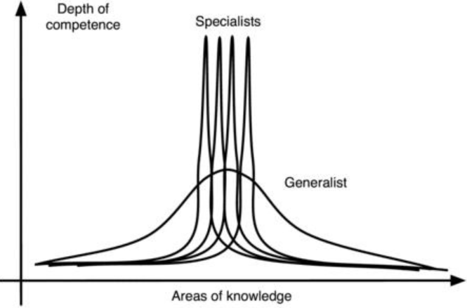
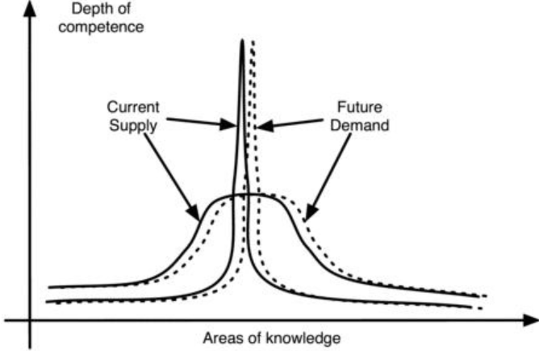

It's obviously more expensive, both in time and money, for Person A and Person B to gain the required amount of knowledge in both fields X and Y than it is if A were to concentrate on X while B concentrated on Y. 
与 A 专注于 X，B 专注于 Y 相比，A 和 B 在 X 和 Y 领域都获得相同数量的知识，显然在时间和金钱上都更昂贵。
In this way, both can gain the same depth of knowledge in half of the fields, in half the time.
这样，双方可以在一半的领域、一半的时间内获得相同的知识深度。
Alternatively, they can get twice as much knowledge in the same field in the same time. 
或者，他们可以在同一时间，在同一领域获得两倍的知识。
It follows that the more a field is further split up into subfields, the less expensive this knowledge gets. 
因此，一个领域被分割的子领域越多，知识成本就越低。
These cost savings can be used to reach even deeper levels of competence (see this figure).
这些节省的成本，可用于达到更深层次的能力（参见此[图]()）。

The knowledge of a natural philosopher in the 17th century was so broad that he would cover several fields such as mathematics, physics, chemistry, meteorology, etc. 
(illustrated by a broad bell curve) 
17世纪一位自然哲学家的知识非常广泛，涵盖了数学、物理、化学、气象等多个领域。（以宽钟形曲线表示）
Compared to a modern-day scientist the natural philosopher's knowledge on a specific topic could be said to have been remedial at best. 
与现代科学家相比，自然哲学家对特定主题的知识，充其量可以说是补救式的。
On the other hand, a modern scientist knows very little, even when it comes to basic things, outside his own field of specialization. 
另一方面，现代科学家对自己专业领域之外的基本知识知之甚少。
This is solved by having many more scientists, each covering their own narrow subfield.
这是通过拥有更多的科学家来解决的，每个科学家都涵盖自己狭窄的子领域。
It's important to realize, though, that just because humans are getting more specialized  doesn't  mean  they're  getting  smarter. 
然而，重要的是要意识到，人类变得更加专业化，并不意味着他们变得更聪明。
 Given  these  limitations,  it's clear  that  the  depth  of  specialization  comes  at  the  cost  of  narrowness  of specialization. 
鉴于这些限制，很明显，专业化的深度是以专业化的狭窄为代价的。
Having a narrow but deep knowledge means that one doesn't have much  broad  knowledge  or  broadly  applicable  skills. 
拥有狭隘但深厚的知识意味着，一个人没有太多广泛的知识，或广泛适用的技能。
 The  marketplace compensates for this by making available, at a price, the products produced by other specialists. 
市场通过以一定的价格，提供其他专家生产的产品，来弥补这一点。
However, the individual specialist is subject to the risk of being stuck  with  a  useless  skill  if  the  demand  for  their  particular  skill  suddenly vanishes due to outsourcing, or stagnating wages due to competition. 
但是，如果由于外包，或由于竞争，导致工资停滞不前，对特定技能的需求突然消失，个别专家可能会陷入技能无用的困境。
Specialists that have invested their entire knowledge in skills useful for employment risk suddenly finding themselves without income in a changing world. 
将全部知识投入到对就业有用的技能上的专家，突然发现，不断变化的世界中，自己在没有了收入。
Hence a lot of effort  goes  into  continuously  acquiring  new  skills  while  discarding  old  ones.
因此，很多努力用在不断获得新技能，同时丢弃旧技能上。
Many  find  it  stressful  to  keep  up  with  the  technological  drift  of  their specialization as new methods are continuously introduced, requiring them to discard previously acquired knowledge.
随着新方法的不断引入，许多人发现，跟上他们专业化的技术变化，会带来压力，这要求他们放弃以前获得的知识。

This figure shows a narrow delta function representing the skills of a specialist. 
该图显示了代表专家技能的窄 delta 函数。
A dotted line and an arrow represents the shift in demand. 
虚线和箭头表示需求的变化。
The demand now lies almost entirely out of the specialist's supply. 
现在的需求几乎完全超出了专家的供应。
This requires the specialist to work very hard to stay on target. 
这需要专家非常努力地工作以保持目标。
The figure also shows a wider bell curve that represents the skills of the generalist. 
该图还显示了代表通才技能的更宽的钟形曲线。
During a similar demand shift, the overlap between the new demand and the generalist's supply is substantial.
在类似的需求转变期间，新需求和通才供应之间的重叠是巨大的。
Here,  a  large  problem  is  that  previously  acquired,  specialized  knowledge can't be used as a foundation for new specialized knowledge--by definition, only generalized  knowledge  can  serve  this  purpose. 
在这里，一个大问题是，以前获得的专业知识，不能作为新专业知识的基础——根据定义，只有广义知识才能达到这个目的。
 The  only  thing  the  specialist knows is how much effort it took to reach the level of the former specialization and that this must now be repeated probably several more times throughout his career.
专家唯一知道的是，达到以前的专业水平需要付出多少努力，而且现在必须在他的职业生涯中多次重复这一点。

In other words, a specialist has acquired a lot of specialized knowledge at a cheap unit cost in order to be competitive. 
换句话说，专家以低廉的单位成本，获得了大量专业知识，以保持竞争力。
However, given the low unit cost, this knowledge  is  not  a  solid  basis  for  further  professional  growth;  rather,  it's expendable. 
然而，鉴于单位成本较低，这些知识并不是进一步专业发展的坚实基础； 相反，它是可消耗品。
The means to survival for a specialist is his ability to rapidly learn new subjects, quickly produce saleable works, and then move on. 
专家生存的手段是，他能够快速学习新学科，快速制作出可销售的作品，然后继续前进。
This is called skimming. 
这称为略读。
It's the same strategy pursued by weeds, to use an ecological analogy.
At the expert level (see Gauging mastery), a person needs 80-100 hours a week to stay competitive. 
使用生态学类比，这与杂草所追求的策略相同。
在专家级别（参见[衡量精通]()），一个人每周需要 80-100 小时才能保持竞争力。
For masters level, it's 60-80 hours, and to remain competent requires 40-60 hours a week.
对于大师水平，它是 60-80 小时，而保持能力需要每周 40-60 小时。

The professional need to forget and relearn can be hard to accept, especially for  dedicated  specialists  who  personally  identify  with,  self-actualize  through, and  take  pride  in  the  knowledge  they  have  spent  years  acquiring. 
忘记和重新学习的专业需求可能难以接受，特别是对于那些个人认同、自我实现，并为他们多年来获得的知识感到自豪的敬业的专家们。
 These  are people who consider their work an expression of who they are. 
这些人认为他们的工作表现了他们的身份。
They usually produce the best work, the "cathedrals" of their professions. 
他们通常制作最好的作品，即他们职业的“大教堂”。
Conversely, they're also at the highest risk of burning out when the market or their employers force them  to  tear  down  their  cathedrals  and  build  something  else. 
相反，当市场或他们的雇主强迫他们拆除大教堂，并建造其他东西时，他们也面临最高的烧毁风险。
 Those  who maintain a professional distance from their knowledge and treat it like school courses  and  exam-passing  fare  better. 
那些与他们的知识保持专业距离，并将其视为学校课程和通过考试方法的人会更好。
 These  are  the  people  who  build  the "cookie-cutter homes" of  their  professions,  which  are  ideally  suited  for  mass production. 
这些人建造了专业的“千篇一律的房子”，这非常适合大规模生产。
These are the "professionals."
这些是“专业人士”。

Creating  a  system  based  on  specialized  production  thus  increases productivity, but at the cost of increased risk to and pressure on the individual.
因此，创建基于专业化生产的系统，可以提高生产力，但代价是增加了个人的风险和压力。
Another feature of specialized work is that it depends on expending resources such as time and energy. 
专业工作的另一个特点是，它依赖于时间和精力等资源的消耗。
Therefore, specialization is not an optimal strategy for those who seek balance in their life. 
因此，对于那些在生活中寻求平衡的人来说，专业化并不是最佳策略。
Those who take some time or energy off to pursue other interests will surely be overtaken by another specialist, who sleeps less or does not have other responsibilities. 
那些花一些时间或精力去追求其他兴趣的人，肯定会被另一个睡眠不足，或没有其他责任的专家超越。
The competition is intense.
竞争很激烈。

A  further  problem  that  causes  systemic  inefficiencies  is  that  advancement inside the system is subject to the Peter Principle, where people are promoted as long as they're competent in their current specialization. 
导致系统效率低下的另一个问题是，系统内部的晋升受制于彼得原则，只要人们在当前的专业领域内胜任，他就会得到晋升。
This creates a problem as specializations change, and a person might get promoted to a specialization, typically  management,  where  he  isn't  competent  (his  highest  level  of incompetence) and never will be. 
随着专业化的变化，这会产生一个问题，一个人可能会被提升到一个专业化，通常是管理，在那里他不胜任（他是最不胜任的）并且永远也不会胜任。
In such a system, work is only done by those who are yet to reach a position in which they're incompetent. 
在这样的系统中，工作只能由那些，尚未达到他们职位无能的人来完成。
Although some institutions  have  made  efforts  to  eliminate  the  detrimental  effects  of  this principle, it's still observed in many places.
虽然一些机构已经努力消除这一原则的不利影响，但许多地方得仍然依旧。