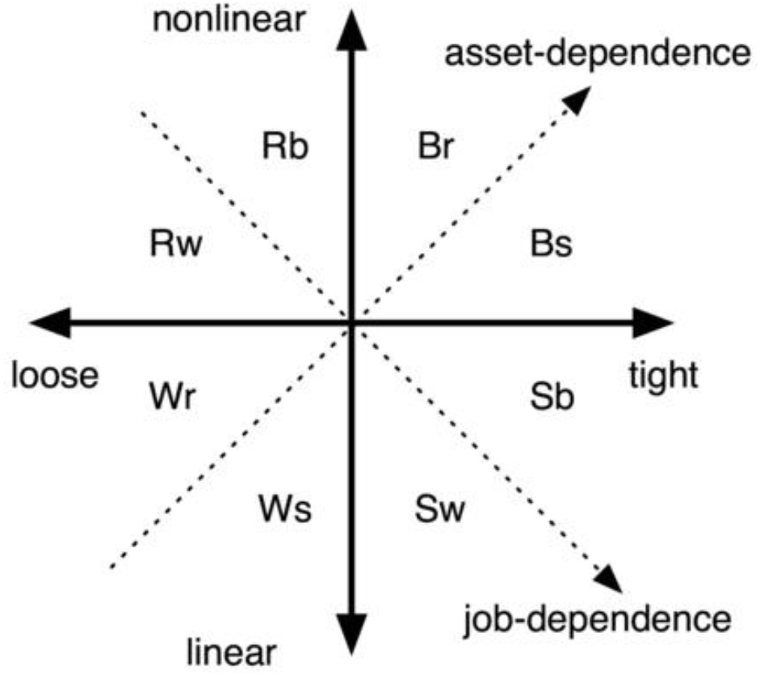

A Renaissance man is a person who is competent in a wide range of fields, covering  intellectual  areas  as  well  as  the  arts,  physical  fitness,  and  social accomplishments.
文艺复兴人是一个在许多领域都有能力的人，包括智力领域以及艺术、身体健康和社会成就。
This contrasts with the more modern, specialized approach, where a person is encouraged to build skills in a single vocation and use the income from that to pay for everything else.
这与更现代、更专业的方法形成了对比，后者鼓励一个人在一个职业中培养技能，并用这一职业的收入来支付其他一切。
However, I think it can be argued that a specialist is not a well-balanced human.
然而，我认为可以说专家不是一个平衡良好的人。
Many people strive for a sense a balance  between  work  and  life  without  ever  achieving  it,  leaving  some  areas underdeveloped  and  others  overly  so.
许多人追求工作和生活之间的平衡感，却从未实现过，却留下一些领域欠发达，而另一些领域则过于落后。
This  isn't  the  case  for  the  Renaissance man,  who  develops  all  sides  of  himself  to  their  full  potential.
对于文艺复兴人来说，情况并非如此，他充分发挥了自己的各方面潜力。
Furthermore, generalized skills allow a Renaissance man to reach creative solutions for most of his needs.
此外，广义的技能使文艺复兴人能够为他的大部分需求找到创造性的解决方案。
Because of his ability to solve problems, the Renaissance man is  fairly independent of the marketplace since he no longer has to buy nearly as much  to  satisfy  his  needs.
由于他解决问题的能力，文艺复兴人相当独立于市场，因为他不再需要购买太多东西来满足自己的需求。
Rather  than  buying  a  product,  he  puts  solutions together  using  social  skills  (borrowing,  bartering),  technical  skills  (building, reengineering),  artistic  skills  (designing,  creating),  and  physical  fitness (humanpowered  tools).
和购买产品不同，他利用社交技能（借、易货）、技术技能（建筑、再工程）、艺术技能（设计、创造）和身体健康（人力工具）来整合解决方案。
Buying  less  means  that  he  doesn't  require  millions  to reach financial independence.
减少购买意味着他不需要数百万美元就能实现财务独立。
For the money he needs, jobs are much easier to find.
对于他所需要的钱来说，工作更容易找到。
The Renaissance man can apply for different jobs in different fields rather than just a single one.
文艺复兴人可以申请不同领域的不同工作，而不仅仅是一份工作。
Although they don't pay as well as a highly specialized career job, less money is needed.
虽然他们的薪水不如一份高度专业化的职业工作，但需要的钱更少。
Complex solutions based on multiple different skills don't require leverage.
基于多种不同技能的复杂解决方案不需要杠杆。
They may result in profit, but profit is merely a side effect of the construction, and therefore the Renaissance man isn't subject to the same risk as the businessman.
它们可能会带来利润，但利润只是建筑的副作用，因此文艺复兴人不会像商人一样面临同样的风险。
The main purpose of the Renaissance man is to solve a problem as a human rather than as a part of the "work-spend" system.
文艺复兴人的主要目的是作为一个人而不是作为“工作-消费”体系的一部分来解决问题。

The Renaissance man is capable of many different things and doesn't restrict himself  to  vocational  skills.
文艺复兴人有很多不同的能力，不局限于职业技能。
He  does  his  own  taxes  and  researches  his  own investments.
他自己纳税，自己研究投资。
He can fix a computer or a broken appliance.
他能修理电脑或电器。
He knows how to drive and fix a car, but he has enough time and athletic ability to ride his bicycle 20 miles instead, or run five miles to get groceries.
他知道如何开车和修车，但他有足够的时间和运动能力骑自行车30公里，或者跑8公里去买食品。
Physically, he keeps up with people decades younger than himself.
在身体上，他能跟上比他年轻几十岁的人。
He can play an instrument, dance, paint, or write creatively.
他能演奏乐器、跳舞、绘画或创作。
He can create interesting meals from scratch rather than recipe.
他可以从头开始制作有趣的饭菜，而不是参照食谱。
Socially, he knows who to ask for help, who needs help, and how to put people together to efficiently solve problems.
在社交方面，他知道向谁寻求帮助，谁需要帮助，以及如何让人们团结起来有效地解决问题。
He is a leader or an inspiration to other people, whether it is personal, local, national, or global.
无论是个人、地方、国家还是全球，他都是领导者或激励他人的人。

The Renaissance man has the best of all worlds.
文艺复兴人拥有世界上最好的东西。
In this figure, we can draw a line of increasing job dependence from the highly independent Renaissance man to the highly dependent salary man, with the working man and the businessman having a sort of semi-dependence.
在这个[图]()中，我们可以画出一条从高度独立的文艺复兴人到高度依赖薪水的人的工作依赖性增加的线，工人和商人有一种半依赖性。
Similarly, we can draw a line of increasing asset  independence  from  the  highly  independent  working  man  to  the  highly dependent businessman.
同样，我们可以从高度独立的工人到高度依赖的商人，划出一条增加资产独立性的线。
These dimensions are illustrated in this figure, which provides  another  way  of  looking  at  the  types.
这些尺寸如[图]()所示，它提供了查看类型的另一种方式。
This  can  be  thought  of  as  an alternative four types or a further splitting into octants to more precisely describe the leanings of a person.
这可以被认为是四种类型的替代，通过进一步分解成八份，来更精确地描述一个人的倾向。
In the latter case, each of the four types fall into a given wing.
在后一种情况下，四种类型中的每一种都会落入给定的象限。
The  nomenclature  of  the  figure  should  be  self-evident.
图形的命名应该是不言而喻的。
For  example,  a Renaissance man could be leaning towards asset-backed job independence of a businessman (Rb) or he could be leaning towards the jack-of-all-trades approach to job independence of a working man (Rw).
例如，文艺复兴人可能倾向于商人（Rb）的资产支持的工作独立性，或者他可能倾向于工人（Rw）的工作独立性的各行各业方法。
Similarly, the salary man could lean  towards  starting  a  side  business  or  investing  in  stocks  to  provide  more income to replace or add to some of his job income (Sb), or he could reduce his need for job income by divesting some of the things he has financed and finding  ways to do more and spend less (Sw).
类似地，领薪人可能倾向于开办副业或投资股票，以提供更多收入来取代或增加部分工作收入（Sb），或者他可以通过剥离一些他资助的东西并找到做得更多、花得更少的方法来减少对工作收入的需求（Sw）。
A working man could engage in longer- term consulting projects (Ws).
工人可以从事长期咨询项目（Ws）。
  

An alternative way of looking at behaviors in terms of dependence on financing and having a job.
从对资金和工作的依赖性角度看待行为的另一种方式。
Taken together with the previous figure, this describes eight types.
结合上图，本文描述了八种类型。

Independence is not something one has; rather, it is something that one is.
独立不是一个人有的；而是，它是一个人是什么。
This is good news, because it means that it is possible to change one's behavior and economic interactions in a way that fosters greater independence, or less, if so desired.
这是一个好消息，因为这意味着有可能改变一个人的行为和经济互动，以促进更大的独立性，如果需要的话，也可以减少。
The salary man can work on reducing his dependence on money by learning and creating alternative solutions, thus reducing his dependence on a job.
领薪人可以通过学习和创造替代方案来减少对金钱的依赖，从而减少对工作的依赖。
Such activities are best started through one's hobbies.
这样的活动最好从个人爱好开始。
Similarly, the working man can also learn to create solutions rather than buying them--in particular, it is quite  likely  that  the  working  man  will  already  be  creating  some  of  his  own solutions, like car repair, lawn maintenance, plumbing, etc.
同样，工人也可以学习创造解决方案，而不是购买解决方案——特别是，工人很可能已经在创造一些自己的解决方案，如汽车维修、草坪维护、管道维修等。
This could free up money for his legacy or charity, or the money could simply be used to buy time for early retirement.
这可以为他的遗产或慈善事业腾出资金，或者这些钱可以用来为提前退休争取时间。
Finally, the businessman can discover other forms of profit than strictly monetary, like social and environmental.
最后，商人可以发现其他形式的利润，而不是严格的金钱，如社会和环境。
Health and good relations could  just  as  easily  be  optimized,  and  when  business  size  is  subject  to diminishing returns, why not aim for a smaller but more efficient business (see Appropriate  response)?  That  is,  the  business  of  finding  solutions  for  just  a handful  of  people  rather  than  leveraged  solutions  that  control  and  serve thousands or millions of people.
健康和良好的关系也可以很容易地得到优化，当业务规模受到回报递减的影响时，为什么不把目标定在规模更小但效率更高的业务上（参见[恰当的反应]()）？也就是说，业务是为少数人找到解决方案，而不是控制和服务数千或数百万人的杠杆式解决方案。
Doing this, the businessman will find that the  leveraged bond eventually eases and money will flow to him freely.
这样做，商人会发现杠杆债券最终会变得容易，资金将自由地流向他。
