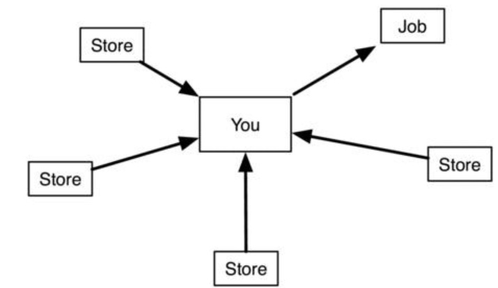
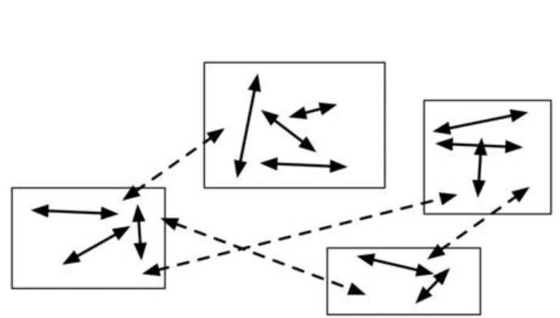

Consider the cash flow of a salary man who puts effort into a job that yields a wage, which is then spent on stuff that is used or consumed in an endless cycle. 
考虑一个薪资人的现金流，他把精力投入到一个能产生工资的工作中，然后消耗的东西上或花在一个无尽的循环。
This figure shows how the dependencies look in greater detail and in extreme conditions this can be a literal depiction, where the boxes are buildings and the arrows  correspond  to  driving a  car  between  the  boxes. 
此图更详细地显示了依赖的样貌，在极端情况下，这可以是文字描述，其中方框是建筑物，箭头对应于在方框之间驾驶汽车。
There's  a  box  for  the home, a box for the job, where the consumer drives to get money, and boxes for stores, where he drives to exchange the money from his job for entertainment or stuff which he drives back to his home. 
有一个用于家庭的盒子，一个用于工作的盒子，消费者开车去拿钱，还有一个用于商店的盒子，他开车去把工作中的钱换成娱乐或其他东西，然后开车回家。

  

Consumer culture shows a modular structure where problems are solved by driving to different stores to buy parts of the solution. 
消费文化显示了一种模块化结构，通过驾车到不同的商店，购买部件来解决问题。
This activity is made possible by driving to a job and exchanging time for money. 
这项活动是通过开车上班，和用时间换金钱来实现的。

This figure shows a tight coupling between the consumer, the job, and the stores, respectively. 
此图分别显示了消费者、工作和商店之间的紧密耦合。
Here the stores should be thought of broadly as shops, gyms, restaurants,  dentists,  plumbers,  etc. 
在这里，商店应该被广泛地视为商店、健身房、餐馆、牙医、水管工等。
If  the  coupling  to  the  job  is  severed,  the advanced consumer with good credit, savings, or insurance can draw on those, but he still needs to go to stores for his needs, since everything requires external interaction in the form of regular trips to stores--"I'm going to the store, need anything?" 
如果与工作的耦合被切断，拥有良好信用、储蓄或保险的高级消费者可以利用这些，但他仍然需要去商店满足自己的需求，因为一切都需要定期去商店的形式的外部互动——“我要去商店，需要什么吗？”

This  is  the  consequence  of  specialization. 
这是专业化的结果。
The  solutions  to  his  problems, except the very specialized problem detailed in his job description, have been outsourced  to  the  marketplace  and  personal  competence  has  been  lost  or replaced with information on "where to find good deals." Eventually he comes to depend strongly on this marketplace and hence on his continued employment. 
除了他工作中详细描述的、非常专业的问题外，他的问题的解决方案已经外包给了市场，个人能力已经丧失，或被，“在哪里找到好交易”的信息所取代最终，他开始强烈地依赖于这个市场，从而依赖于他的继续就业。

The individual consumers depend as strongly on an aggregate of stores as the stores depend on the aggregate of consumers. 
个体消费者对商店集合的依赖程度，与商店对消费者集合的依赖程度一样强烈。
This explains advertising and the insistence for expert solutions, at least as far as the experts are concerned, for they need to earn money at their jobs too. 
这就解释了，广告和对专家解决方案的坚持，至少就专家而言，他们也需要在工作中挣钱。

This is outsourcing taken to its logical extreme. 
这就是外包的逻辑极端。
Many believe that extreme outsourcing such as hiring assistants to write personal letters, walk their dog, and maybe talk to their spouses, is the way to go, counting on lower offshore living costs  to  maintain  their  comparative  advantage,  or  even  common  outsourcing such as buying cake mixes, eating out, or having a plumber fix a clogged pipe. 
许多人认为，极端外包（如雇佣助手写私人信件、遛狗、或者可能是与配偶交谈），甚至是常见的外包（如购买蛋糕配料、外出就餐、或者让水管工修理堵塞的管子）是一条可行之路，依靠较低的离岸生活成本，来保持其相对优势，。
There  are  three  reasons  for  this  line  of  thinking. 
这一思路有三个原因。
The  first  is  misinformation. 
首先是错误信息。
Consumers have become convinced that experts are needed for anything but the simplest task. 
消费者已经确信，除了最简单的任务，任何事情都需要专家。
The second is lack of personal skills. 
第二是缺乏个人技能。
Knowing how to provide basic needs, like householding skills or how to stay happy, can be tremendously valuable. 
知道如何提供基本需求，如持家技能或如何保持快乐，可能是非常有价值的。
They  can  often  be  had  very  inexpensively  compared  to  what  the market offers. 
与市场提供的产品相比，它们通常是非常便宜的。
For instance, imagine the value of a support network of family and friends, or meaningful, unstressful work, compared to the hourly rate of a psychotherapist or stress-relieving prescription drugs. 
例如，想象一下，与心理治疗师或缓解压力的处方药的小时工资相比，家庭和朋友的支持网络，或有意义、无压力的工作的价值。
Or that preprocessed food, which only needs to be heated, takes about 15 minutes of salary work to pay for, which is comparable to the time it takes to cook a similar meal from scratch. 
或者，只需加热的预处理食品，需要大约15分钟的工资工作，这相当于从头开始做一顿类似的饭所需的时间。
The third is lack of choices. 
第三是缺乏选择。
When the market mainly offers full-time jobs and the culture expects you to spend the rest of your time shopping and watching TV, it leaves little time for anything else. 
当市场主要提供全职工作，文化期望你把剩余的时间花在购物和看电视上时，剩下的时间就很少了。

For  individuals,  outsourcing  and  comparative  advantage  can't  remain advantageous  in  practice  if  taken  to  extremes. 
对于个人而言，如果走极端，外包和比较优势在实践中就无法保持优势。
Yet  in  many  ways  it  has  been taken too far already when people spend eight hours a day for 30 years to buy electric can openers and marble towers.The solution is to reverse the outsourcing of ordinary life skills and gradually insource skills that were previously acquired in the marketplace to 
然而，30年来，人们每天花8小时购买电动开罐器和大理石塔，在许多方面已经走得太远了。解决办法是，扭转普通生活技能外包的趋势，逐步内包以前外包的技能

- become less dependent on a single source of income. 
-减少对单一收入来源的依赖。
- become less dependent on a multitude of store services. 
-减少对众多商店服务的依赖。
This is both simple as well as tremendously challenging, because it requires a different kind of thinking. 
这既简单又极具挑战性，因为它需要一种不同的思维方式。
To get started, make a list of services and things acquired in the marketplace (see Building blocks for how to get a better idea of how to look for them) and start learning them on a need-to-know basis (see The Renaissance education). 
开始时，列出市场上获得的服务和物品清单（参见[构建模块]()了解如何更好地寻找它们），并在需要了解的基础上开始学习它们（参见[文艺复兴式的教育]()）。
Here is a short list41 of suggestions:  
以下是建议的简短列表：

1.  Hair cutting. If necessary change your hairstyle into something you can do.
Be flexible!
1.理发。如果必要的话，把你的发型改成你能做的。
变灵活！
2.  Mending clothes and darning socks.
2.补衣服和补袜子。
3.  Cooking, preferably from scratch. Heating something in the microwave or
mixing powder with water doesn't count. Again, if necessary, change your
diet.
3.烹饪，最好从头开始。用微波炉加热或将粉末与水混合不算数。如果有必要，再次改变你的饮食。
4.  Buying  something  used  instead  of  new  or  swapping  something.  There  are now many websites to facilitate this.
4.购买用过的东西而不是新，交换的东西。现在有许多网站可以做这件事。
5.  Getting  somewhere  without  a  car.  Use  public  transportation, commute  by bicycle or try walking a few blocks to the grocery.
5.不开车到达某处。使用公共交通工具，骑自行车上下班，或者试着走几个街区去杂货店。
6.  Borrowing a book  from  the  library.  It's  amazing  how  many  people  do not take advantage of this free resource.
6.从图书馆借书。令人惊讶的是，有多少人没有利用这一免费资源。
7.  Planting a garden of edible vegetables. Start with spices. Move onto high-cost/low-effort plants like tomatoes (not potatoes). Look into permacultureand intensive gardening.
7.在菜园种植可食蔬。从香料开始。转向高成本/低投入的植物，如西红柿（而不是土豆）。了解永久性种植和密集型园艺。
8.  Making  simple  nontoxic  household  agents  from  scratch,  like  laundry detergent, toothpaste, insect killer, window cleaner, or beer.
8.从零开始制作简单无毒的家用洗涤剂，如洗衣粉、牙膏、杀虫剂、窗户清洁剂或啤酒。
9.  Bicycle,  motorcycle,  or  car  maintenance.  At  least  start  by  washing  it yourself.  Move  on  to  fixing  flats,  cleaning,  changing  oil,  and  lubricating parts. Graduate to disassembling the drive train and engine.
9.自行车、摩托车或汽车维修。至少从自己洗开始。继续固定平面、清洁、换油和润滑零件。开始分解传动系和发动机。

A very common and very good piece of career advice is not to work to earn money but to work to learn new skills, gain new connections, and create new opportunities. 
一个非常普遍和非常好的职业建议是，不是为了挣钱而工作，而是为了学习新技能、获得新的关系和创造新的机会而工作。
Similarly, life advice like the above should not exclusively be for the purpose of saving money--although it'll come in handy later in Important financial  ratios--but  to  build  social  cohesion  and  connections  and  learn  and exercise skills that can later create opportunities. 
类似地，上述生活建议不应该仅仅是为了省钱——尽管它在以后的重要财务比率中会派上用场——而是为了建立社会凝聚力和联系，学习和锻炼能够创造机会的技能。
This way, saving money won't be  seen  as  consumer  deprivation  but  as  producer  manifestation;  you're  now making something rather than buying it. 
这样，省钱就不会被视为剥夺消费者的权利，而是生产者的表现；你现在在做东西，而不是买东西。
In my opinion, that makes you a more interesting person. 
在我看来，这使你成为一个更有趣的人。

Another very common--and in my opinion very bad--piece of advice, at least for the purposes of attaining success as a Renaissance man is to pick and focus exclusively on one thing, say hair cutting. 
另一个很常见的建议——在我看来也是很糟糕的建议——至少对于作为一个文艺复兴人获得成功的目的来说，就是选择并专注于一件事，比如说理发。
This may be fine if you need to make a career out of it, but if you only need to provide for yourself and possibly a few friends  there's  no  need  to  specialize  and  develop  all  skills  sufficient  to  be marketable; just focus on your own hair. 
如果你需要从中获得一份职业，这可能很好；但如果你只需要为自己，和可能的几个朋友提供服务，那么就没有必要将技能提高到可以在市场上销售的水平；只关注你自己的头发。

However, without changing one's frame of mind from that of a consumer, solving  daily  problems  by  learning  a  bunch  of  new  things  and  doing  them yourself  runs  the  risk  of  turning  into  a  multitude  of  hobbies  (see  here),  as supplies  are  ordered  from  stores,  clubs  are  joined,  or  projects  become  overly  ambitious,  at  least  in  terms  of  acquiring  the  tools  and  supplies. 
然而，如果不改变消费者的心态，通过学习一堆新事物并自己动手解决日常问题，就有可能变成多种爱好（参见[此处]()），因为从商店订购用品、加入俱乐部或项目变得过于雄心勃勃，至少在获取工具和物资方面会是这样。
This  could therefore  easily  end  up  strengthening  the  dependencies  of  this  figure,  first running out to stores to buy supplies and then running back to work to pay for them, leaving little time and room for the project, which eventually moves out to the garage with the rest of the stuff. 
因此，这很容易强化这一数字的依赖性，首先跑到商店去购买用品，然后又跑回去工作去支付费用，为项目留下很少的时间和空间，最终项目和其他东西一起搬到了车库。

Therefore,  a  requirement  is  to  make  each  project  self-supported. 
因此，一个要求是使每个项目都能自我支持。
To understand  what  this  means,  divide  the  projects  into  three  groups  (and everything in between)  
要理解这意味着什么，请将项目分为三组（以及中间的所有内容）
- Projects that cost money   
- 花钱的项目  

Projects  with  start-up  costs  and  regular  fixed  costs  (see  Depreciation schedules). 
项目有初创花费和固定支出（参考）。  
You need to buy equipment and pay subscription fees or replace equipment that wears out on a regular basis. 
Many sports fall under this category. 
你需要购买设备和付订阅费用或者在固定周期替换损耗的设备。很多在运动都可以落在这个条目下。  

- Projects that are "free"  
-  “免费的”项目  

Projects  with  few  start-up  costs,  no  fixed  costs,  and  no  cash  flow,  but possibly network connections of learning skills or providing some value. 
These projects are free. 
项目需要极少的启动资金，没有固定支出，没有现金流，但是可能是学习新技能和提供其他简直的网络连接。这些项目是免费的。   
This can include using things you already have, such as a computer and an Internet connection. 
这可以是使用你已经拥有的事物，例如计算机和网络连接。  

- Projects that earn money   
- 赚钱的项目  
Projects that are saving you money or--even better--making you money;   
帮你省钱的项目——或更好——帮你赚钱；  
not as in a hopeful future, but now. 
This could include learning how to cook, fixing  computers,  mowing  people's  lawns  (for  the  exercise),  babysitting, etc  
不只是在有希望的未来，而是现在。这包括了学习如何烹调，修电脑，帮人剪草坪（用于练习），看孩子等等。   
It's of primary importance that a project produces value, even if that value isn't money, and doesn't destroy value. 
最主要的是这些项目产生价值，尽管这些价值不是钱，也不损害它的价值。  
Money leaving your pocket is a big warning sign that your activities fall into the first category. 
当你的钱从你的口袋里流走的时候就是一个警示信号，你的活动都掉进了第一个分类。   These should be avoided as much as possible and replaced with or modified into activities that are "free" but provide the opportunity to learn,  meet  new  people,  and  possibly  earn  money  eventually. 
这是需要尽可能避免的并且替换或者修改为“免费”的活动，但能提供学习的计划，遇到新的人，或者偶尔有赚钱的可能。  
It's  often  quite possible to find a direct, yet free, replacement for a cash-negative activity. 
找些直接免费的活动来代替负现金流的活动是非常可能的。   
For instance, rather than going to the movies, you can borrow the DVD from the library or a friend about six months later if you just change your perspective. 
例如，通过改变你的观点，你可以六个月以后从图书馆或者朋友那里借DVD，而不是去电影院。 
Don't get too ambitious about making money right away. 
不用太急切的想立刻就赚钱。 
Serendipity plays a larger role in the long term. 
从长远来看，偶然性起着更大的作用。
For example, I replaced my fascination with buying computer  hardware  (expensive  money  sink)  with  learning  about  the  *nix operating system (free) and eventually ended up as the system administrator of the department I was working in simply because I was the one who knew the most when the previous admin left. 
例如，我用学习*nix操作系统（免费）取代了对购买计算机硬件（昂贵的吸金寿）的迷恋，最终成为我所在部门的系统管理员，原因很简单，因为我是前任管理员离开时知道得最多的人。
Later I turned the knowledge of emacs and LaTeX from writing scientific articles into a freelancing job as a copy editor, which  covered  all  my  expenses  working  approximately  30  minutes  a  day  on average. 
后来，我把emacs和LaTeX的知识从写科学文章变成了一份自由职业者的复印编辑工作，这涵盖了我平均每天工作大约30分钟的所有费用。
Blogging  was  another  activity  that  started  as  a  constructive  way  of channeling  my  writing  and  eventually  turned  into  this  book,  which  I  typeset myself using what I learned as a copy editor. 
写博客是另一项活动，最初是作为引导我写作的一种建设性方式，最终演变成了这本书，我用我作为一名文案编辑所学的知识为自己排版。
My interest in economics grew out of my interest in geopolitics, and eventually turned into an interest in investing, that I combined with my savings, which came from my interest in not spending money by doing more things myself, and so I was able to devise a custom-made portfolio that suited my particular investing temperament. 
我对经济学的兴趣源于我对地缘政治的兴趣，并最终转变为对投资的兴趣，这与我的储蓄相结合，我的储蓄来源于，我不想通过自己做更多的事情来花钱，因此我能够设计出适合我特殊投资气质的定制投资组合。

Over time, this approach automatically develops several diversified streams of cash, as well as many more means to save money and keep that cash. 
随着时间的推移，这种方法会自动开发出多种多样的现金流，以及更多节省资金和保留现金的方法。
Yet, cash  flow  is  not  the  only  measure  of  independence. 
然而，现金流并不是衡量独立性的唯一标准。
Some  develop  a  social network so large that they can travel anywhere with little cost (look into courier services and couch surfing), and others develop such a wide set of skills along with an ability to sell those skills that they can work for room and board as well as a small stipend. 
一些人发展了一个如此庞大的社交网络，以至于他们可以花费很少的费用去任何地方旅行（看看快递服务和沙发冲浪），而另一些人则发展了如此广泛的技能，并有能力出售这些技能，他们可以为食宿工作，还可以获得少量的津贴。

Conversely, it may be that an activity needs certain other connections. 
相反，活动可能需要某些其他连接。
For example, using the company gym for free requires working for the company. 
例如，免费使用公司健身房需要为公司工作。
In fact, companies often attempt to strengthen their employees' dependence on the company by providing "benefits" like health care, retirement plans,  and  other perks which can be thought of as golden handcuffs. 
事实上，公司经常试图通过提供“福利”来加强员工对公司的依赖，如医疗、退休计划和其他可以被视为金手铐的津贴。
This must be kept in mind when  resolving  dependencies,  especially  connections  to  things  outside  your immediate control. 
在解决依赖关系时，尤其是与你无法直接控制的事物的连接时，必须记住这一点。

The optimal solution in terms of dependencies and connections is shown in this figure. 
此[图]()显示了依赖关系和连接方面的最佳解决方案。
Here each project is modularized and acts as a holon. 
在这里，每个项目都是模块化的，充当一个全息图。
This means that the connections within the project are strong, whereas the connections between a project  and  the  external  world  (other  projects)  are  weak. 
这意味着项目内部的连接很强，而项目与外部世界（其他项目）之间的连接很弱。
Consequently,  any given project doesn't depend very much on other projects, and vice versa. 
因此，任何给定的项目都不太依赖于其他项目，反之亦然。
They are also self-supporting and able to contribute to each other without depending on each other. 
他们也能自给自足，能够相互帮助而不依赖对方。
It is resilient, much like the Internet is resilient by design, as it can still  function  even  when  individual  servers  are  down,  as  no  single  server  is critical. 
它是有弹性的，就像互联网在设计上是有弹性的一样，因为它即使在个别服务器停机时也能正常工作，因为没有一台服务器是至关重要的。
Now, can you say the same thing about your life with regards to your job? Or your car?
现在，关于你的工作，你能对你的生活说同样的话吗？还是你的车？

  

This figure shows how to organize your activities. Much like an
industrial conglomerate, dependencies between the projects are weak.
Strong dependencies are contained inside the projects.
此图显示如何组织你的活动。很像一个
工业集团，项目之间的依赖性较弱。
强依赖性包含在项目中。
Another  aspect  of  this  figure  is  that  no  single  module  dominates. 
该图的另一个方面是没有单一模块占主导地位。
The modules are diversified into approximately equally large sizes, which decreases risk. 
模块的大小大致相同，从而降低了风险。
For instance, consider the university departments in The Renaissance ideal. 
例如，考虑文艺复兴式理想中的大学系。
Each department in a university is about equally large and strong. 
一所大学的每个系的规模和实力大致相同。
This is unlike most people where one skill completely dominates all others--for example, one may be paid $25,000/year for one activity (one's job) but less than $25/year for one's next highest source of income, which is very likely to be the interest from a savings  account. 
这与大多数人不同，他们的一项技能完全支配着所有其他技能——例如，一个人的一项活动（一份工作）的报酬可能为25000美元/年，但下一个最高收入来源的报酬可能低于25美元/年，而下一个最高收入来源很可能是储蓄账户的利息。
With  proper  diversification,  if  one  income-generating  module fails,  it  doesn't  cause  shockwaves  through  the  rest  of  the  system  because  the external coupling to other modules is weak. 
通过适当的多样化，如果一个创收模块出现故障，不会对系统的其余部分造成冲击波，因为与其他模块的外部耦合很弱。
In addition, if the external couplings connect  to  different  modules,  rather  than  connecting  to  the  same  module,  this lack  of  centralization  protects  the  system  from  disruptions  and  cascading failures. 
此外，如果外部耦合连接到不同的模块，而不是连接到同一个模块，这种缺乏集中化的情况可以保护系统免受中断和级联故障的影响。
Furthermore, the wider the diversification, the greater the likelihood of taking  advantage  of  opportunities  in  the  unique  environment  you  reside  in,  or which you may find yourself residing in due to changing circumstances--this is the  quintessence  of  adaptability. 
此外，多样化的范围越广，就越有可能在你所处的独特环境中利用机会，或者由于环境的变化，你可能会发现自己正在利用所处的环境——这就是适应性的精髓。
If  you  find  yourself  in  a  situation  where  you can't  solve  a  problem,  solve  another  problem--an  omnivore  always  has  more options available when solving the problem of eating.
如果你发现自己无法解决一个问题，那就解决另一个问题——杂食动物在解决吃饭问题时总是有更多的选择。

Note  that  simple,  small,  and  slow  modules  are  easier  to  manage  than complicated, large, and fast modules. 
请注意，简单、小而慢的模块比复杂、大而快的模块更易于管理。
In managing modules, your reaction time should be faster than the characteristic time scale of anything you interact with and you should be able to understand and control anything you engage with/in as well  as  have  the  time  to  oversee  the  operation. 
在管理模块时，你的反应时间应快于与之交互的任何事物的特征时间尺度，你应能够理解和控制你参与的任何事物，并有时间监督操作。
While  increasing  size  and complexity  initially  offers  better  benefits,  the  benefits  decrease  as  increasingly higher  costs  of  unforeseen  problems  swamp  the  system. 
虽然增加规模和复杂性最初会带来更好的好处，但随着不可预见问题的成本越来越高，最终淹没系统，好处会减少。
Here  the  answer  is  to offload  the  complexity,  but  where  do  you  begin  and  where  do  you  stop? Communities  like  the  Shakers  and  the  Quakers  have  thought  about  this  and decided  on  some  ground  rules  of  what  complexities  to  avoid. 
这里的答案是减轻复杂性，但是从哪里开始，从哪里停止？像Shakers和Quaker这样的团体已经考虑过这一点，并决定了一些基本规则来避免什么样的复杂性。
In  general,  the avoided  complexities  are  the  tightly  coupled  complexities.42  They  will  gladly borrow those, but they won't own them. 
通常，避免的复杂性是紧密耦合的复杂性。他们很乐意借，但不会拥有。
To wit, they use a modularity strategy with loose couplings to avoid many problems. 
也就是说，他们使用具有松散耦合的模块化策略来避免许多问题。
Slowness  can  be  achieved  through  delayed  gratification. 
缓慢可以通过延迟满足来实现。
In  a  world  of scarcity,  instant  gratification  is  the  optimal  strategy. 
在一个稀缺的世界里，即时满足是最佳策略。
In  a  world  of  abundance, delayed gratification is the optimal strategy. 
在一个富足的世界里，延迟满足是最佳策略。
Genetically, there's a preference for the former, which means that a mature person with a measure of self-control has an advantage, being able to wait for bargains. 
从基因上来说，人们更喜欢前者，这意味着一个有一定自控能力的成熟人有一个优势，能够等待便宜货。
It also means if you have patience and  don't  depend  on  speed,  there  are  fewer  costs  to  be  paid  for  the  additional power that speed otherwise requires. 
这也意味着如果你有耐心并且不依赖于速度，那么速度所需要的额外动力所需的成本就会减少。
It's helpful to master the art of waiting. 
掌握等待的艺术是有帮助的。
often the problems we perceive as urgent turn out to be less  than  urgent. 
我们认为紧迫的问题往往没有那么紧迫。
We are prone to action, but Sometimes  they  will  even  resolve  themselves  without  any interaction.
我们倾向于采取行动，但有时问题甚至会在没有任何互动的情况下，自行解决问题。