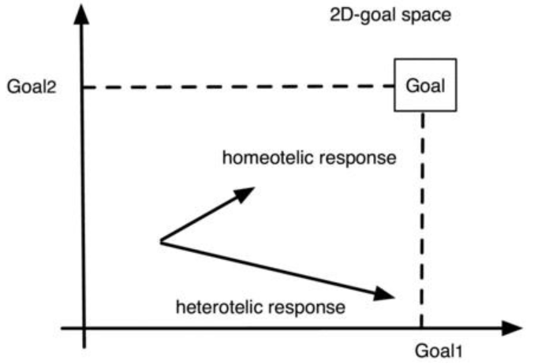

When  pursuing  a  goal  with  an  externally  preset  strategy,  there's  a  strong
tendency to focus on tactics to increase productivity. 

当使用一个外部预设的目标去追求一个目标时，有很强趋势去增加生产力。

Crank the machine faster to
get done sooner. 

通过让机器转动的更快来完成更快。

"Here's how you can save five minutes while brushing your
teeth, and here's how you can more effectively respond to e-mails, and here are
500 additional tips." 

“这是如何让你节省5分钟的刷牙时间，这是如何提高你回复邮件的效率，这是额外的500个小贴士。”

The reason is that, other than working faster, most people
really don't have a lot of freedom in terms of strategies for reaching their goal,
since  their  strategies  are  locked  in  (see  The  lock-in)  either  externally  by
association--for  example,  company  procedures--or  internally,  by  habit  or
tradition. 

原因时这样的，比起做的更快，很多人没有获得他们目标的很多的策略的自由度，因为他们的策略被外部的关联锁住（参见锁住），比如，公司的制度，或者内部的习惯或传统等锁住。

 The  only  way  is  therefore  to  use  slightly  more  effective  tactics.

唯一的方法时使用直接的更高效的战术。

Consider,  for  example,  a  factory  floor,  where  the  only  allowed  means  of
increasing productivity is to run each station faster. 

考虑一些，例如，一个车间，只允许每个工站运行更快来增加总的平均生产率。

Now, admittedly, if you have
a million employees, you can probably save a million minutes by getting your
workers to spend one minute less on a given task, and if you're the business
owner, it all adds up, maybe to $1 million for you and one million curses from
the  employees. 

现在，如果你有1百万工人，你可以通过每个工人给定任务少花1分钟来节省1百万分钟，如果你是这生意的所有者，所有都加起来，你可能得到1百万刀和1百万句咒骂。

 Perhaps  a  redesign  of  the  factory  floor  layout,  that  is  a  new
production strategy, would be more effective than reusing the old strategy with
slightly better tactics? 

可能重新设计车间的布局会是一个新的生产策略，也许会比重用老策略这样直接的战术更有效率？

For the individual person, who is saving a minute here and
a minute there to spend working towards his goal, another goal-seeking strategy
would be more effective.

对于个人，他在这在那节省一分钟用于向他的目标迈进，其他的目标搜寻可能会更有效率。

Thus,  to  increase  effectiveness,  the  focus  must  be  on  improving  on  the
strategy rather than improving on the tactics. 

也就是说，为了增加效率，关注点应该是提高策略而不是提高战术。

Rather than using better tactics to
reach goals, the goal-setting method must become better. 

和使用更好的战术达成目标比起来，目标设定的方法必须变好。

Traditional goal-setting
is one-dimensional.

传统的目标设定都是一维的。

 It follows a process that essentially draws a line between A
and B and then divides that line into small steps of actions that are taken in an
incremental fashion. 

它遵循着一条由A到B的需要绘制的直线，并且把线分割成小段，通过行动渐进地前进。

The problem with this approach is not so much the division
into  steps,  which  can  be  psychologically  helpful  or  a  way  of  maintaining
managerial control or measuring progress.

这种方法的问题不是分割了太多的小段，小段在心理上能够帮助维护管理控制和衡量进度。

 Rather, it's in the goal-setting itself, in
particular the drawing of a straight line between A and B.
This  rarely  works,  since  real-life  goals  are  seldom  straightforwardly  one-
dimensional.  

而是，它是在于目标设定本身，在于A到B间特殊绘制的直线。这种很少行得通，因为现实生活很少是直接的一维模式。

Most  actions  have  side  effects.  This  has  a  very  important

consequence:
You can never do just one thing!

很多行动都有副作用。这样就代理了一个重要的后果：你永远不能只做一件事情！

When focusing on a single goal, side effects are ignored. 

当专注单一的目标时，副作用可以忽略。

For instance, the
most  popular  single  goal  is  building  a  career.  

举例来说，最流行的单一目标时职业建设。

This  goal  tends  to  ignore  the
sometimes  adverse  side  effects  such  as  complete  dependence  on  the  job,

这个目标趋向于忽略有害的副作用例如完全依赖于工作，

complete  identification  with  the  job, 

完全由工作标识，

 alienation  from  the  spouse  and  any
children, failing physical health, stress, and so on. 

疏远配偶和子女，健康变坏，压力等等。

If one manages to maintain a
strict focus on the goal, then by the time the goal is reached, this strategy will
have  caused  so  much  collateral  damage  that  the  work  is  not  complete; 

如果一个人设法维持对目标的专注，那么随着目标的达成，这个策略会造成如此多的附带破坏以至于工作无法完成；

 the
damage must be fixed first. 

需要首先修复破坏。

Often this "fixing" creates additional problems.

这种“修复”经常会制造附带的问题。

Consider  a  two-dimensional  problem  (see  this  figure). 

考虑一下一个两维的问题（参考这个图）。

 A  rudimentary
example  of  a  two-dimensional  problem  is  achieving  the  famous  "work-life"-
balance. 

一个基本的二维的例子时获得有名的“工作生活”平衡。

While I don't believe there is such a thing, it will serve as an example.

当然我不相信这种事情，所有它就作为一个例子。

In this example, the challenge is to solve two problems simultaneously. 

这个例子里，挑战是同时地解决两个问题。

The first
problem, goal1, is the "work" problem, presumably working enough to build a
career, display skills, gain power, money, awards, merit badges, or whatever. 

第一问题是，目标1，工作问题，假定做足够多的工作来建设职业，展示技能，增加权力，钱，奖励，获得荣誉，无所谓什么。

The
ideal  point  is  marked  on  the  x-axis. 

理想的位置被标记在x轴上。

 The  second  problem,  goal2,  is  the  "life"
problem, that is having a happy home life, whatever that entails. 

第二个问题，目标2，是“生活”问题，就是有一个幸福的家庭，无论需要这需要什么。

The ideal point
is  marked  on  the  y-axis.  Together  they  form  a  two-dimensional  goal
(goal1,goal2) marked with the box "Goal."

理想的点被标记在y轴上。

它们共同组成了二维的目标（目标1，目标2）标记在方框“目标”里。

This figure requires a rudimentary understanding of vector spaces from
"linear algebra 101." 

这张图要求“线性代数101”中对基本的对于向量空间的理解。

It shows the difference between a heterotelic and a
homeotelic response in a world that only has two possible goals.

它表现了真实世界里有两种可能性目标的异目的性和同目的性的反馈。

 The
homeotelic response moves closer to both goals whereas the heterotelic
response, while moving further towards goal-1, actually moves away from

goal-2.

同目的性响应像两个目标靠近，同时异目的性靠近目标1，实际上是原理目标2.

Also shown in the figure are two possible strategies. 

这也在图中表现了两种可能的策略。

Both strategies have
side effects and affect the pursuit of both goals.

两策略对对方的目标都有的侧面影响。

 The heterotelic strategy moves
you closer to goal-1--you went in the right direction along the x-axis--but away
from goal-2--you went in the wrong direction along the y-axis.

异目的性让你接近目标1——你沿x轴向正确的方向走——但是远离了目标2——你沿y轴向错误的方向走。

 Heterotelic,  a
term borrowed from ecological philosophy, means different goals (telos is Greek
for goal). 

异目的性是从生态学上借鉴的术语，意思是不同的目标（telos 在希腊语里是目标的意思）。

A heterotelic strategy includes finite behavior that is misdirected. 

异目的性的策略包含错误方向上的有限行为。

This
behavior  is  behavior  that  works  against  you.  

这些行为是一下阻碍你的工作。

The  homeotelic,  meaning  same
goals,  response,  on  the  other  hand,  moves  you  closer  to  both  goals.  

同目的性，意思是相同的目标，响应，另一个方面，将你推向接近两个目标。

From  a
systemic perspective, the homeotelic response is the right strategy, because it
works against you the least.

从系统的角度上来看，同目的性响应是正确的策略，因为它让阻碍你的工作最小化。

Another way to think of a heterotelic response to a problem is that it aims to
fix a single symptom of, say, a disease. 

考虑对问题的异端反应的另一种方式是，它旨在解决一个单一的症状，例如，一种疾病。

If the response causes undesirable side
effects, additional drugs are taken in an attempt to fix these side effects.

如果该反应导致不良副作用，则会服用额外的药物以试图解决这些副作用。

 Here
many arrows are used in the figure to try to get closer to the desired goal. 

这里图中使用了许多箭头，以尝试更接近期望的目标。

The
heterotelic  response  makes  particular  symptoms  more  bearable  and  tends  to
encourage more problem-causing behavior. 

异端反应使特定症状更容易忍受，并倾向于鼓励更多引起问题的行为。

If hiding the symptoms is effective,
then  Liebig's  Law  of  the  minimum  suggests  that  additional  symptoms  will
appear. 

如果隐藏症状是有效的，那么Liebig最小定律表明会出现额外的症状。

If these in turn are treated heterotelically, then eventually the underlying
problem will become so large that the system fails catastrophically (stress ->
burn out -> depression -> heart attack) or simply becomes unsolvable.

如果这些反过来被异端处理，那么最终潜在的问题将变得如此之大，以至于系统会发生灾难性的故障（压力 -> 倦怠 -> 抑郁 -> 心脏病发作）或变得无法解决。

Conversely, the homeotelic response aims to fix the entire problem--that is,
cure  the  disease.  

相反，同种异体反应旨在解决整个问题——即治愈疾病。

Naturally,  this  is  the  ideal  approach,  but  it  requires  a  wiser
approach to the problem. 

自然，这是理想的方法，但它需要更明智的方法来解决问题。

An important part of the systems thinking approach is
to continuously increase the number of different problems that the strategy aims
to solve or the number of different goals that the strategy intends to meet.

系统思维方法的一个重要部分是，不断增加战略以解决的不同问题的数量，或增加战略以实现的不同目标的数量。

A good strategy solves multiple problems at the same time!
Yet enormous amounts of resources in our society are aimed towards solving
problems heterotelically. 

一个好的策略可以同时解决多个问题！ 然而，我们社会中的大量资源旨在异地解决问题。

Sometimes the solution is the cause of a new problem,
but thanks to short-term thinking, the focus is often on responding to problems
rather than preventing them. 

有时，解决方案是导致新问题的原因，但由于短视，往往将重点放在对问题的响应，而不是预防问题。

Our culture seems to have an ongoing fascination
with action, and "reaction" is ironically more visible than "proaction."43

我们的文化似乎对行动一直着迷，讽刺的是，“反应”比“行动”更明显。

To  solve  the  problem,  the  cause  of  the  problem  must  be  understood.
However,  this  is  difficult  and  often  impossible!  Often  there  isn't  one  single
cause. 

要解决问题，必须了解问题的原因。 然而，这是困难的，而且往往是不可能的！ 很多时候，原因不止一个

The human brain seems to be almost incapable of dealing with problems
that have multiple causes. 

人类的大脑似乎无法处理具有多种原因的问题。

For instance, what is the cause of a financial crisis? It
usually  has  at  least  ten  different  causes,  exactly  because  a  crisis  can  be
postponed  by  treating  individual  symptoms,  after  which  the  system  collapses
altogether;  any  reasonably  intelligent  person  blaming  just  a  few  of  the  many

causes  probably  has  other  motivations.  

例如，金融危机的原因是什么？ 它通常至少有十种不同的原因，正是因为可以通过治疗个别症状来推迟危机，然后导致整个系统都崩溃了；任何只责怪众多原因中的几个的聪明人，可能有其他的动机。

To  simplify  problem-solving,  it's
paramount that problems remain "small, slow, and diversified." This, of course,
is  anathema  in  a  culture  that  prides  itself  on  being  bigger,  faster,  and  more
focused.  

为了简化解决问题，最重要的是让问题保持“小、慢、多样化”。 当然，这在以更大、更快和更专注为荣的文化中，这是令人厌恶的。

Nevertheless,  small,  slow,  and  diversified  must  serve  as  a  natural
delimiter to remain on top of the situation. While this may not be understood by
everybody  else,  it's  fortunately  possible  to  live  a  life  based  on  this  simple
philosophy  on  your  own,  by  not  engaging  in  things  that  are  beyond  your
comprehension and control.

然而，小、慢和多样化必须作为一个自然的分隔符，以保持领先地位。 虽然其他人可能无法理解这一点，但幸运的是，通过不参与超出你理解和控制范围的事情，你可以自己过基于这种简单哲学的生活。

