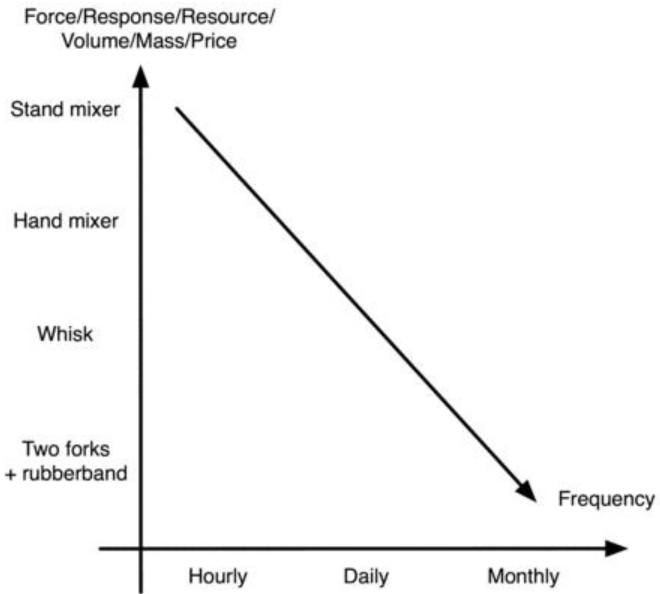

Materialism  has  a  fascination  with  overbuilding,  oversizing,  and
overcompensating.

唯物主义痴迷于过量建造，过大的尺寸和过度的消耗。

 This is bad economics. 
 
 这是坏的经济学。
 
 Consider that for each thing that gets
overbuilt,  there's  something  that  doesn't  get  built. 

考虑到过度建造了如此多的东西，那一定有一些东西没有得到建造。

 For  each  thing  that  gets
underbuilt,  there's  something  that  must  be  replaced  when  it  breaks. 

对于那些欠建造的东西，当它们损坏的时候，一定需要一些东西来替换它们。

 Both
problems mean that resources are wasted.

两个问题都意味着资源的浪费

Resources are wasted when the response is not appropriate for the situation.

资源被浪费，与此同时情况没有得到合适的反应。

Responses can be divided into labor, capital, and management.

反应可以被细分成劳动力，资本和管理。

 Many are short
on skill (management) and time (labor), therefore money (capital) is spent to
compensate,  hence  the  existence  of  automatic  egg  boiler  gadgets  and  other
atrocities. 

很多是技能（管理）和时间（劳动力）的匮乏，然而金钱（资本）用于补足，也就是自动煮蛋器和其他暴行存在的原因。

What is ignored here is that the opportunity cost in terms of time spent
working (or watching TV) and time not spent learning a skill (such as how to
boil an egg) is often higher than the cost in time to learn to boil an egg in a pot
and actually do it. 

这里被忽略的是机会成本，花费时间工作（或者看电视）的时间和没有花时间学习技能（例如如何煮鸡蛋），前者的花费的时间成本要比学习用锅煮鸡蛋要高。

Indeed, the time savings of gadgets is often overestimated,
while  the  time  needed  to  learn  a  skill  is  equally  often  overestimated. 

相反的，设备减少的时间也经常被过高估计了，与此同时学习新技能的时间也被过高估计了。

 This  is
particularly  true  since  many  capital  assets  are  just  sitting  around,  serving  no
purpose most of the time (see How to get rid of things).52

这尤其真实，因为很多财产都是放在哪，绝大多数时间都没有用处（参见如何摆脱物品）。

 Conversely, if a job is
going to be repeated often, it makes sense to buy a labor-saving device. 

相反的，如果一个工作经常被重复，购买劳动力就说的过去了——节省设备。

Ignoring
skill for the moment, the simple trade-off between capital and labor suggests an
arrangement such as that in this figure.

先忽略技能，简单的资本和劳动力的权衡建议如下图。

This figure shows total cost as a function of rate of use. 

这张图显示了功能总花费和使用频率的关系。

For instance,
once a month baking warrants a pair of forks tied together, whereas baking
daily warrants a hand mixer. 

例如，一个月烘焙一次用叉子搅拌就行了，然而每天都烘焙需要一个手动的搅拌器。

Specifically, anything used less than once a
month warrants improvisation.

特别的，任何一个月使用少于一次的即兴发挥就行了。

Skill serves to shift the line in the figure down and to the left because skill
makes the use of time and capital more efficient. 

技能产出在图中向下和向左移动是因为技能使时间和资本更有效。

Except at a very high level,
maintaining skill has no cost, so if something is learned once, no further effort is
required. 

除非特别高阶，否则维护技能不需要花费，因此如果一些东西学了一次，将来不需要额外的努力。

In this case it's sensible to develop a skill to just before the point that it
begins to require maintenance, continued practice--beyond this point, replacing
skill and time with capital assets makes more sense.

这个例子中，发展一项技能到它需要维护前的是明治的，持续练习——在这个点之前，在这之后，用资产来替换技能和时间更明治。

The skill component is something that consumers frequently misunderstand.

技能组件是消费者经常误解的东西。

A skilled response can easily be many times more efficient than an unskilled
response. 

一个有技术的反应通常轻易地达到没技术反应的数倍效果。

Conversely, the same ratio doesn't hold in terms of capitalization. 

相反，持有资本却不能达到这种比率。

For
example, an expensive car won't be much faster than an inexpensive one.

例如，一个昂贵的汽车不会比便宜的快多少。

 In the
example of this figure, a whisk will only be a few minutes slower than a hand
mixer, not counting the time one must work to earn the money for a hand mixer.

在图中的例子里，一个叉子搅拌就比手动搅拌器慢几分钟，还不算赚钱买搅拌器的时间。

Consider the difference between an experienced swimmer and a beginning
swimmer.

考虑一下专业游泳者和初学者间的区别。

 The former is fast and the latter is slow. 
 
 前者快后者慢。
 
 This, however, doesn't mean
that the faster swimmer expends much more energy than the slow swimmer.

然而，这不意味着快的要比慢的花很多能量。

 The
experienced swimmer is much much efficient and seemingly glides through the
water,  whereas  the  beginner  is  inefficient  and  struggles  just  to  keep  his  head

afloat. 

专业游泳者在水中划水时非常有效率，与此同时初学者挣扎着把他的头浮起来。

Money-handling skills are very similar. 

处理金钱的技能非常相似。

The experienced money handler
knows exactly where and how to spend money to get the maximum out of it. 

有经验的控钱手知道钱应该花在哪怎么花来得到最大的收益。

An
unskilled money handler spends money everywhere, too much on some things,
too little on other things, with much going to waste.

一个无技能的控钱手把钱到处花到很多东西上，这一点那一点，很多都浪费掉了。

