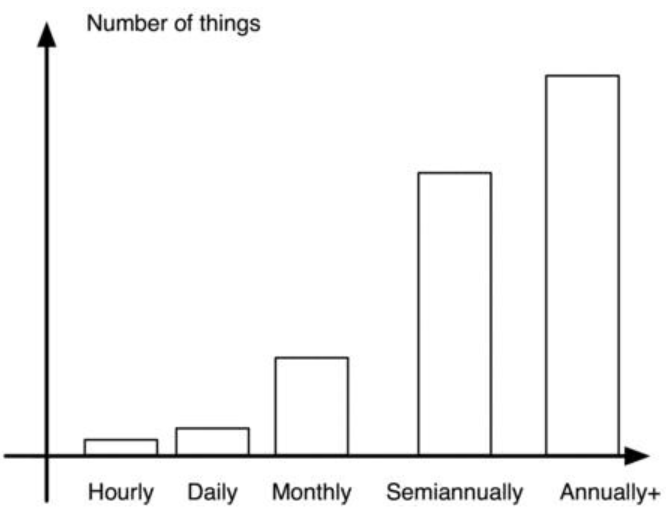

It's  hard  to  determine  where  everybody  got  the  bright  idea  to  turn  their houses into warehouses, but a very simple solution to this problem is to move all unused  possessions  into  a  storage  unit,  which  is  better  suited  for  the  purpose.
很难确定每个人是从哪里想出了，把房子变成仓库这个好主意，但解决这个问题的一个非常简单的办法是，将所有未使用的物品，搬进一个更适合的储藏室。
This  problem  is  relatively  easy  to  solve,  but  is  perhaps  best  attacked  during  a relocation.
这一问题相对容易解决，但在重新安置期间可能受到很大的攻击。
Go  through  all  your  possessions.
检查你所有的财产。
For  each  possession,  each  book, each tool, each appliance, each toy, try to recall when you last used it and put it into one of the following categories.
对于每一件物品、每一本书、每一件工具、每一件用具、每一件玩具，试着回忆一下你最后一次使用它的时间，并将它归入以下类别之一。
It's important to be honest.
诚实是很重要的。
To avoid ruining the statistics, a box with 500 nails should be counted as one possession, whereas your  stack  of  plates  doesn't  count  as  one  stack  of  plates.
为了避免破坏统计数据，一个有500颗钉子的盒子应该算作一件物品，而你的一堆盘子不算作一个盘子堆。
You'll  likely  be  using only  one  plate  at  a  time  with  all  other  plates  being  for  either  guests  or  to supplement the stack of unwashed dishes in the sink.
你可能一次只使用一个盘子，其他盘子要么是给客人用的，要么是用来补充水槽里未洗的盘子。
Be reasonable.
变得合理。
1.  I used this today (keep it).
1.
2.  I used this within the past week (keep it).
2.
3.  I used this within the past month (keep it).
3.
4.  I used this within the past six months (get rid of it).
4.
5.  I used this within the past year (get rid of it).
5.
6.  It has been more than a year since I used this (get rid of it!).
6.
7.  I did not even know I owned this?! (get rid of it!!)
7.
1.我今天用过这个（留着）。
2.我在过去一周内使用过（留着）。
3.我在过去一个月内使用过（留着）。
4.我在过去六个月内用过这个（扔掉）。
5.我在过去的一年里用过这个（扔掉）。
6.我已经超过一年多没用了（扔掉！）。
7.我都不知道我还有这个？！（扔掉！！）
If  you  draw  a  histogram  it  might  look  something  like  this  figure. 
如果你画一个直方图，它可能看起来像这个数字。
Don't  be surprised if you use fewer than three percent of your possessions daily and 90%+ of  all  possessions less  than  annually. 
如果你每天使用少于百分之三的物品，每年使用少于百分之九十的物品，不要感到惊讶。
This  is  a  normal  consumer  pattern,  but  a waste of space and money. 
这是一种正常的消费模式，但这浪费空间和金钱。
The  goal  is  to  bunch  the  histogram  up  on  the  left-hand  side,  so  that  most possessions are used daily, with fewer possessions used weekly, only a few used monthly, and only a couple of keepsakes that rarely see any use. 
我们的目标是将柱状图集中在左侧，这样大部分物品每天都会被使用，每周使用的物品较少，只有少数几个每月使用，只有几件很少使用的纪念品。
Usually one's possessions  will  then  fit  into  one  or  two  suitcases  (see  Which  things  should  I own?).
通常一个人的财产可以放进一两个手提箱（看看[哪些物品我需要持有？]()）。

his graph shows a histogram that illustrates the number of possessions versus their usage. 
此图显示了一个直方图，显示了财产数量与使用情况。
The x-axis shows the time since last use intervals and the y-axis shows the number of possessions in this category. 
x轴显示自上次使用以来的时间间隔，y轴显示此类物品的数量。

To  make the  transition,  anything  that  falls  outside  of  this pattern should go into storage. 
要进行转变，任何不属于此模式的内容都应该存储。
In the US people have so much stuff that one can rent commercial storage  units. 
在美国，人们拥有如此之多的东西，以至于可以租用商业存储单元。
In  other  parts  of  the  world  one  has  to  come  to  some  sort  of arrangement with people who will rent out attic or shed space or store things for free. 
在世界的其他地方，人们必须与愿意出租阁楼或棚屋或免费储存东西的人达成某种协议。

This process is most easily accomplished when relocating and things have to come out of the closet, perhaps seeing daylight for the first time in a long time. 
这一过程最容易在重新安置时完成，而且东西必须从柜子里出来，这可能是很长一段时间以来它第一次看到阳光。
Plan  on  relocating  to  a  smaller  home. 
计划搬迁到一个更小的家。
While  packing,  sort  things  into  moving boxes according to the list above. 
包装时，根据上面的列表将物品分类到移动的箱子中。
Put categories 1-3 into a few suitcases--if you need more than that, you're probably cheating--and put the rest in boxes headed to storage. 
把1-3类物品放进几个手提箱——如果你需要更多的东西，你很可能是在作弊——然后把剩下的放进盒子里，运往仓库。

Speaking of relocating to a smaller home, make sure to plan for things that are  important  to  you. 
说到搬到一个更小的家，一定要为那些对你来说很重要的事情做好计划。
For  instance,  if  you  like  to  read,  get  a  home  close  to  the library. 
例如，如果你喜欢阅读，就在图书馆附近找一个家。
This  way  you  can  use  the  public  library  as  your  library  rather  than duplicating the books in your home. 
这样你就可以使用公共图书馆，而不是在家里重复购买书籍。
In fact, one of the strategies I've used is to check whether a book I own is available through the library. 
事实上，我使用的策略之一就是，先检查我自己的书是否可以通过图书馆获得。
If it is, I sell it, swap it, or give it away. 
如果是，我就把它卖掉，交换，或者送人。

If going through this process while staying in the same home, one will find a lot of space liberated. 
如果在同一个家里经历这个过程，你会发现很多空间都被解放了。
This will make cleaning and maintenance easier. 
这将使清洁和维护更容易。
It might also make you question why you live in such a big house (it looks so empty!). 
这也可能会让你质疑，为什么你住在这么大的房子里（看起来空无一人！）。
Please resist the temptation to fill the house with new stuff. 
请抵制用新东西填满房子的诱惑。

A more lengthy process is to get rid of things slowly rather than putting them into  storage. 
一个更漫长的过程是，慢慢地把东西扔掉，而不是把它们储存起来。
I  don't  think  this  is  an  optimal  solution;  see  Sigmoids,  logistic curves, and the maximum power principle for why. 
我不认为这是一个最佳的解决方案；有关原因，请参见[S曲线、逻辑曲线和最大能量原理]()。
Most likely, the process will be too slow and will subsequently stall out of bitterness over the fact that things don't appear to change despite all efforts. 
最有可能的是，这一过程将过于缓慢，随后尽管做出了种种努力，但事情似乎没有改变从而陷入痛苦之中。
The cost of moving slowly towards a goal is that one needs a long time to get anywhere. 
缓慢迈向目标的代价是，需要很长时间才能达到目标。
This requires more discipline and dedication. 
这需要更多的纪律和决断精神。
In other words, there is a tradeoff between making sudden, large changes and being dedicated to incremental change. 
换句话说，在做出突然的、巨大的改变和致力于渐进的改变之间存在着一种权衡。
Only you will know which one fits you better. 
只有你才会知道哪一个更适合你。

However, a slower process allows more maneuvering space. 
然而，较慢的过程允许更多的机动空间。
Rather than just putting  things  into  storage,  things  can  be  thrown  out,  given  away,  exchanged, swapped,  or  sold. 
东西不只能放进仓库，东西可以扔掉、送出、交换、交换或出售。
With  the  Internet,  this  is  much  easier  to  facilitate. 
有了互联网，这就容易多了。 
In  my experience, the question of whether to give, trade, or sell depends on the value of the item. 
根据我的经验，是送出、交易还是出售取决于物品的价值。 
If the item has no use value whatsoever, it should probably be thrown out or recycled for parts. 
如果物品没有任何使用价值，它可能会被扔掉或回收作为零件。 
Fortunately, consumer society has a very good service level  when  it  comes  to  throwing  things  out. 
幸运的是，消费者社会在扔东西方面有很好的服务水平。 
In  principle,  you  could  throw everything in a dumpster. 
原则上，你可以把所有东西都扔进垃圾箱。 
In fact, some people do this--other people live off this bounty through dumpster diving.
事实上，有些人是这样做的，有些人靠垃圾桶潜水来维持生活。 