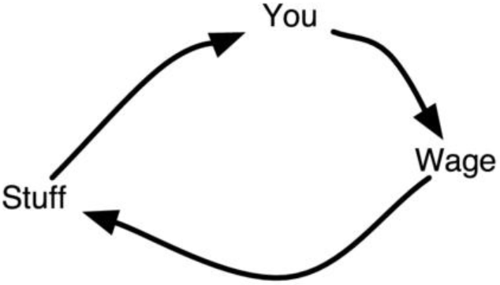
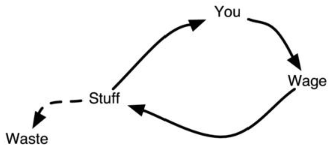
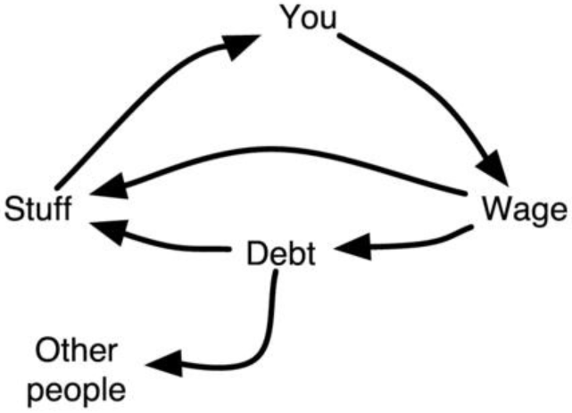
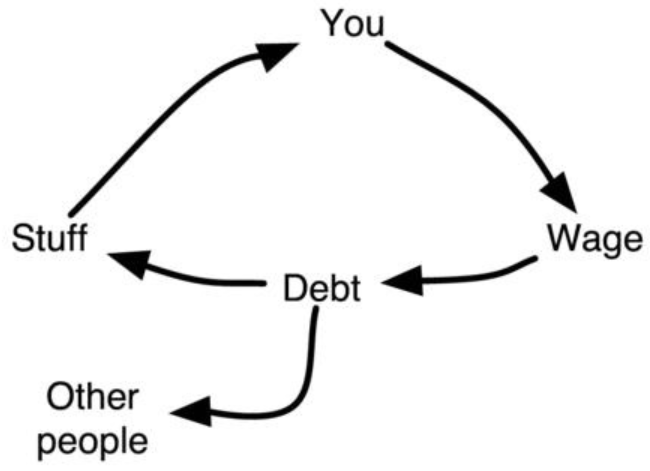
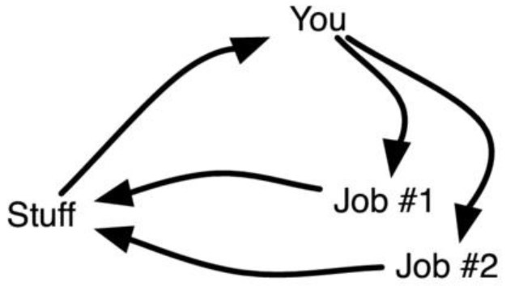
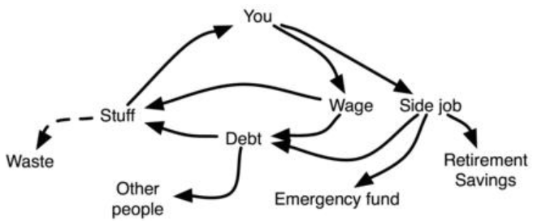
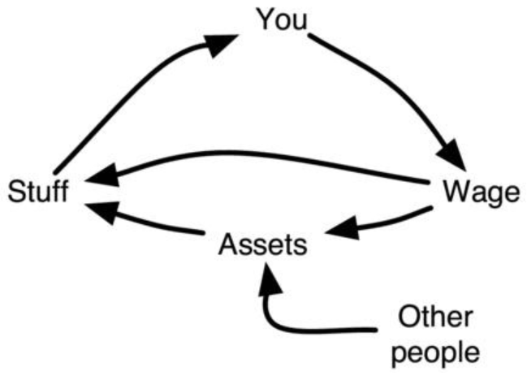
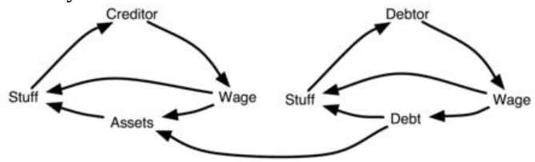
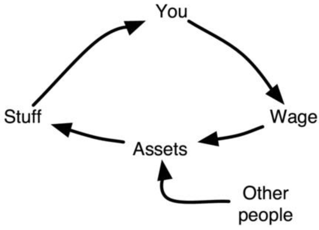
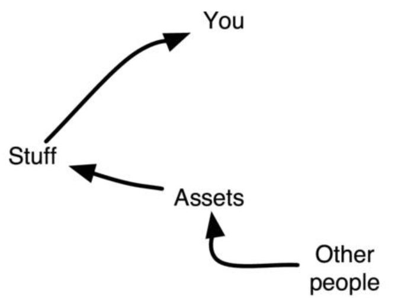

This section describes the different ways money flows for different people
operating within a free market economy. 

这一节描述的是，在自由经济市场中，不同人的不同资金流。

This figure shows the simplest possible
financial cycle for a salaried person.

下面这张[图]()展示了一个工薪一族的经济循环。

 Here you work which results in a wage
which you spend on stuff which you consume. 

这里，你工作得来的薪水变成了你消费的物品。

Here stuff represents actual stuff,
as well as services like dental work, car insurance, and so on. 

这里的物品不只是实物，也包括例如，整牙，汽车保险等等。

This is the work-
spend-consume cycle described in The lock-in and The salary man.

这就是一个被锁住的工薪人的“工作-消费”的循环。

 The work-
spend-consume method is a very simple way of managing finances. 

“工作-消费”这种是非常简单的财务管理方法。

There's only
one source of income and it's impossible to spend money that hasn't been earned.

唯一的收入来源表示，不可能花没有挣到的钱。

All you need is a job and a bank account. 

所有你需要的就是一份工作和一个银行账户。

If the employer pays in cash, you don't
even need a bank account.

如果雇主付你现金，你甚至都不需要银行账户。

The cash flow of someone who works for a living.

一个工作为了谋生的现金流。

Running  the  cycle  produces  waste as  shown  by  the  dashed  arrow  in  this
figure. 

循环运转产生的浪费如[图]()中的虚线所示。

While some think that more waste means more "living," it's clear that the
more  waste  which  leaves  the  stuff  area  without  being  consumed  by  you--for
example,  superfluous  bedrooms,  time  spent  commuting,  clothes  never  worn,
things collecting dust on the shelves--the faster the cycle must run and the harder
or more you must work.

一些人认为，更多的浪费表示更多的“生活”，积攒越来越多的从没用到的东西，例如，多余的卧室，耗时的通勤，没有穿坏的衣服，放在架子上吃灰的东西，循环运转地越快，你就需要越辛苦地工作。

The cash flow of someone who works for a living and continuously
replaces his stuff.

一个为了生活工作的现金流和持续替换他的物品。

People,  who  are  credit-worthy,  which  until  recently  meant  practically
anybody, as people didn't even need to be alive to be "pre-approved," can then
use credit to increase their spending on stuff (see The salary man).

那些有信用的人，现在也意味着所有人，甚至都不需要是活人，就可以得到“预批准”，他们就可以通过信用卡来增加他们消费的物品了（参见[薪资人]()）。

 This is shown
in this figure. 

这展示在这张[图]()中。

First there's an arrow going from debt to stuff, which is called
financing.  

首先，这里有一个从债务到物品的箭头，也被叫做金融。

This  can  be  car-financing,  furniture-financing,  or  house-financing
(mortgage). 

它可以是汽车金融，家具金融，或者住房金融（房贷）。

There's also an arrow going from wage into debt. 

这里还有一个从薪资到债务的箭头。

This represents the
monthly payments which naturally are no longer going into stuff. 

这代表了每月的偿付，自然也就不会流入到物品里。

There's also an
arrow going from debt to other people, which represents the interest and finance
charges  and  other  ways  lenders  are  getting  paid  for  fronting  the  money  you
spend on stuff.

这也是通过债务流向他人的箭头，这代表了利息和金融费用，和其他贷方被支付的钱。

The cash flow when going into debt. 

债务中的现金流。

Some of the wages are now
diverted into paying off debt and paying interest to other people. 

一些薪资被分散成偿付本金和利息。

However,
it's possible to buy more stuff than is otherwise affordable from the
increased flow by using credit.

然而，因为增加了信用卡这个现金流，这让购买更东西成为可能。

What sometimes happens is that this cycle spirals out of control. 

到了一些时候这个螺旋循环会失去控制。

This can
happen  if  there's  no  negative  feedback,  which  is  the  case  if  credit  limits  are
increased to no end or if minimum payments are held down to make the payback
period extremely long. 

当没有负反馈时就能够发生，例如当信用额度无止境地增加，或者最小偿付金额下降来让偿付周期变得极长。

This is profitable to the lender as long as the borrower
doesn't default. 

如果借款人不违约，这对贷款方就是是利润。

The result is shown in this figure. 

结果展示在这张[图]()中。

At this point all wages are
going toward paying off debt. 

在这个点上，所有的薪资都用于偿付贷款。

Stuff can only be bought through continued use of
credit. 

物品通过使用信用卡持续买入。

This stage is right at the limit of defaulting, because payments can barely
be made. 

这个阶段是在违约的边缘，因为偿付很难增加了。

A job loss will  push  this  person  into  default. 

失业将会把一个人推向违约。

 The  only  option  then
would be to negotiate a lower interest rate that will lower the payment, and then
spend the extra money paying off debt rather than spending it on more stuff.

唯一的可行方案时协商一个更低的利率，更低的偿付金额，花额外的钱偿付债务而不是把它们花到各种物品上。

The cash flow when fully in debt. 

一个完全是债务的现金流。

All payments are going towards bills
and credit service.

所有的付款都流向了账单和信用卡。

 Credit is used for all purchases.

信用卡用作所有的消费。

Even when not liable for debt payments, the dependence on having to spend
to get stuff, which can be thought of as another liability, means that losing the
wage will cause serious hardship. 

即使没有贷款需要偿付，对于消费获取物品的依赖，会成为一个麻烦，这意味着如果失去工资以后，会引起一系列的困难时光。

To prevent this, wise people establish a so-
called emergency fund. 

为了阻止这种情况的发生，聪明的人们建立了一个叫做应急资金的东西。

The emergency fund is an attempt to hedge against all
the liabilities in your life with a cash reserve. 

应急资金是一种尝试，它通过现金反转来防范你生命中的所有麻烦。

To establish the fund, spending
must be reduced to divert money to savings as in this figure. 

为了建立这个信托，消费需要减少，并且把钱存起来，就像[图]()中这样。

Its size depends on
a fair estimate of the current liabilities--that is, money that needs to be spent
until  the  lost  wage  can  be  replaced. 

它的规模取决于对当前状况的正确评估，也就是，失去薪资期间需要多少钱。

 Naturally,  this  depends  on  duration,  the
likely reduced amount of spending, and the loss of the wage relative to other
sources of income.

自然的，这取决于长度，减少消费的数量，失去薪资后对其他收入来源的影响。

This shows how an emergency fund works.

这展示了一个应急资金如何工作。

 If wages are no longer
forthcoming, the emergency fund can provide a temporary cash flow to
continue spending.

如果薪资中断，应急资金能够提供临时的现金流。

The emergency fund is no different from normal savings used for presents,
large  purchases,  etc.  

应急资金和正常的储蓄，大额存款等没有区别。

Savings  are  essentially  delayed  consumption. 

存款对延迟消费非常必要。

 The  same
goes for retirement savings, which are essentially a very big fund intended to last
from retirement until death.

退休存款也是这么运作的，就是建立一个很大的资金池支撑从退休到死亡的消耗。

The cash flow when working more than one job. 

当你工作不止一个工作的现金流。

If each job can cover
expenses, the diversification provides security.

如果每个工作能够覆盖支出，分散提供了安全。

 This may also be thought of
as working one job and having multiple clients.

这可能也被认为是一份工作，但是有多个客户。

A person, particularly a nonsalaried working man, may have several sources
of income, either in the form of multiple clients or serial contracts in which case
the cash flow looks like this figure. Due to the unsteady nature of his income, the
working man will likely rely on savings in between jobs.

一个人，特别是没有薪水的打工人，可能会有多个收入源，要么是不同客户的形式，或者是串行合同的形式，他的现金流会像这个[图]()。因为他收入天然的不稳定，打工人在工作和工作之间会依赖储蓄。

 Since periods without
work  are  a  way  of  life,  "emergency  fund"  is  hardly  the  right  term,  but  the
principle  is  the  same.  

因为周期性没有工作是一种生活方式，“应急资金”很难有固定的形式，但是原则是相同的。

Having  more  than  one  income  stream  provides  more
security due to diversification. 

拥有不止一个收入来源，分散提供了更多保险。

Of course, a working man can go into debt as
well, and a salary man can take on side jobs. 

当然，打工人也可以借贷，与此同时薪资人也会兼职。

The complete picture for many
people  will  thus  look  more  like  this  figure.  

对于很多热完整的图片看起来会像这张[图]()。

This  system  is  generally  tightly
coupled  and  complicated,  but  typically  not  complex. 

这个系统通常是紧耦合的，但是通常不复杂。

 There  are  many  books
dedicated  to  decoupling  by  introducing  buffers  and  simplifying  the  system,
mostly by consolidating whatever serves the same function.

很多书尝试通过增加缓冲来解耦和简化系统，大多数是合并相同的服务。

 For example, two
bank  accounts  become  one.  Some  subscribe  to  automating  everything  with
automatic  payments,  etc. 

例如，两个银行账户变成一个。一些人建议定义自动化付款的服务等等。

 Others  prefer  to  make  each  payment  manually.  I
suppose this is like the difference between driving a manual and an automatic
transmission. 

还有一些人倾向每笔支付都手动完成。这种提议就像手动挡和自动挡的区别。

 It  really  doesn't  matter,  and  it's  merely  a  question  of  personal
preference, as long as you choose whatever you're comfortable with. 

事实是，这都不重要，这只是个人喜欢的问题，你只需要选择你觉得合适的就行了。

Personally,
I prefer the manual option since it allows for more control, which makes it easier
to fix things when (not if) they go wrong.

对我个人而言，我倾向于手动选项，因为这允许我更多的控制，当出问题时更容易修复。

More important, though, is the primary reason that so many complain that
they're not "getting ahead," which is apparent from the figure.

更重要的，很多人抱怨说他们并没有“走在前面”，如下面这个[图]()所展示的。

 It's the loss of
wage to waste and other people. 

这是浪费和流向他人所造成的薪资损失。

This constitutes a lot of hard work for nothing,
and it's the reason why so many, after decades of work, have so little to show for
it.

这个构成了努力工作却一无所获，这也是很多人，辛苦工作了很多年以后，几乎什么也没存下。

A fairly common cash flow, albeit a bit simplified, since most people
have multiple, different kinds of debts and savings, and ways of transferring
the money between the accounts.

一个非常常见的现金流，尽管有点简单，但是大多数人，都有不同类型的存款和负债，在不同的账户间传递金钱。

The  previous  chapters  have  mostly  dealt  with  strategies  for  reducing  this
loss. 

上一章讲述了如何减少这种流失的策略。

It's perfectly possible to live well using those methods, and the strategies
and  tactics  can  either  be  used  to  simply  prioritize  resources--for  example,
spending on things that mean something to you, like vacations to the south pole,
antique furniture, brand name educations, etc.

使用那些方式生活时完美的可能，那些策略和战术能够简单地优化资源，例如，花钱到对你有意义的东西上，例如南极旅行，古董家具，名校教育，等等。

--or only working seasonally and
living the rest of the year on savings--alternatively, only working a few hours a
week (see Intermittent work); 

或者，只季节性地工作，每年剩下的时间用积蓄生活，还有就是，每周只工作几个小时（参见[间歇工作]()）。

or, as will be covered below, the money can be
spent on assets which will provide enough cash flow to  completely  eliminate
having to work for money (see Financial independence and investing).

或者，可以覆盖上面的全部情况，把钱花在能提供现金流的资产上，产出足以覆盖消耗的钱（参见[财务独立和投资]()）。

A worker acquires assets by consuming less than his income and then saving
and investing the  rest.  

一个工人能够通过少消费，把剩下的钱用于存款和投资。

This  figure  shows  the  cash  flow  for  a  worker  who  is
investing and accumulating assets.

这张[图]()展示了一个工人投资和积累资产的现金流。

 Notice that there's an additional flow of cash
from assets to stuff. 

注意到，这里有从财务到物品的额外现金流。

This cash comes from other people who pay for the usage of
the investor's assets. 

这个现金流来自其他人对投资人财务的偿付。

The cash flow from wage to stuff is thus reduced.

从薪资到物品的现金流就这样被减少了。

A worker in the asset-building phase. Money is being spent on
investments in assets instead of stuff while assets begin to produce a cash
flow which can be spent on stuff.

一个工人在资产建立阶段。钱被用在资产上，反过来资产会产生现金流花在物品上。

Owning stocks means that the investor gets the profit (but not the wage, see
The salary man) when other workers produce goods and services.

拥有股票意味着投资人，在其他工人生产产品和服务时，就会获得分红（但不是薪资，参见[薪资人]()）。

 Owning rental
units means that the investor gets paid for use of his home.

收房租就意味着，其他人为使用投资人的房子付钱。

 Owning bonds means
that the investor gets paid for use of his money.

拥有债券就意味着，其他人为使用投资人的钱而付钱。

 In fact, combining this figure
and this figure, we get this figure, which shows how creditors and debitors fit
into the economic system.

事实上，将这个[图]()和这个[图]()组合起来，我们得到这个[图]()，这展示了债权人和债务人在经济系统中的位置。

This figure shows the cash flows in a world with only two people. 

这张[图]()显示了只有两个人世界的现金流。

I
labeled them creditor and debtor. In reality, there are many creditors and
debtors (see text for details).
It also explains why the "rich get richer" and why those who are in debt and
work for a living never seem to "get ahead."

我把他们标记为债券人和债务人。现实中，这里有很多债权人和债务人（查看[细节]()）。这也解释了为什么“富人更富”，为什么那些陷入债务的人，为谋生工作，似乎永远没有出头之日。

 While the figure only shows the
cash  flow  between  two  people,  in  reality  the  assets  are  diversified  via  the
financial system so that each asset owner gets paid a little amount from many
different people and each debt owner uses the assets of many different people as
well.

因为这张图只显示了两个人间的现金流，现实中，资产通过金融系统分散，这让每个债权人和债务人间是多对多的关系。

 However, figuratively speaking it is quite possible to match up the relative
sizes of the cash flows between two people. 

但是，从图标上看，两个人的现金流也非常具有说明性。

For example, I spend about as much
on  my  total  living  expenses  as  an  upper-middle-class  family  spends  on  their
mortgage interest alone. 

例如，我的总生活花销，和一个中上阶级房的贷利息的花销相当。

Effectively speaking, I've lent them my money so they
can have a house with five bedrooms, three bathrooms, a vaulted foyer, and a
two-car garage. 

换句话说，我借给他们钱，所以他们能拥有一个五个卧室，三个浴室，一个拱形大厅，一个两车位车库的房子。

In return, they pay all my expenses. Hopefully, we both consider
this a good deal; I know I do.

相反，他们支付给我费用。希望我们都认为这是一个划算的交易，我知道我是。

Financially independent and working. Since these savings flow into a
nonretirement account, money immediately flows out.

财务独立和工作。因为储蓄的现金流进入一个非退休账户，钱立即流出了。

In  a  free  country,  roles  are  chosen,  not  assigned.  Most  people  choose  to
become debtors and borrow money so they can increase their spending, possibly
due to a lack of knowledge or maybe simply due to the barrage of advertising
that  says  spending  money  will  result  in  happiness. 

在一个自由的国家，角色是可以选择的，不是指定的。很多人选择成为债务人，借钱可以让他们增加支出，可能是由于缺乏知识，或者简单地因为广告，他们认为花钱能带来幸福。

 However,  it's  possible  to
choose  the  creditor  side  and  save  money,  eventually  buying  financial
independence. 

然而，也可以选择作为债权人存钱，用来购买财务独立。

 Such  financial  independence  comes  from  investing  in  income-
generating  assets  until  the  cash  flow  from  the  assets  completely  cover  all
spending on stuff. 

财务独立来自投资收益能够覆盖消费。

When this happens, the cash flow looks like this figure. Here
all wages go to increasing assets and work can stop at any time. 

当这发生时，现金流看起来会像这张[图]()。这里，所有的薪资拥有增加资产，工作任何时候都可以停止。

When the person
is no longer working for money, the cash flow situation looks like this figure.

当一个人不再为了钱工作时，他的现金流状况就会看起来像这个[图]()。

