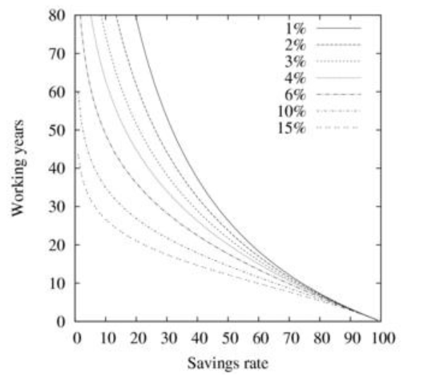

The  above  calculations  don't  take  investment  returns  on  the  fund  into
account. 

上面的计算没有把投资回报加到账户里。

It stands to reason that if someone accumulates a 9 year fund by saving
75% while working for 3 years and invests it with a 5% return, it'll last longer
than 9 years before it runs out, because of the investment returns on the money
that hasn't been spent yet.

由于这个原因，如果一个人，以75%的储蓄率，积累了9年的本金，投资回报率是5%，那么这些钱消耗光会多余9年，因为投资收益还没有花掉。

Presuming the returns can be guaranteed--more about that later--it's possible
to calculate exactly how long such a fund will last if it compounds interest at a
rate i.

假如投资回报有保证（关于这个稍后详述），那么就可以通过复利i来计算基金到底会持续多久。

 Suppose the fund has a size P₀ and each year p is withdrawn on the first
day of the year, while the rest of the money is invested for a year at a rate i. 

假设本金是P₀，每年撤出是p，剩下的钱以利率i按年投资。

Then
the amount of money after one year will be

那么第一年账户里的钱就会是：

P₁=(P₀-p)+i(P₀-p)=(P₀-p)(1+i)=P₀(1+i)-p(1+i).

Another  p  is  withdrawn  (we  have  now  withdrawn  a  total  of  2p)  and  the
remaining amount P₁-c is invested again at the rate i. The amount available at
the end of the second year is then

另一个p撤出后（现在我们总共撤出了2p），账户里剩余的P₁-c 继续以利率i投资。第二年底账户可以余额就是：

P₂=(P₁-p)(1+i) = P₁(1+i)-p(1+i)

  = (P₀(1+i)-p(1+i))(1+i)-p(1+i)

  = P₀(1+i)²-p(1+i)²-p(1+i)

where we substituted in P₁ from the first equation. Repeating this, we find the
remaining amount after the third year to be

我们用第一个公式化简掉P₁。重复这个过程，第三年底，账户将会是：

P₃ = (P₂-p)(1+i) = P₀(1+i)³-p(1+i)³-p(1+i)²-p(1+i)

and so on up to

第N年将会是：

PN=P₀(1+i)^N-p(1+i)^N-p(1+i)^N-1-...-p(1+i)²-p(1+i) 
=P₀(1+i)^N-p[(1+i)^N+(1+i)^N-1+...+(1+i)²+(1+i)].

Write the term in the square bracket as (S for sum)

提取方括号里的项是（这里S表示求和）：

S = (1+i)^N+(1+i)^N-1+...+(1+i)²+(1+i),

then

然后：

(S+1)(1+i) = (1+i)N+1+(1+i)^N+...+(1+i)²+(1+i),

and  so  (S+1)(1+i)-S = S+Si+(1+i)-S = Si+(1+i) = (1)+iN+1  because  all  the
individual terms in the sum cancel out (set N to any random number and write
the sum out to verify if in doubt) leading to

所以，(S+1)(1+i)-S = S+Si+(1+i)-S = Si+(1+i) = (1)+iN+1
就是求和抵消的独立项（如果有怀疑，可以设置N为随机值，然后计算求和结果），推导出：

S = ((1+i)N+1-(1+i))/(i) = ((1+i)((1+i)N-1))/(i).

Substitute this equation and this equation back into this equation to get

将[这个公式]()和[这个公式]()代回到[这个公式]()，得到：

PN = P₀(1+i)^N - pS = P₀(1+i)^N-pS 
= P₀(1+i)^N-p((1+i)((1+i)N-1))/(i).

We are interested in using this formula to determine how long the portfolio will
last, namely, how large is N?107 When money runs out, PN == 0, therefore we
rewrite this equation as

我们感兴趣的是，使用这个公式中，我们的投资组合能持续多久，换句话说，N能多大。当钱耗光时，PN == 0，重写公式：

0 = (P₀)/(p)i-(1+i)(1-1(1+i)^N),

and so
N=log[(1)/(1- (P₀)/(p)(i)/(1+i))]/log(1+i).
From this formula--which incidentally is the point where you can wake up
again if you fell asleep during the derivation--we see that if we have a P₀=10
year  fund  which  pays  out  p=1  annually  at  a  4%  (i=0.04)  interest,  it  lasts
N=12.38 years rather than 10 years. 

所以N=log[(1)/(1- (P₀)/(p)(i)/(1+i))]/log(1+i)。如果你在求导的过程中睡着了，现在可以起来了，如果我们有一个P₀=10年的本金，每年支出为p=1，利率为4%(i=0.04)，它将持续N=12.38年而不是10年。

In comparison, a 20 year fund with the same
parameters lasts 37.39 years. 

作为对比，一个20年的本金参数会持续37.39年。

 This is highly interesting, because by doubling the
savings before beginning the withdrawal, an additional 15 years was gained on
top of the 2.38 years from the 10 year fund's interest.

这很有趣，因为加倍了储蓄以后，在之前的2.38年的基础上，通过10年的利息，又增加了15年。

This equation is the key formula for extreme early retirement, so pay extra
attention to this paragraph!

这个给公式是极早退休的关键公式，所以本章要额外重视！

 The formula relates the number of retirement years
(your life expectancy upon retiring) to the rate of return on your portfolio and the
size  of  your  portfolio  given  in  either  withdrawal  rates p/P₀  or  the  equivalent
"years of fund" as illustrated by this table.

这个公式将你退休的时间（退休以后你生命持续的时间），关联到你投资组合的大小、投资组合的撤出率p/P₀，展示在这个[表]()中。

 Note that these two numbers are each
other's exact inverse,108 since if P₀ is given in years, then p=1 year.

注意，这个两个数字互为倒数，如果P₀单位是年，那么p=1年。

This figure shows the equation, relating the size of the fund to how long it
lasts for different values of i. First, note that i=0 produces a straight line because
if no interest is received, an N year fund will last exactly N years. 

这张[图]()展示了这个公式，对于不同的本金和利率i会持续多久。首先，当i=0时，产生了一条直线，因为收不到利息，N年的本金只会持续N年。

Also, note that
if i = (p/P₀)/(1-p/P₀) then the denominator is 0 and N -> infty. This means that
the portfolio will last forever. 

另外，如果i = (p/P₀)/(1-p/P₀)，分母为0，然后N趋向无穷。这意味着投资组合会永远持续下去。

The reason is that each year the portfolio grows
exactly by the amount that is withdrawn. This is also called a perpetuity and it
will preserve the principal forever. 

这是因为，每年投资组合的增长和撤出的数目相等。这也被叫做永续年金，并且它可以作为永久的成分。

A quick rearrangement of i = (p/P₀)/(1-p/P₀)
yields
P₀ = (1+i)p/i,
which is the required fund size to withdraw p at the beginning of each period

when interest is added at the end of the period.109 

重新整理 i = (p/P₀)/(1-p/P₀)后，得出P₀ = (1+i)p/i，这就是撤出p要求的本金P₀。

A perpetuity leaves an estate
which  is  exactly  equal  to  P₀. 

永续年金留下了P₀作为遗产。

 If  less  than  p  (as  given  by  this  equation)  is
withdrawn,  then  what  is  not  withdrawn  can  be  used  to  grow  principal.  

如果少于撤出p（在这个[公式]()里给出），那么没有撤出的就会被用作增长要素。

This
means that P will increase even as money is withdrawn.

这也意味着即使有撤出，P还会增加。

Size of fund given in years of expenses versus how long it will actually
last before being depleted given different investment return rates.

本金大小，给定年限，和它会持续多久和不同的投资利率间的关系图。

The time to accumulate the fund P₀/p (given in years or months or whatever
your preferred time unit is) can be calculated in a similar way. 

积累本金的P₀/p（按你的喜欢以年或者月为单位）的时间，可以用相同的方法计算。

The simplest way
to calculate it uses the method of this table
P₀/p=(r)/(1-r)M,

最简单的方法可以用这个[表]()来计算P₀/p=(r)/(1-r)M,

where r is the savings rate and M is the number of years worked.

这里r表示储蓄率，M是你工作的时间。

 This is the
same equation that was used to generate this table. 

这和生成这个[表]()的公式相同。

Now, if the funds are invested
at a rate i and allowed to compound we get
P₀/p=(r)/(1-r)SUMi=1M (1+i)i-1.

现在，如果本金以利率8进行复利投资，我们得到，

P₀/p=(r)/(1-r)SUMi=1M (1+i)i-1

Note that this equation reduces to the equation above if i=0.

注意，如果i=0，这个公式会简化成上面的[公式]()。

 Using a similar trick
to handle the sum, we find
P₀/p=(r)/(1-r)((1+i)^M-1)/(i).

使用相同的技巧处理求和，我们会发现P₀/p=(r)/(1-r)((1+i)^M-1)/(i)。

In  traditional  personal  finance  planning  the  time  invested  M  is  the  most
important factor, with typical values around 30 or 40 years. 

在传统的个人经济计划中，时间投资M是最重要的因素，这个值通常在30或40年左右。

Some people will be
clever enough to achieve superior investment returns i.

一些人很聪明，他们可以获取超高的投资回报率i。

 We are not counting on
this. 

我们不计算这个。

In the case of early retirement, M will be small, and we will presume that i
is of the usual range, maybe around 6%. 

在早退休的例子中，M将会很小，并且我们假定i在通常的范围内，可能是6%左右。

The main lever in this equation is thus
r/(1-r). 

这个公式里的主要的就会是r/(1-r)。

For a traditional savings rate r=0.1 the lever is r/(1-r)=0.11, whereas for
an extreme savings rate r=0.75, the lever r/(1-r)=3, which is 27 times higher!

对于传统储蓄率 r=0.1来说，杠杆是r/(1-r)=0.11，然而对于极端的储蓄率r=0.75，杠杆是r/(1-r)=3，比之前高27倍！

Even with a lot of time to compound and a market outperformance of a few
percent, it's hard to beat a factor of 27.110
This figure shows the time it takes to grow the fund to 30 years as a function
of savings rate. 

即使通过很长时间的复利和市场出色的表现，它也很难打败27倍。这张[图]()展示了30年本金不同储蓄率所需要的时间。

According to this figure, a 30-year fund will last 70 years even at
a modest 3% return rate.

根据这张[图]()，即使在3%的回报率下，一个30年的本金会持续70年。

The time M it takes to grow P₀/p to 30 for a given savings rate r. 

在给定储蓄率，积累P₀/p为30年所需要的时间。

A fund
nominally lasting 30 years should be safe to retire on in most
circumstances. 

一个可以持续30年的本金，对于绝大多数退休情况都足够安全了。

Note that a traditional savings rate of 15% requires a little
over 30 years of work to make it given average investment returns of 10%.

注意传统15%的储蓄率会让需要的时间多余30年，在给定的10%的平均回报率下。

If, on the other hand, investment returns drop to a conservative 6%, more
than 45 years of work is required.

也就是，如果投资回报率降到保守的6%，就要求超过45年的工作时间。

Let us isolate M from this equation to get
M =log(1+i(P₀)/(p)(1-r)/(r))/log(1+i).

我们从公式里提取M得到

M =log(1+i(P₀)/(p)(1-r)/(r))/log(1+i)。

Assuming  that  the  life  expectancy  is  100  years  and  one  is  either  financially
independent or working to become so for the last 80 years of that time span
(adjust your numbers as you see fit), then
80 = N + M,
where N is the number of years living off your money and M is the number of
years spent accumulating it.

假设能活到100岁，一个人要么财务独立，要么在后面的80年里工作（调整这个到你认为合适的时间），那么80=N+M，这里N表示靠积累生活的时间，M表示积累的时间。

 We can now plot the working time M as a function
of  the  savings  rate  r  to  find  out  how  many  years  are  needed  to  work  to
accumulate  enough  money  for  a  given  rate  of  return  i. 

我们可以绘出，在回报率i下，工作时间M和储蓄率r之间关系的图线。

 This  is  shown  in  this
figure. This is the most important figure in this chapter.

这显示在这张[图]()中。这是本章中最重要的[图]()了。

 Specifically, it shows
that  high  savings  rates  lead  to  extremely  early  financial  independence.

确切地说，它展示了高储蓄率带来极早的财务独立。

Conversely, the traditionally recommended savings rates mean working for 40

years or more, and they're very dependent on the return rate i.

相反的，传统建议的储蓄率意味着要工作40年或更多，而且他们非常依赖回报率i。

 It also shows the
difference  between  a  savings  rate  of,  say  35%,  which  most  people  would
consider to be high, and a savings rate of 70%.

它也显示了不同储蓄率，例如一般人认为35%很高，和70%储蓄率的不同。

 It shows what your savings rate r
should  be  to  retire  in  M  years. 

它展示了你的储蓄率和应该退休的年龄M间的关系。

 As  is  evident,  saving  three  quarters  of  one's
income creates financial independence in about five years!

非常清楚的是，一个人如果存3/4的收入，那他5年就可以经济独立！

 Conversely, a savings
rate of 15% requires about 35 years of work at an optimistic return rate of 6%,
about 20 years of work at a 10% rate, and about 45 years at a 4% rate.

相反，如果储蓄率为15%，那就要求，即使乐观的6%的回报率，也要工作35年，10%的储蓄率，工作35年，4%的储蓄率，工作45年。

Figure showing savings rate against years to retirement for a range of
investment return rates, presuming that the total number of years worked
and years retired equals 80--for example, a person starts working at 20 and
dies at 100.

图标显示了储蓄年限在不同投资回报率下的关系，假设一个人能工作的时间是80年，即，20岁开始工作，100岁死。

₀₁₂₃⁰¹²³⁴
